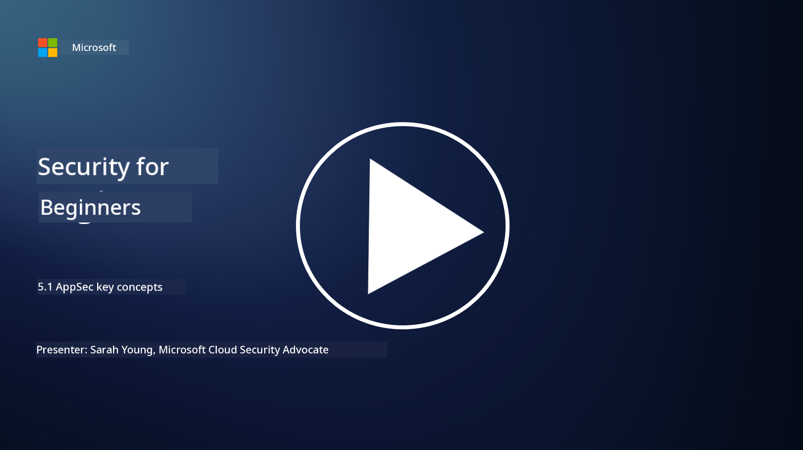

<!--
CO_OP_TRANSLATOR_METADATA:
{
  "original_hash": "e4b56bb23078d3ffb7ad407d280b0c36",
  "translation_date": "2025-11-18T18:07:14+00:00",
  "source_file": "5.1 AppSec key concepts.md",
  "language_code": "pcm"
}
-->
# AppSec key concepts

Application security na one kind security wey get im own specialization. For dis part of di course, we go look well well into application security.

## Introduction

For dis lesson, we go talk about:

- Wetin be application security?

- Wetin be di key concepts/principles of application security?

## Wetin be application security?

Application security, wey people dey call "AppSec," na di way wey dem dey protect software applications from security wahala, vulnerabilities, and attacks. E cover di processes, techniques, and tools wey dem dey use to find, reduce, and stop security risks for di time wey dem dey develop, deploy, and maintain di application.

Application security dey very important because applications na one of di main targets for cyberattacks. Bad people dey use di weak points and wahala wey dey software to enter anyhow, thief data, spoil services, or do other bad things. If application security dey strong, e go help make sure say di application and di data wey dey inside am dey safe, correct, and dey available.

## Wetin be di key concepts/principles of application security?

Di key concepts and principles wey dey support application security na:

1. **Secure by Design**:

- Security suppose dey inside di application's design and architecture from di beginning, no be something wey dem go add later.

2. **Input Validation**:

- Any input wey user dey give suppose dey check well to make sure say e dey correct and e no get bad code or data.

3. **Output Encoding**:

- Any data wey dem dey send go di client suppose dey encode well to stop wahala like cross-site scripting (XSS).

4. **Authentication and Authorization**:

- Make sure say users dey authenticate and dem dey give access to resources based on di roles and permissions wey dem get.

5. **Data Protection**:

- Any sensitive data suppose dey encrypt when e dey store, dey move, or dey process to stop people wey no get permission from accessing am.

6. **Session Management**:

- Secure session management go make sure say user sessions dey safe from hijacking and people wey no suppose dey access am.

7. **Secure Dependencies**:

- Make sure say all di software dependencies dey up to date with security patches to stop vulnerabilities.

8. **Error Handling and Logging**:

- Use secure error handling to make sure say sensitive information no dey show and make sure say logging dey safe.

9. **Security Testing**:

- Dey test applications regularly for vulnerabilities using methods like penetration testing, code reviews, and automated scanning tools.

10. **Secure Software Development Lifecycle (SDLC)**:

- Put security practices inside every stage of di software development lifecycle, from di requirements to deployment and maintenance.

## Further reading

- [SheHacksPurple: Wetin be Application Security? - YouTube](https://www.youtube.com/watch?v=eNmccQNzSSY)
- [Wetin Be Application Security? - Cisco](https://www.cisco.com/c/en/us/solutions/security/application-first-security/what-is-application-security.html#~how-does-it-work)
- [Wetin be application security? Process and tools for securing software | CSO Online](https://www.csoonline.com/article/566471/what-is-application-security-a-process-and-tools-for-securing-software.html)
- [OWASP Cheat Sheet Series | OWASP Foundation](https://owasp.org/www-project-cheat-sheets/)

---

<!-- CO-OP TRANSLATOR DISCLAIMER START -->
**Disclaimer**:  
Dis document don dey translate wit AI translation service [Co-op Translator](https://github.com/Azure/co-op-translator). Even though we dey try make am accurate, abeg sabi say automated translations fit get mistake or no correct well. Di original document for im native language na di main correct source. For important information, e better make una use professional human translation. We no go fit take blame for any misunderstanding or wrong interpretation wey fit happen because of dis translation.
<!-- CO-OP TRANSLATOR DISCLAIMER END -->