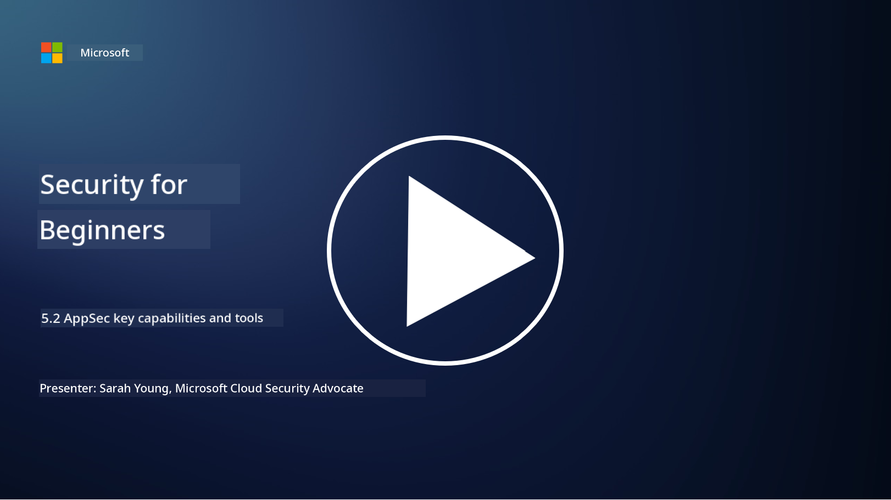

<!--
CO_OP_TRANSLATOR_METADATA:
{
  "original_hash": "790a3fa7e535ec60bb51bde13e759781",
  "translation_date": "2025-11-18T18:15:42+00:00",
  "source_file": "5.2 AppSec key capabilities.md",
  "language_code": "pcm"
}
-->
For dis section, we go talk more about di main tools and wetin dem fit do for application security:

## Introduction

For dis lesson, we go explain di main tools and wetin dem fit do for application security.

## AppSec main tools and wetin dem fit do

Di main tools and wetin dem fit do for application security dey very important to find, stop, and prevent security wahala and threats for software applications. Dis na some of di most important ones:

**1. Static Application Security Testing (SAST)**:

- **Wetin e fit do**: E dey check source code, bytecode, or binary code to find security wahala for di application's code.

- **Tools**: Examples na Fortify, Checkmarx, and Veracode.

**2. Dynamic Application Security Testing (DAST)**:

- **Wetin e fit do**: E dey scan app wey dey run to find wahala by sending input requests and checking di response.

- **Tools**: Examples na ZAP, Burp Suite, and Qualys Web Application Scanning.

**3. Interactive Application Security Testing (IAST)**:

- **Wetin e fit do**: E join SAST and DAST together to check code when e dey run, e dey give better results and reduce false positives.

- **Tools**: Examples na Contrast Security and HCL AppScan.

**4. Runtime Application Self-Protection (RASP)**:

- **Wetin e fit do**: E dey monitor and protect apps as dem dey run, e dey detect and stop security threats as dem dey happen.

- **Tools**: Examples na Veracode Runtime Protection and F5 Advanced WAF with RASP.

**5. Web Application Firewalls (WAFs)**:

- **Wetin e fit do**: E dey act like shield between di app and internet, e dey filter traffic wey dey come and block bad requests.

- **Tools**: Examples na ModSecurity, AWS WAF, and Akamai Kona Site Defender.

**6. Dependency Scanning**:

- **Wetin e fit do**: E dey find wahala for third-party libraries and components wey di app dey use.

- **Tools**: Examples na OWASP Dependency-Check and Snyk.

**7. Penetration Testing (Pen Testing)**:

- **Wetin e fit do**: E dey act like real-world attack to find wahala and check di security of di app.

- **Tools**: Certified ethical hackers and security professionals dey use tools like Metasploit and Nmap.

**8. Security Scanning and Analysis**:

- **Wetin e fit do**: E dey scan for known wahala, configuration errors, and security misconfigurations.

- **Tools**: Examples na Nessus, Qualys Vulnerability Management, and OpenVAS.

**9. Container Security Tools**:

- **Wetin e fit do**: E dey focus on di security of containerized apps and di environment wey dem dey.

- **Tools**: Examples na Docker Security Scanning and Aqua Security.

**10. Secure Development Training**:

- **Wetin e fit do**: E dey give training and awareness programs to developers to help dem code well.

- **Tools**: Customized training programs and platforms.

**11. Security Testing Frameworks**:

- **Wetin e fit do**: E dey provide full testing frameworks for different application security testing needs.

- **Tools**: OWASP Amass, OWASP OWTF and FrAppSec.

**12. Secure Code Review Tools**:

- **Wetin e fit do**: E dey check source code for security wahala and coding best practices.

- **Tools**: Examples na SonarQube and Checkmarx.

**13. Secure APIs and Microservices Tools**:

- **Wetin e fit do**: E dey focus on di security of APIs and microservices, including authentication, authorization, and data protection.

- **Tools**: Examples na Apigee, AWS API Gateway, and Istio.

## Further reading

- [Wetin Be Application Security? Concepts, Tools & Best Practices | HackerOne](https://www.hackerone.com/knowledge-center/what-application-security-concepts-tools-best-practices)
- [Wetin Be IAST? (Interactive Application Security Testing) (comparitech.com)](https://www.comparitech.com/net-admin/what-is-iast/)
- [10 Types of Application Security Testing Tools: When and How to Use Dem (cmu.edu)](https://insights.sei.cmu.edu/blog/10-types-of-application-security-testing-tools-when-and-how-to-use-them/)
- [Shifting di Balance of Cybersecurity Risk: Principles and Approaches for Security-by-Design and Default | Cyber.gov.au](https://www.cyber.gov.au/about-us/view-all-content/publications/principles-and-approaches-for-security-by-design-and-default)

---

<!-- CO-OP TRANSLATOR DISCLAIMER START -->
**Disclaimer**:  
Dis dokyument don use AI transleshion service [Co-op Translator](https://github.com/Azure/co-op-translator) do di transleshion. Even as we dey try make am accurate, abeg make you sabi say automatik transleshion fit get mistake or no dey correct well. Di original dokyument wey dey for im native language na di main source wey you go fit trust. For important informashon, e good make you use professional human transleshion. We no go fit take blame for any misunderstanding or wrong interpretation wey fit happen because you use dis transleshion.
<!-- CO-OP TRANSLATOR DISCLAIMER END -->