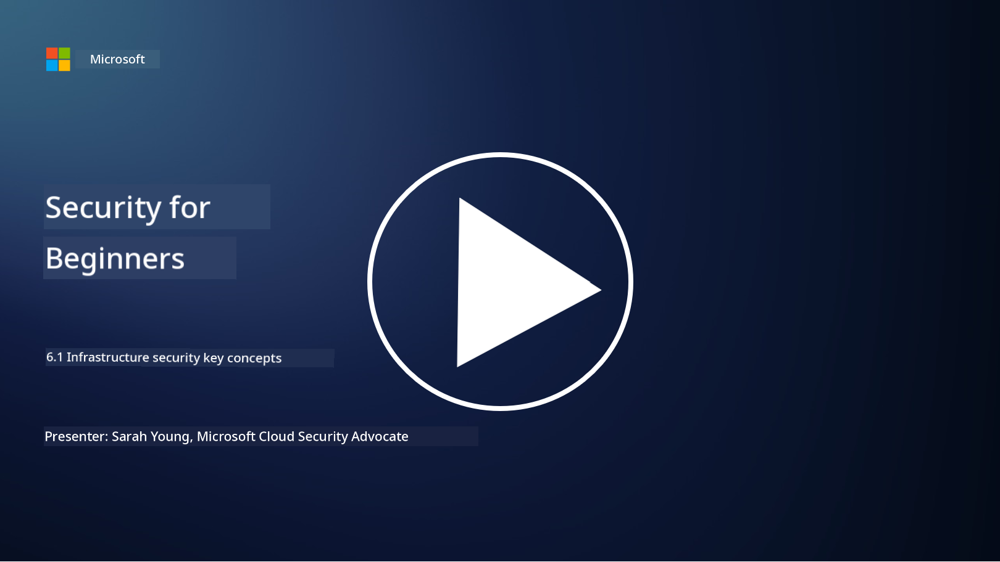

<!--
CO_OP_TRANSLATOR_METADATA:
{
  "original_hash": "882ebf66a648f419bcbf680ed6aefa00",
  "translation_date": "2025-11-18T17:59:07+00:00",
  "source_file": "6.1 Infrastructure security key concepts.md",
  "language_code": "pcm"
}
-->
# Infrastructure security key concepts

“Infrastructure” na di foundation wey dey for any IT environment, e include servers, cloud services, and containers – plenty different technologies dey inside. Di applications wey we talk about for di last section dey run for infrastructure, so attackers fit target am too.

For dis lesson, we go talk about:

- Wetin be security hygiene and why e dey important?

- Wetin be security posture management?

- Wetin be patching and why e dey important?

- Wetin be containers and wetin dey different for dia security?

## Wetin be security hygiene and why e dey important?

**Security hygiene** na di set of practices and behaviors wey people and organizations dey follow to maintain better cybersecurity habits. E mean say dem dey take steps to protect systems, data, and networks from threats and vulnerabilities. Good security hygiene dey important for plenty reasons:

- **Prevent Attacks**: If you dey follow best practices, e fit stop common cyberattacks like phishing, malware infections, and unauthorized access.

- **Protect Data**: Better security hygiene dey protect sensitive and confidential data from theft or exposure.

- **Maintain Trust**: Organizations wey dey show good security hygiene go make customers and partners trust dem.

- **Compliance**: Plenty regulations and standards dey require organizations to follow security hygiene practices.

- **Reduce Risk**: If you dey consistent with security hygiene, e go reduce di overall risk of security wahala and breaches.

Security hygiene dey include things like keeping software up to date, using strong passwords and multi-factor authentication, regular backups, employee training, and monitoring for suspicious activities. Na di foundation of strong cybersecurity posture.

## Wetin be security posture management?

Security Posture Management na di practice of checking, monitoring, and managing how an organization dey ready to protect dia IT systems, networks, data, and assets from cyber threats and attacks. Di cybersecurity posture na di overall approach and readiness wey di organization get to safeguard dia digital assets and make sure say dia information dey confidential, correct, and available. E involve di strategies, policies, practices, and technologies wey di organization dey use to protect dia things. 

E dey focus on evaluating and maintaining di security of systems, networks, applications, and data to make sure say dem dey follow security policies, best practices, and compliance requirements. SPM dey help give full view of di organization security status, identify vulnerabilities and weaknesses, and prioritize wetin dem go fix first.

## Wetin be patching and why e dey important?

**Patching** na di process of applying software updates, wey people dey call patches or fixes, to software, operating systems, and applications. Dis updates dey usually fix security vulnerabilities, bugs, and other wahala wey attackers fit use. Even hardware devices dey need patching: e fit be dia firmware or built-in OS. Hardware patching dey harder pass software patching.

Patching dey important for plenty reasons:

- **Security**: Patches dey fix known vulnerabilities wey attackers fit use to enter systems and steal data.

- **Stability**: Patches dey improve stability and performance, so systems no go dey crash anyhow.

- **Compliance**: Plenty regulations and compliance standards dey require organizations to apply security patches quick.

- **Maintain Trust**: Regular patching dey show customers and stakeholders say di organization dey serious about security.

- **Reduce Risk**: Patching dey reduce di attack surface and di chance say cyberattacks go succeed.

If you no apply patches quick, e fit make systems dey open to known exploits, wey go increase di risk of security wahala and data loss.

## Wetin be containers and wetin dey different for dia security?

Containers na lightweight, standalone, and executable software packages wey get everything wey dem need to run software, like di code, runtime, libraries, and system tools. Containers dey provide consistent and isolated environment for applications, wey dey make am easy to develop, package, and deploy software across different environments and platforms. Popular containerization technologies na Docker and Kubernetes.

Container Security na di practices and technologies wey people dey use to protect containers and di applications wey dey inside dem from different security threats and vulnerabilities. Container security dey important because, even though containers dey portable and scalable, dem still get dia own security wahala:

1. **Image Security:** Container images fit get vulnerabilities, and if you no dey update and patch dem regularly, attackers fit use dem. Container security dey involve scanning images for known vulnerabilities and making sure say only trusted images dey used.

2. **Runtime Security:** Containers wey dey run must dey isolated from each other and di host system to stop unauthorized access and possible attacks. Runtime security dey use isolation technologies like namespaces and cgroups, plus tools for monitoring and auditing container behavior.

3. **Network Security:** Containers dey communicate with each other and external systems through networks. You need proper network segmentation and firewall rules to control traffic between containers and stop unauthorized access.

4. **Access Control:** E dey important to make sure say only authorized users and processes fit access and modify containers. Role-based access control (RBAC) and identity management tools dey help for dis area.

5. **Logging and Monitoring:** Container security dey involve collecting and analyzing logs and monitoring data to detect and respond to security wahala and anomalies quick.

6. **Orchestration Security:** If you dey use container orchestration platforms like Kubernetes, you need to secure di orchestration layer too. Dis one include securing di Kubernetes API server, setting proper RBAC policies, and auditing cluster activity.

7. **Secrets Management:** Handling sensitive information like API keys and passwords inside containers need secure storage and management solutions to stop exposure.

Container security solutions dey combine security best practices, vulnerability scanning tools, runtime protection mechanisms, network security configurations, and container orchestration security features. Continuous monitoring and automation dey very important for container security to detect and respond to threats fast as containerized applications dey grow and scale.

## Further reading

- [The importance of security hygiene | Security Magazine](https://www.securitymagazine.com/articles/99510-the-importance-of-security-hygiene)
- [What is CSPM? | Microsoft Security](https://www.microsoft.com/security/business/security-101/what-is-cspm?WT.mc_id=academic-96948-sayoung)
- [What is Cloud Security Posture Management (CSPM)? | HackerOne](https://www.hackerone.com/knowledge-center/what-cloud-security-posture-management)
- [Function of cloud security posture management - Cloud Adoption Framework | Microsoft Learn](https://learn.microsoft.com/azure/cloud-adoption-framework/organize/cloud-security-posture-management?WT.mc_id=academic-96948-sayoung)
- [What Is a CNAPP? | Microsoft Security](https://www.microsoft.com/security/business/security-101/what-is-cnapp)
- [Why Everyone Is Talking About CNAPP (forbes.com)](https://www.forbes.com/sites/forbestechcouncil/2021/12/10/why-everyone-is-talking-about-cnapp/?sh=567275ca1549)
- [Why is patching important to cybersecurity? - CyberSmart](https://cybersmart.co.uk/blog/why-is-patching-important-to-cybersecurity/)
- [What Is Container Security? Complete Guide [2023] (aquasec.com)](https://www.aquasec.com/cloud-native-academy/container-security/container-security/)

---

<!-- CO-OP TRANSLATOR DISCLAIMER START -->
**Disclaimer**:  
Dis dokyument don use AI translation service [Co-op Translator](https://github.com/Azure/co-op-translator) do di translation. Even as we dey try make am accurate, abeg make you sabi say automated translations fit get mistake or no dey correct well. Di original dokyument for im native language na di main correct source. For important information, e good make professional human translation dey use. We no go fit take blame for any misunderstanding or wrong interpretation wey fit happen because you use dis translation.
<!-- CO-OP TRANSLATOR DISCLAIMER END -->