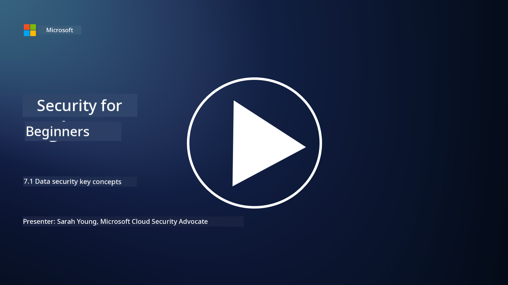

<!--
CO_OP_TRANSLATOR_METADATA:
{
  "original_hash": "9703868f41dcddd5a98dea9ea6fcd94d",
  "translation_date": "2025-11-18T17:59:55+00:00",
  "source_file": "7.1 Data security key concepts.md",
  "language_code": "pcm"
}
-->
# Data security key concepts

We don talk small small about data security for dis course. Now, make we enter di mata well well. For dis lesson, you go learn:

- Wetin be data security?

- Wetin be data classification?

- Wetin be data lifecycle management?

- Wetin be data loss prevention (DLP)?

- Why data security dey important for organization?

## Wetin be data security?

**Data security** na di way wey people dey protect digital data like database, files, and sensitive information from people wey no suppose touch am, make dem no fit see am, change am, or destroy am. Di main goal na to make sure say di data dey safe, correct, and dey available anytime we need am. To do dis one, we go use different methods like technology, rules, and physical security to protect di data from wahala like cyberattack, people wey dey inside wey fit do bad thing, and data wey dem fit steal. Some things wey dey help for data security na encryption, access control, authentication, audit trail, and security policy.

## Wetin be data classification?

**Data classification** na di way wey people dey arrange data based on how sensitive e be, di value, and how e take important to di organization. Di reason why dem dey do data classification na to help di organization sabi di kind data wey dem get and how dem go protect am. Di common way wey dem dey classify data na "public," "internal," "confidential," and "restricted" or "highly confidential." After dem don classify di data, di organization go fit put di right security control and access restriction to make sure say di sensitive data dey safe and dem dey follow di law wey dey guide data protection.

## Wetin be data lifecycle management?

**Data lifecycle management** na di way wey people dey manage data from di time wey dem create am or collect am till di time wey dem go keep am for archive or delete am. Di lifecycle of data dey include stages like creation, storage, processing, transmission, archival, and disposal. Data lifecycle management dey involve di rules and process wey dem go use for each stage of di data lifecycle, like how long dem go keep di data, who fit see am, backup, and how dem go clean di data. If organization sabi manage di lifecycle of data well, e go help dem save space, make di data better, and follow di law wey dey guide data protection.

## Wetin be data loss prevention (DLP)?

**Data Loss Prevention (DLP)** na di technology, rules, and way wey people dey use to stop sensitive or confidential data from leaking, sharing, or people wey no suppose see am. DLP dey use inspection and analysis to check di data wey dey move (like email, web traffic), di one wey dem don store (like files and database), and di one wey people dey use (like data wey dem dey work on). Di goal of DLP na to find di sensitive data and block am or encrypt am to stop data wey dem fit steal, follow di law wey dey guide data protection, and protect di name of di organization.

## Why data security dey important for organization?

Data security dey very important for organization because:

- **Protection of Sensitive Information**: Organization dey keep sensitive data like customer record, intellectual property, financial data, and employee information. Data security dey protect dis kind data from people wey no suppose see am or steal am.

- **Compliance**: Many industry and place get law wey dey guide how people go protect data and privacy. Data security dey help organization follow dis law so dem no go pay fine or spoil their name.

- **Prevention of Data Breaches**: If data leak, e fit cause money loss, spoil di name of di organization, and bring wahala for court. Data security dey help stop data wey dem fit steal or reduce di damage if e happen.

- **Preservation of Trust**: Customers and stakeholders dey trust organization with their data. If data leak, e go spoil di trust. Strong data security dey help keep di trust and confidence of customers.

- **Competitive Advantage**: If organization dey show say dem dey serious about data security, e fit make dem better pass their competitors. Customers and partners go like work with organization wey dey protect data well.

- **Operational Continuity**: Data security dey include backup and plan for disaster recovery. E dey make sure say di important data dey available and di business no go stop if data loss or disaster happen.

- **Protection Against Insider Threats**: Data security dey also protect di organization from people wey dey inside wey fit expose data by mistake or do bad thing.

To summarize, data security dey very important to protect sensitive information, follow di law, stop data wey dem fit steal, keep trust, and make sure say di organization dey successful and their name no spoil.

## Further reading

- [What Is Data Security? | Microsoft Security](https://www.microsoft.com/en-au/security/business/security-101/what-is-data-security?WT.mc_id=academic-96948-sayoung)
- [Automatically Classify & Protect Documents & Data | Microsoft Purview Information Protection](https://youtu.be/v8LqmzBUaOo)
- [Example data classification policy](https://www.cmu.edu/data/guidelines/data-classification.html)
- [What is Data Security? Data Security Definition and Overview | IBM](https://www.ibm.com/topics/data-security)
- [Data Lifecycle Management: A 2023 Guide for Your Business (cloudwards.net)](https://www.cloudwards.net/data-lifecycle-management/)
- [What is data loss prevention (DLP)? | Microsoft Security](https://www.microsoft.com/security/business/security-101/what-is-data-loss-prevention-dlp?WT.mc_id=academic-96948-sayoung)
- [What is DLP? How data loss prevention software works and why you need it | CSO Online](https://www.csoonline.com/article/569559/what-is-dlp-how-data-loss-prevention-software-works-and-why-you-need-it.html)

---

<!-- CO-OP TRANSLATOR DISCLAIMER START -->
**Disclaimer**:  
Dis document don use AI translation service [Co-op Translator](https://github.com/Azure/co-op-translator) take translate am. Even though we dey try make e accurate, abeg sabi say automated translations fit get mistake or no dey 100% correct. Di original document for di native language na di main correct source. For important information, e better make una use professional human translation. We no go fit take responsibility for any misunderstanding or wrong interpretation wey fit happen because of dis translation.
<!-- CO-OP TRANSLATOR DISCLAIMER END -->