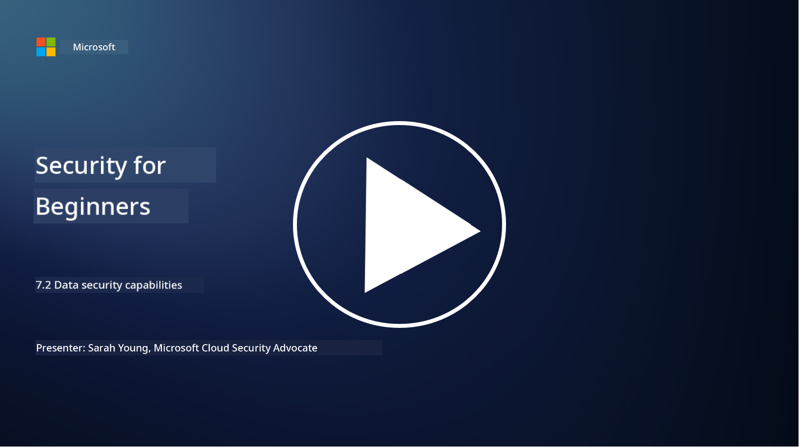

<!--
CO_OP_TRANSLATOR_METADATA:
{
  "original_hash": "50697add9758e54693442d502d2d5f8a",
  "translation_date": "2025-11-18T18:09:41+00:00",
  "source_file": "7.2 Data security capabilities.md",
  "language_code": "pcm"
}
-->
# Data security capabilities

For dis section, we go talk more about di main tools and wetin dem fit do for data security:

**Introduction**

For dis lesson, we go talk about:

- Wetin be data loss prevention tools?

- Wetin be insider risk management tools?

- Wetin data retention tools fit do?

## Wetin be data loss prevention tools?

Data Loss Prevention (DLP) tools na software and technology wey dem design to stop people wey no suppose get access, share, or leak sensitive or private data for inside one company. Dis tools dey use content inspection, policy enforcement, and monitoring to find and protect sensitive data make e no leak or misuse. Example of DLP products na: Symantec Data Loss Prevention, McAfee Total Protection for Data Loss Prevention, Microsoft 365 DLP**: E dey work with Microsoft 365 apps to help companies find and protect sensitive data for emails, documents, and messages.

## Wetin be insider risk management tools?

Insider Risk Management tools dey help companies find and reduce risk wey fit come from workers, contractors, or partners wey fit intentionally or by mistake spoil data security. Dis tools dey monitor how people dey behave, how dem dey access things, and how dem dey use data to catch any suspicious move or insider threat. Example of insider risk management products na: Microsoft Insider Risk Management (wey be part of Microsoft 365), Forcepoint Insider Threat Data Protection, Varonis Insider Threat Detection.

## Wetin data retention tools fit do?

Data retention tools na software and solutions wey dem design to manage how company go keep and delete data based on their data retention policy and wetin law talk. Dis tools dey help automate how dem go keep data for some time and delete am well when e no dey needed again. Example of data retention products na: Veritas Enterprise Vault, Commvault Complete Data Protection, Microsoft data lifecycle management. Dis tools dey help companies control how dem dey keep and throway data, make dem follow data protection law, and manage data well from beginning to end.

## Further reading

- [Guide to Data Security Posture Management (DSPM) | CSA (cloudsecurityalliance.org)](https://cloudsecurityalliance.org/blog/2023/03/31/the-big-guide-to-data-security-posture-management-dspm/)
- [Data Loss Prevention across endpoints, apps, & services | Microsoft Purview](https://youtu.be/hvqq8L_0kgI)
- [18 Best Data Loss Prevention Software Tools 2023 (Free + Paid) (comparitech.com)](https://www.comparitech.com/data-privacy-management/data-loss-prevention-tools-software/)
- [Data Loss Prevention (nist.gov)](https://tsapps.nist.gov/publication/get_pdf.cfm?pub_id=904672)
- [Learn about insider risk management | Microsoft Learn](https://learn.microsoft.com/purview/insider-risk-management?WT.mc_id=academic-96948-sayoung)
- [Data Lifecycle Management | IBM](https://www.ibm.com/topics/data-lifecycle-management)
- [What Is Data Lifecycle Management (DLM)? | 2023 Best Practices (selecthub.com)](https://www.selecthub.com/big-data-analytics/data-lifecycle-management/)

---

<!-- CO-OP TRANSLATOR DISCLAIMER START -->
**Disclaimer**:  
Dis docu don dey translate wit AI translation service [Co-op Translator](https://github.com/Azure/co-op-translator). Even though we dey try make am accurate, abeg sabi say automated translations fit get mistake or no dey 100% correct. Di original docu for di language wey dem write am first na di main correct source. For important information, e better make una use professional human translation. We no go fit take blame for any misunderstanding or wrong interpretation wey fit happen because of dis translation.
<!-- CO-OP TRANSLATOR DISCLAIMER END -->