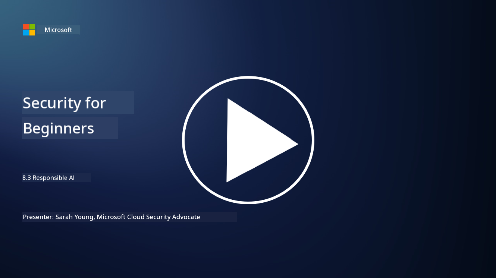

<!--
CO_OP_TRANSLATOR_METADATA:
{
  "original_hash": "5e9775ee91bde7d44577891d5f11c4c5",
  "translation_date": "2025-11-18T18:10:16+00:00",
  "source_file": "8.3 Responsible AI.md",
  "language_code": "pcm"
}
-->
# Responsible AI

## Wetin be responsible AI and how e take relate to AI security?

Responsible AI na di way wey people dey develop and use artificial intelligence (AI) wey go dey ethical, clear, and go follow wetin society value. E dey include things like fairness, accountability, and robustness, to make sure say AI systems dey designed and dey work to benefit people, communities, and society as e be.

Di connection between responsible AI and AI security dey important because:

-   **Ethical Matters**: Responsible AI dey involve ethical matters wey dey affect security, like privacy and data protection. To make sure say AI systems dey respect user privacy and dey protect personal data na one big part of responsible AI.

-   **Strong and Reliable Systems**: AI systems suppose strong well to resist manipulation and attacks, and dis na one of di main principles for both responsible AI and AI security. E include protecting di system from adversarial attacks and making sure say di AI dey make correct decisions.

-   **Transparency and Explainability**: Responsible AI dey make sure say AI systems dey clear and di decisions wey dem dey make fit explain well. Dis dey very important for security because people wey dey use di system need to understand how di AI dey work to trust di security.

-   **Accountability**: AI systems suppose dey responsible for di actions wey dem dey take, so e mean say dem go get ways to trace di decisions and fix any problem wey fit happen. Dis dey align with security practices wey dey monitor and check system activities to stop and handle breaches.

To summarize, responsible AI and AI security dey work together, and di principles of responsible AI dey help make AI systems more secure and better against threats.

## How I fit make sure say my AI system dey secure and ethical?

To make sure say your AI system dey secure and ethical, you go need to follow dis steps:

- **Follow Ethical Principles**: Use di guidelines wey dey focus on human, societal, and environmental wellbeing; fairness; privacy protection; reliability; transparency; contestability; and accountability.

- **Put Strong Security Measures**: Do proactive security testing and use AI trust, risk, and security management programs to protect di system from threats and problems.

- **Involve Different People**: Carry different people join di AI development process, like ethicists, social scientists, and people wey di system go affect, to make sure say different ideas and values dey considered.

- **Make Di System Transparent and Explainable**: Make sure say di way di AI dey make decisions dey clear and fit explain well, so people go trust am and fit see any bias or mistake.

- **Protect Data Privacy**: Use encryption and other data protection methods to make sure say di data dey safe and respect di privacy rights of users.

- **Put Human Oversight**: Get ways wey human beings fit check di decisions wey AI dey make and fit challenge am if e no correct, to make sure say di system dey accountable.

- **Learn About AI Safety**: Always dey follow di latest research and discussions about AI safety to understand how di security and ethics for AI dey change.

- **Follow Di Rules**: Make sure say your AI system dey follow all di laws and regulations wey dey, like data protection laws, anti-discrimination laws, and industry-specific guidelines.

## You fit give me example of security problem wey unethical use of AI fit cause?

Dis na some examples of security problems wey fit happen if people no use AI well:

- **Bias for Decision-Making**: If AI dey trained with data wey get bias, e fit continue di bias and even make am worse. For example, if search engine dey trained with data wey dey show stereotypes, e fit dey give biased search results wey fit lead to unfair treatment or discrimination.

- **AI for Court Systems**: If people dey use AI for legal decisions, e fit cause wahala if di way di AI dey make decisions no clear or e dey influenced by biased data. Dis fit lead to wrong legal outcomes and fit affect people rights.

- **Manipulation of AI Systems**: AI systems fit dey attacked by people wey wan change di input data small to make di system give wrong results. For example, autonomous cars fit dey tricked to misread traffic signs, wey fit cause safety problems.

- **AI Surveillance**: If people dey use AI for surveillance, e fit cause privacy wahala, especially if dem no get proper consent or dem dey use am to take away people freedom. Dis na big problem for places wey government dey use AI to monitor and suppress people.

Dis examples dey show why e dey important to think about ethics when people dey develop and use AI systems, to stop security problems and protect people rights and privacy.

## Further reading

 - [Microsoft Responsible AI Standard v2 General Requirements](https://query.prod.cms.rt.microsoft.com/cms/api/am/binary/RE5cmFl?culture=en-us&country=us&WT.mc_id=academic-96948-sayoung)
 - [Responsible AI (mit.edu)](https://sloanreview.mit.edu/big-ideas/responsible-ai/)
 - [13 Principles for Using AI Responsibly (hbr.org)](https://hbr.org/2023/06/13-principles-for-using-ai-responsibly)

---

<!-- CO-OP TRANSLATOR DISCLAIMER START -->
**Disclaimer**:  
Dis dokyument don use AI translation service [Co-op Translator](https://github.com/Azure/co-op-translator) do di translation. Even as we dey try make am accurate, abeg sabi say machine translation fit get mistake or no dey correct well. Di original dokyument wey dey for im native language na di main source wey you go trust. For important information, e better make professional human translation dey use. We no go fit take blame for any misunderstanding or wrong interpretation wey fit happen because you use dis translation.
<!-- CO-OP TRANSLATOR DISCLAIMER END -->