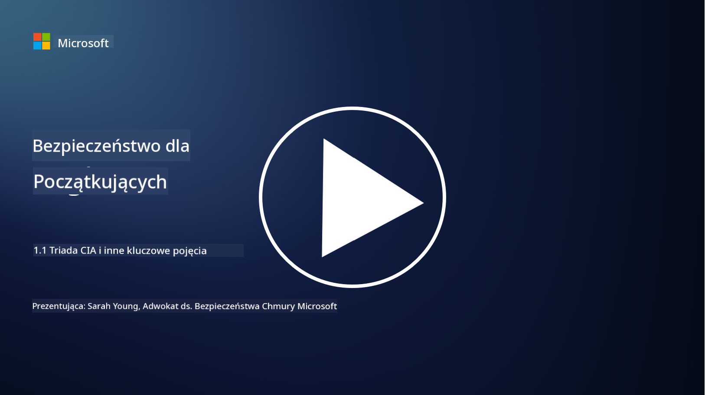
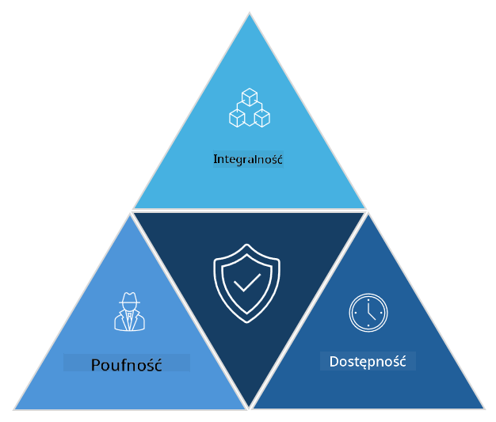

<!--
CO_OP_TRANSLATOR_METADATA:
{
  "original_hash": "16a76f9fa372fb63cffb6d76b855f023",
  "translation_date": "2025-09-03T17:39:35+00:00",
  "source_file": "1.1 The CIA triad and other key concepts.md",
  "language_code": "pl"
}
-->
# Triada CIA i inne kluczowe pojęcia

## Wprowadzenie

W tej lekcji omówimy:

 - Czym jest cyberbezpieczeństwo?
   
 
 - Czym jest triada CIA w cyberbezpieczeństwie?

   

 - Czym są autentyczność, niezaprzeczalność i prywatność w kontekście cyberbezpieczeństwa?

## Czym jest cyberbezpieczeństwo?

Cyberbezpieczeństwo, znane również jako bezpieczeństwo informacji, to praktyka ochrony systemów komputerowych, sieci, urządzeń i danych przed atakami cyfrowymi, nieautoryzowanym dostępem, uszkodzeniem lub kradzieżą. Głównym celem cyberbezpieczeństwa jest zapewnienie poufności, integralności i dostępności zasobów cyfrowych oraz informacji. Specjaliści ds. cyberbezpieczeństwa projektują i wdrażają mechanizmy ochrony, aby zabezpieczyć zasoby, dane i informacje. W miarę jak coraz więcej aspektów naszego życia przenosi się do świata cyfrowego, cyberbezpieczeństwo stało się priorytetem zarówno dla osób prywatnych, jak i organizacji.

## Czym jest triada CIA w cyberbezpieczeństwie?

Triada CIA w cyberbezpieczeństwie odnosi się do modelu, który uwzględnia trzy główne aspekty każdego działania związanego z cyberbezpieczeństwem lub projektowaniem systemu/środowiska:

### Poufność

To aspekt, który większość osób kojarzy z terminem „cyberbezpieczeństwo”: poufność to proces ochrony danych i informacji przed próbami nieautoryzowanego dostępu, czyli tylko osoby, które muszą mieć dostęp do informacji, mogą je zobaczyć. Nie wszystkie dane są jednakowo ważne, dlatego dane są zazwyczaj kategoryzowane i chronione w zależności od tego, jak dużą szkodę mogłoby wyrządzić ich ujawnienie niewłaściwym osobom.

### Integralność

Odnosi się do ochrony dokładności i wiarygodności danych znajdujących się w środowiskach oraz zapobiegania ich modyfikacji lub zmiany przez osoby nieupoważnione. Na przykład: student zmienia swoją datę urodzenia w rejestrze kierowców w DMV, aby wyglądało na to, że jest starszy, dzięki czemu może uzyskać prawo jazdy z wcześniejszą datą urodzenia i kupić alkohol.

### Dostępność

To aspekt istotny w operacyjnej technologii informacyjnej, ale dostępność jest również ważna w cyberbezpieczeństwie. Istnieją specyficzne rodzaje ataków, które celują w dostępność, przed którymi specjaliści ds. bezpieczeństwa muszą się chronić (np. ataki typu DDoS – rozproszona odmowa dostępu).

**Triada CIA w cyberbezpieczeństwie**

## Czym są autentyczność, niezaprzeczalność i prywatność w kontekście cyberbezpieczeństwa?

Są to dodatkowe ważne pojęcia związane z zapewnieniem bezpieczeństwa i wiarygodności systemów oraz danych:

**Autentyczność** - odnosi się do pewności, że informacje, komunikacja lub podmiot, z którym się kontaktujesz, są prawdziwe i nie zostały zmienione ani naruszone przez osoby nieupoważnione.

**Niezaprzeczalność** - to koncepcja zapewnienia, że strona nie może zaprzeczyć swojemu udziałowi lub autentyczności transakcji czy komunikacji. Zapobiega sytuacjom, w których ktoś twierdzi, że nie wysłał wiadomości lub nie wykonał określonej czynności, mimo że istnieją dowody na to.

**Prywatność** - odnosi się do ochrony wrażliwych i osobistych informacji przed nieautoryzowanym dostępem, użyciem, ujawnieniem lub manipulacją. Obejmuje kontrolę nad tym, kto ma dostęp do danych osobowych oraz jak te dane są zbierane, przechowywane i udostępniane.

## Dodatkowa lektura

[What Is Information Security (InfoSec)? | Microsoft Security](https://www.microsoft.com/security/business/security-101/what-is-information-security-infosec#:~:text=Three%20pillars%20of%20information%20security%3A%20the%20CIA%20triad,as%20guiding%20principles%20for%20implementing%20an%20InfoSec%20plan.)

---

**Zastrzeżenie**:  
Ten dokument został przetłumaczony za pomocą usługi tłumaczenia AI [Co-op Translator](https://github.com/Azure/co-op-translator). Chociaż dokładamy wszelkich starań, aby tłumaczenie było precyzyjne, prosimy pamiętać, że automatyczne tłumaczenia mogą zawierać błędy lub nieścisłości. Oryginalny dokument w jego rodzimym języku powinien być uznawany za źródło autorytatywne. W przypadku informacji o kluczowym znaczeniu zaleca się skorzystanie z profesjonalnego tłumaczenia przez człowieka. Nie ponosimy odpowiedzialności za jakiekolwiek nieporozumienia lub błędne interpretacje wynikające z użycia tego tłumaczenia.