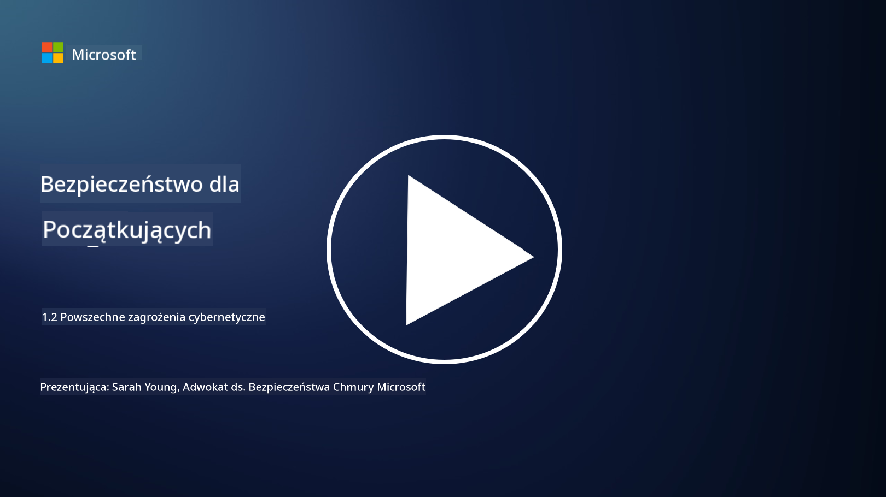

<!--
CO_OP_TRANSLATOR_METADATA:
{
  "original_hash": "6fc3030323139d7134a4ca9d03eccac9",
  "translation_date": "2025-09-03T17:09:35+00:00",
  "source_file": "1.2 Common cybersecurity threats.md",
  "language_code": "pl"
}
-->
# Typowe zagrożenia cyberbezpieczeństwa

## Wprowadzenie

W tej lekcji omówimy:

- Co to jest zagrożenie cyberbezpieczeństwa?

- Dlaczego złośliwi aktorzy chcą naruszyć dane i systemy IT?

- Jakie są najczęstsze rodzaje zagrożeń cyberbezpieczeństwa?

- Co to jest framework MITRE ATT&CK?

- Gdzie mogę być na bieżąco z krajobrazem zagrożeń cyberbezpieczeństwa?

## Co to jest zagrożenie cyberbezpieczeństwa?

Zagrożenie cyberbezpieczeństwa odnosi się do każdego potencjalnego niebezpieczeństwa lub ryzyka, które może naruszyć poufność, integralność lub dostępność danych lub systemów IT. Zagrożenia te są stwarzane przez złośliwych aktorów, którzy próbują wykorzystać luki w celu uzyskania nieautoryzowanego dostępu, kradzieży wrażliwych informacji, zakłócenia operacji lub wyrządzenia szkody osobom, organizacjom, a nawet całym państwom. Zagrożenia cyberbezpieczeństwa mogą przybierać różne formy i celować w różne aspekty systemów cyfrowych i danych.

## Dlaczego złośliwi aktorzy chcą naruszyć dane i systemy IT?

Złośliwi aktorzy naruszają dane i systemy IT z różnych powodów, często kierując się osobistymi korzyściami, motywami ideologicznymi lub chęcią wywołania zakłóceń. Zrozumienie tych motywacji może pomóc organizacjom i osobom lepiej bronić się przed zagrożeniami cybernetycznymi. Oto kilka typowych powodów, dla których złośliwi aktorzy przeprowadzają cyberataki:

1. **Korzyści finansowe**: Wiele ataków jest motywowanych chęcią osiągnięcia zysku finansowego. Złośliwi aktorzy mogą kraść wrażliwe informacje, takie jak numery kart kredytowych, dane kont bankowych czy dane osobowe, aby popełniać oszustwa, kradzież tożsamości, wymuszać okup lub sprzedawać skradzione dane w dark webie.

2. **Szpiegostwo**: Państwa, konkurenci lub inne podmioty mogą angażować się w cybernetyczne szpiegostwo, aby kraść wrażliwe dane rządowe, korporacyjne lub badawcze w celu uzyskania przewagi politycznej, ekonomicznej lub militarnej.

3. **Zakłócenia i sabotaż**: Niektóre ataki mają na celu zakłócenie infrastruktury krytycznej, usług lub operacji z powodów politycznych lub ideologicznych. Takie ataki mogą powodować chaos, straty finansowe i szkody w reputacji.

4. **Motywacje ideologiczne**: Hakerzy aktywiści (hacktywiści) i grupy o motywacjach ideologicznych lub politycznych mogą naruszać systemy, aby zwrócić uwagę na określone kwestie, promować swoje przekonania lub protestować przeciwko konkretnym działaniom lub organizacjom.

5. **Nieumyślne działania**: Nie wszystkie złośliwe działania są celowe; niektóre osoby mogą nieświadomie przyczyniać się do zagrożeń cybernetycznych, padając ofiarą socjotechniki lub będąc częścią zainfekowanej sieci.

Ostatecznie motywacje do naruszania danych i systemów IT mogą być bardzo różnorodne, a skutki takich ataków mogą być poważne. Ważne jest, aby osoby, organizacje i rządy traktowały cyberbezpieczeństwo poważnie i wdrażały środki ochrony przed tymi zagrożeniami.

## Jakie są najczęstsze rodzaje zagrożeń cyberbezpieczeństwa?

Istnieje kilka typowych rodzajów ataków cybernetycznych, które złośliwi aktorzy wykorzystują do naruszania systemów, kradzieży danych i powodowania zakłóceń. Oto niektóre z najczęściej spotykanych typów w momencie pisania:

1. **Phishing**:

Phishing polega na wysyłaniu podstępnych e-maili lub wiadomości, które wyglądają na pochodzące z wiarygodnych źródeł, w celu nakłonienia odbiorców do ujawnienia wrażliwych informacji, takich jak hasła, numery kart kredytowych czy dane osobowe. Phishing może również prowadzić ofiary na złośliwe strony internetowe lub do pobrania złośliwego oprogramowania.

2. **Malware**:

Malware (złośliwe oprogramowanie) obejmuje różne programy zaprojektowane do infekowania systemów, kradzieży danych lub powodowania szkód. Rodzaje malware to:

- **Ransomware**: Szyfruje pliki i żąda okupu za ich odszyfrowanie.

- **Trojan**: Podszywa się pod legalne oprogramowanie, dając atakującym nieautoryzowany dostęp.

- **Wirusy**: Samoreplikujące się programy, które przyczepiają się do plików i rozprzestrzeniają.

- **Robaki**: Samoreplikujące się programy, które rozprzestrzeniają się przez sieci.

3. **Denial of Service (DoS) i Distributed Denial of Service (DDoS)**:

Ataki DoS przeciążają docelowy system, czyniąc go niedostępnym dla użytkowników. Ataki DDoS wykorzystują sieć zainfekowanych urządzeń do zalania celu ruchem, utrudniając funkcjonowanie systemu lub całkowicie go unieruchamiając.

4. **SQL Injection**:

W tym ataku atakujący manipulują polami wejściowymi aplikacji internetowej, aby wstrzyknąć złośliwe zapytania SQL, potencjalnie uzyskując nieautoryzowany dostęp do baz danych i wrażliwych danych.

5. **Cross-Site Scripting (XSS)**:

Atakujący wstrzykują złośliwe skrypty do aplikacji internetowych, które są następnie wykonywane przez przeglądarki nieświadomych użytkowników. Może to prowadzić do kradzieży danych użytkowników i/lub rozprzestrzeniania malware.

6. **Socjotechnika**:

Socjotechnika wykorzystuje psychologię człowieka, aby manipulować osobami do ujawnienia poufnych informacji lub wykonania działań, które naruszają bezpieczeństwo.

7. **Zero-Day (0day) Exploits**:

Te ataki celują w luki w oprogramowaniu lub sprzęcie, które nie są jeszcze znane dostawcy lub opinii publicznej. Atakujący wykorzystują te luki, zanim zostaną opracowane poprawki. Wiele organizacji obawia się zero-day, ponieważ nie ma na nie łatki, ale nie są one tak powszechne jak inne ataki na tej liście. Gdy zero-day zostanie odkryty, badacze bezpieczeństwa szybko pracują nad stworzeniem poprawki, dlatego zero-day zazwyczaj mają krótki czas życia.

8. **Ataki na dane uwierzytelniające**:

Te ataki obejmują ataki brute force, w których atakujący wielokrotnie zgadują hasła, oraz ataki credential stuffing, w których skradzione dane uwierzytelniające z jednej strony są używane do próby uzyskania dostępu na innych stronach.

## Co to jest framework MITRE ATT&CK?

[Framework MITRE ATT&CK](https://attack.mitre.org/) (Adversarial Tactics, Techniques, and Common Knowledge) to framework, który kataloguje i kategoryzuje taktyki, techniki i procedury (TTPs), które przeciwnicy wykorzystują podczas cyberataków. Framework został stworzony przez MITRE Corporation, organizację non-profit prowadzącą centra badawczo-rozwojowe dla różnych agencji rządowych.

Framework MITRE ATT&CK zapewnia ustandaryzowany sposób opisywania i analizowania zagrożeń cybernetycznych, umożliwiając specjalistom ds. cyberbezpieczeństwa lepsze zrozumienie i obronę przed różnymi technikami ataków. Jest szeroko stosowany przez zespoły bezpieczeństwa, łowców zagrożeń i osoby reagujące na incydenty do:

1. **Zrozumienia zachowań przeciwników**: Framework dokumentuje rzeczywiste zachowania ataków, opisując kroki, które podejmują atakujący od początkowego wejścia do osiągnięcia swoich celów. Obejmuje szeroki zakres technik ataków stosowanych przez różne grupy zagrożeń.

2. **Planowania i wdrażania strategii obronnych**: Zespoły bezpieczeństwa mogą korzystać z frameworku, aby opracować proaktywne strategie obronne, które odpowiadają na konkretne taktyki i techniki, jakie mogą stosować przeciwnicy.

3. **Reagowania na incydenty i łowienia zagrożeń**: Podczas badania incydentów lub prowadzenia łowienia zagrożeń specjaliści ds. bezpieczeństwa mogą odwoływać się do frameworku, aby zidentyfikować i zneutralizować konkretne techniki stosowane przez atakujących.

Framework MITRE ATT&CK jest zorganizowany w matryce, które grupują techniki ataków w oparciu o konkretne platformy i środowiska, takie jak Windows, macOS, Linux i usługi w chmurze. Każda matryca jest podzielona na taktyki (cele wysokiego poziomu) i techniki (konkretne metody stosowane do osiągnięcia tych celów). Dla każdej techniki framework dostarcza informacji o jej działaniu, potencjalnych środkach zaradczych i odpowiednich odniesieniach do rzeczywistych grup zagrożeń, które stosowały tę technikę.

Framework jest stale aktualizowany i rozszerzany w miarę gromadzenia nowych informacji o zagrożeniach i ewolucji krajobrazu cyberbezpieczeństwa. Jest to cenne źródło wiedzy, które pomaga poprawić postawę organizacji w zakresie cyberbezpieczeństwa, umożliwiając głębsze zrozumienie, jak działają atakujący i jak bronić się przed ich taktykami.

## Gdzie mogę być na bieżąco z krajobrazem zagrożeń cyberbezpieczeństwa?

Istnieje wiele źródeł, które można wykorzystać, aby być na bieżąco z zagrożeniami cyberbezpieczeństwa. Oto kilka z nich:

- [Open Web Application Security Project (OWASP) top 10 vulnerabilities](https://owasp.org/Top10/)
- [Common Vulnerabilities and Exposures (CVEs)](https://www.bing.com/ck/a?!&&p=53df6007f017bca2JmltdHM9MTY5MjU3NjAwMCZpZ3VpZD0zYmY4N2RiYS1jYWI1LTYwMDgtMWY1YS02ZmYyY2JjNjYxZWUmaW5zaWQ9NTc2OQ&ptn=3&hsh=3&fclid=3bf87dba-cab5-6008-1f5a-6ff2cbc661ee&psq=cve&u=a1aHR0cHM6Ly9iaW5nLmNvbS9hbGluay9saW5rP3VybD1odHRwcyUzYSUyZiUyZmN2ZS5taXRyZS5vcmclMmYmc291cmNlPXNlcnAtcnImaD1BZXN4S0VBWTNnbGhNZEFpd3daMlNSZkZQNTlrODhIUnYxRUtlSkY1RTk0JTNkJnA9a2NvZmZjaWFsd2Vic2l0ZQ&ntb=1 "Common Vulnerabilities and Exposures")
- [Microsoft Security Response Center blogs](https://msrc.microsoft.com/blog/)
- [National Institute of Standards and Technology (NIST)](https://www.dhs.gov/topics/cybersecurity): NIST dostarcza zasoby, alerty i najnowsze aktualizacje dotyczące potencjalnych zagrożeń cyberbezpieczeństwa.
- [Cybersecurity and Infrastructure Security Agency (CISA)](https://www.cisa.gov/resources-tools/resources/free-cybersecurity-services-and-tools): CISA dostarcza zasoby cyberbezpieczeństwa i najlepsze praktyki dla firm, agencji rządowych i innych organizacji. CISA udostępnia aktualne informacje o typach aktywności bezpieczeństwa o dużym wpływie, które dotyczą społeczności jako całości, oraz szczegółowe analizy nowych i rozwijających się zagrożeń cybernetycznych.
- [National Cybersecurity Center of Excellence (NCCoE)](https://www.dhs.gov/topics/cybersecurity): NCCoE to centrum, które dostarcza praktyczne rozwiązania cyberbezpieczeństwa, które można zastosować w rzeczywistych sytuacjach.
- [US-CERT](https://www.cisa.gov/resources-tools/resources/free-cybersecurity-services-and-tools): United States Computer Emergency Readiness Team (US-CERT) dostarcza różnorodne zasoby cyberbezpieczeństwa, w tym alerty, wskazówki i inne.
- CERT Twojego kraju

---

**Zastrzeżenie**:  
Ten dokument został przetłumaczony za pomocą usługi tłumaczenia AI [Co-op Translator](https://github.com/Azure/co-op-translator). Chociaż dokładamy wszelkich starań, aby tłumaczenie było precyzyjne, prosimy pamiętać, że automatyczne tłumaczenia mogą zawierać błędy lub nieścisłości. Oryginalny dokument w jego rodzimym języku powinien być uznawany za źródło autorytatywne. W przypadku informacji o kluczowym znaczeniu zaleca się skorzystanie z profesjonalnego tłumaczenia przez człowieka. Nie ponosimy odpowiedzialności za jakiekolwiek nieporozumienia lub błędne interpretacje wynikające z użycia tego tłumaczenia.