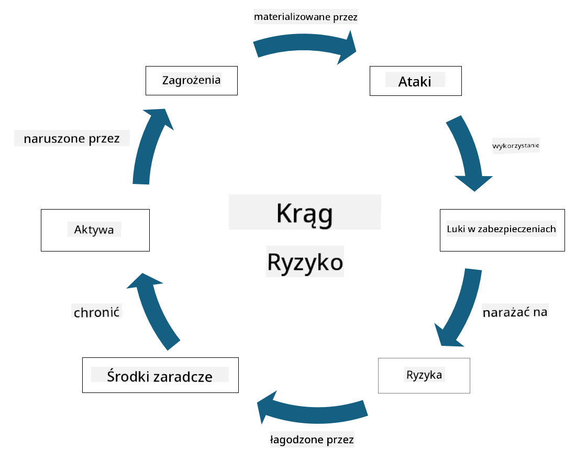

<!--
CO_OP_TRANSLATOR_METADATA:
{
  "original_hash": "fcca304f072cabf206388199e8e2e578",
  "translation_date": "2025-09-03T17:44:39+00:00",
  "source_file": "1.3 Understanding risk management.md",
  "language_code": "pl"
}
-->
# Zrozumienie zarządzania ryzykiem

## Wprowadzenie

W tej lekcji omówimy:

- Definicje często używanych terminów związanych z bezpieczeństwem

- Rodzaje zabezpieczeń

- Ocena ryzyka bezpieczeństwa

## Definicje często używanych terminów związanych z bezpieczeństwem

Te terminy są podstawowymi pojęciami w dziedzinie cyberbezpieczeństwa i zarządzania ryzykiem. Przyjrzyjmy się każdemu z nich i ich wzajemnym relacjom:

1. **Agent zagrożenia**:

Agent zagrożenia to osoba, grupa, organizacja lub zautomatyzowany system, który może wykorzystać podatności w systemie lub sieci, aby wyrządzić szkody. Agentami zagrożenia mogą być hakerzy, twórcy złośliwego oprogramowania, niezadowoleni pracownicy lub inne podmioty stanowiące ryzyko dla systemów informacyjnych i technologicznych.

2. **Zagrożenie**:

Zagrożenie to potencjalne zdarzenie lub działanie, które może wykorzystać podatności w systemie i spowodować szkody dla zasobów. Zagrożenia mogą obejmować takie działania jak włamania, wycieki danych, ataki typu denial-of-service i inne. Zagrożenia to "co" w kontekście potencjalnych szkód, jakie mogą zostać wyrządzone zasobom organizacji.

3. **Podatność**:

Podatność to słabość lub wada w projekcie, implementacji lub konfiguracji systemu, którą może wykorzystać agent zagrożenia, aby naruszyć bezpieczeństwo systemu. Podatności mogą występować w oprogramowaniu, sprzęcie, procesach lub zachowaniach ludzkich. Identyfikacja i eliminacja podatności są kluczowe dla minimalizowania ryzyka udanych ataków.

4. **Ryzyko**:

Ryzyko to potencjalna strata, szkoda lub uszkodzenie wynikające z interakcji między zagrożeniem a podatnością. Oznacza prawdopodobieństwo, że agent zagrożenia wykorzysta podatność, aby spowodować negatywne skutki. Ryzyko jest często oceniane pod kątem jego potencjalnego wpływu i prawdopodobieństwa wystąpienia.

5. **Zasób**:

Zasób to wszystko, co ma wartość i co organizacja chce chronić. Zasoby mogą obejmować obiekty fizyczne (np. komputery i serwery), dane (informacje o klientach, dokumenty finansowe), własność intelektualną (tajemnice handlowe, patenty) oraz zasoby ludzkie (umiejętności i wiedza pracowników). Ochrona zasobów jest kluczowym celem cyberbezpieczeństwa.

6. **Ekspozycja**:

Ekspozycja odnosi się do stanu podatności na potencjalne zagrożenia. Występuje, gdy istnieje podatność, którą może wykorzystać agent zagrożenia. Ekspozycja podkreśla ryzyko związane z obecnością podatności w systemie lub sieci.

7. **Zabezpieczenie**:

Zabezpieczenie to środek wdrożony w celu zmniejszenia ryzyka związanego z podatnościami i zagrożeniami. Zabezpieczenia mogą mieć charakter techniczny, proceduralny lub administracyjny. Są one zaprojektowane tak, aby zapobiegać, wykrywać lub łagodzić potencjalne zagrożenia i podatności. Przykłady obejmują zapory sieciowe, kontrolę dostępu, szyfrowanie, polityki bezpieczeństwa i szkolenia pracowników.

Podsumowując relacje między tymi terminami: Agenci zagrożenia wykorzystują podatności, aby realizować zagrożenia, które mogą prowadzić do ryzyka mającego potencjał wyrządzenia szkód cennym zasobom. Ekspozycja występuje, gdy obecne są podatności, a zabezpieczenia są wdrażane w celu zmniejszenia ryzyka poprzez zapobieganie lub łagodzenie skutków zagrożeń dla zasobów. Ten model stanowi podstawę zarządzania ryzykiem w cyberbezpieczeństwie, pomagając organizacjom w identyfikacji, ocenie i eliminacji potencjalnych zagrożeń dla ich systemów informacyjnych i zasobów.

## Rodzaje zabezpieczeń

Zabezpieczenia to środki lub mechanizmy wdrażane w celu ochrony systemów informacyjnych i zasobów przed różnymi zagrożeniami i podatnościami. Można je podzielić na kilka kategorii w zależności od ich celu i funkcji. Oto niektóre z typowych rodzajów zabezpieczeń:

1. **Zabezpieczenia administracyjne**:

Te zabezpieczenia dotyczą polityk, procedur i wytycznych regulujących praktyki bezpieczeństwa organizacji oraz zachowanie użytkowników.

- Polityki i procedury bezpieczeństwa: Udokumentowane wytyczne określające, jak utrzymywane jest bezpieczeństwo w organizacji.

- Świadomość bezpieczeństwa i szkolenia: Programy edukacyjne dla pracowników dotyczące najlepszych praktyk w zakresie bezpieczeństwa i potencjalnych zagrożeń.

- Reakcja na incydenty i zarządzanie nimi: Plany reagowania na incydenty bezpieczeństwa i ich łagodzenia.

2. **Zabezpieczenia techniczne**:

Zabezpieczenia techniczne obejmują wykorzystanie technologii do egzekwowania środków bezpieczeństwa i ochrony systemów oraz danych. Przykłady zabezpieczeń technicznych to:

- Kontrola dostępu: Środki ograniczające dostęp użytkowników do zasobów na podstawie ich ról i uprawnień.

- Szyfrowanie: Przekształcanie danych w bezpieczny format, aby zapobiec nieautoryzowanemu dostępowi.

- Zapory sieciowe: Urządzenia zabezpieczające sieć, które filtrują i kontrolują ruch przychodzący i wychodzący.

- Systemy wykrywania i zapobiegania włamaniom (IDPS): Narzędzia monitorujące ruch sieciowy pod kątem podejrzanych działań.

- Oprogramowanie antywirusowe i antymalware: Programy wykrywające i usuwające złośliwe oprogramowanie.

- Mechanizmy uwierzytelniania: Metody weryfikacji tożsamości użytkowników, takie jak hasła, biometryka i uwierzytelnianie wieloskładnikowe.

- Zarządzanie poprawkami: Regularne aktualizowanie oprogramowania w celu usunięcia znanych podatności.

3. **Zabezpieczenia fizyczne**:

Zabezpieczenia fizyczne to środki ochrony zasobów fizycznych i obiektów.

- Ochrona i personel kontrolujący dostęp: Pracownicy monitorujący i kontrolujący dostęp do obiektów fizycznych.

- Kamery monitoringu: Systemy wideo do monitorowania i rejestrowania działań.

- Zamki i bariery fizyczne: Środki ograniczające dostęp do wrażliwych obszarów.

- Kontrola środowiskowa: Środki regulujące temperaturę, wilgotność i inne czynniki środowiskowe wpływające na sprzęt i centra danych.

4. **Zabezpieczenia operacyjne**:

Te zabezpieczenia dotyczą codziennych operacji i działań zapewniających ciągłe bezpieczeństwo systemów.

- Zarządzanie zmianami: Procesy śledzenia i zatwierdzania zmian w systemach i konfiguracjach.

- Kopie zapasowe i odzyskiwanie danych: Plany tworzenia kopii zapasowych i odzyskiwania danych w przypadku awarii systemu lub katastrofy.

- Rejestrowanie i audyt: Monitorowanie i rejestrowanie działań systemowych w celu zapewnienia bezpieczeństwa i zgodności.

- Bezpieczne praktyki kodowania: Wytyczne dotyczące pisania oprogramowania w sposób minimalizujący podatności.

5. **Zabezpieczenia prawne i regulacyjne**:

Te zabezpieczenia zapewniają zgodność z obowiązującymi przepisami, regulacjami i standardami branżowymi. Standardy, które organizacja musi spełniać, zależą od jurysdykcji, branży i innych czynników.

- Regulacje dotyczące ochrony danych: Zgodność z przepisami takimi jak RODO, HIPAA i CCPA.

- Standardy branżowe: Przestrzeganie standardów takich jak PCI DSS dla bezpieczeństwa danych kart płatniczych.

Te kategorie zabezpieczeń współpracują ze sobą, tworząc kompleksową postawę bezpieczeństwa organizacji, pomagając chronić jej systemy, dane i zasoby przed szerokim zakresem zagrożeń.

## Ocena ryzyka bezpieczeństwa

Niektórzy specjaliści ds. bezpieczeństwa uważają, że zarządzanie ryzykiem należy pozostawić specjalistom ds. ryzyka, ale zrozumienie procesu zarządzania ryzykiem bezpieczeństwa jest ważne dla każdego specjalisty ds. bezpieczeństwa, aby móc wyrazić ryzyko bezpieczeństwa w języku zrozumiałym dla reszty organizacji i umożliwić podjęcie działań.

Organizacje muszą stale oceniać ryzyko bezpieczeństwa i decydować, jakie działania (lub ich brak) podjąć w związku z ryzykiem dla biznesu. Poniżej przedstawiono przegląd tego, jak zazwyczaj wygląda ten proces. Należy zauważyć, że proces ten jest zwykle realizowany przez kilka różnych zespołów w organizacji; rzadko zdarza się, aby jeden zespół był odpowiedzialny za kompleksowe zarządzanie ryzykiem.

1. **Identyfikacja zasobów i zagrożeń**:

Organizacja identyfikuje zasoby, które chce chronić. Mogą to być dane, systemy, sprzęt, oprogramowanie, własność intelektualna i inne. Następnie identyfikuje potencjalne zagrożenia, które mogą być skierowane przeciwko tym zasobom.

2. **Ocena podatności**:

Organizacje identyfikują podatności lub słabości w systemach lub procesach, które mogą zostać wykorzystane przez zagrożenia. Podatności mogą wynikać z błędów w oprogramowaniu, nieprawidłowych konfiguracji, braku zabezpieczeń i błędów ludzkich.

3. **Ocena prawdopodobieństwa**:

Organizacja ocenia prawdopodobieństwo wystąpienia każdego zagrożenia. Obejmuje to analizę danych historycznych, informacji o zagrożeniach, trendów branżowych i czynników wewnętrznych. Prawdopodobieństwo może być klasyfikowane jako niskie, średnie lub wysokie w zależności od szans na materializację zagrożenia.

4. **Ocena wpływu**:

Następnie organizacja określa potencjalny wpływ każdego zagrożenia, jeśli wykorzysta podatność. Wpływ może obejmować straty finansowe, zakłócenia operacyjne, szkody reputacyjne, konsekwencje prawne i inne. Wpływ może być również klasyfikowany jako niski, średni lub wysoki w zależności od potencjalnych konsekwencji.

5. **Obliczenie ryzyka**:

Oceny prawdopodobieństwa i wpływu są łączone w celu obliczenia ogólnego poziomu ryzyka dla każdego zidentyfikowanego zagrożenia. Często odbywa się to za pomocą matrycy ryzyka, która przypisuje wartości numeryczne lub jakościowe poziomom prawdopodobieństwa i wpływu. Wynikowy poziom ryzyka pomaga ustalić priorytety zagrożeń wymagających natychmiastowej uwagi.

6. **Priorytetyzacja i podejmowanie decyzji**:

Organizacja priorytetyzuje ryzyka, koncentrując się na tych, które mają najwyższe wartości prawdopodobieństwa i wpływu. Pozwala to na efektywne przydzielanie zasobów i wdrażanie zabezpieczeń. Zagrożenia o wysokim ryzyku wymagają natychmiastowej uwagi, podczas gdy zagrożenia o niższym ryzyku mogą być rozwiązywane w dłuższym okresie.

7. **Zarządzanie ryzykiem**:

Na podstawie oceny ryzyka organizacja decyduje, jak złagodzić lub zarządzać każdym ryzykiem. Może to obejmować wdrożenie zabezpieczeń, przeniesienie ryzyka poprzez ubezpieczenie lub akceptację pewnych poziomów ryzyka resztkowego, jeśli są one uznane za akceptowalne/zbyt kosztowne do rozwiązania/itp.

8. **Ciągłe monitorowanie i przegląd**:

Ocena ryzyka nie jest jednorazowym procesem. Powinna być przeprowadzana okresowo lub za każdym razem, gdy nastąpią istotne zmiany w środowisku organizacji. Ciągłe monitorowanie zapewnia uwzględnienie nowych zagrożeń, podatności lub zmian w krajobrazie biznesowym.

Dzięki ocenie ryzyka bezpieczeństwa w tak ustrukturyzowany sposób organizacje mogą podejmować świadome decyzje dotyczące alokacji zasobów, zabezpieczeń i ogólnych strategii zarządzania ryzykiem. Celem jest zmniejszenie ogólnej ekspozycji organizacji na ryzyko przy jednoczesnym dostosowaniu działań związanych z bezpieczeństwem do celów i priorytetów biznesowych organizacji.

---

**Zastrzeżenie**:  
Ten dokument został przetłumaczony za pomocą usługi tłumaczenia AI [Co-op Translator](https://github.com/Azure/co-op-translator). Chociaż dokładamy wszelkich starań, aby zapewnić poprawność tłumaczenia, prosimy pamiętać, że automatyczne tłumaczenia mogą zawierać błędy lub nieścisłości. Oryginalny dokument w jego języku źródłowym powinien być uznawany za autorytatywne źródło. W przypadku informacji o kluczowym znaczeniu zaleca się skorzystanie z profesjonalnego tłumaczenia przez człowieka. Nie ponosimy odpowiedzialności za jakiekolwiek nieporozumienia lub błędne interpretacje wynikające z użycia tego tłumaczenia.