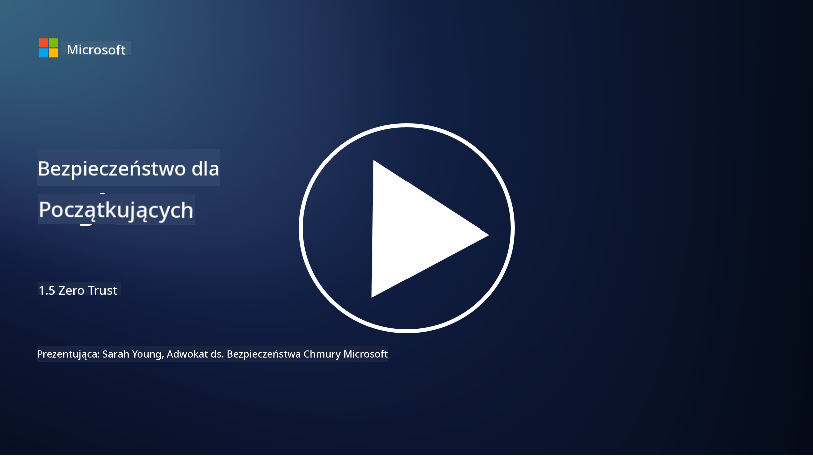
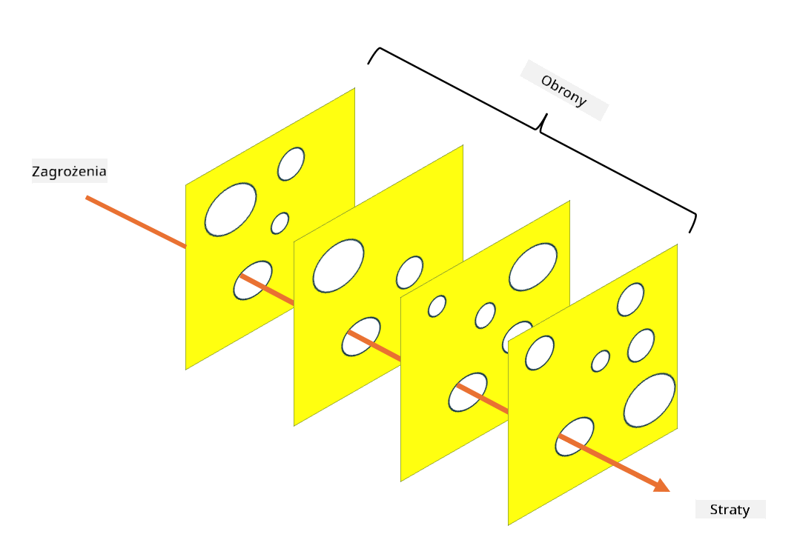

<!--
CO_OP_TRANSLATOR_METADATA:
{
  "original_hash": "75f77f972d2233c584f87c1eb96c983b",
  "translation_date": "2025-09-03T17:16:46+00:00",
  "source_file": "1.5 Zero trust.md",
  "language_code": "pl"
}
-->
# Zero Trust

„Zero trust” to termin, który obecnie często pojawia się w kręgach związanych z bezpieczeństwem. Ale co właściwie oznacza? Czy to tylko modne hasło? W tej lekcji zagłębimy się w to, czym jest zero trust.

## Wprowadzenie

 - W tej lekcji omówimy:
   
   
 - Czym jest zero trust?

   
  

 - Jak zero trust różni się od tradycyjnych architektur bezpieczeństwa?

   
   

 - Czym jest obrona warstwowa?

## Zero Trust

Zero Trust to podejście do cyberbezpieczeństwa, które kwestionuje tradycyjne podejście „ufaj, ale weryfikuj”, zakładając, że żadna jednostka, zarówno wewnątrz, jak i na zewnątrz sieci organizacji, nie powinna być automatycznie uznawana za godną zaufania. Zamiast tego, Zero Trust wymaga weryfikacji każdego użytkownika, urządzenia i aplikacji próbującej uzyskać dostęp do zasobów, niezależnie od ich lokalizacji. Główną zasadą Zero Trust jest minimalizacja „powierzchni ataku” i ograniczenie potencjalnych skutków naruszeń bezpieczeństwa.

W modelu Zero Trust podkreśla się następujące zasady:

1. **Weryfikacja tożsamości**: Autoryzacja i uwierzytelnianie są rygorystycznie stosowane wobec wszystkich użytkowników i urządzeń, niezależnie od ich lokalizacji. Pamiętaj, że tożsamość nie musi być związana z człowiekiem – może to być urządzenie, aplikacja itd.

2. **Minimalne uprawnienia**: Użytkownicy i urządzenia otrzymują minimalny poziom dostępu potrzebny do wykonania swoich zadań, co ogranicza potencjalne szkody w przypadku naruszenia.

3. **Mikrosegmentacja**: Zasoby sieciowe są dzielone na mniejsze segmenty, aby ograniczyć ruch lateralny w sieci w przypadku naruszenia.

4. **Ciągłe monitorowanie**: Prowadzone jest stałe monitorowanie i analiza zachowań użytkowników oraz urządzeń w celu wykrywania anomalii i potencjalnych zagrożeń. Nowoczesne techniki monitorowania wykorzystują również uczenie maszynowe, AI oraz inteligencję zagrożeń, aby dostarczyć dodatkowe szczegóły i kontekst.

5. **Szyfrowanie danych**: Dane są szyfrowane zarówno w trakcie przesyłania, jak i w stanie spoczynku, aby zapobiec nieautoryzowanemu dostępowi.

6. **Ścisła kontrola dostępu**: Kontrole dostępu są egzekwowane na podstawie kontekstu, takiego jak role użytkowników, stan urządzeń i lokalizacja sieciowa.

Microsoft dzieli zero trust na pięć filarów, które omówimy w kolejnej lekcji.

## Różnice w stosunku do tradycyjnych architektur bezpieczeństwa

Zero Trust różni się od tradycyjnych architektur bezpieczeństwa, takich jak modele oparte na perymetrze, w kilku aspektach:

1. **Perymetr vs. podejście oparte na tożsamości**: Tradycyjne modele koncentrują się na zabezpieczeniu perymetru sieci, zakładając, że wewnętrzni użytkownicy i urządzenia mogą być zaufani po uzyskaniu dostępu. Zero Trust zakłada, że zagrożenia mogą pochodzić zarówno z wnętrza, jak i z zewnątrz sieci, i wymusza ścisłe kontrole oparte na tożsamości.

2. **Domyślne zaufanie vs. jawna weryfikacja**: Tradycyjne modele domyślnie ufają urządzeniom i użytkownikom w sieci, dopóki nie zostanie udowodnione inaczej. Zero Trust jawnie weryfikuje tożsamości i stale monitoruje anomalie.

3. **Płaska vs. segmentowana sieć**: Tradycyjne architektury często obejmują płaskie sieci, w których wewnętrzni użytkownicy mają szeroki dostęp. Zero Trust promuje segmentację sieci na mniejsze, izolowane strefy, aby ograniczyć potencjalne naruszenia.

4. **Reaktywne vs. proaktywne podejście**: Tradycyjne bezpieczeństwo często opiera się na reaktywnych środkach, takich jak zapory sieciowe i systemy wykrywania włamań. Zero Trust przyjmuje proaktywne podejście, zakładając, że naruszenia są prawdopodobne i minimalizując ich skutki.

## Obrona warstwowa

Obrona warstwowa, znana również jako bezpieczeństwo warstwowe, to strategia cyberbezpieczeństwa polegająca na wdrażaniu wielu warstw kontroli i środków bezpieczeństwa w celu ochrony zasobów organizacji. Celem jest stworzenie nakładających się warstw obrony, tak aby w przypadku naruszenia jednej warstwy inne nadal zapewniały ochronę. Każda warstwa koncentruje się na innym aspekcie bezpieczeństwa, zwiększając ogólną odporność organizacji na zagrożenia.

Obrona warstwowa obejmuje kombinację technicznych, proceduralnych i fizycznych środków bezpieczeństwa. Mogą to być zapory sieciowe, systemy wykrywania włamań, kontrole dostępu, szyfrowanie, szkolenia użytkowników, polityki bezpieczeństwa i inne. Idea polega na stworzeniu wielu barier, które wspólnie utrudniają atakującym penetrację systemów i sieci organizacji. Model ten jest czasami nazywany „modelem szwajcarskiego sera”, który jest również stosowany w zapobieganiu wypadkom w innych branżach (np. transport).

## Dalsza lektura

[Co to jest Zero Trust?](https://learn.microsoft.com/security/zero-trust/zero-trust-overview?WT.mc_id=academic-96948-sayoung)

[Ewolucja Zero Trust – dokument Microsoft](https://query.prod.cms.rt.microsoft.com/cms/api/am/binary/RWJJdT?WT.mc_id=academic-96948-sayoung)

[Zero Trust i BeyondCorp Google Cloud | Blog Google Cloud](https://cloud.google.com/blog/topics/developers-practitioners/zero-trust-and-beyondcorp-google-cloud)

---

**Zastrzeżenie**:  
Ten dokument został przetłumaczony za pomocą usługi tłumaczeniowej AI [Co-op Translator](https://github.com/Azure/co-op-translator). Chociaż dokładamy wszelkich starań, aby tłumaczenie było precyzyjne, prosimy pamiętać, że automatyczne tłumaczenia mogą zawierać błędy lub nieścisłości. Oryginalny dokument w jego rodzimym języku powinien być uznawany za wiarygodne źródło. W przypadku informacji krytycznych zaleca się skorzystanie z profesjonalnego tłumaczenia wykonanego przez człowieka. Nie ponosimy odpowiedzialności za jakiekolwiek nieporozumienia lub błędne interpretacje wynikające z korzystania z tego tłumaczenia.