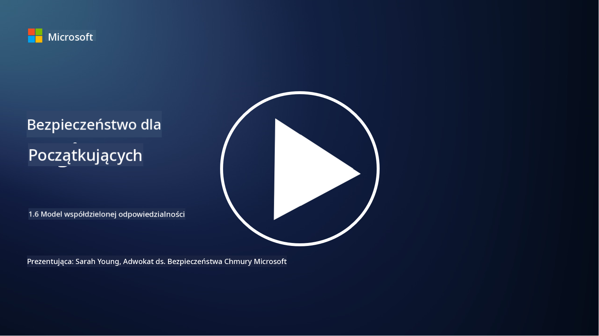

<!--
CO_OP_TRANSLATOR_METADATA:
{
  "original_hash": "a48db640d80c786b928ca178c414f084",
  "translation_date": "2025-09-03T17:27:13+00:00",
  "source_file": "1.6 Shared responsibility model.md",
  "language_code": "pl"
}
-->
# Model współdzielonej odpowiedzialności

Współdzielona odpowiedzialność to stosunkowo nowa koncepcja w IT, która pojawiła się wraz z rozwojem chmury obliczeniowej. Z perspektywy cyberbezpieczeństwa kluczowe jest zrozumienie, kto dostarcza jakie mechanizmy ochrony, aby uniknąć luk w zabezpieczeniach.

## Wprowadzenie

W tej lekcji omówimy:

 - Czym jest współdzielona odpowiedzialność w kontekście cyberbezpieczeństwa?
   
 - Jak różni się współdzielona odpowiedzialność za mechanizmy ochrony
   w modelach IaaS, PaaS i SaaS?

   

 - Gdzie można znaleźć informacje o mechanizmach ochrony oferowanych przez 
   platformę chmurową?

   
 

 - Co oznacza zasada „ufaj, ale sprawdzaj”?

## Czym jest współdzielona odpowiedzialność w kontekście cyberbezpieczeństwa?

Współdzielona odpowiedzialność w cyberbezpieczeństwie odnosi się do podziału obowiązków związanych z ochroną pomiędzy dostawcę usług chmurowych (CSP) a jego klientów. W środowiskach chmurowych, takich jak Infrastructure as a Service (IaaS), Platform as a Service (PaaS) i Software as a Service (SaaS), zarówno CSP, jak i klient mają określone role w zapewnianiu bezpieczeństwa danych, aplikacji i systemów.

## Jak różni się współdzielona odpowiedzialność za mechanizmy ochrony w modelach IaaS, PaaS i SaaS?

Podział obowiązków zazwyczaj zależy od rodzaju używanej usługi chmurowej:

 - **IaaS (Infrastructure as a Service)**: CSP dostarcza podstawową infrastrukturę (serwery, sieci, przechowywanie danych), podczas gdy klient odpowiada za zarządzanie systemami operacyjnymi, aplikacjami i konfiguracjami bezpieczeństwa na tej infrastrukturze.
   
   
 - **PaaS (Platform as a Service):** CSP oferuje platformę, na której klienci mogą budować i wdrażać aplikacje. CSP zarządza infrastrukturą, a klient koncentruje się na rozwoju aplikacji i bezpieczeństwie danych.

   

 - **SaaS (Software as a Service)**: CSP dostarcza w pełni funkcjonalne aplikacje dostępne przez internet. W tym przypadku CSP odpowiada za bezpieczeństwo aplikacji i infrastruktury, a klient zarządza dostępem użytkowników i wykorzystaniem danych.

Zrozumienie współdzielonej odpowiedzialności jest kluczowe, ponieważ wyjaśnia, które aspekty bezpieczeństwa są pokrywane przez CSP, a które musi zaadresować klient. Pomaga to uniknąć nieporozumień i zapewnia kompleksowe wdrożenie środków bezpieczeństwa.

## Gdzie można znaleźć informacje o mechanizmach ochrony oferowanych przez platformę chmurową?

Aby dowiedzieć się, jakie mechanizmy ochrony oferuje platforma chmurowa, należy zapoznać się z dokumentacją i zasobami dostarczonymi przez dostawcę usług chmurowych. Obejmują one:

 - **Strona internetowa i dokumentacja CSP**: Strona internetowa CSP zawiera informacje o funkcjach bezpieczeństwa i mechanizmach ochrony oferowanych w ramach ich usług. CSP zazwyczaj udostępniają szczegółową dokumentację wyjaśniającą ich praktyki, mechanizmy ochrony i zalecenia. Może to obejmować białe księgi, przewodniki bezpieczeństwa i dokumentację techniczną.
   
 - **Oceny i audyty bezpieczeństwa**: Większość CSP poddaje swoje mechanizmy ochrony ocenie przez niezależnych ekspertów i organizacje zajmujące się bezpieczeństwem. Te przeglądy mogą dostarczyć informacji o jakości środków bezpieczeństwa CSP. Czasami prowadzi to do uzyskania certyfikatu zgodności bezpieczeństwa przez CSP (patrz następny punkt).
 - **Certyfikaty zgodności bezpieczeństwa**: Większość CSP uzyskuje certyfikaty, takie jak ISO:27001, SOC 2 czy FedRAMP. Certyfikaty te potwierdzają, że dostawca spełnia określone standardy bezpieczeństwa i zgodności.

Pamiętaj, że poziom szczegółowości i dostępność informacji mogą się różnić w zależności od dostawcy chmurowego. Zawsze upewnij się, że korzystasz z oficjalnych i aktualnych zasobów dostarczonych przez dostawcę usług chmurowych, aby podejmować świadome decyzje dotyczące bezpieczeństwa zasobów w chmurze.

## Co oznacza zasada „ufaj, ale sprawdzaj”?

W kontekście korzystania z CSP, oprogramowania zewnętrznego lub innych usług związanych z bezpieczeństwem IT, organizacja może początkowo zaufać zapewnieniom dostawcy dotyczącym mechanizmów ochrony. Jednak aby naprawdę upewnić się, że dane i systemy są bezpieczne, powinna zweryfikować te zapewnienia poprzez oceny bezpieczeństwa, testy penetracyjne oraz przegląd mechanizmów ochrony zewnętrznej strony przed pełną integracją oprogramowania lub usługi z operacjami organizacji. Wszystkie osoby i organizacje powinny stosować zasadę „ufaj, ale sprawdzaj” wobec mechanizmów ochrony, za które nie są odpowiedzialne.

## Współdzielona odpowiedzialność w organizacji
Pamiętaj, że współdzielona odpowiedzialność za bezpieczeństwo w organizacji między różnymi zespołami również musi być brana pod uwagę. Zespół ds. bezpieczeństwa rzadko wdraża wszystkie mechanizmy ochrony samodzielnie i musi współpracować z zespołami operacyjnymi, programistami oraz innymi działami firmy, aby wdrożyć wszystkie niezbędne środki bezpieczeństwa, które zapewnią ochronę organizacji.

## Dalsza lektura
- [Shared responsibility in the cloud - Microsoft Azure | Microsoft Learn](https://learn.microsoft.com/azure/security/fundamentals/shared-responsibility?WT.mc_id=academic-96948-sayoung)
- [What is shared responsibility model? – Definition from TechTarget.com](https://www.techtarget.com/searchcloudcomputing/definition/shared-responsibility-model)
- [The shared responsibility model explained and what it means for cloud security | CSO Online](https://www.csoonline.com/article/570779/the-shared-responsibility-model-explained-and-what-it-means-for-cloud-security.html)
- [Shared Responsibility for Cloud Security: What You Need to Know (cisecurity.org)](https://www.cisecurity.org/insights/blog/shared-responsibility-cloud-security-what-you-need-to-know)

---

**Zastrzeżenie**:  
Ten dokument został przetłumaczony za pomocą usługi tłumaczeniowej AI [Co-op Translator](https://github.com/Azure/co-op-translator). Chociaż dokładamy wszelkich starań, aby zapewnić dokładność, prosimy pamiętać, że automatyczne tłumaczenia mogą zawierać błędy lub nieścisłości. Oryginalny dokument w jego rodzimym języku powinien być uznawany za wiarygodne źródło. W przypadku informacji krytycznych zaleca się skorzystanie z profesjonalnego tłumaczenia wykonanego przez człowieka. Nie ponosimy odpowiedzialności za jakiekolwiek nieporozumienia lub błędne interpretacje wynikające z korzystania z tego tłumaczenia.