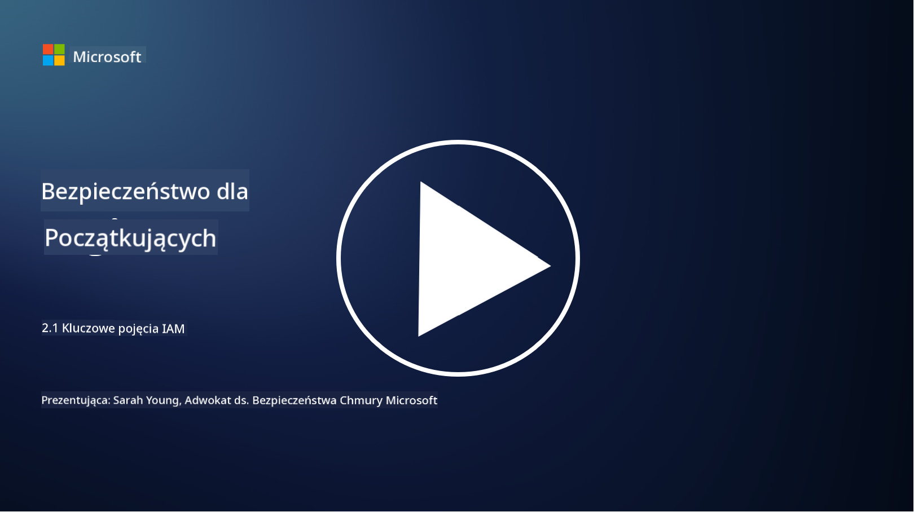

<!--
CO_OP_TRANSLATOR_METADATA:
{
  "original_hash": "2e3864e3d579f0dbb4ac2ec8c5f82acf",
  "translation_date": "2025-09-03T16:55:54+00:00",
  "source_file": "2.1 IAM key concepts.md",
  "language_code": "pl"
}
-->
# Kluczowe pojęcia IAM

Czy kiedykolwiek logowałeś się na komputer lub stronę internetową? Oczywiście, że tak! To oznacza, że już korzystałeś z mechanizmów kontroli tożsamości w codziennym życiu. Zarządzanie tożsamością i dostępem (IAM) to kluczowy filar bezpieczeństwa, o którym dowiemy się więcej w kolejnych lekcjach.

**Wprowadzenie**

W tej lekcji omówimy:

- Co rozumiemy przez zarządzanie tożsamością i dostępem (IAM) w kontekście cyberbezpieczeństwa?  
- Na czym polega zasada najmniejszych uprawnień?  
- Co to jest rozdział obowiązków?  
- Czym są uwierzytelnianie i autoryzacja?  

## Co rozumiemy przez zarządzanie tożsamością i dostępem (IAM) w kontekście cyberbezpieczeństwa?

Zarządzanie tożsamością i dostępem (IAM) odnosi się do zestawu procesów, technologii i polityk wdrażanych w celu zapewnienia, że odpowiednie osoby mają właściwy dostęp do zasobów w cyfrowym środowisku organizacji. IAM obejmuje zarządzanie cyfrowymi tożsamościami (użytkownikami, pracownikami, partnerami) oraz ich dostępem do systemów, aplikacji, danych i sieci. Głównym celem IAM jest zwiększenie bezpieczeństwa, uproszczenie dostępu użytkowników oraz zapewnienie zgodności z politykami i regulacjami organizacyjnymi. Rozwiązania IAM zazwyczaj obejmują uwierzytelnianie użytkowników, autoryzację, zarządzanie tożsamościami, kontrolę dostępu oraz zarządzanie cyklem życia użytkownika (np. upewnienie się, że konta są usuwane, gdy nie są już używane).

## Na czym polega zasada najmniejszych uprawnień?

Zasada najmniejszych uprawnień to podstawowa koncepcja, która zakłada przyznawanie użytkownikom i systemom jedynie minimalnych uprawnień niezbędnych do wykonywania ich zadań lub ról. Ta zasada pomaga ograniczyć potencjalne szkody w przypadku naruszenia bezpieczeństwa lub zagrożenia wewnętrznego. Przestrzeganie zasady najmniejszych uprawnień pozwala organizacjom zmniejszyć powierzchnię ataku i zminimalizować ryzyko nieautoryzowanego dostępu, wycieków danych oraz przypadkowego nadużycia uprawnień. W praktyce oznacza to, że użytkownicy mają dostęp tylko do tych zasobów i funkcji, które są niezbędne do wykonywania ich obowiązków, i nic więcej. Na przykład, jeśli potrzebujesz jedynie przeczytać dokument, przyznanie pełnych uprawnień administracyjnych do tego dokumentu byłoby nadmierne.

## Co to jest rozdział obowiązków?

Rozdział obowiązków to zasada mająca na celu zapobieganie konfliktom interesów oraz zmniejszenie ryzyka oszustw i błędów poprzez rozdzielenie kluczowych zadań i odpowiedzialności między różne osoby w organizacji. W kontekście cyberbezpieczeństwa rozdział obowiązków polega na zapewnieniu, że żadna pojedyncza osoba nie ma kontroli nad wszystkimi aspektami kluczowego procesu lub systemu. Celem jest stworzenie systemu kontroli i równowagi, który uniemożliwia jednej osobie przeprowadzenie zarówno etapu konfiguracji, jak i zatwierdzenia procesu. Na przykład w systemach finansowych może to oznaczać, że osoba wprowadzająca transakcje do systemu nie powinna być tą samą osobą, która je zatwierdza. Dzięki temu zmniejsza się ryzyko nieautoryzowanych lub oszukańczych działań pozostających niezauważonymi.

## Czym są uwierzytelnianie i autoryzacja?

Uwierzytelnianie i autoryzacja to dwa podstawowe pojęcia w cyberbezpieczeństwie, które odgrywają kluczową rolę w zapewnianiu bezpieczeństwa i integralności systemów komputerowych oraz danych. Są one często używane razem w celu kontrolowania dostępu do zasobów i ochrony wrażliwych informacji.

**1. Uwierzytelnianie**:  
Uwierzytelnianie to proces weryfikacji tożsamości użytkownika, systemu lub podmiotu próbującego uzyskać dostęp do systemu komputerowego lub określonego zasobu. Zapewnia, że deklarowana tożsamość jest prawdziwa i dokładna. Metody uwierzytelniania zazwyczaj obejmują wykorzystanie jednego lub więcej z następujących czynników:  

a. Coś, co wiesz: Obejmuje hasła, kody PIN lub inne tajne informacje, które powinien znać tylko uprawniony użytkownik.  

b. Coś, co masz: Dotyczy fizycznych tokenów lub urządzeń, takich jak karty inteligentne, tokeny bezpieczeństwa czy telefony komórkowe, używane do potwierdzenia tożsamości użytkownika.  

c. Coś, czym jesteś: Odnosi się do czynników biometrycznych, takich jak odciski palców, rozpoznawanie twarzy czy skany siatkówki, które są unikalne dla danej osoby.  

Mechanizmy uwierzytelniania są używane do potwierdzenia, że użytkownik jest tym, za kogo się podaje, zanim uzyska dostęp do systemu lub zasobu. Pomaga to zapobiegać nieautoryzowanemu dostępowi i zapewnia, że tylko uprawnieni użytkownicy mogą wykonywać działania w systemie.

**2. Autoryzacja**:  
Autoryzacja to proces przyznawania lub odmawiania określonych uprawnień i przywilejów uwierzytelnionym użytkownikom lub podmiotom po zweryfikowaniu ich tożsamości. Określa, jakie działania lub operacje użytkownik może wykonywać w systemie lub na określonych zasobach. Autoryzacja opiera się często na wcześniej zdefiniowanych politykach, regułach kontroli dostępu i rolach przypisanych użytkownikom.

Autoryzację można postrzegać jako odpowiedź na pytanie: "Co może zrobić uwierzytelniony użytkownik?" Obejmuje definiowanie i egzekwowanie polityk kontroli dostępu w celu ochrony wrażliwych danych i zasobów przed nieautoryzowanym dostępem lub modyfikacją.

**Podsumowując:**

- Uwierzytelnianie ustala tożsamość użytkowników lub podmiotów.  
- Autoryzacja określa, jakie działania i zasoby uwierzytelnieni użytkownicy mogą uzyskać lub zmodyfikować.  

## Dalsza lektura

- [Describe identity concepts - Training | Microsoft Learn](https://learn.microsoft.com/training/modules/describe-identity-principles-concepts/?WT.mc_id=academic-96948-sayoung)  
- [Introduction to identity - Microsoft Entra | Microsoft Learn](https://learn.microsoft.com/azure/active-directory/fundamentals/identity-fundamental-concepts?WT.mc_id=academic-96948-sayoung)  
- [What is Identity Access Management (IAM)? | Microsoft Security](https://www.microsoft.com/security/business/security-101/what-is-identity-access-management-iam?WT.mc_id=academic-96948-sayoung)  
- [What is IAM? Identity and access management explained | CSO Online](https://www.csoonline.com/article/518296/what-is-iam-identity-and-access-management-explained.html)  
- [What is IAM? (auth0.com)](https://auth0.com/blog/what-is-iam/)  
- [Security+: implementing Identity and Access Management (IAM) controls [updated 2021] | Infosec (infosecinstitute.com)](https://resources.infosecinstitute.com/certifications/securityplus/security-implementing-identity-and-access-management-iam-controls/)  
- [least privilege - Glossary | CSRC (nist.gov)](https://csrc.nist.gov/glossary/term/least_privilege)  
- [Security: The Principle of Least Privilege (POLP) - Microsoft Community Hub](https://techcommunity.microsoft.com/t5/azure-sql-blog/security-the-principle-of-least-privilege-polp/ba-p/2067390?WT.mc_id=academic-96948-sayoung)  
- [Principle of least privilege | CERT NZ](https://www.cert.govt.nz/it-specialists/critical-controls/principle-of-least-privilege/)  
- [Why is separation of duties required by NIST 800-171 and CMMC? - (totem.tech)](https://www.totem.tech/cmmc-separation-of-duties/)  

---

**Zastrzeżenie**:  
Ten dokument został przetłumaczony za pomocą usługi tłumaczeniowej AI [Co-op Translator](https://github.com/Azure/co-op-translator). Chociaż dokładamy wszelkich starań, aby tłumaczenie było precyzyjne, prosimy pamiętać, że automatyczne tłumaczenia mogą zawierać błędy lub nieścisłości. Oryginalny dokument w jego rodzimym języku powinien być uznawany za wiarygodne źródło. W przypadku informacji o kluczowym znaczeniu zaleca się skorzystanie z profesjonalnego tłumaczenia wykonanego przez człowieka. Nie ponosimy odpowiedzialności za jakiekolwiek nieporozumienia lub błędne interpretacje wynikające z użycia tego tłumaczenia.