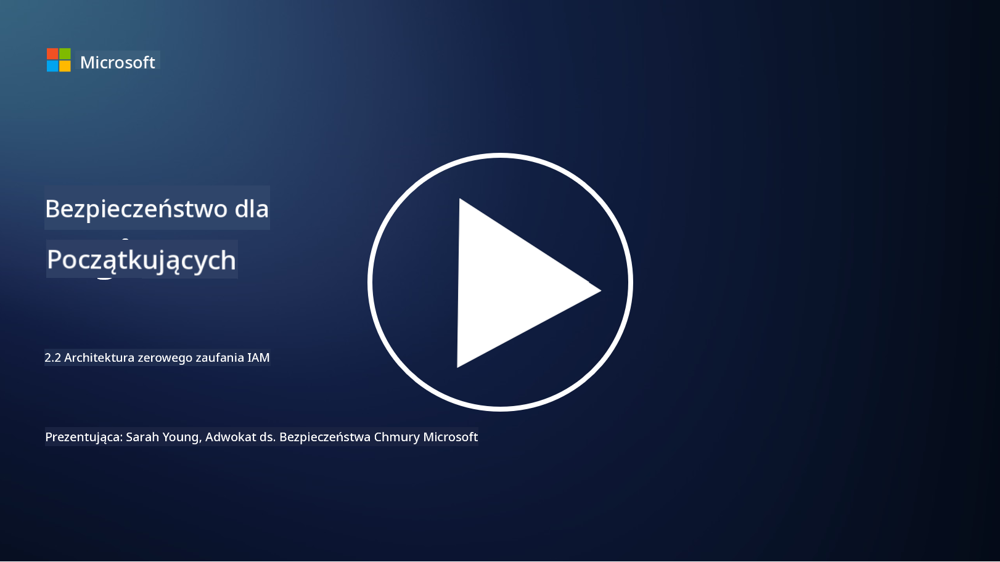

<!--
CO_OP_TRANSLATOR_METADATA:
{
  "original_hash": "4774a978af123f72ebb872199c4c4d4f",
  "translation_date": "2025-09-03T17:14:48+00:00",
  "source_file": "2.2 IAM zero trust architecture.md",
  "language_code": "pl"
}
-->
# Architektura IAM w modelu zero trust

Tożsamość odgrywa kluczową rolę w implementacji architektury zero trust i budowaniu granic dla każdego środowiska IT. W tej sekcji omówimy, dlaczego ważne jest stosowanie kontroli tożsamości w celu wdrożenia modelu zero trust.

## Wprowadzenie

W tej lekcji omówimy:

 - Dlaczego musimy używać tożsamości jako granicy w nowoczesnych środowiskach IT?
   
 - Jak różni się to od tradycyjnych architektur IT?

 - Jak tożsamość jest wykorzystywana do wdrożenia architektury zero trust?

## Dlaczego musimy używać tożsamości jako granicy w nowoczesnych środowiskach IT?

W nowoczesnych środowiskach IT tradycyjna koncepcja fizycznej granicy (z wykorzystaniem narzędzi takich jak zapory sieciowe i granice sieci) jako głównej linii obrony przed zagrożeniami cybernetycznymi staje się coraz mniej skuteczna ze względu na rosnącą złożoność technologii, wzrost pracy zdalnej oraz przyjęcie usług chmurowych. Zamiast tego organizacje przechodzą na model, w którym tożsamość staje się nową granicą. Oznacza to, że bezpieczeństwo opiera się na weryfikacji i zarządzaniu tożsamością użytkowników, urządzeń i aplikacji próbujących uzyskać dostęp do zasobów, niezależnie od ich fizycznej lokalizacji.

Oto dlaczego używanie tożsamości jako granicy jest kluczowe w nowoczesnych środowiskach IT:

**Praca zdalna**: Wraz z rozpowszechnieniem pracy zdalnej i urządzeń mobilnych użytkownicy mogą uzyskiwać dostęp do zasobów z różnych lokalizacji i urządzeń. Tradycyjne podejście oparte na granicach fizycznych nie działa, gdy użytkownicy nie są już ograniczeni do biura.

**Środowiska chmurowe i hybrydowe**: Organizacje coraz częściej korzystają z usług chmurowych i środowisk hybrydowych. Dane i aplikacje nie są już wyłącznie zlokalizowane w siedzibie organizacji, co sprawia, że tradycyjne mechanizmy obrony granic stają się mniej istotne.

**Bezpieczeństwo w modelu zero trust**: Koncepcja bezpieczeństwa zero trust zakłada, że żadna jednostka, zarówno wewnątrz, jak i na zewnątrz sieci, nie powinna być automatycznie uznawana za godną zaufania. Tożsamość staje się podstawą weryfikacji żądań dostępu, niezależnie od ich źródła.

**Krajobraz zagrożeń**: Zagrożenia cybernetyczne ewoluują, a atakujący znajdują sposoby na obejście tradycyjnych mechanizmów obrony granic. Phishing, inżynieria społeczna i zagrożenia wewnętrzne często wykorzystują ludzkie słabości, zamiast próbować przełamać granice sieci.

**Podejście skoncentrowane na danych**: Ochrona wrażliwych danych jest priorytetem. Skupiając się na tożsamości, organizacje mogą kontrolować, kto ma dostęp do jakich danych, zmniejszając ryzyko naruszeń bezpieczeństwa.

## Jak różni się to od tradycyjnych architektur IT?

Tradycyjne architektury IT opierały się głównie na modelach bezpieczeństwa opartych na granicach, gdzie zapory sieciowe i granice sieci odgrywały znaczącą rolę w ochronie przed zagrożeniami. Główne różnice między tradycyjnym podejściem a podejściem skoncentrowanym na tożsamości to:

|      Aspekt                 |      Tradycyjne architektury IT                                                                  |      Podejście skoncentrowane na tożsamości                                                             |
|-----------------------------|--------------------------------------------------------------------------------------------------|----------------------------------------------------------------------------------------------------------|
|     Skupienie               |     Skupienie na granicach: Opierało się na mechanizmach obrony takich jak zapory sieciowe.      |     Skupienie na weryfikacji tożsamości: Przesunięcie od granic sieci do weryfikacji tożsamości użytkownika/urządzenia. |
|     Lokalizacja             |     Zależność od lokalizacji: Bezpieczeństwo powiązane z fizycznymi lokalizacjami biur i granicami sieci. |     Niezależność od lokalizacji: Bezpieczeństwo nie powiązane z konkretnymi lokalizacjami; dostęp z dowolnego miejsca. |
|     Założenie zaufania      |     Założenie zaufania: Zaufanie wewnątrz granic sieci dla użytkowników/urządzeń.                |     Podejście zero trust: Zaufanie nigdy nie jest zakładane; dostęp jest weryfikowany na podstawie tożsamości i kontekstu. |
|     Uwzględnienie urządzeń  |     Różnorodność urządzeń: Zakładano, że urządzenia wewnątrz granic sieci są bezpieczne.         |     Świadomość urządzeń: Uwzględnienie stanu zdrowia i bezpieczeństwa urządzenia, niezależnie od lokalizacji. |
|     Ochrona danych          |     Ochrona danych: Skupienie na zabezpieczaniu granic sieci w celu ochrony danych.              |     Ochrona skoncentrowana na danych: Skupienie na kontrolowaniu dostępu do danych na podstawie tożsamości i wrażliwości danych. |

## Jak tożsamość jest wykorzystywana do wdrożenia architektury zero trust?

W architekturze zero trust podstawową zasadą jest nigdy nie ufać automatycznie żadnej jednostce, niezależnie od tego, czy znajduje się wewnątrz, czy na zewnątrz granic sieci. Tożsamość odgrywa kluczową rolę w implementacji podejścia zero trust, umożliwiając ciągłą weryfikację jednostek próbujących uzyskać dostęp do zasobów. Nowoczesne mechanizmy bezpieczeństwa tożsamości pozwalają na dokładną identyfikację i uwierzytelnianie każdego użytkownika, urządzenia, aplikacji i usługi przed przyznaniem dostępu. Obejmuje to weryfikację ich cyfrowej tożsamości za pomocą metod takich jak kombinacje nazwy użytkownika i hasła, uwierzytelnianie wieloskładnikowe (MFA), biometryka i inne silne mechanizmy uwierzytelniania.

## Dalsza lektura

- [Securing identity with Zero Trust | Microsoft Learn](https://learn.microsoft.com/security/zero-trust/deploy/identity?WT.mc_id=academic-96948-sayoung)
- [Zero Trust Principles and Guidance for Identity and Access | CSA (cloudsecurityalliance.org)](https://cloudsecurityalliance.org/artifacts/zero-trust-principles-and-guidance-for-iam/)
- [Zero Trust Identity Controls - Essentials Series - Episode 2 - YouTube](https://www.youtube.com/watch?v=fQZQznIKcGM&list=PLXtHYVsvn_b_gtX1-NB62wNervQx1Fhp4&index=13)

---

**Zastrzeżenie**:  
Ten dokument został przetłumaczony za pomocą usługi tłumaczenia AI [Co-op Translator](https://github.com/Azure/co-op-translator). Chociaż dokładamy wszelkich starań, aby tłumaczenie było precyzyjne, prosimy pamiętać, że automatyczne tłumaczenia mogą zawierać błędy lub nieścisłości. Oryginalny dokument w jego rodzimym języku powinien być uznawany za wiarygodne źródło. W przypadku informacji o kluczowym znaczeniu zaleca się skorzystanie z profesjonalnego tłumaczenia przez człowieka. Nie ponosimy odpowiedzialności za jakiekolwiek nieporozumienia lub błędne interpretacje wynikające z użycia tego tłumaczenia.