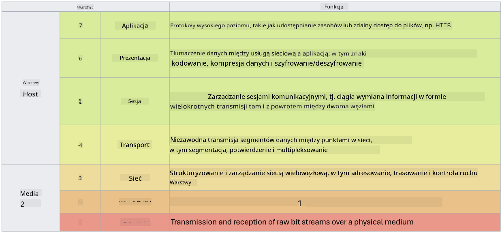

<!--
CO_OP_TRANSLATOR_METADATA:
{
  "original_hash": "252724eceeb183fb9018f88c5e1a3f0c",
  "translation_date": "2025-09-03T17:48:29+00:00",
  "source_file": "3.1 Networking key concepts.md",
  "language_code": "pl"
}
-->
# Kluczowe pojęcia sieciowe

Jeśli kiedykolwiek pracowałeś w IT, prawdopodobnie zetknąłeś się z pojęciami związanymi z sieciami. Chociaż w nowoczesnych środowiskach tożsamość jest naszym głównym mechanizmem kontroli dostępu, nie oznacza to, że kontrola sieciowa jest zbędna. Mimo że jest to obszerny temat, w tej lekcji omówimy kilka kluczowych pojęć sieciowych.

W tej lekcji omówimy:

 - Co to jest adresowanie IP?
   
 - Co to jest model OSI?

 

 - Co to jest TCP/UDP?

   
 

 - Co to są numery portów?

   
  

 - Co to jest szyfrowanie danych w spoczynku i w tranzycie?

## Co to jest adresowanie IP?

Adresowanie IP, czyli adresowanie protokołem internetowym (Internet Protocol), to numeryczna etykieta przypisana każdemu urządzeniu podłączonemu do sieci komputerowej korzystającej z protokołu internetowego do komunikacji. Służy jako unikalny identyfikator urządzeń w sieci, umożliwiając im wysyłanie i odbieranie danych przez internet lub inne połączone sieci. Istnieją dwie główne wersje adresowania IP: IPv4 (Internet Protocol version 4) i IPv6 (Internet Protocol version 6). Adres IP jest zazwyczaj przedstawiany w formacie IPv4 (np. 192.168.1.1) lub IPv6 (np. 2001:0db8:85a3:0000:0000:8a2e:0370:7334).

## Co to jest model OSI?

Model OSI (Open Systems Interconnection) to koncepcyjna struktura, która standaryzuje funkcje systemu komunikacyjnego w siedmiu odrębnych warstwach. Każda warstwa wykonuje określone zadania i komunikuje się z sąsiednimi warstwami, aby zapewnić efektywną i niezawodną komunikację danych między urządzeniami w sieci. Warstwy, od najniższej do najwyższej, to:

 1. Warstwa fizyczna
    
 
 2. Warstwa łącza danych

    
    

 1. Warstwa sieciowa

    
   

 1. Warstwa transportowa

    

 1. Warstwa sesji

    
   

 1. Warstwa prezentacji

    
    

 1. Warstwa aplikacji

Model OSI dostarcza wspólnego punktu odniesienia do zrozumienia, jak protokoły i technologie sieciowe współdziałają, niezależnie od konkretnych implementacji sprzętowych czy programowych.

_ref: https://en.wikipedia.org/wiki/OSI_model_

## Co to jest TCP/UDP?

TCP (Transmission Control Protocol) i UDP (User Datagram Protocol) to dwa podstawowe protokoły warstwy transportowej używane w sieciach komputerowych do ułatwienia komunikacji między urządzeniami przez internet lub w sieci lokalnej. Odpowiadają za dzielenie danych na pakiety do transmisji i ponowne składanie tych pakietów w oryginalne dane po stronie odbiorcy. Różnią się jednak swoimi cechami i zastosowaniami.

**TCP (Transmission Control Protocol)**:

TCP to protokół zorientowany na połączenie, który zapewnia niezawodne i uporządkowane dostarczanie danych między urządzeniami. Ustanawia połączenie między nadawcą a odbiorcą przed rozpoczęciem wymiany danych. TCP gwarantuje, że pakiety danych dotrą w odpowiedniej kolejności i może ponownie przesłać utracone pakiety, aby zapewnić integralność i kompletność danych. Dzięki temu TCP nadaje się do aplikacji wymagających niezawodnego dostarczania danych, takich jak przeglądanie stron internetowych, e-mail, transfer plików (FTP) i komunikacja z bazami danych.

**UDP (User Datagram Protocol)**:

UDP to protokół bezpołączeniowy, który oferuje szybszą transmisję danych, ale nie zapewnia tego samego poziomu niezawodności co TCP. Nie ustanawia formalnego połączenia przed wysłaniem danych i nie zawiera mechanizmów potwierdzania ani ponownego przesyłania utraconych pakietów. UDP nadaje się do aplikacji, w których szybkość i efektywność są ważniejsze niż gwarantowane dostarczenie, takich jak komunikacja w czasie rzeczywistym, transmisje strumieniowe, gry online i zapytania DNS.

Podsumowując, TCP priorytetowo traktuje niezawodność i uporządkowane dostarczanie, co czyni go odpowiednim dla aplikacji wymagających dokładności danych, podczas gdy UDP kładzie nacisk na szybkość i efektywność, co sprawia, że nadaje się do aplikacji, w których dopuszczalne są drobne straty danych lub zmiana kolejności w zamian za zmniejszenie opóźnień. Wybór między TCP a UDP zależy od specyficznych wymagań aplikacji lub usługi.

## Co to są numery portów?

W sieciach numer portu to numeryczny identyfikator używany do rozróżniania różnych usług lub aplikacji działających na jednym urządzeniu w sieci. Porty pomagają kierować przychodzące dane do odpowiedniej aplikacji. Numery portów to 16-bitowe liczby całkowite bez znaku, co oznacza, że mieszczą się w zakresie od 0 do 65535. Są podzielone na trzy zakresy:

- Porty dobrze znane (0-1023): Zarezerwowane dla standardowych usług, takich jak HTTP (port 80) i FTP (port 21).

- Porty zarejestrowane (1024-49151): Używane przez aplikacje i usługi, które nie należą do zakresu dobrze znanych, ale są oficjalnie zarejestrowane.

- Porty dynamiczne/prywatne (49152-65535): Dostępne do tymczasowego lub prywatnego użytku przez aplikacje.

## Co to jest szyfrowanie danych w spoczynku i w tranzycie?

Szyfrowanie to proces przekształcania danych w bezpieczny format, aby chronić je przed nieautoryzowanym dostępem lub manipulacją. Szyfrowanie można stosować zarówno do danych "w spoczynku" (przechowywanych na urządzeniu lub serwerze), jak i "w tranzycie" (przesyłanych między urządzeniami lub przez sieci).

Szyfrowanie danych w spoczynku: Polega na szyfrowaniu danych przechowywanych na urządzeniach, serwerach lub systemach pamięci masowej. Nawet jeśli atakujący uzyska fizyczny dostęp do nośnika danych, nie będzie mógł uzyskać dostępu do danych bez kluczy szyfrowania. Jest to kluczowe dla ochrony wrażliwych danych w przypadku kradzieży urządzenia, naruszenia danych lub nieautoryzowanego dostępu.

Szyfrowanie danych w tranzycie: Polega na szyfrowaniu danych podczas ich przesyłania między urządzeniami lub przez sieci. Zapobiega podsłuchiwaniu i nieautoryzowanemu przechwytywaniu danych podczas transmisji. Powszechne protokoły szyfrowania danych w tranzycie to HTTPS dla komunikacji internetowej oraz TLS/SSL do zabezpieczania różnych rodzajów ruchu sieciowego.

## Dalsza lektura
- [How Do IP Addresses Work? (howtogeek.com)](https://www.howtogeek.com/341307/how-do-ip-addresses-work/)
- [Understanding IP Address: An Introductory Guide (geekflare.com)](https://geekflare.com/understanding-ip-address/)
- [What is the OSI model? The 7 layers of OSI explained (techtarget.com)](https://www.techtarget.com/searchnetworking/definition/OSI)
- [The OSI Model – The 7 Layers of Networking Explained in Plain English (freecodecamp.org)](https://www.freecodecamp.org/news/osi-model-networking-layers-explained-in-plain-english/)
- [TCP/IP protocols - IBM Documentation](https://www.ibm.com/docs/en/aix/7.3?topic=protocol-tcpip-protocols)
- [Common Ports Cheat Sheet: The Ultimate Ports & Protocols List (stationx.net)](https://www.stationx.net/common-ports-cheat-sheet/)
- [Azure Data Encryption-at-Rest - Azure Security | Microsoft Learn](https://learn.microsoft.com/azure/security/fundamentals/encryption-atrest?WT.mc_id=academic-96948-sayoung)

---

**Zastrzeżenie**:  
Ten dokument został przetłumaczony za pomocą usługi tłumaczenia AI [Co-op Translator](https://github.com/Azure/co-op-translator). Chociaż dokładamy wszelkich starań, aby zapewnić poprawność tłumaczenia, prosimy pamiętać, że automatyczne tłumaczenia mogą zawierać błędy lub nieścisłości. Oryginalny dokument w jego rodzimym języku powinien być uznawany za wiarygodne źródło. W przypadku informacji o kluczowym znaczeniu zaleca się skorzystanie z profesjonalnego tłumaczenia przez człowieka. Nie ponosimy odpowiedzialności za jakiekolwiek nieporozumienia lub błędne interpretacje wynikające z użycia tego tłumaczenia.