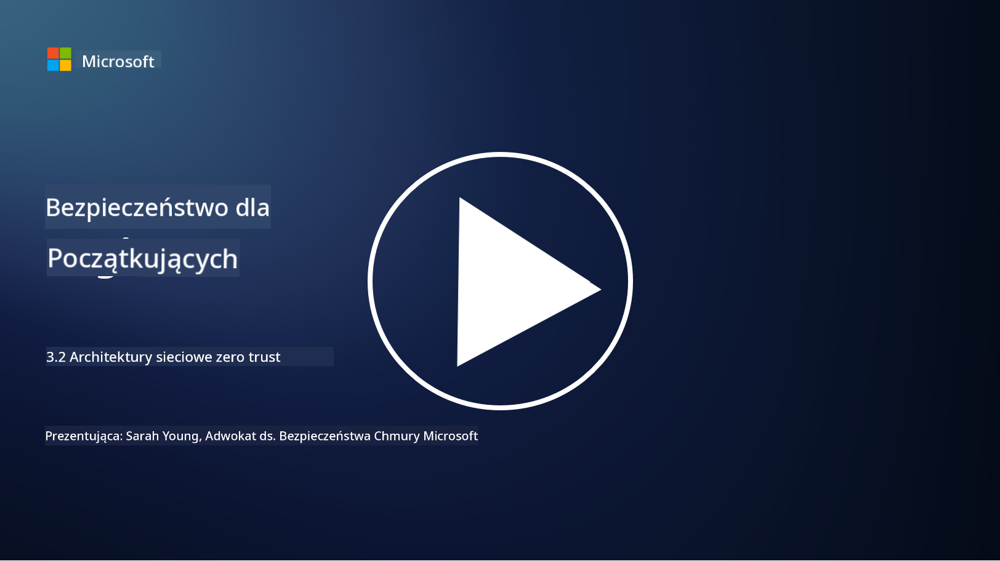

<!--
CO_OP_TRANSLATOR_METADATA:
{
  "original_hash": "680d6e14d9d33fc471c22f44679713f8",
  "translation_date": "2025-09-03T17:30:25+00:00",
  "source_file": "3.2 Networking zero trust architecture.md",
  "language_code": "pl"
}
-->
# Architektury sieciowe oparte na zasadzie zero trust

Sieć odgrywa kluczową rolę w kontrolach opartych na zasadzie zero trust. W tej lekcji dowiemy się więcej na temat:

- Czym jest segmentacja sieci?  
- Jak segmentacja sieci pomaga wdrożyć zasadę zero trust?  
- Czym jest szyfrowanie end-to-end?

## Czym jest segmentacja sieci?

Segmentacja sieci to praktyka dzielenia sieci na mniejsze, izolowane segmenty lub podsieci. Każdy segment jest odseparowany od innych, a dostęp między segmentami jest kontrolowany i ograniczany na podstawie określonych polityk bezpieczeństwa. Segmentacja sieci służy poprawie bezpieczeństwa poprzez ograniczenie skutków potencjalnych naruszeń i minimalizowanie możliwości lateralnego przemieszczania się atakujących w obrębie sieci.

Dzięki wdrożeniu segmentacji sieci organizacja może tworzyć "strefy", które oddzielają różne typy użytkowników, aplikacji i danych. Zmniejsza to powierzchnię ataku i minimalizuje potencjalne szkody spowodowane incydentem bezpieczeństwa. Segmentację sieci można osiągnąć za pomocą technologii takich jak wirtualne sieci LAN (VLAN), zapory sieciowe i mechanizmy kontroli dostępu.

## Jak segmentacja sieci pomaga wdrożyć zasadę zero trust?

Segmentacja sieci jest ściśle powiązana z zasadami modelu Zero Trust. W architekturze Zero Trust segmentacja sieci pomaga egzekwować zasadę "najmniejszych uprawnień", zapewniając, że użytkownicy i urządzenia mają dostęp wyłącznie do zasobów i usług, które są im niezbędne do wykonywania swoich zadań. Dzięki podziałowi sieci na mniejsze strefy organizacje mogą wdrażać rygorystyczne mechanizmy kontroli dostępu, izolować kluczowe zasoby i zapobiegać lateralnemu przemieszczaniu się atakujących.

Segmentacja sieci wspiera również egzekwowanie kontroli dostępu opartych na tożsamości, gdzie użytkownicy i urządzenia są dokładnie uwierzytelniane i autoryzowane przed uzyskaniem dostępu do określonych segmentów. Zapobiega to nieautoryzowanemu dostępowi do wrażliwych zasobów i ogranicza potencjalne skutki przejęcia poświadczeń.

## Czym jest szyfrowanie end-to-end?

Szyfrowanie end-to-end (E2E) to środek bezpieczeństwa, który zapewnia, że dane pozostają zaszyfrowane przez całą swoją podróż od nadawcy do odbiorcy. W tym procesie dane są szyfrowane po stronie nadawcy, a jedynie odbiorca posiada klucz deszyfrujący, który pozwala na ich odczytanie. Procesy szyfrowania i deszyfrowania odbywają się na urządzeniach końcowych, co sprawia, że dostęp do danych w postaci jawnej jest niezwykle trudny dla nieautoryzowanych stron, w tym dostawców usług i pośredników.

Szyfrowanie E2E zapewnia wysoki poziom poufności i bezpieczeństwa transmisji danych, nawet jeśli dane przechodzą przez różne systemy pośredniczące lub sieci. Jest powszechnie stosowane w aplikacjach do bezpiecznego przesyłania wiadomości, usługach e-mail i innych platformach komunikacyjnych, aby chronić wrażliwe informacje przed przechwyceniem i nieautoryzowanym dostępem.

Ta metoda szyfrowania gwarantuje, że nawet jeśli atakujący uzyskają dostęp do danych w trakcie ich przesyłania, zobaczą jedynie zaszyfrowaną zawartość, która jest bezużyteczna bez klucza deszyfrującego. Szyfrowanie end-to-end odgrywa kluczową rolę w ochronie prywatności użytkowników i zabezpieczaniu wrażliwych informacji przed ujawnieniem nieautoryzowanym stronom.

## Czym jest SASE?

SASE to skrót od "Secure Access Service Edge" i oznacza ramy i architekturę cyberbezpieczeństwa, które łączą funkcje bezpieczeństwa sieciowego i szerokopasmowego dostępu do sieci (WAN) w jedną usługę opartą na chmurze. SASE zostało zaprojektowane, aby zapewnić bezpieczny i skalowalny dostęp do zasobów sieciowych, aplikacji i danych dla użytkowników zdalnych i mobilnych, jednocześnie upraszczając zarządzanie siecią i redukując złożoność tradycyjnych architektur sieciowych i bezpieczeństwa.

Kluczowe cechy i komponenty SASE obejmują:

1. **Oparte na chmurze:** SASE jest dostarczane jako usługa w chmurze, co oznacza, że funkcje bezpieczeństwa i sieciowe są zapewniane z chmury, a nie za pomocą tradycyjnego sprzętu i urządzeń lokalnych.  

2. **Integracja bezpieczeństwa i sieci:** SASE integruje różne usługi bezpieczeństwa, takie jak bezpieczne bramy internetowe (SWG), zapory sieciowe jako usługa (FWaaS), zapobieganie utracie danych (DLP), dostęp do sieci oparty na zasadzie zero trust (ZTNA) oraz optymalizacja WAN z funkcjami sieci szerokopasmowej. Ta integracja pomaga usprawnić operacje związane z bezpieczeństwem i siecią.  

3. **Zero Trust:** SASE działa zgodnie z zasadą zero trust, co oznacza, że egzekwuje rygorystyczne mechanizmy kontroli dostępu i polityki najmniejszych uprawnień. Użytkownicy i urządzenia nie są domyślnie zaufani i muszą zostać uwierzytelnieni oraz autoryzowani przed uzyskaniem dostępu do zasobów.  

4. **Skoncentrowane na tożsamości:** SASE opiera się na tożsamości użytkowników i urządzeń jako podstawie kontroli dostępu. Polityki oparte na tożsamości i kontekście są wykorzystywane do określania uprawnień dostępu, a te polityki dynamicznie dostosowują się do zachowań użytkowników i kontekstu.  

5. **Skalowalność i elastyczność:** SASE może łatwo skalować się, aby obsłużyć dużą liczbę użytkowników i urządzeń, co czyni go odpowiednim dla organizacji o zróżnicowanych i zmieniających się potrzebach w zakresie sieci i bezpieczeństwa.  

SASE jest szczególnie istotne w nowoczesnej erze pracy zdalnej i adopcji chmury, ponieważ zapewnia kompleksowe i elastyczne podejście do zabezpieczania i zarządzania dostępem do sieci. Pomaga organizacjom dostosować się do zmieniających się wymagań w zakresie bezpieczeństwa i sieci, jednocześnie utrzymując silne skupienie na modelach bezpieczeństwa skoncentrowanych na użytkownikach i zasadzie zero trust.

## Dalsza lektura

- [What Is Network Segmentation? - Cisco](https://www.cisco.com/c/en/us/products/security/what-is-network-segmentation.html#~benefits)  
- [What Is Micro-Segmentation? - Cisco](https://www.cisco.com/c/en/us/products/security/what-is-microsegmentation.html)  
- [Implementing Network Segmentation and Segregation | Cyber.gov.au](https://www.cyber.gov.au/resources-business-and-government/maintaining-devices-and-systems/system-hardening-and-administration/network-hardening/implementing-network-segmentation-and-segregation)  
- [What Is Network Segmentation and Why It Matters | CompTIA](https://www.comptia.org/blog/security-awareness-training-network-segmentation)  
- [Network Segmentation: Concepts and Practices (cmu.edu)](https://insights.sei.cmu.edu/blog/network-segmentation-concepts-and-practices/)  
- [Secure networks with Zero Trust | Microsoft Learn](https://learn.microsoft.com/security/zero-trust/deploy/networks?WT.mc_id=academic-96948-sayoung)  
- [What is end-to-end encryption? | IBM](https://www.ibm.com/topics/end-to-end-encryption)  
- [What Is End-to-End Encryption, and Why Does It Matter? (howtogeek.com)](https://www.howtogeek.com/711656/what-is-end-to-end-encryption-and-why-does-it-matter/)  
- [Definition of Secure Access Service Edge (SASE) - Gartner Information Technology Glossary](https://www.gartner.com/en/information-technology/glossary/secure-access-service-edge-sase)  
- [What Is Secure Access Service Edge (SASE)? | Microsoft Security](https://www.microsoft.com/security/business/security-101/what-is-sase?WT.mc_id=academic-96948-sayoung)  

---

**Zastrzeżenie**:  
Ten dokument został przetłumaczony za pomocą usługi tłumaczenia AI [Co-op Translator](https://github.com/Azure/co-op-translator). Chociaż dokładamy wszelkich starań, aby zapewnić poprawność tłumaczenia, prosimy pamiętać, że automatyczne tłumaczenia mogą zawierać błędy lub nieścisłości. Oryginalny dokument w jego rodzimym języku powinien być uznawany za źródło autorytatywne. W przypadku informacji o kluczowym znaczeniu zaleca się skorzystanie z profesjonalnego tłumaczenia przez człowieka. Nie ponosimy odpowiedzialności za jakiekolwiek nieporozumienia lub błędne interpretacje wynikające z użycia tego tłumaczenia.