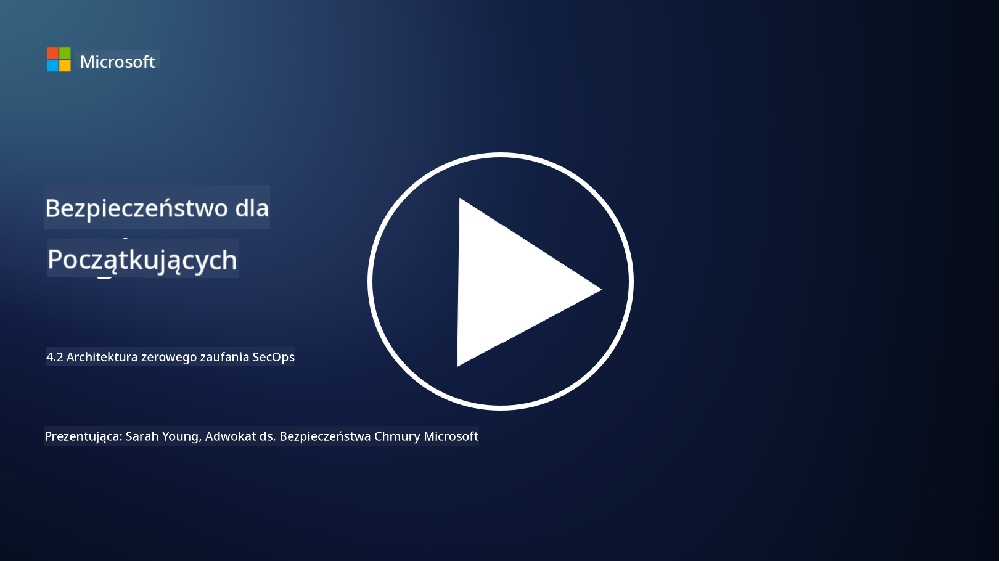

<!--
CO_OP_TRANSLATOR_METADATA:
{
  "original_hash": "45bbdc114e70936816b0b3e7c40189cf",
  "translation_date": "2025-09-03T17:32:33+00:00",
  "source_file": "4.2 SecOps zero trust architecture.md",
  "language_code": "pl"
}
-->
# Architektura zero trust w operacjach bezpieczeństwa

Operacje bezpieczeństwa stanowią dwie części architektury zero trust, a w tej lekcji dowiemy się o obu:

- Jak powinny być budowane architektury IT, aby umożliwić centralne zbieranie logów?

- Jakie są najlepsze praktyki dla operacji bezpieczeństwa w nowoczesnych środowiskach IT?

## Jak powinny być budowane architektury IT, aby umożliwić centralne zbieranie logów?

Centralne zbieranie logów jest kluczowym elementem nowoczesnych operacji bezpieczeństwa. Umożliwia organizacjom agregowanie logów i danych z różnych źródeł, takich jak serwery, aplikacje, urządzenia sieciowe i narzędzia bezpieczeństwa, w centralnym repozytorium do analizy, monitorowania i reagowania na incydenty. Oto najlepsze praktyki dotyczące budowy architektur IT wspierających centralne zbieranie logów:

1. **Integracja źródeł logów**:

- Upewnij się, że wszystkie istotne urządzenia i systemy są skonfigurowane do generowania logów. Obejmuje to serwery, zapory sieciowe, routery, przełączniki, aplikacje i urządzenia bezpieczeństwa.

- Skonfiguruj źródła logów tak, aby przesyłały logi do centralnego kolektora lub systemu zarządzania logami.

2. **Wybór odpowiedniego narzędzia SIEM (Security Information and Event Management)**:

- Wybierz rozwiązanie SIEM, które odpowiada potrzebom i skali Twojej organizacji.

- Upewnij się, że wybrane rozwiązanie wspiera zbieranie, agregację, analizę i raportowanie logów.

3. **Skalowalność i redundancja**:

- Zaprojektuj architekturę tak, aby była skalowalna i mogła obsłużyć rosnącą liczbę źródeł logów oraz zwiększoną ilość danych.

- Wprowadź redundancję dla wysokiej dostępności, aby zapobiec zakłóceniom spowodowanym awariami sprzętu lub sieci.

4. **Bezpieczny transport logów**:

- Używaj bezpiecznych protokołów, takich jak TLS/SSL lub IPsec, do przesyłania logów ze źródeł do centralnego repozytorium.

- Wprowadź uwierzytelnianie i kontrolę dostępu, aby upewnić się, że tylko autoryzowane urządzenia mogą przesyłać logi.

5. **Normalizacja**:

- Standaryzuj formaty logów i normalizuj dane, aby zapewnić spójność i ułatwić analizę.

6. **Przechowywanie i retencja**:

- Określ odpowiedni okres przechowywania logów na podstawie wymagań zgodności i bezpieczeństwa.

- Przechowuj logi w sposób bezpieczny, chroniąc je przed nieautoryzowanym dostępem i manipulacją.

## Jakie są najlepsze praktyki dla operacji bezpieczeństwa w nowoczesnych środowiskach IT?

Oprócz centralnego zbierania logów, oto najlepsze praktyki dla operacji bezpieczeństwa w nowoczesnych środowiskach IT:

1. **Ciągłe monitorowanie**: Wprowadź ciągłe monitorowanie aktywności sieci i systemów, aby wykrywać i reagować na zagrożenia w czasie rzeczywistym.

2. **Inteligencja zagrożeń**: Bądź na bieżąco z nowymi zagrożeniami i podatnościami, korzystając z kanałów i usług inteligencji zagrożeń.

3. **Szkolenie użytkowników**: Regularnie przeprowadzaj szkolenia z zakresu świadomości bezpieczeństwa dla pracowników, aby zmniejszyć ryzyko związane z inżynierią społeczną i atakami phishingowymi.

4. **Plan reagowania na incydenty**: Opracuj i przetestuj plan reagowania na incydenty, aby zapewnić szybkie i skuteczne działania w przypadku incydentów bezpieczeństwa.

5. **Automatyzacja bezpieczeństwa**: Wykorzystaj narzędzia automatyzacji i orkiestracji bezpieczeństwa, aby usprawnić reakcję na incydenty i powtarzalne zadania.

6. **Kopia zapasowa i odzyskiwanie**: Wprowadź solidne rozwiązania do tworzenia kopii zapasowych i odzyskiwania danych, aby zapewnić dostępność danych w przypadku ich utraty lub ataków ransomware.

## Dalsza lektura

- [Microsoft Security Best Practices module: Security operations | Microsoft Learn](https://learn.microsoft.com/security/operations/security-operations-videos-and-decks?WT.mc_id=academic-96948-sayoung)
- [Security operations - Cloud Adoption Framework | Microsoft Learn](https://learn.microsoft.com/azure/cloud-adoption-framework/secure/security-operations?WT.mc_id=academic-96948-sayoung)
- [What is Security Operations and Analytics Platform Architecture? A Definition of SOAPA, How It Works, Benefits, and More (digitalguardian.com)](https://www.digitalguardian.com/blog/what-security-operations-and-analytics-platform-architecture-definition-soapa-how-it-works#:~:text=All%20in%20all%2C%20security%20operations%20and%20analytics%20platform,become%20more%20efficient%20and%20operative%20with%20your%20security.)

---

**Zastrzeżenie**:  
Ten dokument został przetłumaczony za pomocą usługi tłumaczenia AI [Co-op Translator](https://github.com/Azure/co-op-translator). Chociaż dokładamy wszelkich starań, aby tłumaczenie było precyzyjne, prosimy pamiętać, że automatyczne tłumaczenia mogą zawierać błędy lub nieścisłości. Oryginalny dokument w jego rodzimym języku powinien być uznawany za wiarygodne źródło. W przypadku informacji o kluczowym znaczeniu zaleca się skorzystanie z profesjonalnego tłumaczenia przez człowieka. Nie ponosimy odpowiedzialności za jakiekolwiek nieporozumienia lub błędne interpretacje wynikające z użycia tego tłumaczenia.