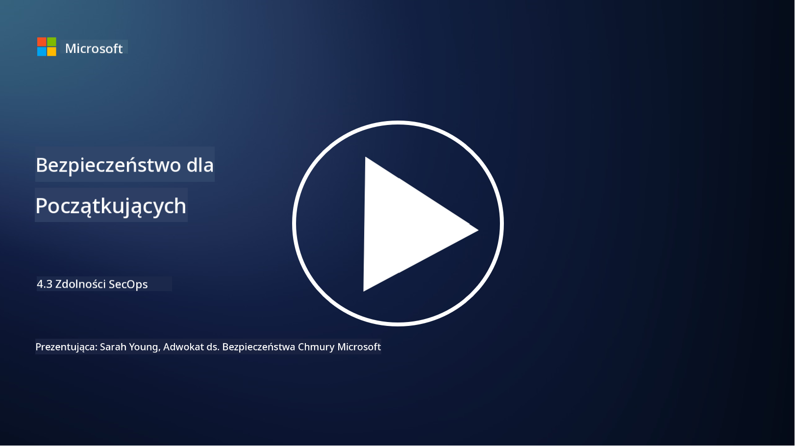

<!--
CO_OP_TRANSLATOR_METADATA:
{
  "original_hash": "553eb694c89f1caca0694e8d8ab89e0e",
  "translation_date": "2025-09-03T17:41:39+00:00",
  "source_file": "4.3 SecOps capabilities.md",
  "language_code": "pl"
}
-->
# Funkcje SecOps

W tej sekcji omówimy szczegóły dotyczące podstawowych narzędzi i funkcji, które można wykorzystać w operacjach bezpieczeństwa.

W tej lekcji omówimy:

- Czym jest narzędzie do zarządzania informacjami i zdarzeniami bezpieczeństwa (SIEM)?

- Czym jest XDR?

- Jakie funkcje można wykorzystać do poprawy operacji bezpieczeństwa?

## Czym jest narzędzie do zarządzania informacjami i zdarzeniami bezpieczeństwa (SIEM)?

Narzędzie do zarządzania informacjami i zdarzeniami bezpieczeństwa (SIEM) służy do analizy alertów bezpieczeństwa generowanych w całym środowisku IT organizacji. Zbierają, agregują, korelują i analizują dane z logów oraz zdarzenia bezpieczeństwa z różnych źródeł, takich jak urządzenia sieciowe, serwery, aplikacje i systemy bezpieczeństwa.

Kluczowe funkcje i możliwości narzędzi SIEM obejmują:

1. **Zbieranie logów**: Narzędzia SIEM zbierają logi i dane o zdarzeniach bezpieczeństwa z szerokiej gamy urządzeń, systemów i aplikacji, w tym zapór sieciowych, systemów wykrywania włamań, oprogramowania antywirusowego i innych.

2. **Normalizacja danych**: Normalizują dane z logów do wspólnego formatu, aby ułatwić analizę i korelację.

3. **Korelacja zdarzeń**: Narzędzia SIEM korelują zdarzenia, aby zidentyfikować wzorce i anomalie, które mogą wskazywać na incydenty bezpieczeństwa lub zagrożenia.

4. **Alerty i powiadomienia**: Generują alerty i powiadomienia w czasie rzeczywistym, gdy wykryte zostaną podejrzane działania lub naruszenia bezpieczeństwa, umożliwiając natychmiastową reakcję.

5. **Wykrywanie incydentów**: Umożliwiają wykrywanie incydentów bezpieczeństwa, takich jak nieautoryzowany dostęp, naruszenia danych, infekcje złośliwym oprogramowaniem i zagrożenia wewnętrzne.

6. **Analiza zachowań użytkowników i podmiotów (UEBA)**: Niektóre narzędzia SIEM zawierają funkcje UEBA, które identyfikują nietypowe zachowania użytkowników i podmiotów, mogące wskazywać na przejęte konta lub zagrożenia wewnętrzne.

7. **Integracja z wywiadem o zagrożeniach**: Narzędzia SIEM mogą integrować się z kanałami wywiadu o zagrożeniach, aby poprawić wykrywanie zagrożeń poprzez porównywanie znanych wskaźników kompromitacji (IOC) z aktywnością sieciową.

8. **Automatyzacja i orkiestracja**: Funkcje automatyzacji pozwalają narzędziom SIEM automatyzować reakcje na typowe incydenty bezpieczeństwa, skracając czas reakcji i zmniejszając nakład pracy ręcznej.

9. **Pulpity i wizualizacja**: Oferują pulpity i narzędzia wizualizacyjne do monitorowania danych bezpieczeństwa i tworzenia niestandardowych raportów.

10. **Integracja z innymi narzędziami bezpieczeństwa**: Narzędzia SIEM często integrują się z innymi narzędziami i technologiami bezpieczeństwa, takimi jak rozwiązania do wykrywania i reagowania na zagrożenia na urządzeniach końcowych (EDR), aby zapewnić całościowy obraz stanu bezpieczeństwa organizacji.

## Czym jest XDR?

XDR (Extended Detection and Response) to technologia, która rozszerza możliwości tradycyjnego wykrywania i reagowania na zagrożenia na urządzeniach końcowych (EDR) i łączy je z szerszą telemetrią bezpieczeństwa z różnych źródeł, aby zapewnić bardziej kompleksowy obraz stanu bezpieczeństwa organizacji. XDR ma na celu poprawę wykrywania zagrożeń, reagowania na incydenty i ogólnego bezpieczeństwa, eliminując ograniczenia wynikające z polegania wyłącznie na EDR, SIEM lub innych pojedynczych narzędziach bezpieczeństwa.

Kluczowe cechy i komponenty XDR obejmują:

1. **Integracja danych**: XDR integruje dane z wielu źródeł, w tym urządzeń końcowych, ruchu sieciowego, usług w chmurze, poczty e-mail i innych. Ta kompleksowa agregacja danych zapewnia szerszy kontekst dla wykrywania i analizy zagrożeń.

2. **Zaawansowana analityka**: XDR wykorzystuje zaawansowaną analitykę, uczenie maszynowe i analizę zachowań, aby identyfikować i priorytetyzować zagrożenia bezpieczeństwa. Szuka wzorców i anomalii w zintegrowanych danych, aby wykrywać zarówno znane, jak i nieznane zagrożenia.

3. **Automatyczne wykrywanie zagrożeń**: XDR automatyzuje wykrywanie zagrożeń bezpieczeństwa i anomalii poprzez korelowanie informacji z różnych źródeł. Może identyfikować złożone łańcuchy ataków obejmujące wiele wektorów.

4. **Badanie i reagowanie na incydenty**: XDR oferuje narzędzia do badania i reagowania na incydenty, pomagając zespołom ds. bezpieczeństwa szybko ocenić zakres i wpływ incydentów oraz podjąć odpowiednie działania naprawcze.

5. **Integracja z wywiadem o zagrożeniach**: Integruje kanały wywiadu o zagrożeniach i dane, aby poprawić wykrywanie zagrożeń poprzez porównywanie znanych wskaźników kompromitacji (IOC) z aktywnością sieciową i urządzeń końcowych.

6. **Zunifikowana konsola**: XDR zazwyczaj oferuje zunifikowaną konsolę lub pulpit, na którym zespoły ds. bezpieczeństwa mogą przeglądać i zarządzać alertami oraz incydentami bezpieczeństwa z różnych źródeł w sposób scentralizowany.

7. **Pokrycie wielu platform**: Rozwiązania XDR obejmują szeroką gamę platform, w tym urządzenia końcowe, serwery, środowiska chmurowe i urządzenia mobilne, co czyni je odpowiednimi dla nowoczesnych, wieloplatformowych środowisk IT.

## Jakie funkcje można wykorzystać do poprawy operacji bezpieczeństwa?

Aby poprawić operacje bezpieczeństwa, organizacje mogą wykorzystać kilka funkcji oprócz narzędzi SIEM:

1. **Uczenie maszynowe i sztuczna inteligencja**: Wdrożenie zaawansowanej analityki, uczenia maszynowego i AI w celu wykrywania rozwijających się zagrożeń i automatyzacji poszukiwania zagrożeń.

2. **Analiza zachowań użytkowników i podmiotów (UEBA)**: Analiza zachowań użytkowników i podmiotów w celu wykrywania anomalii i zagrożeń wewnętrznych.

3. **Kanały wywiadu o zagrożeniach**: Integracja kanałów wywiadu o zagrożeniach, aby być na bieżąco z najnowszymi zagrożeniami i wskaźnikami kompromitacji.

4. **Orkiestracja, automatyzacja i reakcja na zagrożenia (SOAR)**: Wdrożenie platform SOAR w celu automatyzacji reakcji na incydenty i usprawnienia przepływów pracy w operacjach bezpieczeństwa.

5. **Technologie dezinformacji**: Wdrożenie technologii dezinformacji w celu wprowadzenia w błąd i wykrycia atakujących w sieci.

## Dalsza lektura

- [What is SIEM? | Microsoft Security](https://www.microsoft.com/security/business/security-101/what-is-siem?WT.mc_id=academic-96948-sayoung)
- [What Is SIEM? - Security Information and Event Management - Cisco](https://www.cisco.com/c/en/us/products/security/what-is-siem.html)
- [Security information and event management - Wikipedia](https://en.wikipedia.org/wiki/Security_information_and_event_management)
- [What Is XDR? | Microsoft Security](https://www.microsoft.com/security/business/security-101/what-is-xdr?WT.mc_id=academic-96948-sayoung)
- [XDR & XDR Security (kaspersky.com.au)](https://www.kaspersky.com.au/resource-center/definitions/what-is-xdr)
- [The Power of SecOps: Redefining Core Security Capabilities - The New Stack](https://thenewstack.io/the-power-of-secops-redefining-core-security-capabilities/)
- [Seven Steps to Improve Your Security Operations and Response (securityintelligence.com)](https://securityintelligence.com/seven-steps-to-improve-your-security-operations-and-response/)

---

**Zastrzeżenie**:  
Ten dokument został przetłumaczony za pomocą usługi tłumaczenia AI [Co-op Translator](https://github.com/Azure/co-op-translator). Chociaż dokładamy wszelkich starań, aby zapewnić poprawność tłumaczenia, prosimy pamiętać, że automatyczne tłumaczenia mogą zawierać błędy lub nieścisłości. Oryginalny dokument w jego rodzimym języku powinien być uznawany za autorytatywne źródło. W przypadku informacji o kluczowym znaczeniu zaleca się skorzystanie z profesjonalnego tłumaczenia przez człowieka. Nie ponosimy odpowiedzialności za jakiekolwiek nieporozumienia lub błędne interpretacje wynikające z użycia tego tłumaczenia.