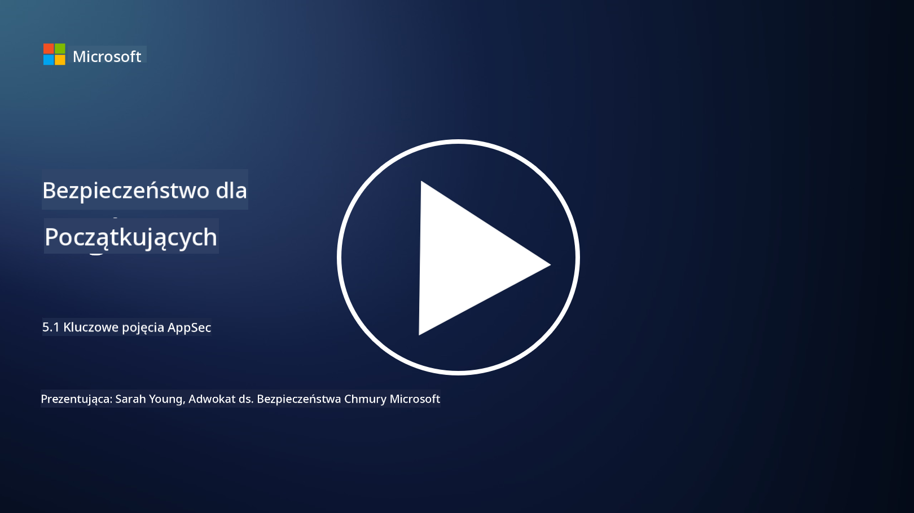

<!--
CO_OP_TRANSLATOR_METADATA:
{
  "original_hash": "e4b56bb23078d3ffb7ad407d280b0c36",
  "translation_date": "2025-09-03T17:28:57+00:00",
  "source_file": "5.1 AppSec key concepts.md",
  "language_code": "pl"
}
-->
# Kluczowe pojęcia AppSec

Bezpieczeństwo aplikacji to specjalizacja w dziedzinie bezpieczeństwa. W tej części kursu przyjrzymy się bliżej bezpieczeństwu aplikacji.

## Wprowadzenie

W tej lekcji omówimy:

- Czym jest bezpieczeństwo aplikacji?

- Jakie są kluczowe pojęcia/zasady bezpieczeństwa aplikacji?

## Czym jest bezpieczeństwo aplikacji?

Bezpieczeństwo aplikacji, często skracane do "AppSec", odnosi się do praktyk mających na celu ochronę aplikacji przed zagrożeniami, podatnościami i atakami. Obejmuje procesy, techniki i narzędzia stosowane w celu identyfikacji, łagodzenia i zapobiegania ryzykom bezpieczeństwa na każdym etapie cyklu życia aplikacji: od jej tworzenia, przez wdrożenie, aż po utrzymanie.

Bezpieczeństwo aplikacji jest kluczowe, ponieważ aplikacje są częstym celem cyberataków. Złośliwi aktorzy wykorzystują podatności i słabości w oprogramowaniu, aby uzyskać nieautoryzowany dostęp, kraść dane, zakłócać działanie usług lub przeprowadzać inne szkodliwe działania. Skuteczne bezpieczeństwo aplikacji pomaga zapewnić poufność, integralność i dostępność aplikacji oraz powiązanych z nią danych.

## Jakie są kluczowe pojęcia/zasady bezpieczeństwa aplikacji?

Kluczowe pojęcia i zasady, które stanowią fundament bezpieczeństwa aplikacji, obejmują:

1. **Bezpieczeństwo w fazie projektowania**:

- Bezpieczeństwo powinno być uwzględnione w projektowaniu i architekturze aplikacji od samego początku, a nie dodawane później.

2. **Walidacja danych wejściowych**:

- Wszystkie dane wprowadzane przez użytkownika powinny być sprawdzane, aby upewnić się, że odpowiadają oczekiwanym formatom i są wolne od złośliwego kodu lub danych.

3. **Kodowanie danych wyjściowych**:

- Dane wysyłane do klienta powinny być odpowiednio kodowane, aby zapobiec podatnościom, takim jak cross-site scripting (XSS).

4. **Uwierzytelnianie i autoryzacja**:

- Uwierzytelniaj użytkowników i przyznawaj im dostęp do zasobów na podstawie ich ról i uprawnień.

5. **Ochrona danych**:

- Wrażliwe dane powinny być szyfrowane podczas przechowywania, przesyłania i przetwarzania, aby zapobiec nieautoryzowanemu dostępowi.

6. **Zarządzanie sesjami**:

- Bezpieczne zarządzanie sesjami chroni sesje użytkowników przed przejęciem i nieautoryzowanym dostępem.

7. **Bezpieczne zależności**:

- Wszystkie zależności oprogramowania powinny być aktualizowane o poprawki bezpieczeństwa, aby zapobiec podatnościom.

8. **Obsługa błędów i logowanie**:

- Zaimplementuj bezpieczną obsługę błędów, aby nie ujawniać wrażliwych informacji, oraz stosuj bezpieczne praktyki logowania.

9. **Testowanie bezpieczeństwa**:

- Regularnie testuj aplikacje pod kątem podatności, korzystając z metod takich jak testy penetracyjne, przeglądy kodu i automatyczne narzędzia skanujące.

10. **Bezpieczny cykl życia oprogramowania (SDLC)**:

- Włącz praktyki bezpieczeństwa na każdym etapie cyklu życia oprogramowania, od wymagań po wdrożenie i utrzymanie.

## Dalsza lektura

- [SheHacksPurple: What is Application Security? - YouTube](https://www.youtube.com/watch?v=eNmccQNzSSY)
- [What Is Application Security? - Cisco](https://www.cisco.com/c/en/us/solutions/security/application-first-security/what-is-application-security.html#~how-does-it-work)
- [What is application security? A process and tools for securing software | CSO Online](https://www.csoonline.com/article/566471/what-is-application-security-a-process-and-tools-for-securing-software.html)
- [OWASP Cheat Sheet Series | OWASP Foundation](https://owasp.org/www-project-cheat-sheets/)

---

**Zastrzeżenie**:  
Ten dokument został przetłumaczony za pomocą usługi tłumaczenia AI [Co-op Translator](https://github.com/Azure/co-op-translator). Chociaż dokładamy wszelkich starań, aby tłumaczenie było precyzyjne, prosimy pamiętać, że automatyczne tłumaczenia mogą zawierać błędy lub nieścisłości. Oryginalny dokument w jego rodzimym języku powinien być uznawany za źródło autorytatywne. W przypadku informacji o kluczowym znaczeniu zaleca się skorzystanie z profesjonalnego tłumaczenia przez człowieka. Nie ponosimy odpowiedzialności za jakiekolwiek nieporozumienia lub błędne interpretacje wynikające z użycia tego tłumaczenia.