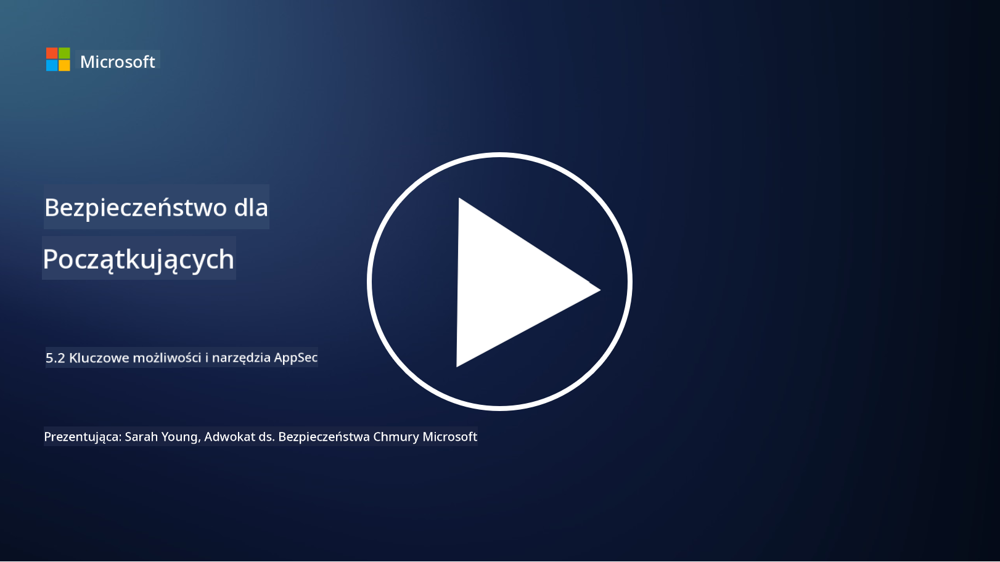

<!--
CO_OP_TRANSLATOR_METADATA:
{
  "original_hash": "790a3fa7e535ec60bb51bde13e759781",
  "translation_date": "2025-09-03T17:34:07+00:00",
  "source_file": "5.2 AppSec key capabilities.md",
  "language_code": "pl"
}
-->
## Wprowadzenie

W tej lekcji omówimy kluczowe możliwości i narzędzia wykorzystywane w bezpieczeństwie aplikacji.

## Kluczowe możliwości i narzędzia w AppSec

Kluczowe możliwości i narzędzia wykorzystywane w bezpieczeństwie aplikacji są niezbędne do identyfikowania, łagodzenia i zapobiegania lukom w zabezpieczeniach oraz zagrożeniom w aplikacjach. Oto niektóre z najważniejszych:

**1. Statyczne testowanie bezpieczeństwa aplikacji (SAST)**:

- **Możliwości**: Analizuje kod źródłowy, kod bajtowy lub kod binarny w celu identyfikacji luk w zabezpieczeniach w bazie kodu aplikacji.

- **Narzędzia**: Przykłady to Fortify, Checkmarx i Veracode.

**2. Dynamiczne testowanie bezpieczeństwa aplikacji (DAST)**:

- **Możliwości**: Skanuje działającą aplikację, aby zidentyfikować luki w zabezpieczeniach poprzez wysyłanie żądań wejściowych i analizę odpowiedzi.

- **Narzędzia**: Przykłady to ZAP, Burp Suite i Qualys Web Application Scanning.

**3. Interaktywne testowanie bezpieczeństwa aplikacji (IAST)**:

- **Możliwości**: Łączy elementy SAST i DAST, analizując kod podczas działania aplikacji, co pozwala na uzyskanie bardziej precyzyjnych wyników i redukcję fałszywych alarmów.

- **Narzędzia**: Przykłady to Contrast Security i HCL AppScan.

**4. Ochrona aplikacji w czasie rzeczywistym (RASP)**:

- **Możliwości**: Monitoruje i chroni aplikacje w czasie rzeczywistym, wykrywając i reagując na zagrożenia bezpieczeństwa w momencie ich wystąpienia.

- **Narzędzia**: Przykłady to Veracode Runtime Protection i F5 Advanced WAF z RASP.

**5. Zapory aplikacji internetowych (WAF)**:

- **Możliwości**: Zapewnia warstwę ochronną między aplikacją a internetem, filtrując ruch przychodzący i blokując złośliwe żądania.

- **Narzędzia**: Przykłady to ModSecurity, AWS WAF i Akamai Kona Site Defender.

**6. Skanowanie zależności**:

- **Możliwości**: Identyfikuje luki w zabezpieczeniach w bibliotekach i komponentach zewnętrznych używanych w aplikacji.

- **Narzędzia**: Przykłady to OWASP Dependency-Check i Snyk.

**7. Testy penetracyjne (Pen Testing)**:

- **Możliwości**: Symuluje ataki rzeczywiste, aby odkryć luki w zabezpieczeniach i ocenić bezpieczeństwo aplikacji.

- **Narzędzia**: Przeprowadzane przez certyfikowanych etycznych hakerów i specjalistów ds. bezpieczeństwa przy użyciu różnych narzędzi, takich jak Metasploit i Nmap.

**8. Skanowanie i analiza bezpieczeństwa**:

- **Możliwości**: Skanuje pod kątem znanych luk w zabezpieczeniach, błędów konfiguracji i nieprawidłowych ustawień bezpieczeństwa.

- **Narzędzia**: Przykłady to Nessus, Qualys Vulnerability Management i OpenVAS.

**9. Narzędzia do zabezpieczania kontenerów**:

- **Możliwości**: Koncentrują się na zabezpieczaniu aplikacji kontenerowych i ich środowisk.

- **Narzędzia**: Przykłady to Docker Security Scanning i Aqua Security.

**10. Szkolenia z zakresu bezpiecznego tworzenia oprogramowania**:

- **Możliwości**: Zapewniają szkolenia i programy uświadamiające dla zespołów deweloperskich, promując praktyki bezpiecznego kodowania.

- **Narzędzia**: Dostosowane programy szkoleniowe i platformy.

**11. Ramy testowania bezpieczeństwa**:

- **Możliwości**: Zapewniają kompleksowe ramy testowania dla różnych potrzeb związanych z bezpieczeństwem aplikacji.

- **Narzędzia**: OWASP Amass, OWASP OWTF i FrAppSec.

**12. Narzędzia do przeglądu bezpiecznego kodu**:

- **Możliwości**: Przeglądają kod źródłowy pod kątem luk w zabezpieczeniach i najlepszych praktyk kodowania.

- **Narzędzia**: Przykłady to SonarQube i Checkmarx.

**13. Narzędzia do zabezpieczania API i mikrousług**:

- **Możliwości**: Koncentrują się na zabezpieczaniu API i mikrousług, w tym uwierzytelnianiu, autoryzacji i ochronie danych.

- **Narzędzia**: Przykłady to Apigee, AWS API Gateway i Istio.

## Dalsza lektura

- [What Is Application Security? Concepts, Tools & Best Practices | HackerOne](https://www.hackerone.com/knowledge-center/what-application-security-concepts-tools-best-practices)
- [What is IAST? (Interactive Application Security Testing) (comparitech.com)](https://www.comparitech.com/net-admin/what-is-iast/)
- [10 Types of Application Security Testing Tools: When and How to Use Them (cmu.edu)](https://insights.sei.cmu.edu/blog/10-types-of-application-security-testing-tools-when-and-how-to-use-them/)
- [Shifting the Balance of Cybersecurity Risk: Principles and Approaches for Security-by-Design and Default | Cyber.gov.au](https://www.cyber.gov.au/about-us/view-all-content/publications/principles-and-approaches-for-security-by-design-and-default)

---

**Zastrzeżenie**:  
Ten dokument został przetłumaczony za pomocą usługi tłumaczeniowej AI [Co-op Translator](https://github.com/Azure/co-op-translator). Chociaż dokładamy wszelkich starań, aby tłumaczenie było precyzyjne, prosimy pamiętać, że automatyczne tłumaczenia mogą zawierać błędy lub nieścisłości. Oryginalny dokument w jego języku źródłowym powinien być uznawany za autorytatywne źródło. W przypadku informacji o kluczowym znaczeniu zaleca się skorzystanie z profesjonalnego tłumaczenia przez człowieka. Nie ponosimy odpowiedzialności za jakiekolwiek nieporozumienia lub błędne interpretacje wynikające z użycia tego tłumaczenia.