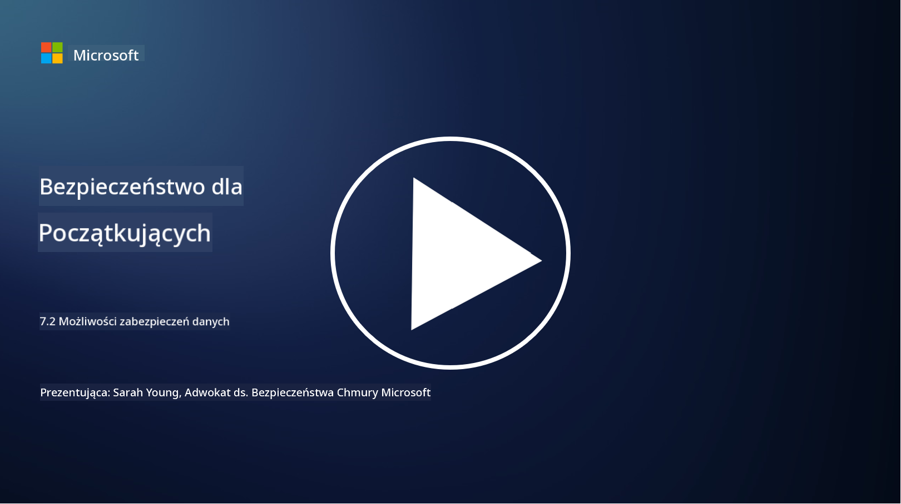

<!--
CO_OP_TRANSLATOR_METADATA:
{
  "original_hash": "50697add9758e54693442d502d2d5f8a",
  "translation_date": "2025-09-03T17:35:51+00:00",
  "source_file": "7.2 Data security capabilities.md",
  "language_code": "pl"
}
-->
# Zdolności w zakresie bezpieczeństwa danych

W tej sekcji omówimy szczegóły dotyczące podstawowych narzędzi i funkcji wykorzystywanych w bezpieczeństwie danych:

**Wprowadzenie**

W tej lekcji omówimy:

- Czym są narzędzia zapobiegania utracie danych?

- Czym są narzędzia zarządzania ryzykiem wewnętrznym?

- Jakie narzędzia do przechowywania danych są dostępne?

## Czym są narzędzia zapobiegania utracie danych?

Narzędzia zapobiegania utracie danych (Data Loss Prevention, DLP) to zestaw rozwiązań i technologii, które mają na celu zapobieganie nieautoryzowanemu dostępowi, udostępnianiu lub wyciekom wrażliwych lub poufnych danych w organizacji. Te narzędzia wykorzystują inspekcję treści, egzekwowanie polityk i monitorowanie, aby identyfikować i chronić wrażliwe dane przed ich ujawnieniem lub niewłaściwym użyciem. Przykłady produktów DLP obejmują: Symantec Data Loss Prevention, McAfee Total Protection for Data Loss Prevention, Microsoft 365 DLP**: Integruje się z aplikacjami Microsoft 365, pomagając organizacjom identyfikować i chronić wrażliwe dane w e-mailach, dokumentach i wiadomościach.

## Czym są narzędzia zarządzania ryzykiem wewnętrznym?

Narzędzia zarządzania ryzykiem wewnętrznym pomagają organizacjom identyfikować i minimalizować ryzyko związane z pracownikami, kontrahentami lub partnerami, którzy mogą celowo lub przypadkowo naruszyć bezpieczeństwo danych. Te narzędzia monitorują zachowanie użytkowników, wzorce dostępu i wykorzystanie danych, aby wykrywać podejrzane działania i potencjalne zagrożenia wewnętrzne. Przykłady produktów zarządzania ryzykiem wewnętrznym obejmują: Microsoft Insider Risk Management (część Microsoft 365), Forcepoint Insider Threat Data Protection, Varonis Insider Threat Detection.

## Jakie narzędzia do przechowywania danych są dostępne?

Narzędzia do przechowywania danych obejmują oprogramowanie i rozwiązania zaprojektowane do zarządzania przechowywaniem i usuwaniem danych zgodnie z politykami przechowywania danych i wymogami prawnymi organizacji. Te narzędzia pomagają automatyzować proces przechowywania danych przez określony czas oraz ich bezpiecznego usuwania, gdy nie są już potrzebne. Przykłady produktów do przechowywania danych obejmują: Veritas Enterprise Vault, Commvault Complete Data Protection, Microsoft data lifecycle management. Te rozwiązania pomagają organizacjom utrzymać kontrolę nad przechowywaniem i usuwaniem danych, zapewniając zgodność z przepisami dotyczącymi ochrony danych, jednocześnie efektywnie zarządzając danymi przez cały ich cykl życia.

## Dalsza lektura

- [Przewodnik po zarządzaniu postawą bezpieczeństwa danych (DSPM) | CSA (cloudsecurityalliance.org)](https://cloudsecurityalliance.org/blog/2023/03/31/the-big-guide-to-data-security-posture-management-dspm/)
- [Zapobieganie utracie danych na urządzeniach końcowych, w aplikacjach i usługach | Microsoft Purview](https://youtu.be/hvqq8L_0kgI)
- [18 najlepszych narzędzi do zapobiegania utracie danych w 2023 roku (darmowe + płatne) (comparitech.com)](https://www.comparitech.com/data-privacy-management/data-loss-prevention-tools-software/)
- [Zapobieganie utracie danych (nist.gov)](https://tsapps.nist.gov/publication/get_pdf.cfm?pub_id=904672)
- [Dowiedz się więcej o zarządzaniu ryzykiem wewnętrznym | Microsoft Learn](https://learn.microsoft.com/purview/insider-risk-management?WT.mc_id=academic-96948-sayoung)
- [Zarządzanie cyklem życia danych | IBM](https://www.ibm.com/topics/data-lifecycle-management)
- [Czym jest zarządzanie cyklem życia danych (DLM)? | Najlepsze praktyki 2023 (selecthub.com)](https://www.selecthub.com/big-data-analytics/data-lifecycle-management/)

---

**Zastrzeżenie**:  
Ten dokument został przetłumaczony za pomocą usługi tłumaczeniowej AI [Co-op Translator](https://github.com/Azure/co-op-translator). Chociaż dokładamy wszelkich starań, aby tłumaczenie było precyzyjne, prosimy pamiętać, że automatyczne tłumaczenia mogą zawierać błędy lub nieścisłości. Oryginalny dokument w jego rodzimym języku powinien być uznawany za wiarygodne źródło. W przypadku informacji krytycznych zaleca się skorzystanie z profesjonalnego tłumaczenia wykonanego przez człowieka. Nie ponosimy odpowiedzialności za jakiekolwiek nieporozumienia lub błędne interpretacje wynikające z korzystania z tego tłumaczenia.