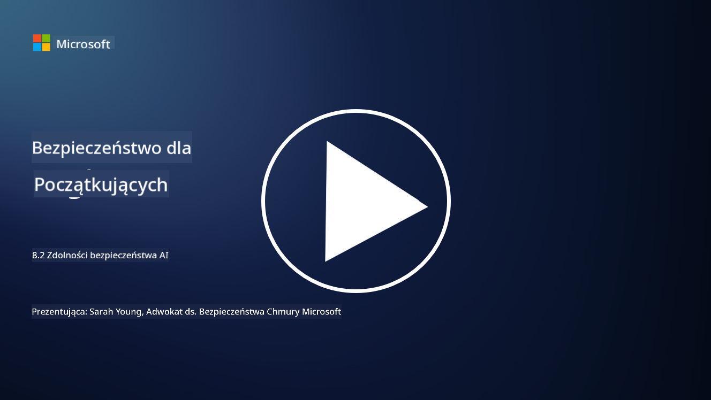

<!--
CO_OP_TRANSLATOR_METADATA:
{
  "original_hash": "b6bb7175672298d1e2f73ba7e0006f95",
  "translation_date": "2025-09-03T17:38:14+00:00",
  "source_file": "8.2 AI security capabilities.md",
  "language_code": "pl"
}
-->
# Zdolności w zakresie bezpieczeństwa AI

## Jakie narzędzia i możliwości mamy obecnie, aby zabezpieczyć systemy AI?

Obecnie dostępnych jest kilka narzędzi i możliwości, które pomagają w zabezpieczeniu systemów AI:

-   **Counterfit**: Otwarty, automatyczny program do testowania bezpieczeństwa systemów AI, stworzony w celu pomocy organizacjom w przeprowadzaniu ocen ryzyka bezpieczeństwa AI i zapewnieniu odporności ich algorytmów.
-   **Narzędzia do Adwersarialnego Uczenia Maszynowego**: Narzędzia te oceniają odporność modeli uczenia maszynowego na ataki adwersarialne, pomagając w identyfikacji i łagodzeniu podatności.
-   **Zestawy Narzędzi Bezpieczeństwa AI**: Dostępne są otwarte zestawy narzędzi, które oferują zasoby do zabezpieczania systemów AI, w tym biblioteki i frameworki do wdrażania środków bezpieczeństwa.
-   **Platformy Współpracy**: Partnerstwa między firmami a społecznościami AI w celu opracowania skanerów bezpieczeństwa specyficznych dla AI oraz innych narzędzi do zabezpieczenia łańcucha dostaw AI.

Te narzędzia i możliwości są częścią rozwijającej się dziedziny, której celem jest zwiększenie bezpieczeństwa systemów AI wobec różnorodnych zagrożeń. Stanowią one połączenie badań, praktycznych narzędzi i współpracy przemysłowej, mające na celu sprostanie unikalnym wyzwaniom związanym z technologiami AI.

## A co z testowaniem AI w ramach red teamingu? Czym różni się to od tradycyjnego red teamingu bezpieczeństwa?

Testowanie AI w ramach red teamingu różni się od tradycyjnego red teamingu bezpieczeństwa w kilku kluczowych aspektach:

-   **Skupienie na systemach AI**: Red teaming AI koncentruje się na unikalnych podatnościach systemów AI, takich jak modele uczenia maszynowego i przepływy danych, zamiast na tradycyjnej infrastrukturze IT.
-   **Testowanie zachowań AI**: Obejmuje testowanie, jak systemy AI reagują na nietypowe lub nieoczekiwane dane wejściowe, co może ujawnić podatności, które mogą zostać wykorzystane przez atakujących.
-   **Badanie awarii AI**: Red teaming AI analizuje zarówno złośliwe, jak i nieszkodliwe awarie, uwzględniając szerszy zakres scenariuszy i potencjalnych awarii systemu, nie tylko naruszenia bezpieczeństwa.
-   **Wstrzykiwanie poleceń i generowanie treści**: Obejmuje również badanie awarii, takich jak wstrzykiwanie poleceń, gdzie atakujący manipulują systemami AI, aby generowały szkodliwe lub nieuzasadnione treści.
-   **Etyka i odpowiedzialność AI**: Jest to część zapewnienia odpowiedzialnego projektowania AI, które gwarantuje, że systemy AI są odporne na próby zmuszenia ich do działania w niezamierzony sposób.

Ogólnie rzecz biorąc, red teaming AI to rozszerzona praktyka, która nie tylko obejmuje badanie podatności na zagrożenia bezpieczeństwa, ale także testowanie innych typów awarii systemowych specyficznych dla technologii AI. Jest to kluczowy element w rozwijaniu bezpieczniejszych systemów AI poprzez zrozumienie i łagodzenie nowych ryzyk związanych z wdrażaniem AI.

## Dalsza lektura

 - [Microsoft AI Red Team buduje przyszłość bezpieczniejszego AI | Microsoft Security Blog](https://www.microsoft.com/en-us/security/blog/2023/08/07/microsoft-ai-red-team-building-future-of-safer-ai/?WT.mc_id=academic-96948-sayoung)
 - [Ogłoszenie otwartego frameworku automatyzacji Microsoftu do testowania generatywnych systemów AI | Microsoft Security Blog](https://www.microsoft.com/en-us/security/blog/2024/02/22/announcing-microsofts-open-automation-framework-to-red-team-generative-ai-systems/?WT.mc_id=academic-96948-sayoung)
 - [Narzędzia bezpieczeństwa AI: Otwarty zestaw narzędzi | Wiz](https://www.wiz.io/academy/ai-security-tools)

---

**Zastrzeżenie**:  
Ten dokument został przetłumaczony za pomocą usługi tłumaczenia AI [Co-op Translator](https://github.com/Azure/co-op-translator). Chociaż dokładamy wszelkich starań, aby tłumaczenie było precyzyjne, prosimy pamiętać, że automatyczne tłumaczenia mogą zawierać błędy lub nieścisłości. Oryginalny dokument w jego języku źródłowym powinien być uznawany za autorytatywne źródło. W przypadku informacji o kluczowym znaczeniu zaleca się skorzystanie z profesjonalnego tłumaczenia przez człowieka. Nie ponosimy odpowiedzialności za jakiekolwiek nieporozumienia lub błędne interpretacje wynikające z użycia tego tłumaczenia.