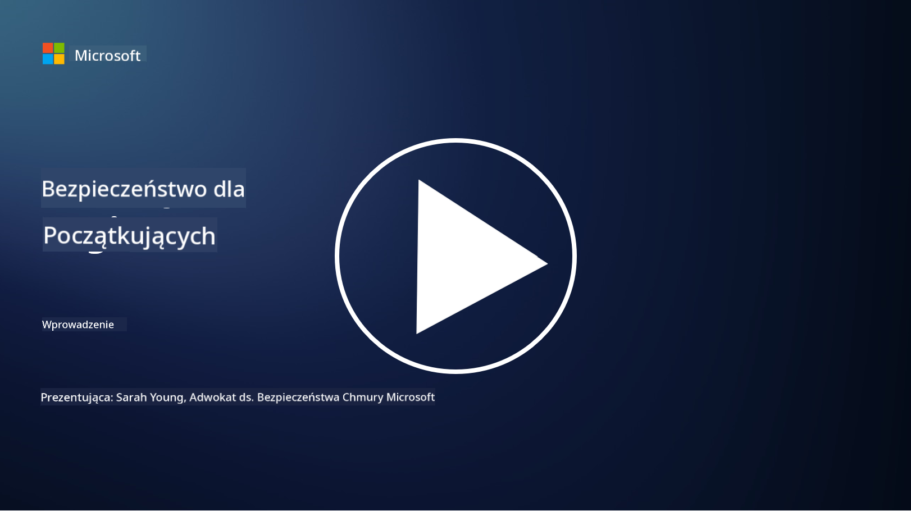

<!--
CO_OP_TRANSLATOR_METADATA:
{
  "original_hash": "fc3d47b5af0cc4fc954ae5d2ea2f7811",
  "translation_date": "2025-10-24T09:05:28+00:00",
  "source_file": "README.md",
  "language_code": "pl"
}
-->
  
  
  
  
  
  

### 🌐 Wsparcie dla wielu języków

#### Obsługiwane przez GitHub Action (Automatyczne i zawsze aktualne)

<!-- CO-OP TRANSLATOR LANGUAGES TABLE START -->
[Arabski](../ar/README.md) | [Bengalski](../bn/README.md) | [Bułgarski](../bg/README.md) | [Birmański (Myanmar)](../my/README.md) | [Chiński (uproszczony)](../zh/README.md) | [Chiński (tradycyjny, Hongkong)](../hk/README.md) | [Chiński (tradycyjny, Makau)](../mo/README.md) | [Chiński (tradycyjny, Tajwan)](../tw/README.md) | [Chorwacki](../hr/README.md) | [Czeski](../cs/README.md) | [Duński](../da/README.md) | [Holenderski](../nl/README.md) | [Estoński](../et/README.md) | [Fiński](../fi/README.md) | [Francuski](../fr/README.md) | [Niemiecki](../de/README.md) | [Grecki](../el/README.md) | [Hebrajski](../he/README.md) | [Hindi](../hi/README.md) | [Węgierski](../hu/README.md) | [Indonezyjski](../id/README.md) | [Włoski](../it/README.md) | [Japoński](../ja/README.md) | [Koreański](../ko/README.md) | [Litewski](../lt/README.md) | [Malajski](../ms/README.md) | [Marathi](../mr/README.md) | [Nepalski](../ne/README.md) | [Norweski](../no/README.md) | [Perski (Farsi)](../fa/README.md) | [Polski](./README.md) | [Portugalski (Brazylia)](../br/README.md) | [Portugalski (Portugalia)](../pt/README.md) | [Pendżabski (Gurmukhi)](../pa/README.md) | [Rumuński](../ro/README.md) | [Rosyjski](../ru/README.md) | [Serbski (cyrylica)](../sr/README.md) | [Słowacki](../sk/README.md) | [Słoweński](../sl/README.md) | [Hiszpański](../es/README.md) | [Suahili](../sw/README.md) | [Szwedzki](../sv/README.md) | [Tagalog (Filipiński)](../tl/README.md) | [Tamilski](../ta/README.md) | [Tajski](../th/README.md) | [Turecki](../tr/README.md) | [Ukraiński](../uk/README.md) | [Urdu](../ur/README.md) | [Wietnamski](../vi/README.md)  
<!-- CO-OP TRANSLATOR LANGUAGES TABLE END -->

**Jeśli chcesz, aby dodatkowe języki były obsługiwane, lista dostępnych języków znajduje się [tutaj](https://github.com/Azure/co-op-translator/blob/main/getting_started/supported-languages.md)**

#### Dołącz do naszej społeczności  

# 🚀 Cyberbezpieczeństwo dla początkujących – program nauczania

W czasach szybkiego rozwoju technologii AI jeszcze ważniejsze jest zrozumienie, jak zabezpieczać systemy IT. Ten kurs został zaprojektowany, aby nauczyć Cię podstawowych koncepcji cyberbezpieczeństwa i rozpocząć Twoją przygodę z nauką o bezpieczeństwie. Kurs jest niezależny od dostawców i podzielony na krótkie lekcje, które zajmują około 30-60 minut. Każda lekcja zawiera krótki quiz oraz linki do dodatkowych materiałów, jeśli chcesz zgłębić temat.

Co obejmuje ten kurs 📚

- 🔐 Podstawowe koncepcje cyberbezpieczeństwa, takie jak triada CIA, różnice między ryzykiem, zagrożeniami itp.
- 🛡️ Zrozumienie, czym jest kontrola bezpieczeństwa i jakie ma formy.
- 🌐 Zrozumienie, czym jest zero trust i dlaczego jest to ważne we współczesnym cyberbezpieczeństwie.
- 🔑 Zrozumienie kluczowych koncepcji i tematów związanych z tożsamością, sieciami, operacjami bezpieczeństwa, infrastrukturą i bezpieczeństwem danych.
- 🔧 Przykłady narzędzi używanych do wdrażania kontroli bezpieczeństwa.

Czego ten kurs nie obejmuje 🙅‍♂️

- 🚫 Jak używać konkretnych narzędzi bezpieczeństwa.
- 🚫 Jak "hakować" lub prowadzić ofensywne działania bezpieczeństwa.
- 🚫 Nauka o konkretnych standardach zgodności.

Po ukończeniu tego kursu możesz przejść do niektórych modułów Microsoft Learn. Polecamy kontynuowanie nauki z [Microsoft Security, Compliance, and Identity Fundamentals.](https://learn.microsoft.com/training/paths/describe-concepts-of-security-compliance-identity/?WT.mc_id=academic-96948-sayoung)  

Ostatecznie możesz rozważyć przystąpienie do [Egzaminu SC-900: Microsoft Security, Compliance, and Identity Fundamentals.](https://learn.microsoft.com/credentials/certifications/exams/sc-900/?WT.mc_id=academic-96948-sayoung)  

> 💁 Jeśli masz jakiekolwiek uwagi lub sugestie dotyczące tego kursu oraz treści, których brakuje, chętnie je usłyszymy!

## Przegląd modułów 📝  
| **Numer modułu** | **Nazwa modułu**                           | **Nauczane koncepcje**               | **Cele nauki**                                                                                                  |
|-------------------|-------------------------------------------|--------------------------------------|-----------------------------------------------------------------------------------------------------------------|
| **1.1**           | Podstawowe koncepcje bezpieczeństwa       | [Triada CIA](https://github.com/microsoft/Security-101/blob/main/1.1%20The%20CIA%20triad%20and%20other%20key%20concepts.md)                        | Dowiedz się o poufności, dostępności i integralności. Również o autentyczności, niezaprzeczalności i prywatności. |
| **1.2**           | Podstawowe koncepcje bezpieczeństwa       | [Typowe zagrożenia cyberbezpieczeństwa](https://github.com/microsoft/Security-101/blob/main/1.2%20Common%20cybersecurity%20threats.md)        | Dowiedz się o typowych zagrożeniach cyberbezpieczeństwa, które dotykają jednostki i organizacje.                |
| **1.3**           | Podstawowe koncepcje bezpieczeństwa       | [Zrozumienie zarządzania ryzykiem](https://github.com/microsoft/Security-101/blob/main/1.3%20Understanding%20risk%20management.md)       | Dowiedz się o ocenie i zrozumieniu ryzyka – wpływ/prawdopodobieństwo oraz wdrażanie kontroli.                                                                                                               | |
| **1.4**           | Podstawowe koncepcje bezpieczeństwa       | [Praktyki bezpieczeństwa i dokumentacja](https://github.com/microsoft/Security-101/blob/main/1.4%20Security%20practices%20and%20documentation.md) | Dowiedz się o różnicy między politykami, procedurami, standardami a regulacjami/prawem.                         |
| **1.5**           | Podstawowe koncepcje bezpieczeństwa       | [Zero trust](https://github.com/microsoft/Security-101/blob/main/1.5%20Zero%20trust.md)                           | Dowiedz się, czym jest zero trust i jak wpływa na architekturę. Co to jest obrona w głąb?                       |
| **1.6**           | Podstawowe koncepcje bezpieczeństwa       | [Model współdzielonej odpowiedzialności](https://github.com/microsoft/Security-101/blob/main/1.6%20Shared%20responsibility%20model.md)                           | Czym jest model współdzielonej odpowiedzialności i jak wpływa na cyberbezpieczeństwo?                           |
| **1.7**           | [Quiz na zakończenie modułu](https://github.com/microsoft/Security-101/blob/main/1.7%20End%20of%20module%20quiz.md)                        |                                      |                                                                                                                 |
| **2.1**           | Podstawy zarządzania tożsamością i dostępem | [Kluczowe koncepcje IAM](https://github.com/microsoft/Security-101/blob/main/2.1%20IAM%20key%20concepts.md)                     | Dowiedz się o zasadzie najmniejszych uprawnień, podziale obowiązków, jak IAM wspiera zero trust.                |
| **2.2**           | Podstawy zarządzania tożsamością i dostępem | [Architektura zero trust IAM](https://github.com/microsoft/Security-101/blob/main/2.2%20IAM%20zero%20trust%20architecture.md)          | Dowiedz się, jak tożsamość staje się nową granicą dla współczesnych środowisk IT i jakie zagrożenia eliminuje.  |
| **2.3**           | Podstawy zarządzania tożsamością i dostępem | [Możliwości IAM](https://github.com/microsoft/Security-101/blob/main/2.3%20IAM%20capabilities.md)                     | Dowiedz się o możliwościach IAM i kontrolach zabezpieczających tożsamości.                                      |
| **2.4**           | [Quiz na zakończenie modułu](https://github.com/microsoft/Security-101/blob/main/2.4%20End%20of%20module%20quiz.md)                        |                                      |                                                                                                                 |
| **3.1**           | Podstawy bezpieczeństwa sieci             | [Kluczowe koncepcje sieciowe](https://github.com/microsoft/Security-101/blob/main/3.1%20Networking%20key%20concepts.md)              | Dowiedz się o koncepcjach sieciowych (adresy IP, numery portów, szyfrowanie itp.).                              |
| **3.2**           | Podstawy bezpieczeństwa sieci             | [Architektura zero trust sieci](https://github.com/microsoft/Security-101/blob/main/3.2%20Networking%20zero%20trust%20architecture.md)   | Dowiedz się, jak sieci przyczyniają się do architektury E2E ZT i jakie zagrożenia eliminują.                    |
| **3.3**           | Podstawy bezpieczeństwa sieci             | [Możliwości bezpieczeństwa sieci](https://github.com/microsoft/Security-101/blob/main/3.3%20Network%20security%20capabilities.md)        | Dowiedz się o narzędziach bezpieczeństwa sieci – zapory, WAF, ochrona przed DDoS itp.                           |
| **3.4**           | [Quiz na zakończenie modułu](https://github.com/microsoft/Security-101/blob/main/3.4%20End%20of%20module%20quiz.md)                        |                                      |                                                                                                                 |
| **4.1**           | Podstawy operacji bezpieczeństwa          | [Kluczowe koncepcje SecOps](https://github.com/microsoft/Security-101/blob/main/4.1%20SecOps%20key%20concepts.md)                  | Dowiedz się, dlaczego operacje bezpieczeństwa są ważne i jak różnią się od zwykłych zespołów IT.                |
| **4.2**           | Podstawy operacji bezpieczeństwa          | [Architektura zero trust SecOps](https://github.com/microsoft/Security-101/blob/main/4.2%20SecOps%20zero%20trust%20architecture.md)       | Dowiedz się, jak SecOps przyczynia się do architektury E2E ZT i jakie zagrożenia eliminuje.                     |
| **4.3**           | Podstawy operacji bezpieczeństwa          | [Możliwości SecOps](https://github.com/microsoft/Security-101/blob/main/4.3%20SecOps%20capabilities.md)                  | Dowiedz się o narzędziach SecOps – SIEM, XDR itp.                                                                |
| **4.4**           | [Quiz na zakończenie modułu](https://github.com/microsoft/Security-101/blob/main/4.4%20End%20of%20module%20quiz.md)                        |                                      |                                                                                                                 |
| **5.1**           | Podstawy bezpieczeństwa aplikacji         | [Kluczowe koncepcje AppSec](https://github.com/microsoft/Security-101/blob/main/5.1%20AppSec%20key%20concepts.md)                  | Dowiedz się o koncepcjach AppSec, takich jak projektowanie z myślą o bezpieczeństwie, walidacja danych wejściowych itp. |
| **5.2**           | Podstawy bezpieczeństwa aplikacji         | [Możliwości AppSec](https://github.com/microsoft/Security-101/blob/main/5.2%20AppSec%20key%20capabilities.md)                  | Dowiedz się o narzędziach AppSec: narzędziach bezpieczeństwa w pipeline, skanowaniu kodu, skanowaniu sekretów itp.                       |
| **5.3**           | [Quiz na zakończenie modułu](https://github.com/microsoft/Security-101/blob/main/5.3%20End%20of%20module%20quiz.md)                        |                                      |                                                                                                                 |
| **6.1**           | Podstawy bezpieczeństwa infrastruktury      | [Kluczowe pojęcia bezpieczeństwa infrastruktury](https://github.com/microsoft/Security-101/blob/main/6.1%20Infrastructure%20security%20key%20concepts.md) | Dowiedz się o wzmacnianiu systemów, aktualizacjach, higienie bezpieczeństwa, bezpieczeństwie kontenerów.                                  |
| **6.2**           | Podstawy bezpieczeństwa infrastruktury      | [Możliwości bezpieczeństwa infrastruktury](https://github.com/microsoft/Security-101/blob/main/6.2%20Infrastructure%20security%20capabilities.md) | Dowiedz się o narzędziach wspierających bezpieczeństwo infrastruktury, np. CSPM, bezpieczeństwo kontenerów itp.            |
| **6.3**           | [Quiz na zakończenie modułu](https://github.com/microsoft/Security-101/blob/main/6.3%20End%20of%20module%20quiz.md)                        |                                      |                                                                                                                 |
| **7.1**           | Podstawy bezpieczeństwa danych                | [Kluczowe pojęcia bezpieczeństwa danych](https://github.com/microsoft/Security-101/blob/main/7.1%20Data%20security%20key%20concepts.md)           | Dowiedz się o klasyfikacji i przechowywaniu danych oraz dlaczego jest to ważne dla organizacji.                     |
| **7.2**           | Podstawy bezpieczeństwa danych                | [Możliwości bezpieczeństwa danych](https://github.com/microsoft/Security-101/blob/main/7.2%20Data%20security%20capabilities.md)           | Dowiedz się o narzędziach bezpieczeństwa danych – DLP, zarządzaniu ryzykiem wewnętrznym, zarządzaniu danymi itp.                          |
| **7.3**           | [Quiz na zakończenie modułu](https://github.com/microsoft/Security-101/blob/main/7.3%20End%20of%20module%20quiz.md)                        |
| **8.1**           | Podstawy bezpieczeństwa AI                | [Kluczowe pojęcia bezpieczeństwa AI](https://github.com/microsoft/Security-101/blob/main/8.1%20AI%20security%20key%20concepts.md)          | Dowiedz się o różnicach i podobieństwach między tradycyjnym bezpieczeństwem a bezpieczeństwem AI.                 |
| **8.2**           | Podstawy bezpieczeństwa AI                | [Możliwości bezpieczeństwa AI](https://github.com/microsoft/Security-101/blob/main/8.2%20AI%20security%20capabilities.md)           | Dowiedz się o narzędziach bezpieczeństwa AI i kontrolach, które można zastosować w celu zabezpieczenia AI.                         |
| **8.3**           | Podstawy bezpieczeństwa AI                | [Odpowiedzialne AI](https://github.com/microsoft/Security-101/blob/main/8.3%20Responsible%20AI.md)          | Dowiedz się, czym jest odpowiedzialne AI oraz o specyficznych zagrożeniach związanych z AI, które powinny być znane specjalistom ds. bezpieczeństwa.                          |
| **8.4**           | [Quiz na zakończenie modułu](https://github.com/microsoft/Security-101/blob/main/8.4%20End%20of%20module%20quiz.md)     

## 🎒 Inne kursy 

Nasz zespół tworzy inne kursy! Sprawdź:

<!-- CO-OP TRANSLATOR OTHER COURSES START -->
### Azure / Edge / MCP / Agenci

---
 
### Seria Generative AI

[-9333EA?style=for-the-badge&labelColor=E5E7EB&color=9333EA)](https://github.com/microsoft/Generative-AI-for-beginners-dotnet?WT.mc_id=academic-105485-koreyst)
[-C084FC?style=for-the-badge&labelColor=E5E7EB&color=C084FC)](https://github.com/microsoft/generative-ai-for-beginners-java?WT.mc_id=academic-105485-koreyst)
[-E879F9?style=for-the-badge&labelColor=E5E7EB&color=E879F9)](https://github.com/microsoft/generative-ai-with-javascript?WT.mc_id=academic-105485-koreyst)

---
 
### Podstawowe kursy

---
 
### Seria Copilot

<!-- CO-OP TRANSLATOR OTHER COURSES END -->

## Uzyskiwanie pomocy

Jeśli utkniesz lub masz pytania dotyczące tworzenia aplikacji AI, dołącz:

Jeśli masz uwagi dotyczące produktu lub napotkasz błędy podczas tworzenia, odwiedź:

---

**Zastrzeżenie**:  
Ten dokument został przetłumaczony za pomocą usługi tłumaczenia AI [Co-op Translator](https://github.com/Azure/co-op-translator). Chociaż staramy się zapewnić dokładność, prosimy pamiętać, że automatyczne tłumaczenia mogą zawierać błędy lub nieścisłości. Oryginalny dokument w jego rodzimym języku powinien być uznawany za autorytatywne źródło. W przypadku informacji krytycznych zaleca się skorzystanie z profesjonalnego tłumaczenia przez człowieka. Nie ponosimy odpowiedzialności za jakiekolwiek nieporozumienia lub błędne interpretacje wynikające z użycia tego tłumaczenia.