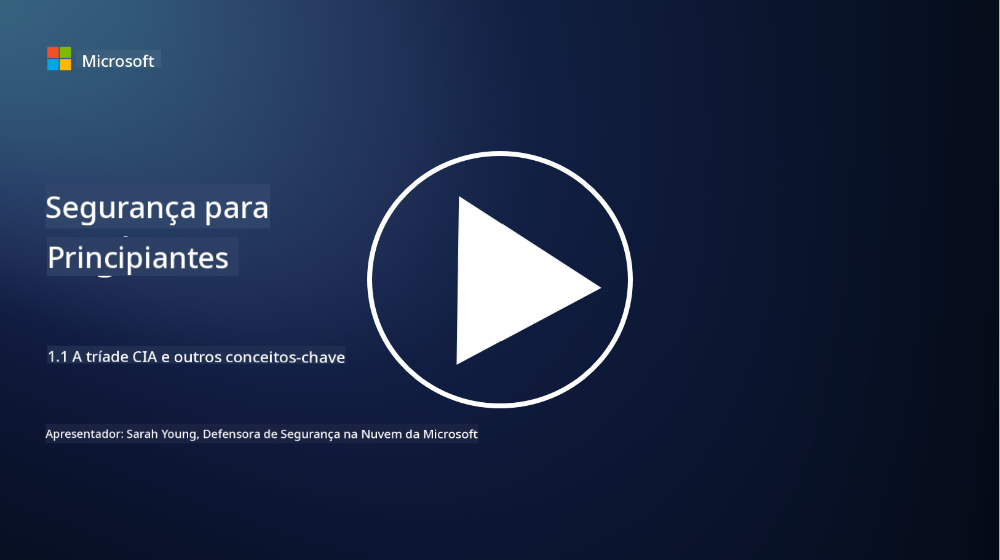

<!--
CO_OP_TRANSLATOR_METADATA:
{
  "original_hash": "16a76f9fa372fb63cffb6d76b855f023",
  "translation_date": "2025-09-03T17:39:50+00:00",
  "source_file": "1.1 The CIA triad and other key concepts.md",
  "language_code": "pt"
}
-->
# A tríade CIA e outros conceitos-chave

## Introdução

Nesta lição, iremos abordar:

 - O que é cibersegurança?
   
 
 - O que é a tríade CIA da cibersegurança?

   

 - O que são autenticidade, não-repudiação e privacidade no contexto da cibersegurança?

## O que é cibersegurança?

Cibersegurança, também conhecida como segurança da informação, é a prática de proteger sistemas informáticos, redes, dispositivos e dados contra ataques digitais, acessos não autorizados, danos ou roubo. O objetivo principal da cibersegurança é garantir a confidencialidade, integridade e disponibilidade de ativos digitais e informações. Profissionais de cibersegurança projetam e implementam controlos de segurança para proteger ativos, dados e informações. À medida que mais aspectos das nossas vidas se tornam digitalizados e online, a cibersegurança tornou-se uma preocupação prioritária tanto para indivíduos como para organizações.

## O que é a tríade CIA da cibersegurança?

A tríade da cibersegurança refere-se ao modelo que incorpora as três principais considerações para qualquer trabalho de cibersegurança ou para o design de um sistema/ambiente:

### Confidencialidade

Esta é a consideração com a qual a maioria das pessoas está familiarizada quando pensa em "cibersegurança": confidencialidade é o processo de proteger dados e informações contra tentativas de acesso não autorizado, ou seja, apenas pessoas que precisam ver as informações podem acessá-las. No entanto, nem todos os dados são iguais, e os dados geralmente são categorizados e protegidos com base no impacto que teria se fossem acessados por pessoas erradas.

### Integridade

Refere-se à proteção da precisão e confiabilidade dos dados contidos em ambientes, garantindo que os dados não sejam alterados ou modificados por indivíduos não autorizados. Por exemplo, um estudante altera a sua data de nascimento no registo de condutores no DMV para parecer mais velho e conseguir reimprimir a sua licença com uma data de nascimento anterior para comprar álcool.

### Disponibilidade

Embora seja uma consideração em toda a TI operacional, a disponibilidade também é importante para a cibersegurança. Existem tipos específicos de ataques que têm como alvo a disponibilidade e que os profissionais de segurança devem proteger (por exemplo, ataques de negação de serviço distribuída – DDoS).

**Tríade CIA da Cibersegurança**

## O que são autenticidade, não-repudiação e privacidade no contexto da cibersegurança?

Estes são conceitos adicionais importantes que estão relacionados com a garantia da segurança e confiabilidade de sistemas e dados:

**Autenticidade** - refere-se à garantia de que a informação, comunicação ou entidade com a qual está a interagir é genuína e não foi adulterada ou modificada por partes não autorizadas.

**Não-repudiação** - é o conceito de garantir que uma parte não pode negar a sua participação ou a autenticidade de uma transação ou comunicação. Impede que alguém afirme que não enviou uma mensagem ou realizou uma determinada ação quando há evidências em contrário.

**Privacidade** - refere-se à proteção de informações sensíveis e identificáveis pessoalmente contra acesso, uso, divulgação ou manipulação não autorizados. Envolve controlar quem tem acesso aos dados pessoais e como esses dados são recolhidos, armazenados e partilhados.

## Leitura adicional

[O que é Segurança da Informação (InfoSec)? | Microsoft Security](https://www.microsoft.com/security/business/security-101/what-is-information-security-infosec#:~:text=Three%20pillars%20of%20information%20security%3A%20the%20CIA%20triad,as%20guiding%20principles%20for%20implementing%20an%20InfoSec%20plan.)

---

**Aviso Legal**:  
Este documento foi traduzido utilizando o serviço de tradução por IA [Co-op Translator](https://github.com/Azure/co-op-translator). Embora nos esforcemos para garantir a precisão, é importante notar que traduções automáticas podem conter erros ou imprecisões. O documento original na sua língua nativa deve ser considerado a fonte autoritária. Para informações críticas, recomenda-se a tradução profissional realizada por humanos. Não nos responsabilizamos por quaisquer mal-entendidos ou interpretações incorretas decorrentes da utilização desta tradução.