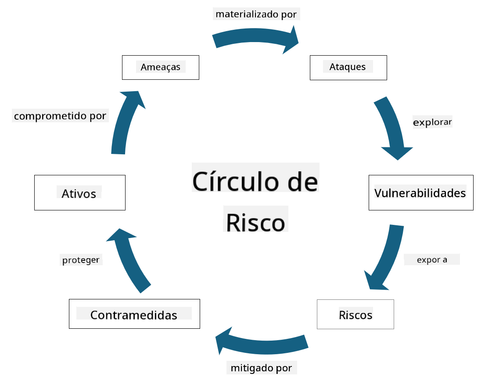

<!--
CO_OP_TRANSLATOR_METADATA:
{
  "original_hash": "fcca304f072cabf206388199e8e2e578",
  "translation_date": "2025-09-03T17:45:14+00:00",
  "source_file": "1.3 Understanding risk management.md",
  "language_code": "pt"
}
-->
# Compreender a gestão de riscos

## Introdução

Nesta lição, iremos abordar:

 - Definições de terminologia de segurança frequentemente utilizada
   
 - Tipos de controlos de segurança

 - Avaliação de riscos de segurança

## Definições de terminologia de segurança frequentemente utilizada

Estes termos são conceitos fundamentais no campo da cibersegurança e gestão de riscos. Vamos analisar cada termo e como se relacionam entre si:

1. **Agente de Ameaça**:

Um agente de ameaça é um indivíduo, grupo, organização ou sistema automatizado que tem o potencial de explorar vulnerabilidades num sistema ou rede para causar danos ou prejuízos. Os agentes de ameaça podem ser hackers, autores de malware, funcionários insatisfeitos ou qualquer entidade que represente um risco para sistemas de informação e tecnologia.

2. **Ameaça**:

Uma ameaça é um evento ou ação potencial que pode explorar vulnerabilidades num sistema e causar danos a um ativo. As ameaças podem incluir ações como hacking, violações de dados, ataques de negação de serviço, entre outros. As ameaças representam o "quê" em termos de possíveis danos que podem ser infligidos aos ativos de uma organização.

3. **Vulnerabilidade**:

Uma vulnerabilidade é uma fraqueza ou falha no design, implementação ou configuração de um sistema que pode ser explorada por um agente de ameaça para comprometer a segurança do sistema. As vulnerabilidades podem existir em software, hardware, processos ou comportamento humano. Identificar e resolver vulnerabilidades é essencial para minimizar o risco de ataques bem-sucedidos.

4. **Risco**:

O risco é o potencial de perda, dano ou prejuízo resultante da interação entre uma ameaça e uma vulnerabilidade. É a probabilidade de que um agente de ameaça explore uma vulnerabilidade para causar um impacto negativo. Os riscos são frequentemente avaliados em termos do seu impacto potencial e da probabilidade de ocorrência.

5. **Ativo**:

Um ativo é qualquer coisa de valor que uma organização procura proteger. Os ativos podem incluir objetos físicos (como computadores e servidores), dados (informação de clientes, registos financeiros), propriedade intelectual (segredos comerciais, patentes) e até recursos humanos (competências e conhecimentos dos funcionários). Proteger ativos é um objetivo fundamental da cibersegurança.

6. **Exposição**:

A exposição refere-se ao estado de estar vulnerável a ameaças potenciais. Ocorre quando existe uma vulnerabilidade que pode ser explorada por um agente de ameaça. A exposição destaca o risco associado à presença de vulnerabilidades num sistema ou rede.

7. **Controlo**:

Um controlo é uma medida implementada para reduzir o risco associado a vulnerabilidades e ameaças. Os controlos podem ser técnicos, processuais ou administrativos. São concebidos para prevenir, detetar ou mitigar ameaças e vulnerabilidades potenciais. Exemplos incluem firewalls, controlos de acesso, encriptação, políticas de segurança e formação de funcionários.

Para resumir a relação entre estes termos: Agentes de ameaça exploram vulnerabilidades para realizar ameaças, que podem levar a riscos com potencial para causar danos a ativos valiosos. A exposição ocorre quando existem vulnerabilidades, e os controlos são implementados para reduzir o risco, prevenindo ou mitigando o impacto das ameaças nos ativos. Este quadro forma a base da gestão de riscos de cibersegurança, orientando as organizações na identificação, avaliação e resolução de riscos potenciais aos seus sistemas de informação e ativos.

## Tipos de controlos de segurança

Os controlos de segurança são medidas ou salvaguardas implementadas para proteger sistemas de informação e ativos contra várias ameaças e vulnerabilidades. Podem ser classificados em várias categorias com base no seu foco e propósito. Aqui estão alguns tipos comuns de controlos de segurança:

1. **Controlos Administrativos**:

Estes controlos estão relacionados com políticas, procedimentos e diretrizes que regem as práticas de segurança da organização e o comportamento dos utilizadores.

- Políticas e procedimentos de segurança: Diretrizes documentadas que definem como a segurança é mantida dentro de uma organização.

- Sensibilização e formação em segurança: Programas para educar os funcionários sobre as melhores práticas de segurança e ameaças potenciais.

- Resposta e gestão de incidentes: Planos para responder e mitigar incidentes de segurança.

2. **Controlos Técnicos**:

Os controlos técnicos envolvem o uso de tecnologia para aplicar medidas de segurança e proteger sistemas e dados. Exemplos de controlos técnicos incluem:

- Controlos de acesso: Medidas que restringem o acesso dos utilizadores a recursos com base nos seus papéis e permissões.

- Encriptação: Conversão de dados num formato seguro para prevenir acessos não autorizados.

- Firewalls: Dispositivos de segurança de rede que filtram e controlam o tráfego de entrada e saída.

- Sistemas de Deteção e Prevenção de Intrusões (IDPS): Ferramentas que monitorizam o tráfego de rede para atividades suspeitas.

- Software antivírus e antimalware: Programas que detetam e removem software malicioso.

- Mecanismos de autenticação: Métodos para verificar a identidade dos utilizadores, como senhas, biometria e autenticação multifator.

- Gestão de patches: Atualização regular de software para resolver vulnerabilidades conhecidas.

3. **Controlos Físicos**:

Os controlos físicos são medidas para proteger ativos físicos e instalações.

- Guardas de segurança e pessoal de controlo de acesso: Pessoal que monitoriza e controla o acesso às instalações físicas.

- Câmaras de vigilância: Sistemas de monitorização de vídeo para observar e gravar atividades.

- Fechaduras e barreiras físicas: Medidas físicas para restringir o acesso a áreas sensíveis.

- Controlos ambientais: Medidas para regular temperatura, humidade e outros fatores ambientais que afetam equipamentos e centros de dados.

4. **Controlos Operacionais**:

Estes controlos estão relacionados com operações e atividades diárias que garantem a segurança contínua dos sistemas.

- Gestão de mudanças: Processos para rastrear e aprovar alterações em sistemas e configurações.

- Backup e recuperação de desastres: Planos para backup de dados e recuperação em caso de falhas de sistema ou desastres.

- Registo e auditoria: Monitorização e registo de atividades do sistema para fins de segurança e conformidade.

- Práticas de codificação segura: Diretrizes para escrever software que minimize vulnerabilidades.

5. **Controlos Legais e Regulamentares**:

Estes controlos garantem a conformidade com leis, regulamentos e normas da indústria relevantes. As normas que uma organização precisa cumprir dependem da jurisdição, setor de atividade e outros fatores.

- Regulamentos de proteção de dados: Conformidade com leis como GDPR, HIPAA e CCPA.

- Normas específicas da indústria: Adesão a normas como PCI DSS para segurança de dados de cartões de pagamento.

Estas categorias de controlos de segurança trabalham em conjunto para criar uma postura de segurança abrangente para as organizações, ajudando a proteger os seus sistemas, dados e ativos contra uma ampla gama de ameaças.

## Avaliação de riscos de segurança

Alguns profissionais de segurança sentem que a gestão de riscos é deixada para especialistas em riscos, mas compreender o processo de gestão de riscos de segurança é importante para qualquer profissional de segurança, ajudando a expressar os riscos de segurança numa linguagem que o resto da organização possa compreender e agir.

As organizações devem avaliar constantemente os riscos de segurança e decidir que ação (ou não) tomar contra os riscos para o negócio. Abaixo está uma visão geral de como isso é normalmente feito. Note que este processo é geralmente realizado por várias equipas diferentes dentro de uma organização; é raro que uma única equipa seja responsável pela gestão de risco de ponta a ponta.

1. **Identificar Ativos e Ameaças**:

A organização identifica os ativos que deseja proteger. Estes podem incluir dados, sistemas, hardware, software, propriedade intelectual e mais. Em seguida, identificam as ameaças potenciais que podem visar esses ativos.

2. **Avaliar Vulnerabilidades**:

As organizações identificam vulnerabilidades ou fraquezas em sistemas ou processos que podem ser exploradas por ameaças. Estas vulnerabilidades podem resultar de falhas de software, configurações incorretas, falta de controlos de segurança e erro humano.

3. **Avaliação de Probabilidade**:

A organização avalia a probabilidade de cada ameaça ocorrer. Isto envolve considerar dados históricos, inteligência sobre ameaças, tendências da indústria e fatores internos. A probabilidade pode ser categorizada como baixa, média ou alta, com base na probabilidade de materialização da ameaça.

4. **Avaliação de Impacto**:

A seguir, a organização determina o impacto potencial de cada ameaça caso explore uma vulnerabilidade. O impacto pode incluir perdas financeiras, interrupções operacionais, danos à reputação, consequências legais e mais. O impacto também pode ser categorizado como baixo, médio ou alto, com base nas possíveis consequências.

5. **Cálculo de Risco**:

As avaliações de probabilidade e impacto são combinadas para calcular o nível geral de risco para cada ameaça identificada. Isto é frequentemente feito usando uma matriz de risco que atribui valores numéricos ou descritores qualitativos aos níveis de probabilidade e impacto. O nível de risco resultante ajuda a priorizar quais riscos precisam de atenção imediata.

6. **Priorização e Tomada de Decisão**:

A organização prioriza os riscos, concentrando-se naqueles com os valores combinados de probabilidade e impacto mais elevados. Isto permite alocar recursos e implementar controlos de forma mais eficaz. Ameaças de alto risco requerem atenção imediata, enquanto ameaças de baixo risco podem ser abordadas ao longo de um período mais longo.

7. **Tratamento de Risco**:

Com base na avaliação de risco, a organização determina como mitigar ou gerir cada risco. Isto pode envolver a implementação de controlos de segurança, transferência de risco através de seguros ou até aceitar certos níveis de risco residual, caso sejam considerados geríveis/demasiado caros para resolver/etc.

8. **Monitorização e Revisão Contínuas**:

A avaliação de risco não é um processo único. Deve ser realizada periodicamente ou sempre que houver mudanças significativas no ambiente da organização. A monitorização contínua garante que novas ameaças, vulnerabilidades ou mudanças no panorama empresarial sejam consideradas.

Ao avaliar os riscos de segurança de forma estruturada, as organizações podem tomar decisões informadas sobre alocação de recursos, controlos de segurança e estratégias gerais de gestão de riscos. O objetivo é reduzir a exposição geral ao risco da organização, alinhando os esforços de segurança com os objetivos e metas empresariais da organização.

---

**Aviso Legal**:  
Este documento foi traduzido utilizando o serviço de tradução por IA [Co-op Translator](https://github.com/Azure/co-op-translator). Embora nos esforcemos para garantir a precisão, é importante notar que traduções automáticas podem conter erros ou imprecisões. O documento original na sua língua nativa deve ser considerado a fonte autoritária. Para informações críticas, recomenda-se a tradução profissional realizada por humanos. Não nos responsabilizamos por quaisquer mal-entendidos ou interpretações incorretas decorrentes da utilização desta tradução.