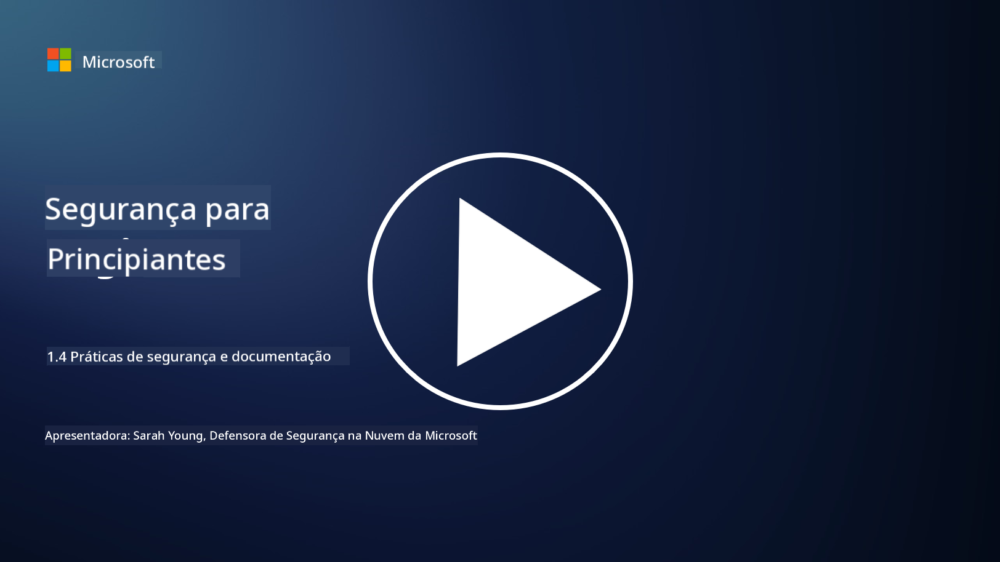

<!--
CO_OP_TRANSLATOR_METADATA:
{
  "original_hash": "d33500902124e52870935bdce4546fcc",
  "translation_date": "2025-09-03T17:25:56+00:00",
  "source_file": "1.4 Security practices and documentation.md",
  "language_code": "pt"
}
-->
# Práticas de segurança e documentação

Pode ser que já tenha ouvido as expressões “política de segurança”, “norma de segurança”, etc., mas a realidade é que muitos profissionais de cibersegurança não as utilizam corretamente. Nesta secção, vamos explicar o que cada uma destas expressões significa e por que motivo uma organização as utiliza.

## Introdução

Nesta lição, vamos abordar:

- O que é uma política de segurança?
  
- O que é uma norma de segurança?

- O que é uma linha de base de segurança?

- O que é uma diretriz de segurança?

- O que é um procedimento de segurança?

- O que são leis e regulamentos no contexto da cibersegurança?

Estes termos são frequentemente utilizados no contexto da cibersegurança para definir diferentes níveis de documentação e práticas de segurança dentro de uma organização. Vamos esclarecer cada termo:

## O que é uma política de segurança?

Uma política de segurança é um documento de alto nível que descreve os objetivos, princípios e diretrizes gerais de segurança de uma organização. Fornece um quadro para a tomada de decisões relacionadas com a segurança e define o tom da postura de segurança da organização. As políticas de segurança geralmente abrangem tópicos como uso aceitável de recursos, proteção de dados, controlo de acesso, resposta a incidentes, entre outros. Uma política é independente de soluções e tecnologias. Um exemplo de política de segurança que muitos conhecem seria a política de uso aceitável de uma organização.

## O que é uma norma de segurança?

Uma norma de segurança é um documento mais detalhado e específico que fornece diretrizes e requisitos para implementar controlos e medidas de segurança dentro de uma organização. As normas são mais concretas e técnicas do que as políticas, oferecendo instruções e recomendações específicas para configurar e manter sistemas, redes e processos de forma a atingir os objetivos de segurança. Um exemplo de norma de segurança seria _“Todos os dados internos devem ser encriptados em repouso e em trânsito.”_

## O que é uma linha de base de segurança?

Uma linha de base de segurança é um conjunto de configurações mínimas de segurança consideradas essenciais para um determinado sistema, aplicação ou ambiente num dado momento. Define um ponto de partida para a segurança que deve ser implementado em todas as instâncias relevantes. As linhas de base de segurança ajudam a garantir consistência e um certo nível de segurança em toda a infraestrutura de TI de uma organização. Um exemplo de linha de base de segurança seria _“As VMs do Azure não devem ter acesso direto à Internet.”_

## O que é uma diretriz de segurança?

Uma diretriz de segurança é um documento que oferece recomendações e orientações quando uma norma de segurança específica não se aplica. As diretrizes procuram lidar com as “zonas cinzentas” que surgem quando uma norma não cobre, ou cobre apenas parcialmente, uma questão.

## O que é um procedimento de segurança?

Um procedimento de segurança é um guia detalhado, passo a passo, que descreve as ações e tarefas específicas que precisam ser realizadas para executar um processo ou tarefa relacionado com a segurança. Os procedimentos são documentos práticos e acionáveis que fornecem uma sequência clara de ações a seguir durante a resposta a incidentes, manutenção de sistemas, integração de utilizadores e outras atividades relacionadas com a segurança. Um exemplo de procedimento de segurança seria _“Quando um incidente de segurança P1 é gerado pelo Microsoft Sentinel, o centro de operações de segurança (SOC) deve informar imediatamente o gestor de segurança de plantão e enviar-lhe os detalhes do incidente.”_

Em resumo, estes termos representam diferentes níveis de documentação e orientação dentro do quadro de cibersegurança de uma organização. As políticas de segurança definem os objetivos de alto nível, as normas fornecem requisitos detalhados, as linhas de base estabelecem configurações mínimas de segurança, as diretrizes oferecem boas práticas e os procedimentos fornecem passos acionáveis para processos de segurança.

## O que são leis/regulamentos no contexto da cibersegurança?

Leis e regulamentos referem-se a quadros legais estabelecidos por governos e entidades reguladoras para definir e aplicar regras, normas e requisitos para proteger sistemas digitais, dados e informações. Estas leis e regulamentos variam consoante a jurisdição e focam-se em diferentes aspetos da cibersegurança, incluindo proteção de dados, privacidade, reporte de incidentes e segurança de infraestruturas críticas. Aqui estão alguns exemplos de leis e regulamentos relacionados com cibersegurança: por exemplo, Regulamento Geral sobre a Proteção de Dados (RGPD), Lei de Portabilidade e Responsabilidade de Seguros de Saúde (HIPAA), Lei de Privacidade do Consumidor da Califórnia (CCPA), Norma de Segurança de Dados da Indústria de Cartões de Pagamento (PCI DSS).

## Leitura adicional

[Modelos de Políticas de Segurança da Informação | SANS Institute](https://www.sans.org/information-security-policy/)

[Conformidade com Leis e Regulamentos de Cibersegurança e Privacidade | NIST](https://www.nist.gov/mep/cybersecurity-resources-manufacturers/compliance-cybersecurity-and-privacy-laws-and-regulations)

---

**Aviso Legal**:  
Este documento foi traduzido utilizando o serviço de tradução por IA [Co-op Translator](https://github.com/Azure/co-op-translator). Embora nos esforcemos para garantir a precisão, é importante ter em conta que traduções automáticas podem conter erros ou imprecisões. O documento original na sua língua nativa deve ser considerado a fonte autoritária. Para informações críticas, recomenda-se a tradução profissional realizada por humanos. Não nos responsabilizamos por quaisquer mal-entendidos ou interpretações incorretas decorrentes da utilização desta tradução.