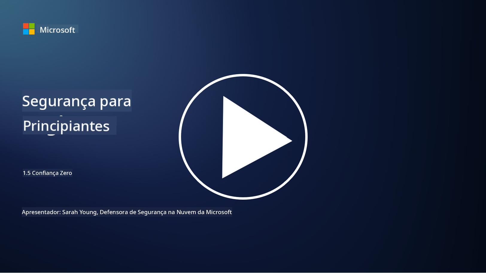

<!--
CO_OP_TRANSLATOR_METADATA:
{
  "original_hash": "75f77f972d2233c584f87c1eb96c983b",
  "translation_date": "2025-09-03T17:17:07+00:00",
  "source_file": "1.5 Zero trust.md",
  "language_code": "pt"
}
-->
# Zero Trust

"Zero trust" é uma expressão muito utilizada atualmente nos círculos de segurança. Mas o que significa? Será apenas uma palavra da moda? Nesta lição, vamos explorar exatamente o que é o conceito de zero trust.

## Introdução

- Nesta lição, vamos abordar:

- O que é zero trust?

- Como o zero trust difere das arquiteturas de segurança tradicionais?

- O que é defesa em profundidade?

## Zero Trust

Zero Trust é uma abordagem de cibersegurança que desafia a noção tradicional de "confiar, mas verificar", assumindo que nenhuma entidade, seja dentro ou fora da rede de uma organização, deve ser confiada de forma inerente. Em vez disso, o Zero Trust defende a verificação de todos os utilizadores, dispositivos e aplicações que tentam aceder a recursos, independentemente da sua localização. O princípio central do Zero Trust é minimizar a "superfície de ataque" e reduzir o impacto potencial de violações de segurança.

Num modelo de Zero Trust, os seguintes princípios são enfatizados:

1. **Verificar Identidade**: Autenticação e autorização são rigorosamente aplicadas a todos os utilizadores e dispositivos, independentemente da sua localização. Lembre-se de que uma identidade não é necessariamente humana: pode ser um dispositivo, uma aplicação, etc.

2. **Privilégio Mínimo**: Utilizadores e dispositivos recebem o nível mínimo de acesso necessário para realizar as suas tarefas, reduzindo os danos potenciais em caso de comprometimento.

3. **Microsegmentação**: Os recursos da rede são divididos em segmentos menores para limitar o movimento lateral dentro da rede em caso de violação.

4. **Monitorização Contínua**: Monitorização e análise contínuas do comportamento de utilizadores e dispositivos são realizadas para detetar anomalias e potenciais ameaças. Técnicas modernas de monitorização também utilizam aprendizagem automática, IA e inteligência de ameaças para fornecer detalhes e contexto adicionais.

5. **Encriptação de Dados**: Os dados são encriptados tanto em trânsito como em repouso para evitar acessos não autorizados.

6. **Controlo de Acesso Rigoroso**: Os controlos de acesso são aplicados com base no contexto, como funções de utilizador, estado do dispositivo e localização na rede.

A Microsoft divide o conceito de zero trust em cinco pilares, que discutiremos numa lição posterior.

## Diferenças em relação às Arquiteturas de Segurança Tradicionais

Zero Trust difere das arquiteturas de segurança tradicionais, como os modelos baseados em perímetro, de várias formas:

1. **Perímetro vs. Foco na Identidade**: Os modelos tradicionais concentram-se em proteger o perímetro da rede, assumindo que utilizadores e dispositivos internos podem ser confiáveis uma vez dentro. Zero Trust, por outro lado, assume que as ameaças podem surgir tanto de dentro como de fora da rede e aplica controlos rigorosos baseados na identidade.

2. **Confiança Implícita vs. Explícita**: Os modelos tradicionais confiam implicitamente em dispositivos e utilizadores dentro da rede até que se prove o contrário. Zero Trust verifica explicitamente identidades e monitoriza continuamente para detetar anomalias.

3. **Rede Plana vs. Segmentada**: As arquiteturas tradicionais frequentemente envolvem redes planas onde os utilizadores internos têm acesso amplo. Zero Trust defende a segmentação da rede em zonas menores e isoladas para conter possíveis violações.

4. **Reativo vs. Proativo**: A segurança tradicional muitas vezes depende de medidas reativas, como firewalls de perímetro e deteção de intrusões. Zero Trust adota uma abordagem proativa, assumindo que as violações são prováveis e minimizando o seu impacto.

## Defesa em Profundidade

Defesa em profundidade, também conhecida como segurança em camadas, é uma estratégia de cibersegurança que envolve a implementação de múltiplas camadas de controlos e medidas de segurança para proteger os ativos de uma organização. O objetivo é criar camadas sobrepostas de defesa, de modo que, se uma camada for comprometida, outras ainda possam oferecer proteção. Cada camada foca-se num aspeto diferente da segurança e aumenta a postura geral de segurança de uma organização.

A defesa em profundidade envolve uma combinação de medidas técnicas, procedimentais e físicas de segurança. Estas podem incluir firewalls, sistemas de deteção de intrusões, controlos de acesso, encriptação, formação de utilizadores, políticas de segurança e muito mais. A ideia é criar múltiplas barreiras que, em conjunto, dificultem a penetração dos sistemas e redes de uma organização por parte de atacantes. Este conceito também é conhecido como o modelo "queijo suíço", utilizado na prevenção de acidentes em outras indústrias (por exemplo, transportes).

## Leitura adicional

[O que é Zero Trust?](https://learn.microsoft.com/security/zero-trust/zero-trust-overview?WT.mc_id=academic-96948-sayoung)

[Evolução do Zero Trust – Documento de Posição da Microsoft](https://query.prod.cms.rt.microsoft.com/cms/api/am/binary/RWJJdT?WT.mc_id=academic-96948-sayoung)

[Zero Trust e BeyondCorp Google Cloud | Blog do Google Cloud](https://cloud.google.com/blog/topics/developers-practitioners/zero-trust-and-beyondcorp-google-cloud)

---

**Aviso Legal**:  
Este documento foi traduzido utilizando o serviço de tradução por IA [Co-op Translator](https://github.com/Azure/co-op-translator). Embora nos esforcemos para garantir a precisão, é importante ter em conta que traduções automáticas podem conter erros ou imprecisões. O documento original na sua língua nativa deve ser considerado a fonte autoritária. Para informações críticas, recomenda-se a tradução profissional realizada por humanos. Não nos responsabilizamos por quaisquer mal-entendidos ou interpretações incorretas decorrentes da utilização desta tradução.