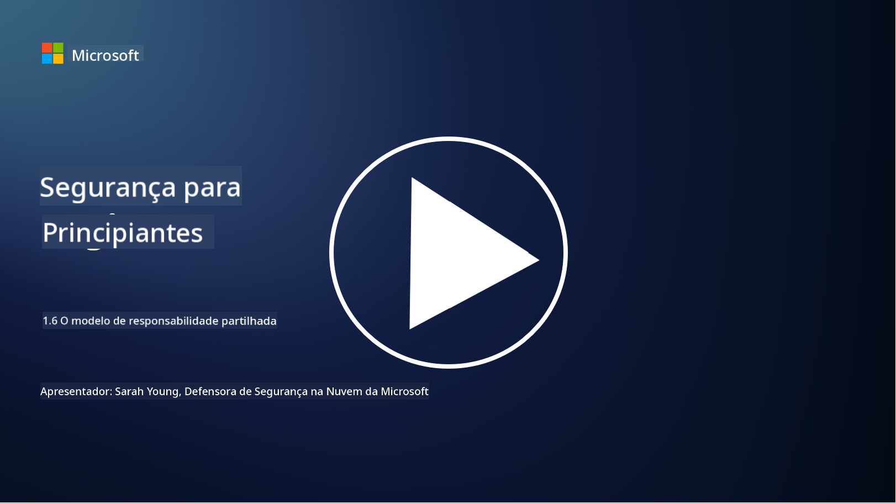

<!--
CO_OP_TRANSLATOR_METADATA:
{
  "original_hash": "a48db640d80c786b928ca178c414f084",
  "translation_date": "2025-09-03T17:27:37+00:00",
  "source_file": "1.6 Shared responsibility model.md",
  "language_code": "pt"
}
-->
# O modelo de responsabilidade partilhada

Responsabilidade partilhada é um conceito mais recente na área de TI que surgiu com o advento da computação em nuvem. Do ponto de vista da cibersegurança, é fundamental compreender quem está a fornecer quais controlos de segurança para evitar lacunas na defesa.

## Introdução

Nesta lição, iremos abordar:

 - O que é responsabilidade partilhada no contexto da cibersegurança?
   
 - Qual é a diferença na responsabilidade partilhada pelos controlos de segurança
   entre IaaS, PaaS e SaaS?

   

 - Onde pode encontrar informações sobre os controlos de segurança que a sua plataforma de nuvem fornece?

   
 

 - O que significa “confiar, mas verificar”?

## O que é responsabilidade partilhada no contexto da cibersegurança?

Responsabilidade partilhada na cibersegurança refere-se à distribuição de responsabilidades de segurança entre um fornecedor de serviços de nuvem (CSP) e os seus clientes. Em ambientes de computação em nuvem, como Infraestrutura como Serviço (IaaS), Plataforma como Serviço (PaaS) e Software como Serviço (SaaS), tanto o CSP como o cliente têm papéis a desempenhar para garantir a segurança dos dados, aplicações e sistemas.

## Qual é a diferença na responsabilidade partilhada pelos controlos de segurança entre IaaS, PaaS e SaaS?

A divisão de responsabilidades geralmente depende do tipo de serviço de nuvem utilizado:

 - **IaaS (Infraestrutura como Serviço)**: O CSP fornece a infraestrutura básica (servidores, rede, armazenamento), enquanto o cliente é responsável por gerir os sistemas operativos, aplicações e configurações de segurança nessa infraestrutura.
   
   
 - **PaaS (Plataforma como Serviço):** O CSP oferece uma plataforma onde os clientes podem construir e implementar aplicações. O CSP gere a infraestrutura subjacente, e o cliente foca-se no desenvolvimento de aplicações e na segurança dos dados.

   

 - **SaaS (Software como Serviço):** O CSP fornece aplicações totalmente funcionais acessíveis pela internet. Neste caso, o CSP é responsável pela segurança da aplicação e da infraestrutura, enquanto o cliente gere o acesso dos utilizadores e o uso dos dados.

Compreender a responsabilidade partilhada é essencial porque esclarece quais aspetos de segurança são cobertos pelo CSP e quais devem ser tratados pelo cliente. Isto ajuda a evitar mal-entendidos e garante que as medidas de segurança sejam implementadas de forma holística.

## Onde pode encontrar informações sobre os controlos de segurança que a sua plataforma de nuvem fornece?

Para descobrir quais controlos de segurança a sua plataforma de nuvem fornece, deve consultar a documentação e os recursos do fornecedor de serviços de nuvem. Estes incluem:

 - **Website e documentação do CSP**: O website do CSP terá informações sobre as funcionalidades e controlos de segurança oferecidos como parte dos seus serviços. Os CSPs geralmente disponibilizam documentação detalhada que explica as suas práticas de segurança, controlos e recomendações. Isto pode incluir whitepapers, guias de segurança e documentação técnica.
   
 - **Avaliações e auditorias de segurança**: A maioria dos CSPs submete os seus controlos de segurança a avaliações realizadas por especialistas independentes e organizações de segurança. Estas análises podem fornecer informações sobre a qualidade das medidas de segurança do CSP. Por vezes, isto resulta na obtenção de certificados de conformidade de segurança (ver próximo ponto).
 - **Certificações de conformidade de segurança**: A maioria dos CSPs obtém certificações como ISO:27001, SOC 2 e FedRAMP, entre outras. Estas certificações demonstram que o fornecedor cumpre normas específicas de segurança e conformidade.

Lembre-se de que o nível de detalhe e a disponibilidade de informações podem variar entre os fornecedores de nuvem. Certifique-se sempre de consultar recursos oficiais e atualizados fornecidos pelo CSP para tomar decisões informadas sobre a segurança dos seus ativos na nuvem.

## O que significa “confiar, mas verificar”?

No contexto de utilização de um CSP, software de terceiros ou outro serviço de segurança de TI, uma organização pode inicialmente confiar nas declarações do fornecedor sobre as medidas de segurança. No entanto, para garantir verdadeiramente a segurança dos seus dados e sistemas, deve verificar essas declarações através de avaliações de segurança, testes de penetração e revisão dos controlos de segurança da entidade externa antes de integrar completamente o software ou serviço nas suas operações. Todas as pessoas e organizações devem procurar confiar, mas verificar os controlos de segurança pelos quais não são responsáveis.

## Responsabilidade partilhada dentro de uma organização

Lembre-se de que a responsabilidade partilhada pela segurança dentro de uma organização entre diferentes equipas também deve ser considerada. A equipa de segurança raramente implementará todos os controlos sozinha e precisará de colaborar com equipas de operações, desenvolvedores e outras partes do negócio para implementar todos os controlos de segurança necessários para manter a organização segura.

## Leitura adicional
- [Shared responsibility in the cloud - Microsoft Azure | Microsoft Learn](https://learn.microsoft.com/azure/security/fundamentals/shared-responsibility?WT.mc_id=academic-96948-sayoung)
- [What is shared responsibility model? – Definition from TechTarget.com](https://www.techtarget.com/searchcloudcomputing/definition/shared-responsibility-model)
- [The shared responsibility model explained and what it means for cloud security | CSO Online](https://www.csoonline.com/article/570779/the-shared-responsibility-model-explained-and-what-it-means-for-cloud-security.html)
- [Shared Responsibility for Cloud Security: What You Need to Know (cisecurity.org)](https://www.cisecurity.org/insights/blog/shared-responsibility-cloud-security-what-you-need-to-know)

---

**Aviso Legal**:  
Este documento foi traduzido utilizando o serviço de tradução por IA [Co-op Translator](https://github.com/Azure/co-op-translator). Embora nos esforcemos para garantir a precisão, é importante notar que traduções automáticas podem conter erros ou imprecisões. O documento original na sua língua nativa deve ser considerado a fonte autoritária. Para informações críticas, recomenda-se a tradução profissional realizada por humanos. Não nos responsabilizamos por quaisquer mal-entendidos ou interpretações incorretas decorrentes da utilização desta tradução.