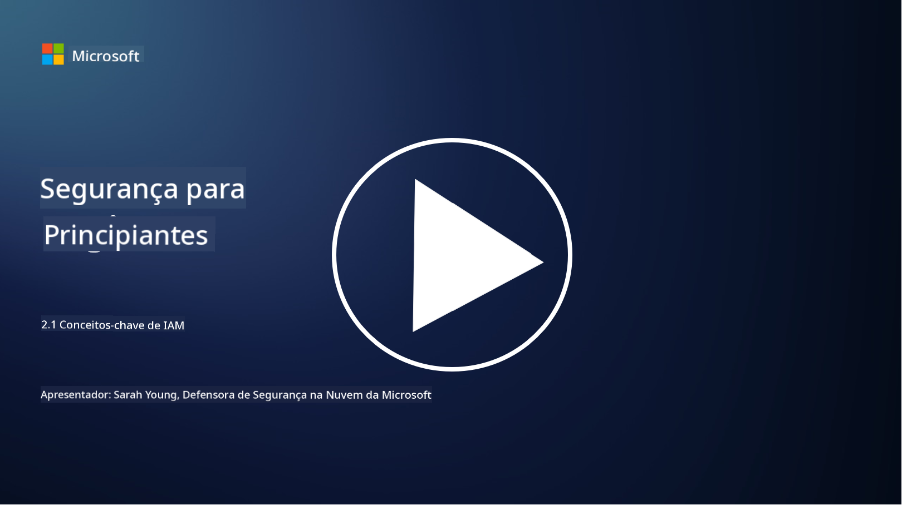

<!--
CO_OP_TRANSLATOR_METADATA:
{
  "original_hash": "2e3864e3d579f0dbb4ac2ec8c5f82acf",
  "translation_date": "2025-09-03T16:56:19+00:00",
  "source_file": "2.1 IAM key concepts.md",
  "language_code": "pt"
}
-->
# Conceitos-chave de IAM

Já alguma vez fez login num computador ou num website? Claro que sim! Isso significa que já utilizou controlos de identidade no seu dia-a-dia. A gestão de identidade e acesso (IAM) é um pilar fundamental da segurança, e vamos aprender mais sobre isso nas próximas lições.

**Introdução**

Nesta lição, vamos abordar:

- O que queremos dizer com gestão de identidade e acesso (IAM) no contexto da cibersegurança?
- O que é o princípio do menor privilégio?
- O que é a segregação de funções?
- O que são autenticação e autorização?

## O que queremos dizer com gestão de identidade e acesso (IAM) no contexto da cibersegurança?

A Gestão de Identidade e Acesso (IAM) refere-se a um conjunto de processos, tecnologias e políticas implementados para garantir que as pessoas certas têm o acesso apropriado aos recursos no ambiente digital de uma organização. A IAM envolve a gestão de identidades digitais (utilizadores, funcionários, parceiros) e o seu acesso a sistemas, aplicações, dados e redes. O objetivo principal da IAM é melhorar a segurança, simplificar o acesso dos utilizadores e garantir conformidade com as políticas e regulamentações da organização. As soluções de IAM geralmente abrangem autenticação de utilizadores, autorização, provisionamento de identidades, controlo de acesso e gestão do ciclo de vida dos utilizadores (assegurando que as contas são eliminadas quando já não estão a ser utilizadas).

## O que é o princípio do menor privilégio?

O princípio do menor privilégio é um conceito fundamental que defende a concessão de apenas os privilégios mínimos necessários para que utilizadores e sistemas desempenhem as suas tarefas ou funções. Este princípio ajuda a limitar os danos potenciais em caso de uma violação de segurança ou ameaça interna. Ao aderir ao princípio do menor privilégio, as organizações reduzem a superfície de ataque e minimizam o risco de acessos não autorizados, violações de dados e uso indevido de privilégios. Na prática, isto significa que os utilizadores têm acesso apenas aos recursos e funcionalidades específicas necessárias para as suas funções, e nada mais. Por exemplo, se apenas precisa de ler um documento, seria excessivo conceder-lhe privilégios administrativos completos sobre esse documento.

## O que é a segregação de funções?

A segregação de funções é um princípio que visa prevenir conflitos de interesse e reduzir o risco de fraudes e erros, distribuindo tarefas e responsabilidades críticas entre diferentes indivíduos dentro de uma organização. No contexto da cibersegurança, a segregação de funções envolve garantir que nenhuma pessoa tenha controlo sobre todos os aspetos de um processo ou sistema crítico. O objetivo é criar um sistema de verificações e equilíbrios que impeça qualquer pessoa de realizar tanto a configuração quanto a aprovação de um processo. Por exemplo, em sistemas financeiros, isso pode significar que a pessoa que insere transações no sistema não deve ser a mesma que aprova essas transações. Isso reduz o risco de ações não autorizadas ou fraudulentas passarem despercebidas.

## O que são autenticação e autorização?

Autenticação e autorização são dois conceitos fundamentais na cibersegurança que desempenham um papel crucial na garantia da segurança e integridade de sistemas informáticos e dados. São frequentemente usados em conjunto para controlar o acesso a recursos e proteger informações sensíveis.

**1. Autenticação**:  
A autenticação é o processo de verificar a identidade de um utilizador, sistema ou entidade que tenta aceder a um sistema informático ou recurso específico. Garante que a identidade reivindicada é genuína e precisa. Os métodos de autenticação geralmente envolvem o uso de um ou mais dos seguintes fatores:

   a. Algo que sabe: Inclui palavras-passe, PINs ou outros conhecimentos secretos que apenas o utilizador autorizado deve possuir.  
   b. Algo que tem: Envolve tokens físicos ou dispositivos como cartões inteligentes, tokens de segurança ou telemóveis usados para confirmar a identidade do utilizador.  
   c. Algo que é: Refere-se a fatores biométricos como impressões digitais, reconhecimento facial ou scans da retina, que são únicos para cada indivíduo.  

Os mecanismos de autenticação são usados para confirmar que um utilizador é quem afirma ser antes de permitir o acesso a um sistema ou recurso. Isso ajuda a prevenir acessos não autorizados e garante que apenas utilizadores legítimos possam realizar ações dentro de um sistema.

**2. Autorização**:  
A autorização é o processo de conceder ou negar permissões e privilégios específicos a utilizadores ou entidades autenticados, uma vez que a sua identidade tenha sido verificada. Determina quais ações ou operações um utilizador está autorizado a realizar dentro de um sistema ou em recursos específicos. A autorização é frequentemente baseada em políticas predefinidas, regras de controlo de acesso e funções atribuídas aos utilizadores.

A autorização pode ser vista como a resposta à pergunta: "O que pode um utilizador autenticado fazer?" Envolve a definição e aplicação de políticas de controlo de acesso para proteger dados e recursos sensíveis contra acessos ou modificações não autorizados.

**Em resumo:**

- A autenticação estabelece a identidade dos utilizadores ou entidades.  
- A autorização determina quais ações e recursos os utilizadores autenticados podem aceder ou manipular.

## Leituras adicionais

- [Describe identity concepts - Training | Microsoft Learn](https://learn.microsoft.com/training/modules/describe-identity-principles-concepts/?WT.mc_id=academic-96948-sayoung)  
- [Introduction to identity - Microsoft Entra | Microsoft Learn](https://learn.microsoft.com/azure/active-directory/fundamentals/identity-fundamental-concepts?WT.mc_id=academic-96948-sayoung)  
- [What is Identity Access Management (IAM)? | Microsoft Security](https://www.microsoft.com/security/business/security-101/what-is-identity-access-management-iam?WT.mc_id=academic-96948-sayoung)  
- [What is IAM? Identity and access management explained | CSO Online](https://www.csoonline.com/article/518296/what-is-iam-identity-and-access-management-explained.html)  
- [What is IAM? (auth0.com)](https://auth0.com/blog/what-is-iam/)  
- [Security+: implementing Identity and Access Management (IAM) controls [updated 2021] | Infosec (infosecinstitute.com)](https://resources.infosecinstitute.com/certifications/securityplus/security-implementing-identity-and-access-management-iam-controls/)  
- [least privilege - Glossary | CSRC (nist.gov)](https://csrc.nist.gov/glossary/term/least_privilege)  
- [Security: The Principle of Least Privilege (POLP) - Microsoft Community Hub](https://techcommunity.microsoft.com/t5/azure-sql-blog/security-the-principle-of-least-privilege-polp/ba-p/2067390?WT.mc_id=academic-96948-sayoung)  
- [Principle of least privilege | CERT NZ](https://www.cert.govt.nz/it-specialists/critical-controls/principle-of-least-privilege/)  
- [Why is separation of duties required by NIST 800-171 and CMMC? - (totem.tech)](https://www.totem.tech/cmmc-separation-of-duties/)  

---

**Aviso Legal**:  
Este documento foi traduzido utilizando o serviço de tradução por IA [Co-op Translator](https://github.com/Azure/co-op-translator). Embora nos esforcemos para garantir a precisão, é importante notar que traduções automáticas podem conter erros ou imprecisões. O documento original na sua língua nativa deve ser considerado a fonte autoritária. Para informações críticas, recomenda-se a tradução profissional realizada por humanos. Não nos responsabilizamos por quaisquer mal-entendidos ou interpretações incorretas decorrentes da utilização desta tradução.