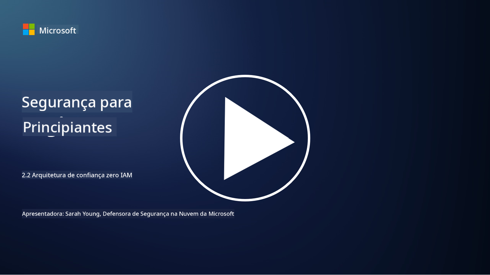

<!--
CO_OP_TRANSLATOR_METADATA:
{
  "original_hash": "4774a978af123f72ebb872199c4c4d4f",
  "translation_date": "2025-09-03T17:15:13+00:00",
  "source_file": "2.2 IAM zero trust architecture.md",
  "language_code": "pt"
}
-->
# Arquitetura de confiança zero para IAM

A identidade é uma parte essencial na implementação de uma arquitetura de confiança zero e na criação de um perímetro para qualquer ambiente de TI. Nesta seção, vamos explorar por que é importante usar controles de identidade para implementar confiança zero.

## Introdução

Nesta lição, vamos abordar:

 - Por que precisamos usar a identidade como nosso perímetro em ambientes modernos de TI?
   
 - Como isso difere das arquiteturas tradicionais de TI?

 - Como a identidade é usada para implementar uma arquitetura de confiança zero?

## Por que precisamos usar a identidade como nosso perímetro em ambientes modernos de TI?

Em ambientes modernos de TI, o conceito tradicional de um perímetro físico (usando ferramentas como firewalls e limites de rede) como a principal linha de defesa contra ameaças cibernéticas está se tornando menos eficaz devido à crescente complexidade da tecnologia, ao aumento do trabalho remoto e à adoção de serviços na nuvem. Em vez disso, as organizações estão migrando para o uso da identidade como o novo perímetro. Isso significa que a segurança gira em torno da verificação e gestão da identidade de utilizadores, dispositivos e aplicações que tentam acessar recursos, independentemente da sua localização física.

Aqui está o motivo pelo qual usar a identidade como perímetro é crucial em ambientes modernos de TI:

**Trabalho Remoto**: Com o trabalho remoto e dispositivos móveis tornando-se a norma, os utilizadores podem acessar recursos de vários locais e dispositivos. A abordagem tradicional de perímetro não funciona quando os utilizadores não estão mais confinados a um escritório físico.

**Ambientes na Nuvem e Híbridos**: As organizações estão adotando cada vez mais serviços na nuvem e ambientes híbridos. Os dados e as aplicações não estão mais localizados exclusivamente nas instalações da organização, tornando as defesas tradicionais de perímetro menos relevantes.

**Segurança de Confiança Zero**: O conceito de segurança de confiança zero assume que nenhuma entidade, seja dentro ou fora da rede, deve ser automaticamente confiável. A identidade torna-se a base para verificar pedidos de acesso, independentemente de onde eles se originam.

**Paisagem de Ameaças**: As ameaças cibernéticas estão evoluindo, e os atacantes estão encontrando formas de contornar as defesas tradicionais de perímetro. Phishing, engenharia social e ameaças internas frequentemente exploram vulnerabilidades humanas em vez de tentar violar perímetros de rede.

**Abordagem Centrada em Dados**: Proteger dados sensíveis é fundamental. Ao focar na identidade, as organizações podem controlar quem acessa quais dados, reduzindo o risco de violações de dados.

## Como isso difere das arquiteturas tradicionais de TI?

As arquiteturas tradicionais de TI dependiam fortemente de modelos de segurança baseados em perímetro, onde firewalls e limites de rede desempenhavam um papel significativo na proteção contra ameaças. As principais diferenças entre abordagens tradicionais e centradas na identidade são:

|      Aspeto                |      Arquiteturas Tradicionais de TI                                                               |      Abordagem Centrada na Identidade                                                                         |
|----------------------------|----------------------------------------------------------------------------------------------------|---------------------------------------------------------------------------------------------------------------|
|     Foco                  |     Foco no Perímetro: Dependência de defesas de perímetro como firewalls e controle de acesso.     |     Foco na Verificação de Identidade: Mudança de limites de rede para verificação de identidade de utilizadores/dispositivos. |
|     Localização           |     Dependência de Localização: Segurança vinculada a locais físicos e limites de rede.            |     Independência de Localização: Segurança não vinculada a locais específicos; acesso de qualquer lugar.     |
|     Suposição de Confiança |     Confiança Presumida: Confiança presumida dentro do perímetro da rede para utilizadores/dispositivos. |     Abordagem de Confiança Zero: Confiança nunca é presumida; o acesso é verificado com base na identidade e no contexto. |
|     Consideração de Dispositivos |     Diversidade de Dispositivos: Presunção de que dispositivos dentro do perímetro da rede eram seguros. |     Consciência de Dispositivos: Consideração da saúde e postura de segurança dos dispositivos, independentemente da localização. |
|     Proteção de Dados      |     Proteção de Dados: Foco na proteção de perímetros de rede para proteger dados.                 |     Proteção Centrada em Dados: Foco no controle de acesso a dados com base na identidade e na sensibilidade dos dados. |

## Como a identidade é usada para implementar uma arquitetura de confiança zero?

Em uma arquitetura de confiança zero, o princípio fundamental é nunca confiar automaticamente em nenhuma entidade, independentemente de estar dentro ou fora do perímetro da rede. A identidade desempenha um papel central na implementação de uma abordagem de confiança zero, permitindo a verificação contínua das entidades que tentam acessar recursos. Os controles modernos de segurança de identidade garantem que cada utilizador, dispositivo, aplicação e serviço que busca acesso a recursos seja devidamente identificado e autenticado antes que o acesso seja concedido. Isso envolve a verificação da identidade digital por meio de métodos como combinações de nome de utilizador/senha, autenticação multifator (MFA), biometria e outros mecanismos de autenticação robustos.

## Leitura adicional

- [Securing identity with Zero Trust | Microsoft Learn](https://learn.microsoft.com/security/zero-trust/deploy/identity?WT.mc_id=academic-96948-sayoung)
- [Zero Trust Principles and Guidance for Identity and Access | CSA (cloudsecurityalliance.org)](https://cloudsecurityalliance.org/artifacts/zero-trust-principles-and-guidance-for-iam/)
- [Zero Trust Identity Controls - Essentials Series - Episode 2 - YouTube](https://www.youtube.com/watch?v=fQZQznIKcGM&list=PLXtHYVsvn_b_gtX1-NB62wNervQx1Fhp4&index=13)

---

**Aviso Legal**:  
Este documento foi traduzido utilizando o serviço de tradução por IA [Co-op Translator](https://github.com/Azure/co-op-translator). Embora nos esforcemos para garantir a precisão, é importante notar que traduções automáticas podem conter erros ou imprecisões. O documento original na sua língua nativa deve ser considerado a fonte autoritária. Para informações críticas, recomenda-se a tradução profissional realizada por humanos. Não nos responsabilizamos por quaisquer mal-entendidos ou interpretações incorretas decorrentes da utilização desta tradução.