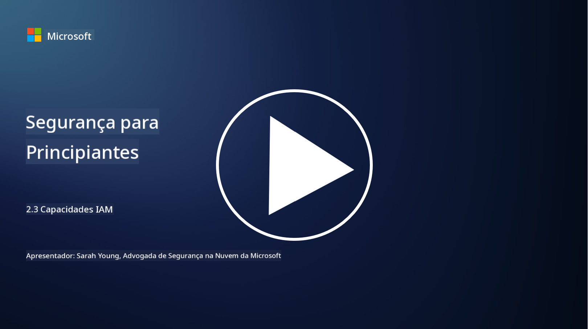

<!--
CO_OP_TRANSLATOR_METADATA:
{
  "original_hash": "bf0b8a54f2c69951744df5a94bc923f7",
  "translation_date": "2025-09-03T17:50:58+00:00",
  "source_file": "2.3 IAM capabilities.md",
  "language_code": "pt"
}
-->
# Capacidades IAM

Nesta secção, vamos explorar mais detalhes sobre as ferramentas e capacidades principais utilizadas na segurança de identidades.

## Introdução

Nesta lição, vamos abordar:

 - O que é um serviço de diretório?
      
     
    
 - Que tipo de capacidades podem ser utilizadas para proteger identidades?
>
>        Autenticação Multi-Fator (MFA)
> 
>        Single Sign-On (SSO)
> 
>        Controlo de Acesso Baseado em Funções (RBAC)
> 
>        Autenticação Adaptativa
> 
>        Autenticação Biométrica
> 
>        Gestão de Acessos Privilegiados (PAM)
> 
>        Governança e Administração de Identidades (IGA)
> 
>        Análise Comportamental

## O que é um serviço de diretório?

Um serviço de diretório é uma base de dados especializada que armazena e gere informações sobre recursos de rede, incluindo utilizadores, grupos, dispositivos, aplicações e outros objetos. Funciona como um repositório centralizado de dados relacionados a identidades e acessos, permitindo que as organizações gerenciem e controlem autenticação de utilizadores, autorização e outras tarefas relacionadas com segurança de forma eficiente.

Os serviços de diretório desempenham um papel crucial nos ambientes de TI modernos ao fornecerem uma base para soluções de gestão de identidades e acessos (IAM). Facilitam o acesso seguro a recursos, aplicam políticas de acesso e simplificam tarefas administrativas. Um dos serviços de diretório mais conhecidos é o Microsoft Active Directory, mas existem outras soluções como diretórios LDAP (Lightweight Directory Access Protocol) que têm propósitos semelhantes.

As principais funções e características de um serviço de diretório no contexto da cibersegurança incluem:

 - **Autenticação de Utilizadores**: Os serviços de diretório validam as credenciais dos utilizadores (como nomes de utilizador e palavras-passe) para garantir que apenas utilizadores autorizados possam aceder à rede e aos seus recursos.
 - **Autorização de Utilizadores**: Determinam o nível de acesso que cada utilizador tem com base no seu papel, pertença a grupos e outros atributos. Isto garante que os utilizadores só acedam aos recursos que lhes são permitidos.
 - **Gestão de Grupos**: Os serviços de diretório permitem que os administradores organizem utilizadores em grupos lógicos, simplificando a gestão de controlo de acessos. As permissões podem ser atribuídas a grupos em vez de utilizadores individuais.
 - **Políticas de Palavras-Passe**: Aplicam regras de complexidade e expiração de palavras-passe, aumentando a segurança das contas de utilizadores.
 - **Single Sign-On (SSO)**: Alguns serviços de diretório suportam SSO, permitindo que os utilizadores acedam a várias aplicações e serviços com um único conjunto de credenciais.
 - **Gestão Centralizada de Utilizadores**: Os serviços de diretório centralizam as informações dos utilizadores, facilitando a gestão de contas, perfis e atributos a partir de um único local.
 - **Auditoria e Registo**: Podem registar atividades de autenticação e acesso de utilizadores, auxiliando em auditorias de segurança e esforços de conformidade.

## Que tipo de capacidades podem ser utilizadas para proteger identidades?

**Autenticação Multi-Fator (MFA)**

A MFA exige que os utilizadores forneçam múltiplas formas de verificação antes de conceder acesso. Normalmente inclui algo que o utilizador sabe (palavra-passe), algo que o utilizador possui (smartphone ou token de segurança) e algo que o utilizador é (dados biométricos como impressão digital ou reconhecimento facial).

**Single Sign-On (SSO)**

O SSO permite que os utilizadores acedam a várias aplicações e sistemas com um único conjunto de credenciais. Isto melhora a experiência do utilizador e reduz os riscos associados à gestão de múltiplas palavras-passe.

**Controlo de Acesso Baseado em Funções (RBAC)**

O RBAC atribui permissões com base em funções predefinidas. Os utilizadores recebem acesso com base nas suas funções dentro de uma organização.

**Autenticação Adaptativa**

A autenticação adaptativa avalia fatores de risco como localização, dispositivo, hora de acesso e comportamento do utilizador para ajustar dinamicamente o nível de autenticação necessário. Se um pedido parecer suspeito, podem ser acionados passos adicionais de autenticação.

**Autenticação Biométrica**

A autenticação biométrica utiliza características biológicas únicas como impressões digitais, traços faciais, padrões de voz e até características comportamentais como velocidade de digitação para verificação de identidade.

**Gestão de Acessos Privilegiados (PAM)**

A PAM foca-se em proteger o acesso a sistemas e dados críticos, aplicando controlos rigorosos em contas privilegiadas. Inclui funcionalidades como acesso just-in-time e monitorização de sessões.

**Governança e Administração de Identidades (IGA)**

As soluções IGA gerem identidades de utilizadores e o seu acesso a recursos ao longo do ciclo de vida. Isto inclui integração, provisionamento, controlo de acesso baseado em funções e desprovisionamento.

**Análise Comportamental**

A análise comportamental monitoriza o comportamento dos utilizadores e estabelece padrões de referência. Desvios da norma podem gerar alertas para investigação adicional.

# Leitura adicional
- [Documentação sobre fundamentos do Azure Active Directory - Microsoft Entra | Microsoft Learn](https://learn.microsoft.com/azure/active-directory/fundamentals/?WT.mc_id=academic-96948-sayoung)
- [O que é o Azure Active Directory? - Microsoft Entra | Microsoft Learn](https://learn.microsoft.com/azure/active-directory/fundamentals/whatis?WT.mc_id=academic-96948-sayoung)
- [Gerir a sua infraestrutura de identidade multi-cloud com Microsoft Entra - YouTube](https://www.youtube.com/watch?v=9qQiq3wTS2Y&list=PLXtHYVsvn_b_gtX1-NB62wNervQx1Fhp4&index=18)

---

**Aviso Legal**:  
Este documento foi traduzido utilizando o serviço de tradução por IA [Co-op Translator](https://github.com/Azure/co-op-translator). Embora nos esforcemos para garantir a precisão, é importante notar que traduções automáticas podem conter erros ou imprecisões. O documento original na sua língua nativa deve ser considerado a fonte autoritária. Para informações críticas, recomenda-se a tradução profissional realizada por humanos. Não nos responsabilizamos por quaisquer mal-entendidos ou interpretações incorretas decorrentes da utilização desta tradução.