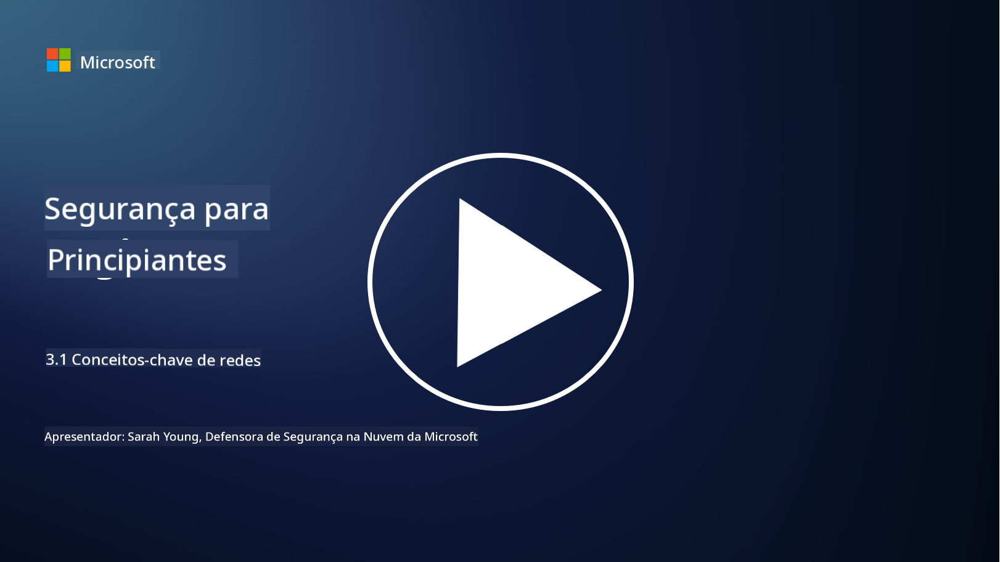
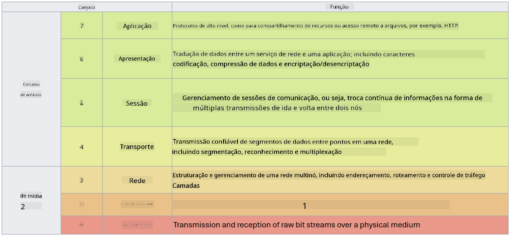

<!--
CO_OP_TRANSLATOR_METADATA:
{
  "original_hash": "252724eceeb183fb9018f88c5e1a3f0c",
  "translation_date": "2025-09-03T17:48:56+00:00",
  "source_file": "3.1 Networking key concepts.md",
  "language_code": "pt"
}
-->
# Conceitos-chave de redes

Se já trabalhou em TI, é provável que tenha tido contacto com conceitos de redes. Embora utilizemos a identidade como o nosso principal controlo de perímetro em ambientes modernos, isso não significa que os controlos de rede sejam redundantes. Apesar de ser um tema vasto, nesta lição iremos abordar alguns conceitos-chave de redes.

Nesta lição, iremos abordar:

 - O que é endereçamento IP?
   
 - O que é o modelo OSI?

 

 - O que é TCP/UDP?

   
 

 - O que são números de porta?

   
  

 - O que é encriptação em repouso e em trânsito?

## O que é endereçamento IP?

Endereçamento IP, ou endereçamento de Protocolo de Internet, é um rótulo numérico atribuído a cada dispositivo conectado a uma rede de computadores que utiliza o Protocolo de Internet para comunicação. Serve como um identificador único para dispositivos dentro de uma rede, permitindo que enviem e recebam dados através da internet ou de outras redes interligadas. Existem duas versões principais de endereçamento IP: IPv4 (Protocolo de Internet versão 4) e IPv6 (Protocolo de Internet versão 6). Um endereço IP é normalmente representado no formato IPv4 (ex.: 192.168.1.1) ou no formato IPv6 (ex.: 2001:0db8:85a3:0000:0000:8a2e:0370:7334).

## O que é o modelo OSI?

O modelo OSI (Interconexão de Sistemas Abertos) é uma estrutura conceptual que padroniza as funções de um sistema de comunicação em sete camadas distintas. Cada camada realiza tarefas específicas e comunica com as camadas adjacentes para garantir uma comunicação de dados eficiente e fiável entre dispositivos numa rede. As camadas, de baixo para cima, são as seguintes:

 1. Camada Física
    
 
 2. Camada de Enlace de Dados

    
    

 1. Camada de Rede

    
   

 1. Camada de Transporte

    

 1. Camada de Sessão

    
   

 1. Camada de Apresentação

    
    

 1. Camada de Aplicação

O modelo OSI fornece uma referência comum para compreender como os protocolos e tecnologias de rede interagem, independentemente das implementações específicas de hardware ou software.

_ref: https://en.wikipedia.org/wiki/OSI_model_

## O que é TCP/UDP?

TCP (Protocolo de Controlo de Transmissão) e UDP (Protocolo de Datagramas de Utilizador) são dois protocolos fundamentais da camada de transporte utilizados em redes de computadores para facilitar a comunicação entre dispositivos através da internet ou dentro de uma rede local. São responsáveis por dividir os dados em pacotes para transmissão e, posteriormente, reconstituir esses pacotes nos dados originais no lado do receptor. No entanto, diferem nas suas características e casos de uso.

**TCP (Protocolo de Controlo de Transmissão)**:

O TCP é um protocolo orientado à conexão que proporciona entrega de dados fiável e ordenada entre dispositivos. Estabelece uma conexão entre o emissor e o receptor antes de iniciar a troca de dados. O TCP garante que os pacotes de dados cheguem na ordem correta e pode lidar com retransmissão de pacotes perdidos para assegurar a integridade e completude dos dados. Isto torna o TCP adequado para aplicações que requerem entrega fiável de dados, como navegação na web, email, transferência de ficheiros (FTP) e comunicação com bases de dados.

**UDP (Protocolo de Datagramas de Utilizador)**:

O UDP é um protocolo sem conexão que oferece transmissão de dados mais rápida, mas não proporciona o mesmo nível de fiabilidade que o TCP. Não estabelece uma conexão formal antes de enviar dados e não inclui mecanismos para reconhecer ou retransmitir pacotes perdidos. O UDP é adequado para aplicações onde a velocidade e eficiência são mais importantes do que a entrega garantida, como comunicação em tempo real, streaming de media, jogos online e consultas DNS.

Em resumo, o TCP prioriza fiabilidade e entrega ordenada, tornando-o adequado para aplicações que requerem precisão nos dados, enquanto o UDP enfatiza velocidade e eficiência, sendo apropriado para aplicações onde pequenas perdas de dados ou reordenamento são aceitáveis em troca de menor latência. A escolha entre TCP e UDP depende dos requisitos específicos da aplicação ou serviço utilizado.

## O que são números de porta?

Em redes, um número de porta é um identificador numérico utilizado para diferenciar entre diferentes serviços ou aplicações que estão a ser executados num único dispositivo dentro de uma rede. As portas ajudam a encaminhar dados recebidos para a aplicação apropriada. Os números de porta são inteiros sem sinal de 16 bits, o que significa que variam de 0 a 65535. São divididos em três intervalos:

- Portas Bem Conhecidas (0-1023): Reservadas para serviços padrão como HTTP (porta 80) e FTP (porta 21).

- Portas Registadas (1024-49151): Utilizadas para aplicações e serviços que não fazem parte do intervalo bem conhecido, mas que estão oficialmente registadas.

- Portas Dinâmicas/Privadas (49152-65535): Disponíveis para uso temporário ou privado por aplicações.

## O que é encriptação em repouso e em trânsito?

Encriptação é o processo de converter dados num formato seguro para protegê-los contra acesso não autorizado ou manipulação. A encriptação pode ser aplicada tanto a dados "em repouso" (quando armazenados num dispositivo ou servidor) como "em trânsito" (quando transmitidos entre dispositivos ou através de redes).

Encriptação em Repouso: Envolve encriptar dados que estão armazenados em dispositivos, servidores ou sistemas de armazenamento. Mesmo que um atacante obtenha acesso físico ao meio de armazenamento, não poderá aceder aos dados sem as chaves de encriptação. Isto é crucial para proteger dados sensíveis em caso de roubo de dispositivos, violações de dados ou acesso não autorizado.

Encriptação em Trânsito: Envolve encriptar dados enquanto viajam entre dispositivos ou através de redes. Isto previne escutas e intercepções não autorizadas de dados durante a transmissão. Protocolos comuns para encriptação em trânsito incluem HTTPS para comunicação web e TLS/SSL para proteger vários tipos de tráfego de rede.

## Leitura adicional
- [How Do IP Addresses Work? (howtogeek.com)](https://www.howtogeek.com/341307/how-do-ip-addresses-work/)
- [Understanding IP Address: An Introductory Guide (geekflare.com)](https://geekflare.com/understanding-ip-address/)
- [What is the OSI model? The 7 layers of OSI explained (techtarget.com)](https://www.techtarget.com/searchnetworking/definition/OSI)
- [The OSI Model – The 7 Layers of Networking Explained in Plain English (freecodecamp.org)](https://www.freecodecamp.org/news/osi-model-networking-layers-explained-in-plain-english/)
- [TCP/IP protocols - IBM Documentation](https://www.ibm.com/docs/en/aix/7.3?topic=protocol-tcpip-protocols)
- [Common Ports Cheat Sheet: The Ultimate Ports & Protocols List (stationx.net)](https://www.stationx.net/common-ports-cheat-sheet/)
- [Azure Data Encryption-at-Rest - Azure Security | Microsoft Learn](https://learn.microsoft.com/azure/security/fundamentals/encryption-atrest?WT.mc_id=academic-96948-sayoung)

---

**Aviso Legal**:  
Este documento foi traduzido utilizando o serviço de tradução por IA [Co-op Translator](https://github.com/Azure/co-op-translator). Embora nos esforcemos para garantir a precisão, é importante ter em conta que traduções automáticas podem conter erros ou imprecisões. O documento original na sua língua nativa deve ser considerado a fonte autoritária. Para informações críticas, recomenda-se a tradução profissional realizada por humanos. Não nos responsabilizamos por quaisquer mal-entendidos ou interpretações incorretas decorrentes da utilização desta tradução.