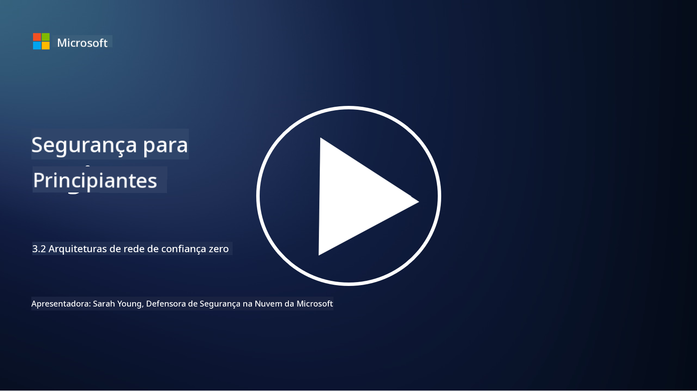

<!--
CO_OP_TRANSLATOR_METADATA:
{
  "original_hash": "680d6e14d9d33fc471c22f44679713f8",
  "translation_date": "2025-09-03T17:30:52+00:00",
  "source_file": "3.2 Networking zero trust architecture.md",
  "language_code": "pt"
}
-->
# Arquiteturas de confiança zero em redes

A rede fornece uma camada crucial nos controlos de confiança zero. Nesta lição, vamos aprender mais sobre:

- O que é segmentação de rede?  
- Como a segmentação de rede ajuda a implementar confiança zero?  
- O que é encriptação de ponta a ponta?

## O que é segmentação de rede?

A segmentação de rede é a prática de dividir uma rede em segmentos ou sub-redes menores e isolados. Cada segmento é separado dos outros, e o acesso entre os segmentos é controlado e restrito com base em políticas de segurança específicas. A segmentação de rede é usada para melhorar a segurança, contendo o impacto de possíveis violações e limitando o movimento lateral de atacantes dentro da rede.

Ao implementar a segmentação de rede, uma organização pode criar "zonas" que separam diferentes tipos de utilizadores, aplicações e dados. Isso reduz a superfície de ataque e minimiza os danos potenciais causados por um incidente de segurança. A segmentação de rede pode ser realizada através de tecnologias como VLANs (redes locais virtuais), firewalls e controlos de acesso.

## Como a segmentação de rede ajuda a implementar confiança zero?

A segmentação de rede está intimamente alinhada com os princípios do modelo de confiança zero. Numa arquitetura de confiança zero, a segmentação de rede ajuda a aplicar o princípio de "privilégio mínimo", garantindo que utilizadores e dispositivos tenham acesso apenas aos recursos e serviços específicos necessários para realizar as suas tarefas. Ao segmentar a rede em zonas menores, as organizações podem implementar controlos de acesso rigorosos, isolar ativos críticos e impedir o movimento lateral de atacantes.

A segmentação de rede também auxilia na aplicação de controlos de acesso baseados em identidade, onde utilizadores e dispositivos são autenticados e autorizados de forma rigorosa antes de acederem a segmentos específicos. Isso evita acessos não autorizados a recursos sensíveis e reduz o impacto potencial de credenciais comprometidas.

## O que é encriptação de ponta a ponta?

A encriptação de ponta a ponta (E2E) é uma medida de segurança que garante que os dados permaneçam encriptados durante toda a sua jornada, desde o remetente até ao destinatário. Neste processo, os dados são encriptados na origem, e apenas o destinatário possui a chave de desencriptação para desbloquear e ler os dados. Os processos de encriptação e desencriptação ocorrem nos pontos finais, tornando extremamente difícil para partes não autorizadas, incluindo fornecedores de serviços e intermediários, acederem aos dados em texto simples.

A encriptação de ponta a ponta oferece um elevado nível de confidencialidade e segurança na transmissão de dados, mesmo que os dados passem por vários sistemas ou redes intermediárias. É frequentemente utilizada em aplicações de mensagens seguras, serviços de email e outras plataformas de comunicação para proteger informações sensíveis contra interceções e acessos não autorizados.

Este método de encriptação garante que, mesmo que atacantes consigam aceder aos dados em trânsito, apenas verão conteúdo encriptado, que é inútil sem a chave de desencriptação. A encriptação de ponta a ponta desempenha um papel crucial na proteção da privacidade dos utilizadores e na salvaguarda de informações sensíveis contra exposição a partes não autorizadas.

## O que é SASE?

SASE significa "Secure Access Service Edge" (Borda de Serviço de Acesso Seguro) e é uma estrutura e arquitetura de cibersegurança que combina segurança de rede e capacidades de rede de área ampla (WAN) num único serviço baseado na nuvem. O SASE foi concebido para fornecer acesso seguro e escalável a recursos de rede, aplicações e dados para utilizadores remotos e móveis, simplificando a gestão de redes e reduzindo a complexidade das arquiteturas tradicionais de rede e segurança.

Características e componentes principais do SASE incluem:

1. **Baseado na Nuvem:** O SASE é fornecido como um serviço na nuvem, o que significa que as funções de segurança e rede são disponibilizadas a partir da nuvem, em vez de depender de hardware e dispositivos tradicionais no local.  

2. **Integração de Segurança e Rede:** O SASE integra vários serviços de segurança, como gateways web seguros (SWG), firewall como serviço (FWaaS), prevenção de perda de dados (DLP), acesso à rede de confiança zero (ZTNA) e otimização de WAN com capacidades de rede de área ampla. Esta integração ajuda a simplificar as operações de segurança e rede.  

3. **Confiança Zero:** O SASE opera com base no princípio de confiança zero, o que significa que aplica controlos de acesso rigorosos e políticas de privilégio mínimo. Utilizadores e dispositivos não são confiáveis por padrão e devem ser autenticados e autorizados antes de acederem a recursos.  

4. **Foco na Identidade:** O SASE concentra-se nas identidades de utilizadores e dispositivos como base para o controlo de acesso. Políticas baseadas em identidade e contexto são usadas para determinar permissões de acesso, e essas políticas adaptam-se dinamicamente com base no comportamento e contexto do utilizador.  

5. **Escalabilidade e Flexibilidade:** O SASE pode escalar facilmente para acomodar um grande número de utilizadores e dispositivos, tornando-o adequado para organizações com necessidades de rede e segurança diversificadas e em constante evolução.  

O SASE é particularmente relevante na era moderna de trabalho remoto e adoção da nuvem, pois oferece uma abordagem abrangente e ágil para proteger e gerir o acesso à rede. Ajuda as organizações a adaptarem-se às mudanças nas exigências de segurança e rede, mantendo um forte foco em modelos de segurança centrados no utilizador e de confiança zero.

## Leitura adicional

- [What Is Network Segmentation? - Cisco](https://www.cisco.com/c/en/us/products/security/what-is-network-segmentation.html#~benefits)  
- [What Is Micro-Segmentation? - Cisco](https://www.cisco.com/c/en/us/products/security/what-is-microsegmentation.html)  
- [Implementing Network Segmentation and Segregation | Cyber.gov.au](https://www.cyber.gov.au/resources-business-and-government/maintaining-devices-and-systems/system-hardening-and-administration/network-hardening/implementing-network-segmentation-and-segregation)  
- [What Is Network Segmentation and Why It Matters | CompTIA](https://www.comptia.org/blog/security-awareness-training-network-segmentation)  
- [Network Segmentation: Concepts and Practices (cmu.edu)](https://insights.sei.cmu.edu/blog/network-segmentation-concepts-and-practices/)  
- [Secure networks with Zero Trust | Microsoft Learn](https://learn.microsoft.com/security/zero-trust/deploy/networks?WT.mc_id=academic-96948-sayoung)  
- [What is end-to-end encryption? | IBM](https://www.ibm.com/topics/end-to-end-encryption)  
- [What Is End-to-End Encryption, and Why Does It Matter? (howtogeek.com)](https://www.howtogeek.com/711656/what-is-end-to-end-encryption-and-why-does-it-matter/)  
- [Definition of Secure Access Service Edge (SASE) - Gartner Information Technology Glossary](https://www.gartner.com/en/information-technology/glossary/secure-access-service-edge-sase)  
- [What Is Secure Access Service Edge (SASE)? | Microsoft Security](https://www.microsoft.com/security/business/security-101/what-is-sase?WT.mc_id=academic-96948-sayoung)  

---

**Aviso Legal**:  
Este documento foi traduzido utilizando o serviço de tradução por IA [Co-op Translator](https://github.com/Azure/co-op-translator). Embora nos esforcemos para garantir a precisão, é importante ter em conta que traduções automáticas podem conter erros ou imprecisões. O documento original na sua língua nativa deve ser considerado a fonte autoritária. Para informações críticas, recomenda-se a tradução profissional realizada por humanos. Não nos responsabilizamos por quaisquer mal-entendidos ou interpretações incorretas decorrentes da utilização desta tradução.