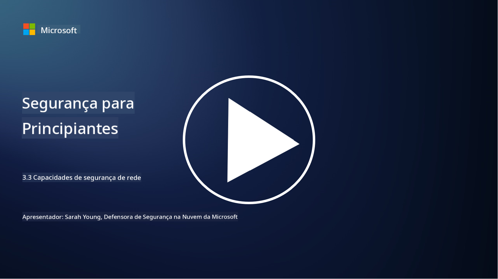

<!--
CO_OP_TRANSLATOR_METADATA:
{
  "original_hash": "c3aba077bb98eebc925dd58d870229ab",
  "translation_date": "2025-09-03T17:12:47+00:00",
  "source_file": "3.3 Network security capabilities.md",
  "language_code": "pt"
}
-->
# Capacidades de segurança de rede

Nesta lição, vamos aprender sobre as seguintes capacidades que podem ser usadas para proteger uma rede:

 - Firewalls tradicionais
 - Firewalls de aplicações web
 - Grupos de segurança na cloud
 - CDN
 - Balanceadores de carga
 - Hosts bastião
 - VPNs
 - Proteção contra DDoS

## Firewalls tradicionais

Firewalls tradicionais são dispositivos de segurança que controlam e monitorizam o tráfego de rede de entrada e saída com base em regras de segurança predefinidas. Eles atuam como uma barreira entre uma rede interna confiável e redes externas não confiáveis, filtrando o tráfego para prevenir acessos não autorizados e potenciais ameaças.

## Firewalls de aplicações web

Firewalls de Aplicações Web (WAFs) são firewalls especializados projetados para proteger aplicações web contra vários ataques, como injeção de SQL, cross-site scripting e outras vulnerabilidades. Eles analisam pedidos e respostas HTTP para identificar e bloquear tráfego malicioso direcionado às aplicações web.

## Grupos de segurança na cloud

Grupos de segurança são uma funcionalidade fundamental de segurança de rede fornecida por fornecedores de serviços na cloud. Eles atuam como firewalls virtuais que controlam o tráfego de entrada e saída para e a partir de recursos na cloud, como máquinas virtuais (VMs) e instâncias. Os grupos de segurança permitem que as organizações definam regras que determinam quais tipos de tráfego são permitidos ou negados, adicionando uma camada adicional de defesa às implementações na cloud.

## Rede de Distribuição de Conteúdo (CDN)

Uma Rede de Distribuição de Conteúdo é uma rede distribuída de servidores localizados em várias regiões geográficas. As CDNs ajudam a melhorar o desempenho e a disponibilidade de websites ao armazenar em cache conteúdos e servi-los a partir de servidores mais próximos do utilizador. Elas também oferecem algum nível de proteção contra ataques DDoS ao distribuir o tráfego por várias localizações de servidores.

## Balanceadores de carga

Os balanceadores de carga distribuem o tráfego de rede de entrada por vários servidores para otimizar a utilização de recursos, garantir alta disponibilidade e melhorar o desempenho das aplicações. Eles ajudam a prevenir sobrecarga de servidores e a manter tempos de resposta eficientes, aumentando a resiliência da rede.

## Hosts bastião

Hosts bastião são servidores altamente seguros e isolados que fornecem acesso controlado a uma rede a partir de uma rede externa não confiável (como a internet). Eles servem como pontos de entrada para administradores acederem a sistemas internos de forma segura. Os hosts bastião são normalmente configurados com medidas de segurança robustas para minimizar a superfície de ataque.

## Redes Privadas Virtuais (VPNs)

As VPNs criam túneis encriptados entre o dispositivo de um utilizador e um servidor remoto, garantindo comunicação segura e privada em redes potencialmente inseguras, como a internet. As VPNs são frequentemente usadas para fornecer acesso remoto a redes internas, permitindo que os utilizadores acedam a recursos como se estivessem fisicamente na mesma rede.

## Ferramentas de proteção contra DDoS

Ferramentas e serviços de proteção contra DDoS (Distributed Denial of Service) são projetados para mitigar o impacto de ataques DDoS, onde múltiplos dispositivos comprometidos inundam uma rede ou serviço para sobrecarregá-lo. As soluções de proteção contra DDoS identificam e filtram o tráfego malicioso, garantindo que o tráfego legítimo ainda possa alcançar o seu destino pretendido.

## Leitura adicional

- [O que é um Firewall? - Cisco](https://www.cisco.com/c/en/us/products/security/firewalls/what-is-a-firewall.html#~types-of-firewalls)
- [O que um Firewall realmente faz? (howtogeek.com)](https://www.howtogeek.com/144269/htg-explains-what-firewalls-actually-do/)
- [O que é um Firewall? Como funcionam e tipos de Firewalls (kaspersky.com)](https://www.kaspersky.com/resource-center/definitions/firewall)
- [Grupo de segurança de rede - como funciona | Microsoft Learn](https://learn.microsoft.com/azure/virtual-network/network-security-group-how-it-works)
- [Introdução à Rede de Distribuição de Conteúdo (CDN) do Azure - Formação | Microsoft Learn](https://learn.microsoft.com/training/modules/intro-to-azure-content-delivery-network/?WT.mc_id=academic-96948-sayoung)
- [O que é uma Rede de Distribuição de Conteúdo (CDN)? - Azure | Microsoft Learn](https://learn.microsoft.com/azure/cdn/cdn-overview?WT.mc_id=academic-96948-sayoung)
- [O que é Balanceamento de Carga? Como funcionam os Balanceadores de Carga (nginx.com)](https://www.nginx.com/resources/glossary/load-balancing/)
- [Hosts bastião vs. VPNs · Tailscale](https://tailscale.com/learn/bastion-hosts-vs-vpns/)
- [O que é uma VPN? Como funciona, tipos de VPN (kaspersky.com)](https://www.kaspersky.com/resource-center/definitions/what-is-a-vpn)
- [Introdução à Proteção contra DDoS do Azure - Formação | Microsoft Learn](https://learn.microsoft.com/training/modules/introduction-azure-ddos-protection/?WT.mc_id=academic-96948-sayoung)
- [O que é um ataque DDoS? | Microsoft Security](https://www.microsoft.com/security/business/security-101/what-is-a-ddos-attack?WT.mc_id=academic-96948-sayoung)

---

**Aviso Legal**:  
Este documento foi traduzido utilizando o serviço de tradução por IA [Co-op Translator](https://github.com/Azure/co-op-translator). Embora nos esforcemos para garantir a precisão, é importante ter em conta que traduções automáticas podem conter erros ou imprecisões. O documento original na sua língua nativa deve ser considerado a fonte autoritária. Para informações críticas, recomenda-se a tradução profissional realizada por humanos. Não nos responsabilizamos por quaisquer mal-entendidos ou interpretações incorretas decorrentes da utilização desta tradução.