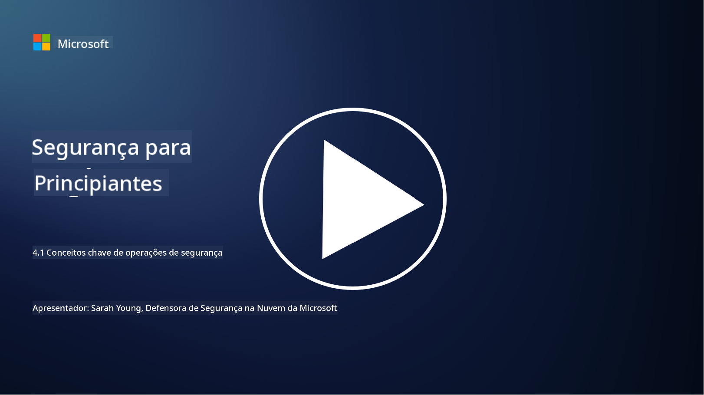

<!--
CO_OP_TRANSLATOR_METADATA:
{
  "original_hash": "6a55b31df9eebf550d040cef0ef7dff3",
  "translation_date": "2025-09-03T17:52:49+00:00",
  "source_file": "4.1 SecOps key concepts.md",
  "language_code": "pt"
}
-->
# Conceitos-chave de operações de segurança

As operações de segurança são um componente crítico da função geral de segurança de uma organização. Nesta lição, vamos aprender mais sobre isso:

 - O que é uma função de operações de segurança dentro de uma empresa?
   
 - Que formas as operações de segurança podem assumir?
   
   - Como as operações de segurança diferem das operações tradicionais de TI?

## O que é uma função de operações de segurança dentro de uma empresa?

Uma função de operações de segurança dentro de uma empresa refere-se a uma equipa ou departamento dedicado responsável por monitorizar, detetar, investigar e responder a ameaças e incidentes de cibersegurança. O objetivo principal de uma função de operações de segurança é garantir a confidencialidade, integridade e disponibilidade dos ativos digitais de uma organização, identificando e mitigando proativamente os riscos de segurança e respondendo de forma eficaz a incidentes de segurança.

## Que formas as operações de segurança podem assumir?

As operações de segurança podem assumir várias formas, dependendo do tamanho e da complexidade da organização. Algumas formas comuns incluem:

**Centro de Operações de Segurança (SOC):** Uma equipa centralizada responsável pela monitorização, análise e resposta a eventos de segurança 24/7. Os SOCs frequentemente utilizam ferramentas e tecnologias avançadas para identificar e responder a ameaças em tempo real.

**Equipa de Resposta a Incidentes:** Uma equipa especializada focada em responder a incidentes e violações de segurança. Eles conduzem investigações, coordenam esforços de resposta e facilitam a recuperação.

**Equipa de Caça a Ameaças:** Uma equipa que procura proativamente sinais de ameaças avançadas e vulnerabilidades ocultas que podem não ser detetadas por ferramentas de segurança tradicionais.

**Equipa Red Team/Blue Team:** A equipa Red simula ataques para identificar vulnerabilidades, enquanto a equipa Blue defende contra esses ataques. Ambas as equipas trabalham juntas para melhorar as medidas de segurança.

**Fornecedor de Serviços de Segurança Geridos (MSSP):** Algumas organizações terceirizam as suas operações de segurança para fornecedores especializados em monitorização de segurança e resposta a incidentes.

## Como as operações de segurança diferem das operações tradicionais de TI?

As operações de segurança e as operações tradicionais de TI estão relacionadas, mas são funções distintas:

**Foco:** As operações de TI concentram-se na gestão e manutenção da infraestrutura de TI da organização, garantindo a sua funcionalidade e disponibilidade. As operações de segurança, por outro lado, priorizam a identificação e mitigação de riscos de segurança e a resposta a incidentes.

**Responsabilidades:** As operações de TI lidam com tarefas como manutenção de sistemas, atualizações de software e suporte ao utilizador. As operações de segurança lidam com deteção de ameaças, resposta a incidentes, gestão de vulnerabilidades e monitorização de segurança.

**Temporalidade:** As operações de TI enfatizam a disponibilidade e o desempenho imediato dos sistemas. As operações de segurança concentram-se na identificação e remediação de ameaças, o que pode não estar sempre alinhado com a disponibilidade imediata.

**Conjunto de competências:** As operações de segurança exigem competências especializadas em análise de ameaças, resposta a incidentes e ferramentas de cibersegurança. As operações de TI requerem especialização em administração de sistemas, gestão de redes e suporte a aplicações.

## Fluxo de trabalho de resposta a incidentes

As Funções Principais do NIST Cybersecurity Framework listam cinco funções abrangentes que devem ser realizadas continuamente como parte do ambiente operacional de uma organização para reduzir o risco de cibersegurança.

É importante compreender que estas atividades devem fazer parte de um ciclo maior que se integra e alinha com os processos mais amplos de cibersegurança de uma organização.

**Nota:** Pode ler mais sobre o NIST Cybersecurity Framework em [https://www.nist.gov/cybersecurity](https://www.nist.gov/cybersecurity)

## Leituras adicionais

- [Operações de segurança | Microsoft Learn](https://learn.microsoft.com/security/operations/overview?WT.mc_id=academic-96948-sayoung)
- [Implementação de processos de operações de segurança | Microsoft Learn](https://learn.microsoft.com/security/operations/?WT.mc_id=academic-96948-sayoung)
- [O que é um centro de operações de segurança (SOC)? | Microsoft Security](https://www.microsoft.com/security/business/security-101/what-is-a-security-operations-center-soc?WT.mc_id=academic-96948-sayoung)
- [O que é um Centro de Operações de Segurança | Cibersegurança | CompTIA](https://www.comptia.org/content/articles/what-is-a-security-operations-center)

---

**Aviso Legal**:  
Este documento foi traduzido utilizando o serviço de tradução por IA [Co-op Translator](https://github.com/Azure/co-op-translator). Embora nos esforcemos para garantir a precisão, é importante notar que traduções automáticas podem conter erros ou imprecisões. O documento original na sua língua nativa deve ser considerado a fonte autoritária. Para informações críticas, recomenda-se a tradução profissional realizada por humanos. Não nos responsabilizamos por quaisquer mal-entendidos ou interpretações incorretas decorrentes da utilização desta tradução.