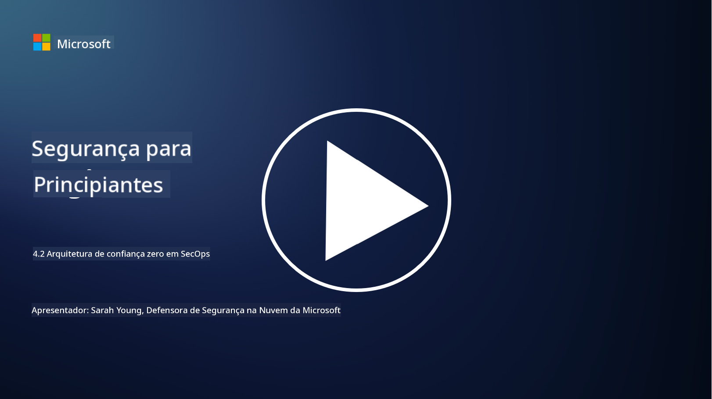

<!--
CO_OP_TRANSLATOR_METADATA:
{
  "original_hash": "45bbdc114e70936816b0b3e7c40189cf",
  "translation_date": "2025-09-03T17:32:51+00:00",
  "source_file": "4.2 SecOps zero trust architecture.md",
  "language_code": "pt"
}
-->
# Arquitetura de confiança zero em operações de segurança

As operações de segurança formam duas partes da arquitetura de confiança zero, e nesta lição vamos aprender sobre ambas:

- Como devem ser construídas as arquiteturas de TI para permitir a recolha centralizada de registos?

- Quais são as melhores práticas para operações de segurança em ambientes modernos de TI?

## Como devem ser construídas as arquiteturas de TI para permitir a recolha centralizada de registos?

A recolha centralizada de registos é um componente essencial das operações de segurança modernas. Permite às organizações agregar registos e dados de várias fontes, como servidores, aplicações, dispositivos de rede e ferramentas de segurança, num repositório central para análise, monitorização e resposta a incidentes. Aqui estão algumas melhores práticas para construir arquiteturas de TI que suportem a recolha centralizada de registos:

1. **Integração das fontes de registo**:

- Certifique-se de que todos os dispositivos e sistemas relevantes estão configurados para gerar registos. Isto inclui servidores, firewalls, routers, switches, aplicações e dispositivos de segurança.

- Configure as fontes de registo para encaminhar os registos para um coletor ou sistema de gestão centralizado.

2. **Escolha da ferramenta SIEM (Gestão de Informação e Eventos de Segurança)**:

- Escolha uma solução SIEM que esteja alinhada com as necessidades e a escala da sua organização.

- Certifique-se de que a solução escolhida suporta recolha, agregação, análise e relatórios de registos.

3. **Escalabilidade e redundância**:

- Projete a arquitetura para ser escalável, acomodando um número crescente de fontes de registo e maior volume de dados.

- Implemente redundância para alta disponibilidade, prevenindo interrupções devido a falhas de hardware ou rede.

4. **Transporte seguro de registos**:

- Utilize protocolos seguros como TLS/SSL ou IPsec para transportar registos das fontes para o repositório centralizado.

- Implemente autenticação e controlos de acesso para garantir que apenas dispositivos autorizados possam enviar registos.

5. **Normalização**:

- Padronize os formatos de registo e normalize os dados para garantir consistência e facilidade de análise.

6. **Armazenamento e retenção**:

- Determine o período de retenção adequado para os registos com base em requisitos de conformidade e segurança.

- Armazene os registos de forma segura, protegendo-os contra acessos não autorizados e adulterações.

## Quais são as melhores práticas para operações de segurança em ambientes modernos de TI?

Além da recolha centralizada de registos, aqui estão algumas melhores práticas para operações de segurança em ambientes modernos de TI:

1. **Monitorização contínua**: Implemente monitorização contínua das atividades da rede e dos sistemas para detetar e responder a ameaças em tempo real.

2. **Inteligência de ameaças**: Mantenha-se informado sobre ameaças e vulnerabilidades emergentes utilizando feeds e serviços de inteligência de ameaças.

3. **Formação de utilizadores**: Realize formações regulares de sensibilização para segurança com os colaboradores para mitigar riscos associados a engenharia social e ataques de phishing.

4. **Plano de resposta a incidentes**: Desenvolva e teste um plano de resposta a incidentes para garantir uma resposta rápida e eficaz a incidentes de segurança.

5. **Automação de segurança**: Utilize ferramentas de automação e orquestração de segurança para agilizar a resposta a incidentes e tarefas repetitivas.

6. **Backup e recuperação**: Implemente soluções robustas de backup e recuperação de desastres para garantir a disponibilidade de dados em caso de perda de dados ou ataques de ransomware.

## Leitura adicional

- [Módulo de Melhores Práticas de Segurança da Microsoft: Operações de segurança | Microsoft Learn](https://learn.microsoft.com/security/operations/security-operations-videos-and-decks?WT.mc_id=academic-96948-sayoung)
- [Operações de segurança - Cloud Adoption Framework | Microsoft Learn](https://learn.microsoft.com/azure/cloud-adoption-framework/secure/security-operations?WT.mc_id=academic-96948-sayoung)
- [O que é Arquitetura de Plataforma de Operações e Análise de Segurança? Uma Definição de SOAPA, Como Funciona, Benefícios e Mais (digitalguardian.com)](https://www.digitalguardian.com/blog/what-security-operations-and-analytics-platform-architecture-definition-soapa-how-it-works#:~:text=All%20in%20all%2C%20security%20operations%20and%20analytics%20platform,become%20more%20efficient%20and%20operative%20with%20your%20security.)

---

**Aviso Legal**:  
Este documento foi traduzido utilizando o serviço de tradução por IA [Co-op Translator](https://github.com/Azure/co-op-translator). Embora nos esforcemos para garantir a precisão, é importante notar que traduções automáticas podem conter erros ou imprecisões. O documento original na sua língua nativa deve ser considerado a fonte autoritária. Para informações críticas, recomenda-se a tradução profissional realizada por humanos. Não nos responsabilizamos por quaisquer mal-entendidos ou interpretações incorretas decorrentes da utilização desta tradução.