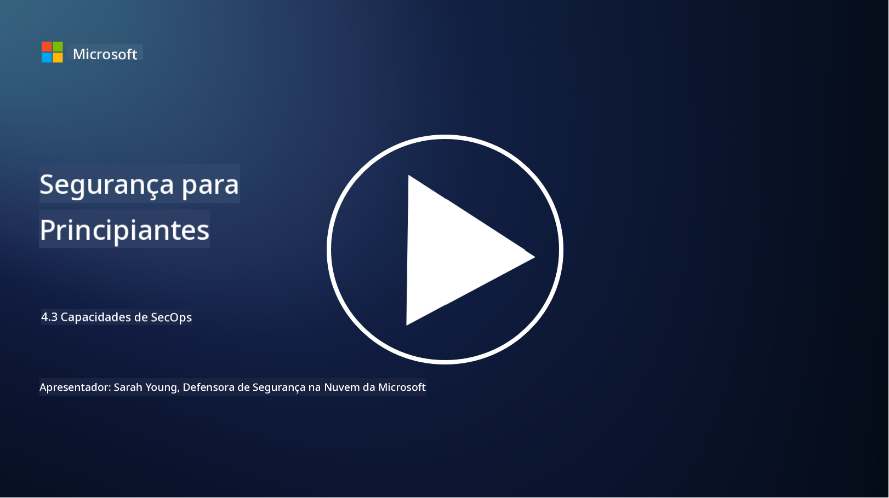

<!--
CO_OP_TRANSLATOR_METADATA:
{
  "original_hash": "553eb694c89f1caca0694e8d8ab89e0e",
  "translation_date": "2025-09-03T17:42:09+00:00",
  "source_file": "4.3 SecOps capabilities.md",
  "language_code": "pt"
}
-->
# Capacidades de SecOps

Nesta secção, vamos explorar mais detalhes sobre as ferramentas e capacidades principais que podem ser utilizadas nas operações de segurança.

Nesta lição, vamos abordar:

- O que é uma ferramenta de gestão de informações e eventos de segurança (SIEM)?

- O que é XDR?

- Que tipo de capacidades podem ser utilizadas para melhorar as operações de segurança?

## O que é uma ferramenta de gestão de informações e eventos de segurança (SIEM)?

Uma ferramenta de Gestão de Informações e Eventos de Segurança (SIEM) é utilizada para analisar alertas de segurança gerados em todo o ambiente de TI de uma organização. Estas ferramentas recolhem, agregam, correlacionam e analisam dados de registo e eventos de segurança provenientes de várias fontes, como dispositivos de rede, servidores, aplicações e sistemas de segurança.

Funções e capacidades principais das ferramentas SIEM incluem:

1. **Recolha de Registos**: As ferramentas SIEM recolhem registos e dados de eventos de segurança de uma ampla gama de dispositivos, sistemas e aplicações, incluindo firewalls, sistemas de deteção de intrusões, software antivírus, entre outros.

2. **Normalização de Dados**: Normalizam os dados de registo num formato comum para facilitar a análise e correlação.

3. **Correlação de Eventos**: Correlacionam eventos para identificar padrões e anomalias que possam indicar incidentes ou ameaças de segurança.

4. **Alertas e Notificações**: Geram alertas e notificações em tempo real quando atividades suspeitas ou violações de segurança são detetadas, permitindo uma resposta imediata.

5. **Deteção de Incidentes**: Facilitam a deteção de incidentes de segurança, incluindo acessos não autorizados, violações de dados, infeções por malware e ameaças internas.

6. **Análise de Comportamento de Utilizadores e Entidades (UEBA)**: Algumas ferramentas SIEM incorporam capacidades de UEBA para identificar comportamentos anormais de utilizadores e entidades que possam indicar contas comprometidas ou ameaças internas.

7. **Integração com Inteligência de Ameaças**: Podem integrar-se com feeds de inteligência de ameaças para melhorar a deteção de ameaças, comparando indicadores de compromisso (IOCs) conhecidos com a atividade da rede.

8. **Automação e Orquestração**: Recursos de automação permitem que os SIEMs automatizem respostas a incidentes de segurança comuns, reduzindo tempos de resposta e esforço manual.

9. **Painéis e Visualização**: Oferecem painéis e ferramentas de visualização para monitorizar dados de segurança e criar relatórios personalizados.

10. **Integração com Outras Ferramentas de Segurança**: Frequentemente integram-se com outras ferramentas e tecnologias de segurança, como soluções de deteção e resposta em endpoints (EDR), para fornecer uma visão holística da postura de segurança de uma organização.

## O que é XDR?

XDR (Extended Detection and Response) é uma tecnologia que expande as capacidades da tradicional Deteção e Resposta em Endpoints (EDR) e combina-as com uma telemetria de segurança mais ampla proveniente de várias fontes, proporcionando uma visão mais abrangente da postura de segurança de uma organização. O XDR tem como objetivo melhorar a deteção de ameaças, a resposta a incidentes e a segurança geral, abordando as limitações de depender exclusivamente de EDR, SIEM ou outras ferramentas individuais de segurança.

Características e componentes principais do XDR incluem:

1. **Integração de Dados**: O XDR integra dados de múltiplas fontes, incluindo endpoints, tráfego de rede, serviços na nuvem, e-mail e mais. Esta agregação abrangente de dados fornece um contexto mais amplo para a deteção e análise de ameaças.

2. **Análises Avançadas**: Utiliza análises avançadas, aprendizagem automática e análise comportamental para identificar e priorizar ameaças de segurança. Procura padrões e anomalias nos dados integrados para detetar ameaças conhecidas e desconhecidas.

3. **Deteção Automática de Ameaças**: Automatiza a deteção de ameaças e anomalias ao correlacionar informações de várias fontes. Pode identificar cadeias de ataque complexas que abrangem múltiplos vetores.

4. **Investigação e Resposta a Incidentes**: Oferece ferramentas para investigação e resposta a incidentes, ajudando as equipas de segurança a avaliar rapidamente o alcance e impacto dos incidentes e tomar ações corretivas apropriadas.

5. **Integração com Inteligência de Ameaças**: Integra feeds e dados de inteligência de ameaças para melhorar a deteção de ameaças, comparando indicadores de compromisso (IOCs) conhecidos com a atividade da rede e dos endpoints da organização.

6. **Consola Unificada**: Geralmente oferece uma consola ou painel unificado onde as equipas de segurança podem visualizar e gerir alertas e incidentes de segurança provenientes de diferentes fontes de forma centralizada.

7. **Cobertura Multiplataforma**: As soluções XDR abrangem uma ampla gama de plataformas, incluindo endpoints, servidores, ambientes na nuvem e dispositivos móveis, tornando-as adequadas para ambientes de TI modernos e multiplataforma.

## Que tipo de capacidades podem ser utilizadas para melhorar as operações de segurança?

Para melhorar as operações de segurança, as organizações podem aproveitar várias capacidades além das ferramentas SIEM:

1. **Aprendizagem Automática e Inteligência Artificial**: Implementar análises avançadas, aprendizagem automática e IA para detetar ameaças em evolução e automatizar a caça de ameaças.

2. **Análise de Comportamento de Utilizadores e Entidades (UEBA)**: Analisar o comportamento de utilizadores e entidades para detetar anomalias e ameaças internas.

3. **Feeds de Inteligência de Ameaças**: Integrar feeds de inteligência de ameaças para manter-se atualizado sobre as últimas ameaças e indicadores de compromisso.

4. **Orquestração, Automação e Resposta de Segurança (SOAR)**: Implementar plataformas SOAR para automatizar a resposta a incidentes e simplificar os fluxos de trabalho das operações de segurança.

5. **Tecnologias de Deceção**: Implementar tecnologias de deceção para enganar e detetar atacantes dentro da rede.

## Leitura adicional

- [What is SIEM? | Microsoft Security](https://www.microsoft.com/security/business/security-101/what-is-siem?WT.mc_id=academic-96948-sayoung)
- [What Is SIEM? - Security Information and Event Management - Cisco](https://www.cisco.com/c/en/us/products/security/what-is-siem.html)
- [Security information and event management - Wikipedia](https://en.wikipedia.org/wiki/Security_information_and_event_management)
- [What Is XDR? | Microsoft Security](https://www.microsoft.com/security/business/security-101/what-is-xdr?WT.mc_id=academic-96948-sayoung)
- [XDR & XDR Security (kaspersky.com.au)](https://www.kaspersky.com.au/resource-center/definitions/what-is-xdr)
- [The Power of SecOps: Redefining Core Security Capabilities - The New Stack](https://thenewstack.io/the-power-of-secops-redefining-core-security-capabilities/)
- [Seven Steps to Improve Your Security Operations and Response (securityintelligence.com)](https://securityintelligence.com/seven-steps-to-improve-your-security-operations-and-response/)

---

**Aviso Legal**:  
Este documento foi traduzido utilizando o serviço de tradução por IA [Co-op Translator](https://github.com/Azure/co-op-translator). Embora nos esforcemos para garantir a precisão, é importante notar que traduções automáticas podem conter erros ou imprecisões. O documento original na sua língua nativa deve ser considerado a fonte autoritária. Para informações críticas, recomenda-se a tradução profissional realizada por humanos. Não nos responsabilizamos por quaisquer mal-entendidos ou interpretações incorretas decorrentes da utilização desta tradução.