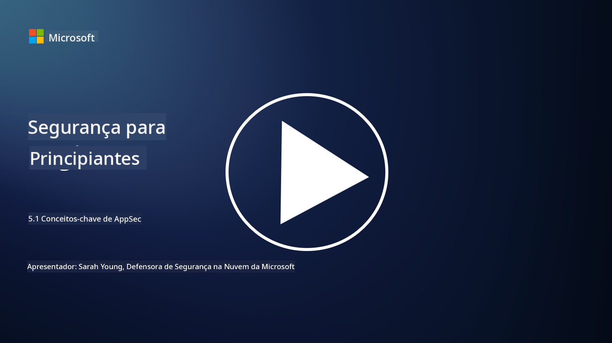

<!--
CO_OP_TRANSLATOR_METADATA:
{
  "original_hash": "e4b56bb23078d3ffb7ad407d280b0c36",
  "translation_date": "2025-09-03T17:29:09+00:00",
  "source_file": "5.1 AppSec key concepts.md",
  "language_code": "pt"
}
-->
# Conceitos-chave de AppSec

A segurança de aplicações é uma especialização de segurança por si só. Nesta parte do curso, vamos explorar mais sobre segurança de aplicações.

## Introdução

Nesta lição, vamos abordar:

- O que é segurança de aplicações?

- Quais são os conceitos/princípios fundamentais da segurança de aplicações?

## O que é segurança de aplicações?

Segurança de aplicações, frequentemente abreviada como "AppSec", refere-se à prática de proteger aplicações de software contra ameaças, vulnerabilidades e ataques de segurança. Abrange os processos, técnicas e ferramentas utilizadas para identificar, mitigar e prevenir riscos de segurança ao longo do ciclo de desenvolvimento, implementação e manutenção de uma aplicação.

A segurança de aplicações é essencial porque as aplicações são alvos comuns de ciberataques. Agentes maliciosos exploram vulnerabilidades e fraquezas no software para obter acesso não autorizado, roubar dados, interromper serviços ou executar outras atividades maliciosas. Uma segurança de aplicações eficaz ajuda a garantir a confidencialidade, integridade e disponibilidade de uma aplicação e dos dados associados.

## Quais são os conceitos/princípios fundamentais da segurança de aplicações?

Os conceitos e princípios fundamentais que sustentam a segurança de aplicações incluem:

1. **Seguro por Design**:

- A segurança deve ser integrada ao design e à arquitetura da aplicação desde o início, em vez de ser adicionada posteriormente.

2. **Validação de Entrada**:

- Todas as entradas do utilizador devem ser validadas para garantir que estão em conformidade com os formatos esperados e estão livres de código ou dados maliciosos.

3. **Codificação de Saída**:

- Os dados enviados ao cliente devem ser devidamente codificados para prevenir vulnerabilidades como cross-site scripting (XSS).

4. **Autenticação e Autorização**:

- Autenticar utilizadores e autorizar o acesso aos recursos com base nos seus papéis e permissões.

5. **Proteção de Dados**:

- Dados sensíveis devem ser encriptados quando armazenados, transmitidos e processados para evitar acessos não autorizados.

6. **Gestão de Sessões**:

- Uma gestão de sessões segura garante que as sessões dos utilizadores estão protegidas contra sequestro e acessos não autorizados.

7. **Dependências Seguras**:

- Manter todas as dependências de software atualizadas com patches de segurança para prevenir vulnerabilidades.

8. **Gestão de Erros e Registos**:

- Implementar uma gestão de erros segura para evitar a exposição de informações sensíveis e garantir práticas seguras de registo.

9. **Testes de Segurança**:

- Testar regularmente as aplicações para identificar vulnerabilidades utilizando métodos como testes de penetração, revisões de código e ferramentas de análise automatizada.

10. **Ciclo de Vida de Desenvolvimento de Software Seguro (SDLC)**:

- Integrar práticas de segurança em todas as fases do ciclo de vida de desenvolvimento de software, desde os requisitos até à implementação e manutenção.

## Leitura adicional

- [SheHacksPurple: What is Application Security? - YouTube](https://www.youtube.com/watch?v=eNmccQNzSSY)
- [What Is Application Security? - Cisco](https://www.cisco.com/c/en/us/solutions/security/application-first-security/what-is-application-security.html#~how-does-it-work)
- [What is application security? A process and tools for securing software | CSO Online](https://www.csoonline.com/article/566471/what-is-application-security-a-process-and-tools-for-securing-software.html)
- [OWASP Cheat Sheet Series | OWASP Foundation](https://owasp.org/www-project-cheat-sheets/)

---

**Aviso Legal**:  
Este documento foi traduzido utilizando o serviço de tradução por IA [Co-op Translator](https://github.com/Azure/co-op-translator). Embora nos esforcemos para garantir a precisão, é importante ter em conta que traduções automáticas podem conter erros ou imprecisões. O documento original na sua língua nativa deve ser considerado a fonte autoritária. Para informações críticas, recomenda-se a tradução profissional realizada por humanos. Não nos responsabilizamos por quaisquer mal-entendidos ou interpretações incorretas decorrentes da utilização desta tradução.