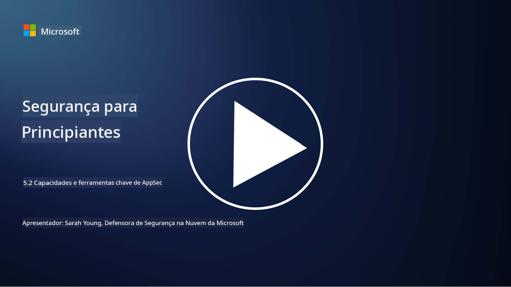

<!--
CO_OP_TRANSLATOR_METADATA:
{
  "original_hash": "790a3fa7e535ec60bb51bde13e759781",
  "translation_date": "2025-09-03T17:34:28+00:00",
  "source_file": "5.2 AppSec key capabilities.md",
  "language_code": "pt"
}
-->
## Introdução

Nesta lição, vamos abordar quais são as principais capacidades e ferramentas utilizadas na segurança de aplicações.

## Capacidades e ferramentas-chave de AppSec

As capacidades e ferramentas essenciais na segurança de aplicações são fundamentais para identificar, mitigar e prevenir vulnerabilidades e ameaças de segurança em aplicações de software. Aqui estão algumas das mais importantes:

**1. Teste de Segurança de Aplicações Estático (SAST)**:

- **Capacidades**: Analisa o código-fonte, bytecode ou código binário para identificar vulnerabilidades de segurança na base de código da aplicação.

- **Ferramentas**: Exemplos incluem Fortify, Checkmarx e Veracode.

**2. Teste de Segurança de Aplicações Dinâmico (DAST)**:

- **Capacidades**: Analisa uma aplicação em execução para identificar vulnerabilidades enviando pedidos de entrada e analisando as respostas.

- **Ferramentas**: Exemplos incluem ZAP, Burp Suite e Qualys Web Application Scanning.

**3. Teste de Segurança de Aplicações Interativo (IAST)**:

- **Capacidades**: Combina elementos de SAST e DAST para analisar o código durante a execução, proporcionando resultados mais precisos e reduzindo falsos positivos.

- **Ferramentas**: Exemplos incluem Contrast Security e HCL AppScan.

**4. Proteção de Aplicações em Tempo de Execução (RASP)**:

- **Capacidades**: Monitoriza e protege aplicações em tempo real, detetando e respondendo a ameaças de segurança à medida que ocorrem.

- **Ferramentas**: Exemplos incluem Veracode Runtime Protection e F5 Advanced WAF com RASP.

**5. Firewalls de Aplicações Web (WAFs)**:

- **Capacidades**: Fornece uma camada de proteção entre a aplicação e a internet, filtrando o tráfego de entrada e bloqueando pedidos maliciosos.

- **Ferramentas**: Exemplos incluem ModSecurity, AWS WAF e Akamai Kona Site Defender.

**6. Análise de Dependências**:

- **Capacidades**: Identifica vulnerabilidades em bibliotecas e componentes de terceiros utilizados na aplicação.

- **Ferramentas**: Exemplos incluem OWASP Dependency-Check e Snyk.

**7. Testes de Penetração (Pen Testing)**:

- **Capacidades**: Simula ataques reais para descobrir vulnerabilidades e avaliar a segurança de uma aplicação.

- **Ferramentas**: Realizado por hackers éticos certificados e profissionais de segurança utilizando várias ferramentas como Metasploit e Nmap.

**8. Análise e Verificação de Segurança**:

- **Capacidades**: Procura vulnerabilidades conhecidas, erros de configuração e falhas de segurança.

- **Ferramentas**: Exemplos incluem Nessus, Qualys Vulnerability Management e OpenVAS.

**9. Ferramentas de Segurança de Contêineres**:

- **Capacidades**: Focam-se na segurança de aplicações containerizadas e dos seus ambientes.

- **Ferramentas**: Exemplos incluem Docker Security Scanning e Aqua Security.

**10. Formação em Desenvolvimento Seguro**:

- **Capacidades**: Oferece programas de formação e sensibilização para equipas de desenvolvimento, promovendo práticas de codificação segura.

- **Ferramentas**: Programas e plataformas de formação personalizados.

**11. Frameworks de Teste de Segurança**:

- **Capacidades**: Fornece frameworks abrangentes para diferentes necessidades de teste de segurança de aplicações.

- **Ferramentas**: OWASP Amass, OWASP OWTF e FrAppSec.

**12. Ferramentas de Revisão de Código Seguro**:

- **Capacidades**: Revê o código-fonte para identificar vulnerabilidades de segurança e boas práticas de codificação.

- **Ferramentas**: Exemplos incluem SonarQube e Checkmarx.

**13. Ferramentas de Segurança para APIs e Microserviços**:

- **Capacidades**: Focam-se na segurança de APIs e microserviços, incluindo autenticação, autorização e proteção de dados.

- **Ferramentas**: Exemplos incluem Apigee, AWS API Gateway e Istio.

## Leitura adicional

- [What Is Application Security? Concepts, Tools & Best Practices | HackerOne](https://www.hackerone.com/knowledge-center/what-application-security-concepts-tools-best-practices)  
- [What is IAST? (Interactive Application Security Testing) (comparitech.com)](https://www.comparitech.com/net-admin/what-is-iast/)  
- [10 Types of Application Security Testing Tools: When and How to Use Them (cmu.edu)](https://insights.sei.cmu.edu/blog/10-types-of-application-security-testing-tools-when-and-how-to-use-them/)  
- [Shifting the Balance of Cybersecurity Risk: Principles and Approaches for Security-by-Design and Default | Cyber.gov.au](https://www.cyber.gov.au/about-us/view-all-content/publications/principles-and-approaches-for-security-by-design-and-default)  

---

**Aviso Legal**:  
Este documento foi traduzido utilizando o serviço de tradução por IA [Co-op Translator](https://github.com/Azure/co-op-translator). Embora nos esforcemos para garantir a precisão, é importante ter em conta que traduções automáticas podem conter erros ou imprecisões. O documento original na sua língua nativa deve ser considerado a fonte autoritária. Para informações críticas, recomenda-se a tradução profissional realizada por humanos. Não nos responsabilizamos por quaisquer mal-entendidos ou interpretações incorretas decorrentes da utilização desta tradução.