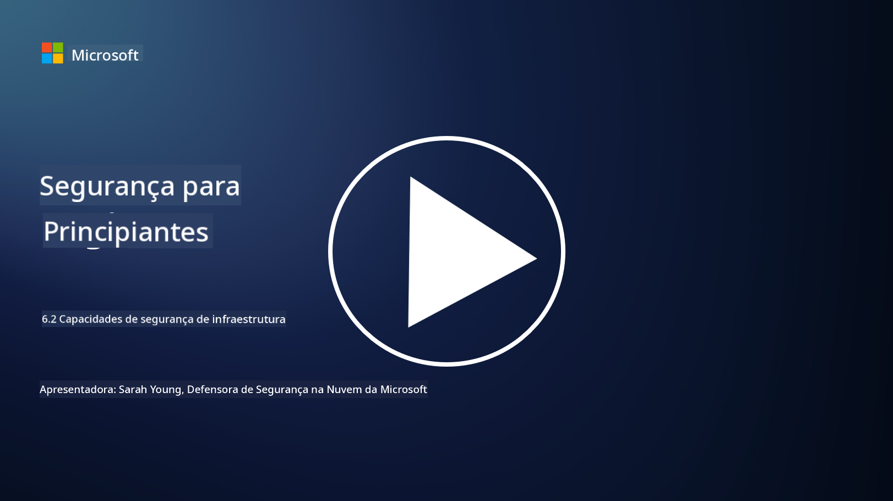

<!--
CO_OP_TRANSLATOR_METADATA:
{
  "original_hash": "7d79ba0e7668b3bdae1fba7aa047f6c0",
  "translation_date": "2025-09-03T17:24:13+00:00",
  "source_file": "6.2 Infrastructure security capabilities.md",
  "language_code": "pt"
}
-->
# Capacidades de segurança de infraestrutura

Nesta seção, vamos explorar mais detalhes sobre as ferramentas e capacidades principais utilizadas na segurança de infraestrutura.

**Introdução**

Nesta lição, vamos abordar:

- O que é gestão de vulnerabilidades?

- O que é CSPM?

- O que é CNAPP?

## O que é gestão de vulnerabilidades?

A gestão de vulnerabilidades é um processo sistemático de identificar, avaliar, priorizar, mitigar e monitorizar vulnerabilidades em sistemas informáticos, software, redes e infraestrutura. O objetivo principal da gestão de vulnerabilidades é reduzir a exposição de uma organização a riscos de segurança, abordando proativamente vulnerabilidades conhecidas antes que possam ser exploradas por agentes maliciosos. Aqui está uma visão geral dos passos principais envolvidos:

Identificação: Realizar varreduras e descobrir vulnerabilidades nos ativos da organização, que podem incluir servidores, aplicações, dispositivos de rede e endpoints.

Avaliação: Avaliar a gravidade e o impacto potencial de cada vulnerabilidade com base em fatores como a pontuação do Common Vulnerability Scoring System (CVSS) e o contexto empresarial.

Priorização: Classificar as vulnerabilidades com base no nível de risco e impacto potencial nas operações e dados da organização.

Mitigação: Desenvolver e implementar estratégias para remediar ou mitigar vulnerabilidades, como aplicar patches, configurar definições de segurança ou implementar controlos compensatórios.

Verificação: Confirmar que as medidas de mitigação foram eficazes na resolução das vulnerabilidades.

Monitorização Contínua: Acompanhar continuamente vulnerabilidades e ameaças potenciais, com varreduras e avaliações regulares.

A gestão de vulnerabilidades é um componente crítico da cibersegurança, ajudando as organizações a manter uma postura de segurança robusta e a reduzir a probabilidade de violações de segurança. Exemplos de ferramentas de gestão de vulnerabilidades incluem Defender for Cloud, Nessus e Qualys.

## O que é CSPM?

Cloud Security Posture Management (CSPM) é um conjunto de ferramentas, processos e práticas projetados para avaliar, monitorizar e aplicar configurações de segurança e boas práticas em ambientes de cloud. As soluções CSPM ajudam as organizações a identificar e remediar configurações incorretas, lacunas de segurança e violações de conformidade na sua infraestrutura de cloud, como na Amazon Web Services (AWS), Microsoft Azure, Google Cloud Platform (GCP) e outros fornecedores de cloud.

Os aspetos principais do CSPM incluem:

- Avaliação de Configuração: Realizar varreduras em recursos e serviços de cloud para identificar configurações incorretas, definições inseguras e desvios das melhores práticas de segurança.

- Aplicação de Políticas de Segurança: Aplicar políticas de segurança e padrões de conformidade em ambientes de cloud, remediando automaticamente configurações incorretas ou gerando alertas.

- Monitorização Contínua: Fornecer visibilidade contínua sobre a postura de segurança dos ativos e recursos de cloud, com alertas em tempo real para incidentes de segurança.

- Relatórios de Conformidade: Gerar relatórios e dashboards para demonstrar conformidade com requisitos regulatórios e padrões da indústria.

O CSPM ajuda as organizações a garantir que a sua infraestrutura de cloud está segura, em conformidade e alinhada com as melhores práticas, reduzindo o risco de incidentes de segurança relacionados com a cloud. Exemplos de ferramentas CSPM incluem Defender for Cloud e Snyk.

## O que é CNAPP?

CNAPP significa Cloud-Native Application Protection Platform. É uma plataforma de software nativa de cloud que simplifica a monitorização, deteção e resposta a potenciais ameaças e vulnerabilidades de segurança na cloud. Combina várias ferramentas e capacidades numa única solução de software para minimizar a complexidade e facilitar as operações das equipas de DevOps e DevSecOps. O CNAPP oferece segurança abrangente para cloud e aplicações ao longo de todo o ciclo de vida CI/CD, desde o desenvolvimento até à produção. Responde à necessidade da indústria por ferramentas modernas de monitorização de segurança na cloud, gestão de postura, prevenção de violações e controlo. As soluções CNAPP fornecem às equipas de segurança a capacidade de quantificar e responder a riscos no ambiente de cloud. Algumas das funcionalidades do CNAPP incluem maior visibilidade, quantificação de riscos, desenvolvimento de software seguro e uma solução de segurança combinada para cloud. O CNAPP integra múltiplas soluções de segurança na cloud que tradicionalmente eram isoladas numa única interface de utilizador, facilitando a proteção de toda a aplicação na cloud de uma organização. Os CNAPPs consolidam várias ferramentas de segurança nativas de cloud e fontes de dados, incluindo varredura de containers, gestão de postura de segurança na cloud, varredura de infraestrutura como código, gestão de permissões de infraestrutura na cloud e plataformas de proteção de workloads em tempo de execução na cloud.

## Leitura adicional
- [What is CSPM? | Microsoft Security](https://www.microsoft.com/security/business/security-101/what-is-cspm?WT.mc_id=academic-96948-sayoung)
- [What is Cloud Security Posture Management (CSPM)? | HackerOne](https://www.hackerone.com/knowledge-center/what-cloud-security-posture-management)
- [Function of cloud security posture management - Cloud Adoption Framework | Microsoft Learn](https://learn.microsoft.com/azure/cloud-adoption-framework/organize/cloud-security-posture-management?WT.mc_id=academic-96948-sayoung)
- [What Is a CNAPP? | Microsoft Security](https://www.microsoft.com/security/business/security-101/what-is-cnapp?WT.mc_id=academic-96948-sayoung)
- [Why Everyone Is Talking About CNAPP (forbes.com)](https://www.forbes.com/sites/forbestechcouncil/2021/12/10/why-everyone-is-talking-about-cnapp/?sh=567275ca1549)
- [Improving Your Multi-Cloud Security with a Cloud-Native Application Protection Platform (CNAPP)](https://www.youtube.com/watch?v=5w42kQ_QjZg&t=212s)

---

**Aviso Legal**:  
Este documento foi traduzido utilizando o serviço de tradução por IA [Co-op Translator](https://github.com/Azure/co-op-translator). Embora nos esforcemos para garantir a precisão, é importante notar que traduções automáticas podem conter erros ou imprecisões. O documento original na sua língua nativa deve ser considerado a fonte autoritária. Para informações críticas, recomenda-se a tradução profissional realizada por humanos. Não nos responsabilizamos por quaisquer mal-entendidos ou interpretações incorretas decorrentes da utilização desta tradução.