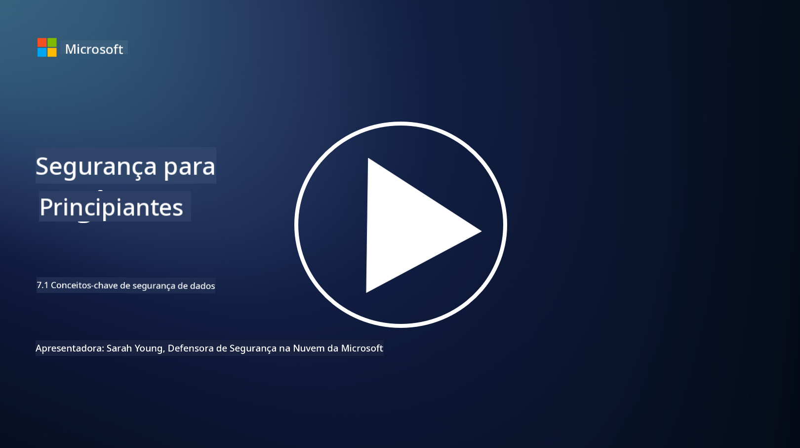

<!--
CO_OP_TRANSLATOR_METADATA:
{
  "original_hash": "9703868f41dcddd5a98dea9ea6fcd94d",
  "translation_date": "2025-09-03T17:19:59+00:00",
  "source_file": "7.1 Data security key concepts.md",
  "language_code": "pt"
}
-->
# Conceitos-chave de segurança de dados

Já mencionámos a segurança de dados e abordámos este tema várias vezes ao longo do curso. Agora, vamos explorar este tópico com mais profundidade. Nesta lição, irá aprender:

- O que é segurança de dados?

- O que é classificação de dados?

- O que é gestão do ciclo de vida dos dados?

- O que é prevenção de perda de dados (DLP)?

- Por que é que a segurança de dados é importante para uma organização?

## O que é segurança de dados?

**Segurança de dados** refere-se à prática de proteger dados digitais, como bases de dados, ficheiros e informações sensíveis, contra acesso, divulgação, alteração ou destruição não autorizados. O principal objetivo da segurança de dados é garantir a confidencialidade, integridade e disponibilidade dos dados. Isto envolve a implementação de uma combinação de medidas de segurança técnicas, administrativas e físicas para proteger os dados contra várias ameaças e vulnerabilidades, incluindo ciberataques, ameaças internas e violações de dados. As medidas de segurança de dados podem incluir encriptação, controlos de acesso, autenticação, registos de auditoria e políticas de segurança.

## O que é classificação de dados?

**Classificação de dados** é o processo de categorizar dados com base na sua sensibilidade, valor e importância para uma organização. O objetivo da classificação de dados é ajudar as organizações a identificar e priorizar a proteção e o tratamento de diferentes tipos de dados. As categorias comuns de classificação de dados incluem "público", "interno", "confidencial" e "restrito" ou "altamente confidencial". Depois de os dados serem classificados, as organizações podem aplicar controlos de segurança e restrições de acesso adequados para garantir que os dados sensíveis sejam devidamente protegidos e que o cumprimento dos requisitos regulamentares seja mantido.

## O que é gestão do ciclo de vida dos dados?

**Gestão do ciclo de vida dos dados** é uma abordagem estruturada para gerir os dados ao longo de todo o seu ciclo de vida, desde a criação ou aquisição até ao arquivamento ou eliminação. O ciclo de vida dos dados geralmente consiste em etapas como criação, armazenamento, processamento, transmissão, arquivamento e eliminação. A gestão do ciclo de vida dos dados envolve a definição de políticas e procedimentos para cada etapa do ciclo de vida dos dados, incluindo retenção de dados, controlos de acesso, backups e limpeza de dados. Uma gestão eficaz do ciclo de vida dos dados ajuda as organizações a otimizar o armazenamento de dados, melhorar a qualidade dos dados e garantir o cumprimento das regulamentações de proteção de dados.

## O que é prevenção de perda de dados (DLP)?

**Prevenção de Perda de Dados (DLP)** refere-se a um conjunto de tecnologias, políticas e práticas concebidas para evitar o acesso, partilha ou fuga não autorizada de dados sensíveis ou confidenciais. As soluções de DLP utilizam inspeção de conteúdo e análise contextual para monitorizar e controlar dados em movimento (por exemplo, e-mails, tráfego web), dados em repouso (por exemplo, ficheiros armazenados e bases de dados) e dados em uso (por exemplo, dados que estão a ser acedidos ou manipulados por utilizadores). O objetivo do DLP é identificar e bloquear ou encriptar dados sensíveis para evitar violações de dados, cumprir regulamentações de proteção de dados e proteger a reputação de uma organização.

## Por que é que a segurança de dados é importante para uma organização?

A segurança de dados é extremamente importante para as organizações por várias razões:

- **Proteção de Informações Sensíveis**: As organizações frequentemente armazenam dados sensíveis, como registos de clientes, propriedade intelectual, dados financeiros e informações de funcionários. A segurança de dados protege estas informações sensíveis contra acesso ou roubo não autorizado.

- **Conformidade**: Muitos setores e jurisdições têm regulamentações rigorosas de proteção e privacidade de dados. A segurança de dados ajuda as organizações a cumprir estas leis, evitando penalizações legais e danos à reputação.

- **Prevenção de Violações de Dados**: Violações de dados podem resultar em perdas financeiras, danos à reputação e consequências legais. Medidas eficazes de segurança de dados ajudam a prevenir violações de dados ou a limitar o seu impacto.

- **Preservação da Confiança**: Os clientes e as partes interessadas confiam nas organizações para protegerem os seus dados. Violações de segurança de dados comprometem essa confiança. Manter uma forte segurança de dados ajuda a preservar a confiança e a confiança dos clientes.

- **Vantagem Competitiva**: Demonstrar um compromisso com a segurança de dados pode ser uma vantagem competitiva. Os clientes e parceiros têm maior probabilidade de trabalhar com organizações que levam a segurança de dados a sério.

- **Continuidade Operacional**: As medidas de segurança de dados, incluindo backups de dados e planeamento de recuperação de desastres, ajudam a garantir a disponibilidade de dados críticos e a continuidade do negócio em caso de perda de dados ou desastres.

- **Proteção Contra Ameaças Internas**: As medidas de segurança de dados também abordam ameaças internas, incluindo exposição acidental de dados por funcionários e ações maliciosas por parte de colaboradores.

Em resumo, a segurança de dados é essencial para proteger informações sensíveis, cumprir regulamentações, prevenir violações de dados, preservar a confiança e garantir o sucesso e a reputação contínuos de uma organização.

## Leitura adicional

- [What Is Data Security? | Microsoft Security](https://www.microsoft.com/en-au/security/business/security-101/what-is-data-security?WT.mc_id=academic-96948-sayoung)
- [Automatically Classify & Protect Documents & Data | Microsoft Purview Information Protection](https://youtu.be/v8LqmzBUaOo)
- [Example data classification policy](https://www.cmu.edu/data/guidelines/data-classification.html)
- [What is Data Security? Data Security Definition and Overview | IBM](https://www.ibm.com/topics/data-security)
- [Data Lifecycle Management: A 2023 Guide for Your Business (cloudwards.net)](https://www.cloudwards.net/data-lifecycle-management/)
- [What is data loss prevention (DLP)? | Microsoft Security](https://www.microsoft.com/security/business/security-101/what-is-data-loss-prevention-dlp?WT.mc_id=academic-96948-sayoung)
- [What is DLP? How data loss prevention software works and why you need it | CSO Online](https://www.csoonline.com/article/569559/what-is-dlp-how-data-loss-prevention-software-works-and-why-you-need-it.html)

---

**Aviso Legal**:  
Este documento foi traduzido utilizando o serviço de tradução por IA [Co-op Translator](https://github.com/Azure/co-op-translator). Embora nos esforcemos para garantir a precisão, é importante notar que traduções automáticas podem conter erros ou imprecisões. O documento original na sua língua nativa deve ser considerado a fonte autoritária. Para informações críticas, recomenda-se a tradução profissional realizada por humanos. Não nos responsabilizamos por quaisquer mal-entendidos ou interpretações incorretas decorrentes da utilização desta tradução.