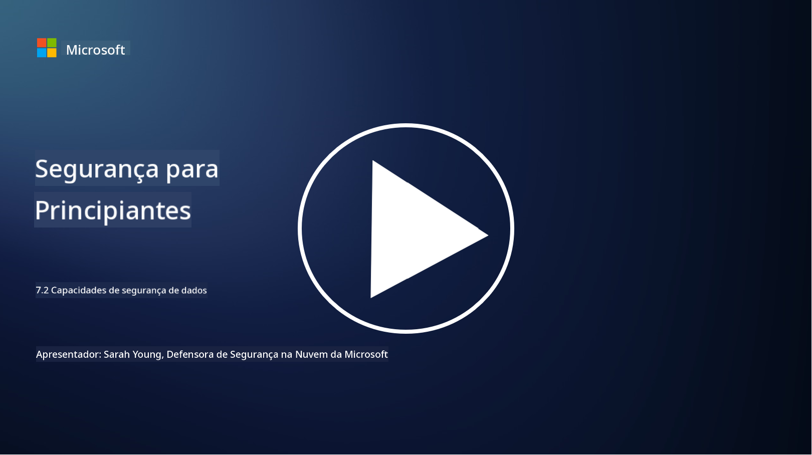

<!--
CO_OP_TRANSLATOR_METADATA:
{
  "original_hash": "50697add9758e54693442d502d2d5f8a",
  "translation_date": "2025-09-03T17:36:07+00:00",
  "source_file": "7.2 Data security capabilities.md",
  "language_code": "pt"
}
-->
# Capacidades de segurança de dados

Nesta secção, vamos explorar mais detalhes sobre as ferramentas e capacidades principais utilizadas na segurança de dados:

**Introdução**

Nesta lição, vamos abordar:

- O que são ferramentas de prevenção de perda de dados?

- O que são ferramentas de gestão de risco interno?

- Que ferramentas de retenção de dados estão disponíveis?

## O que são ferramentas de prevenção de perda de dados?

As ferramentas de Prevenção de Perda de Dados (DLP) referem-se a um conjunto de soluções de software e tecnologias concebidas para evitar o acesso não autorizado, partilha ou fuga de dados sensíveis ou confidenciais dentro de uma organização. Estas ferramentas utilizam inspeção de conteúdo, aplicação de políticas e monitorização para identificar e proteger dados sensíveis contra exposição ou uso indevido. Exemplos de produtos DLP incluem: Symantec Data Loss Prevention, McAfee Total Protection for Data Loss Prevention, Microsoft 365 DLP**: Integra-se com as aplicações do Microsoft 365 para ajudar as organizações a identificar e proteger dados sensíveis em emails, documentos e mensagens.

## O que são ferramentas de gestão de risco interno?

As ferramentas de Gestão de Risco Interno ajudam as organizações a identificar e mitigar riscos provenientes de funcionários, contratados ou parceiros que possam comprometer intencionalmente ou acidentalmente a segurança dos dados. Estas ferramentas monitorizam o comportamento dos utilizadores, padrões de acesso e uso de dados para detetar atividades suspeitas e potenciais ameaças internas. Exemplos de produtos de gestão de risco interno incluem: Microsoft Insider Risk Management (parte do Microsoft 365), Forcepoint Insider Threat Data Protection, Varonis Insider Threat Detection.

## Que ferramentas de retenção de dados estão disponíveis?

As ferramentas de retenção de dados incluem software e soluções concebidas para gerir a retenção e eliminação de dados de acordo com as políticas de retenção de dados e requisitos legais de uma organização. Estas ferramentas ajudam a automatizar o processo de retenção de dados por períodos específicos e a eliminá-los de forma segura quando já não são necessários. Exemplos de produtos de retenção de dados incluem: Veritas Enterprise Vault, Commvault Complete Data Protection, Microsoft data lifecycle management. Estas soluções ajudam as organizações a manter controlo sobre a retenção e eliminação de dados, garantindo conformidade com regulamentos de proteção de dados enquanto gerem eficientemente os dados ao longo do seu ciclo de vida.

## Leitura adicional

- [Guia para Gestão de Postura de Segurança de Dados (DSPM) | CSA (cloudsecurityalliance.org)](https://cloudsecurityalliance.org/blog/2023/03/31/the-big-guide-to-data-security-posture-management-dspm/)
- [Prevenção de Perda de Dados em endpoints, apps e serviços | Microsoft Purview](https://youtu.be/hvqq8L_0kgI)
- [18 Melhores Ferramentas de Software de Prevenção de Perda de Dados 2023 (Grátis + Pago) (comparitech.com)](https://www.comparitech.com/data-privacy-management/data-loss-prevention-tools-software/)
- [Prevenção de Perda de Dados (nist.gov)](https://tsapps.nist.gov/publication/get_pdf.cfm?pub_id=904672)
- [Saiba mais sobre gestão de risco interno | Microsoft Learn](https://learn.microsoft.com/purview/insider-risk-management?WT.mc_id=academic-96948-sayoung)
- [Gestão do Ciclo de Vida dos Dados | IBM](https://www.ibm.com/topics/data-lifecycle-management)
- [O que é Gestão do Ciclo de Vida dos Dados (DLM)? | Melhores Práticas 2023 (selecthub.com)](https://www.selecthub.com/big-data-analytics/data-lifecycle-management/)

---

**Aviso Legal**:  
Este documento foi traduzido utilizando o serviço de tradução por IA [Co-op Translator](https://github.com/Azure/co-op-translator). Embora nos esforcemos para garantir a precisão, é importante notar que traduções automáticas podem conter erros ou imprecisões. O documento original na sua língua nativa deve ser considerado a fonte autoritária. Para informações críticas, recomenda-se a tradução profissional realizada por humanos. Não nos responsabilizamos por quaisquer mal-entendidos ou interpretações incorretas decorrentes da utilização desta tradução.