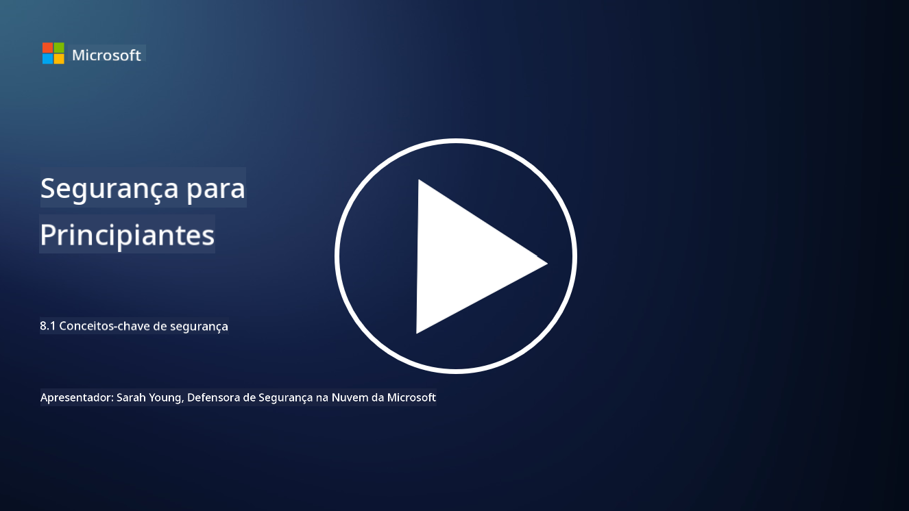

<!--
CO_OP_TRANSLATOR_METADATA:
{
  "original_hash": "66b61d96936cf25d20fcb411d4ce5227",
  "translation_date": "2025-09-03T16:58:27+00:00",
  "source_file": "8.1 AI security key concepts.md",
  "language_code": "pt"
}
-->
# Conceitos-chave de segurança em IA

## Como a segurança em IA difere da cibersegurança tradicional?

Proteger sistemas de IA apresenta desafios únicos em comparação com a cibersegurança tradicional, principalmente devido à natureza das capacidades de aprendizagem e dos processos de tomada de decisão da IA. Aqui estão algumas diferenças principais:

-   **Integridade dos Dados**: Os sistemas de IA dependem fortemente de dados para aprender. Garantir a integridade desses dados é crucial, pois os atacantes podem manipulá-los para influenciar o comportamento da IA, uma tática conhecida como envenenamento de dados.
-   **Segurança do Modelo**: O próprio modelo de tomada de decisão da IA pode ser um alvo. Os atacantes podem tentar reverter a engenharia do modelo ou explorar suas fraquezas para induzir decisões incorretas ou prejudiciais.
-   **Ataques Adversariais**: Os sistemas de IA podem ser suscetíveis a ataques adversariais, onde pequenas alterações, muitas vezes imperceptíveis, nos dados de entrada podem levar a erros ou previsões incorretas.
-   **Segurança da Infraestrutura**: Embora a cibersegurança tradicional também se concentre na proteção da infraestrutura, os sistemas de IA podem ter camadas adicionais de complexidade, como serviços baseados na nuvem ou hardware especializado, que exigem medidas de segurança específicas.
-   **Considerações Éticas**: O uso de IA na segurança traz questões éticas, como preocupações com a privacidade e o potencial de viés nas decisões, que devem ser abordadas na estratégia de segurança.

De forma geral, proteger sistemas de IA exige uma abordagem diferente que considere os aspectos únicos da tecnologia de IA, incluindo a proteção de dados, modelos e o processo de aprendizagem da IA, ao mesmo tempo que aborda as implicações éticas do seu uso.

A segurança em IA e a cibersegurança tradicional compartilham muitas semelhanças, mas também apresentam diferenças distintas devido às características e capacidades únicas dos sistemas de inteligência artificial. Veja como elas diferem:

- **Complexidade das Ameaças**: Os sistemas de IA introduzem novas camadas de complexidade na cibersegurança. A cibersegurança tradicional lida principalmente com ameaças como malware, ataques de phishing e intrusões em redes. No entanto, os sistemas de IA podem ser vulneráveis a ataques como ataques adversariais, envenenamento de dados e evasão de modelos, que visam especificamente os próprios algoritmos de aprendizagem de máquina.

- **Superfície de Ataque**: Os sistemas de IA frequentemente possuem superfícies de ataque maiores em comparação com sistemas tradicionais. Isso ocorre porque eles dependem não apenas de software, mas também de dados e modelos. Os atacantes podem visar os dados de treino, manipular modelos ou explorar vulnerabilidades nos próprios algoritmos.

- **Adaptabilidade das Ameaças**: Os sistemas de IA podem se adaptar e aprender com o ambiente, o que os torna mais suscetíveis a ameaças adaptativas e em evolução. As medidas de cibersegurança tradicionais podem não ser suficientes para defender contra ataques que evoluem constantemente com base no comportamento do sistema de IA.

- **Interpretabilidade e Explicabilidade**: Compreender por que um sistema de IA tomou uma decisão específica é frequentemente mais desafiador em comparação com sistemas de software tradicionais. Essa falta de interpretabilidade e explicabilidade pode dificultar a detecção e mitigação eficaz de ataques a sistemas de IA.

- **Preocupações com a Privacidade dos Dados**: Os sistemas de IA frequentemente dependem de grandes volumes de dados, o que pode introduzir riscos à privacidade se não forem devidamente geridos. As medidas de cibersegurança tradicionais podem não abordar adequadamente essas preocupações específicas de privacidade relacionadas à IA.

- **Conformidade Regulamentar**: O panorama regulatório para a segurança em IA ainda está em evolução, com regulamentações e normas específicas surgindo para lidar com os desafios únicos apresentados pelos sistemas de IA. Os frameworks de cibersegurança tradicionais podem precisar ser estendidos ou adaptados para garantir conformidade com essas novas regulamentações.

- **Considerações Éticas**: A segurança em IA envolve não apenas proteger os sistemas contra ataques maliciosos, mas também garantir que os sistemas de IA sejam utilizados de maneira ética e responsável. Isso inclui considerações como justiça, transparência e responsabilidade, que podem não ser tão proeminentes na cibersegurança tradicional.

## Como a segurança em IA é semelhante à segurança de sistemas de TI tradicionais?

Proteger sistemas de IA compartilha vários princípios fundamentais com a cibersegurança tradicional:

-   **Proteção contra Ameaças**: Tanto os sistemas de IA quanto os tradicionais precisam ser protegidos contra acessos não autorizados, modificações de dados e destruição, além de outras ameaças comuns.
-   **Gestão de Vulnerabilidades**: Muitas vulnerabilidades que afetam sistemas tradicionais, como bugs de software ou configurações incorretas, também podem impactar sistemas de IA.
-   **Segurança de Dados**: A proteção dos dados processados é crucial em ambos os domínios para evitar violações de dados e garantir a confidencialidade.
-   **Segurança da Cadeia de Suprimentos**: Ambos os tipos de sistemas são suscetíveis a ataques na cadeia de suprimentos, onde um componente comprometido pode comprometer a segurança de todo o sistema.

Essas semelhanças destacam que, embora os sistemas de IA introduzam novos desafios de segurança, eles também exigem a aplicação de práticas estabelecidas de cibersegurança para garantir uma proteção robusta. É uma combinação de aproveitar o conhecimento tradicional de segurança enquanto se adapta aos aspectos únicos da tecnologia de IA.

## Leituras adicionais

- [Not with a Bug, But with a Sticker [Book] (oreilly.com)](https://www.oreilly.com/library/view/not-with-a/9781119883982/)
   
- [Intro to AI Security Part 1: AI Security 101 | by HarrietHacks | Medium](https://medium.com/@harrietfarlow/intro-to-ai-security-part-1-ai-security-101-b8662a9efe5)
   
- [Best practices for AI security risk management | Microsoft Security Blog](https://www.microsoft.com/en-us/security/blog/2021/12/09/best-practices-for-ai-security-risk-management/?WT.mc_id=academic-96948-sayoung)
   
- [OWASP AI Security and Privacy Guide | OWASP Foundation](https://owasp.org/www-project-ai-security-and-privacy-guide/)

---

**Aviso Legal**:  
Este documento foi traduzido utilizando o serviço de tradução por IA [Co-op Translator](https://github.com/Azure/co-op-translator). Embora nos esforcemos para garantir a precisão, é importante notar que traduções automáticas podem conter erros ou imprecisões. O documento original na sua língua nativa deve ser considerado a fonte autoritária. Para informações críticas, recomenda-se a tradução profissional realizada por humanos. Não nos responsabilizamos por quaisquer mal-entendidos ou interpretações incorretas decorrentes da utilização desta tradução.