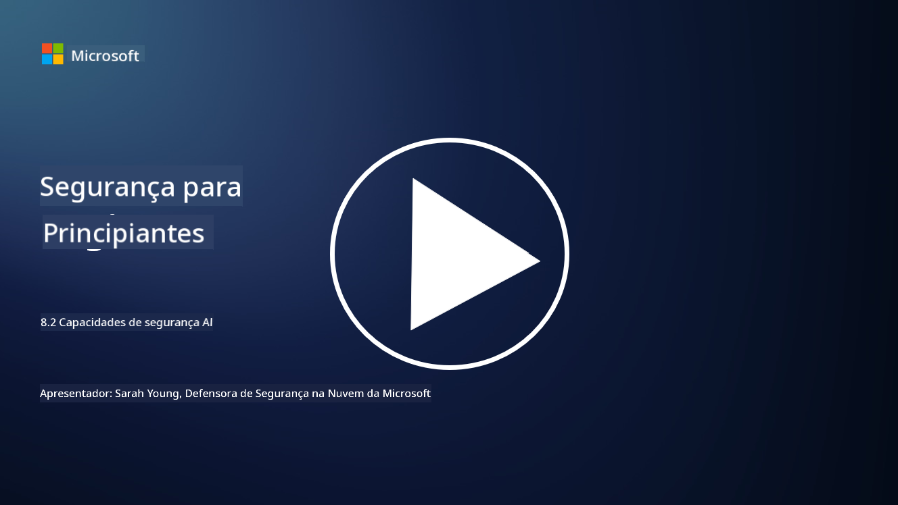

<!--
CO_OP_TRANSLATOR_METADATA:
{
  "original_hash": "b6bb7175672298d1e2f73ba7e0006f95",
  "translation_date": "2025-09-03T17:38:30+00:00",
  "source_file": "8.2 AI security capabilities.md",
  "language_code": "pt"
}
-->
# Capacidades de segurança em IA

## Que ferramentas e capacidades temos atualmente para proteger sistemas de IA?

Atualmente, existem várias ferramentas e capacidades disponíveis para proteger sistemas de IA:

-   **Counterfit**: Uma ferramenta de automação de código aberto para testes de segurança em sistemas de IA, projetada para ajudar organizações a realizar avaliações de risco de segurança em IA e garantir a robustez dos seus algoritmos.
-   **Ferramentas de Aprendizagem Automática Adversária**: Estas ferramentas avaliam a robustez de modelos de aprendizagem automática contra ataques adversários, ajudando a identificar e mitigar vulnerabilidades.
-   **Kits de Ferramentas de Segurança em IA**: Existem kits de ferramentas de código aberto que oferecem recursos para proteger sistemas de IA, incluindo bibliotecas e frameworks para implementar medidas de segurança.
-   **Plataformas Colaborativas**: Parcerias entre empresas e comunidades de IA para desenvolver scanners de segurança específicos para IA e outras ferramentas para proteger a cadeia de fornecimento de IA.

Estas ferramentas e capacidades fazem parte de um campo em crescimento dedicado a melhorar a segurança de sistemas de IA contra uma variedade de ameaças. Representam uma combinação de pesquisa, ferramentas práticas e colaboração na indústria, com o objetivo de enfrentar os desafios únicos colocados pelas tecnologias de IA.

## E quanto ao red teaming em IA? Como isso difere do red teaming tradicional de segurança?

O red teaming em IA difere do red teaming tradicional de segurança em vários aspetos importantes:

-   **Foco em Sistemas de IA**: O red teaming em IA concentra-se nas vulnerabilidades únicas dos sistemas de IA, como modelos de aprendizagem automática e pipelines de dados, em vez de infraestruturas tradicionais de TI.
-   **Testar o Comportamento da IA**: Envolve testar como os sistemas de IA respondem a entradas incomuns ou inesperadas, o que pode revelar vulnerabilidades que poderiam ser exploradas por atacantes.
-   **Explorar Falhas em IA**: O red teaming em IA analisa tanto falhas maliciosas como benignas, considerando um conjunto mais amplo de personas e potenciais falhas do sistema para além de apenas violações de segurança.
-   **Injeção de Prompts e Geração de Conteúdo**: Inclui investigar falhas como a injeção de prompts, onde atacantes manipulam sistemas de IA para produzir conteúdo prejudicial ou sem fundamento.
-   **IA Ética e Responsável**: Faz parte de garantir uma IA responsável desde o design, assegurando que os sistemas de IA são robustos contra tentativas de os fazer comportar-se de formas indesejadas.

No geral, o red teaming em IA é uma prática ampliada que não só cobre a investigação de vulnerabilidades de segurança, mas também inclui testes para outros tipos de falhas específicas de tecnologias de IA. É uma parte essencial do desenvolvimento de sistemas de IA mais seguros, ao compreender e mitigar os riscos novos associados à implementação de IA.

## Leitura adicional

 - [Microsoft AI Red Team building future of safer AI | Microsoft Security Blog](https://www.microsoft.com/en-us/security/blog/2023/08/07/microsoft-ai-red-team-building-future-of-safer-ai/?WT.mc_id=academic-96948-sayoung)
 - [Announcing Microsoft’s open automation framework to red team generative AI Systems | Microsoft Security Blog](https://www.microsoft.com/en-us/security/blog/2024/02/22/announcing-microsofts-open-automation-framework-to-red-team-generative-ai-systems/?WT.mc_id=academic-96948-sayoung)
 - [AI Security Tools: The Open-Source Toolkit | Wiz](https://www.wiz.io/academy/ai-security-tools)

---

**Aviso Legal**:  
Este documento foi traduzido utilizando o serviço de tradução por IA [Co-op Translator](https://github.com/Azure/co-op-translator). Embora nos esforcemos para garantir a precisão, é importante ter em conta que traduções automáticas podem conter erros ou imprecisões. O documento original na sua língua nativa deve ser considerado a fonte autoritária. Para informações críticas, recomenda-se a tradução profissional realizada por humanos. Não nos responsabilizamos por quaisquer mal-entendidos ou interpretações incorretas decorrentes da utilização desta tradução.