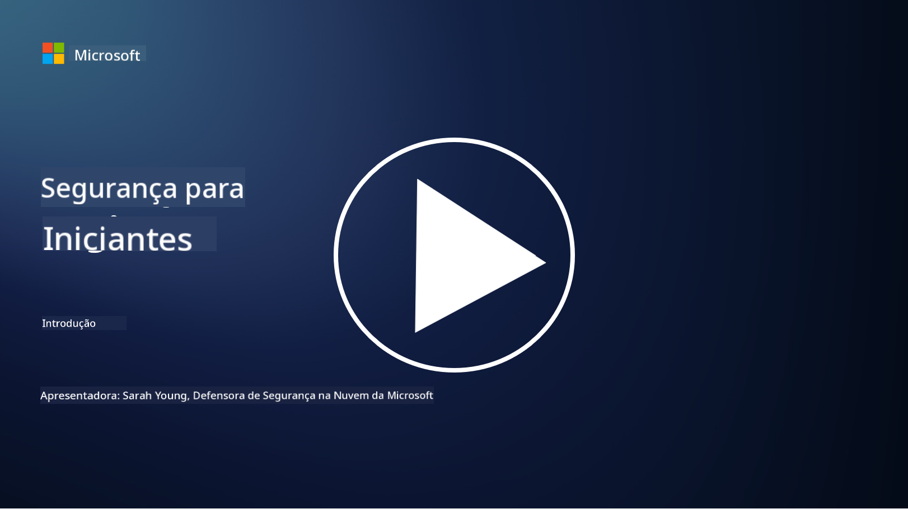

<!--
CO_OP_TRANSLATOR_METADATA:
{
  "original_hash": "0f9381fb23638f9341416474ce3c1563",
  "translation_date": "2025-09-03T17:02:13+00:00",
  "source_file": "README.md",
  "language_code": "pt"
}
-->
  
  
  
  
  
  

# 🚀 Cibersegurança para Iniciantes – um currículo

Nesta era de rápida adoção de tecnologias de IA, é ainda mais essencial compreender como proteger sistemas de TI. Este curso foi criado para ensinar conceitos fundamentais de cibersegurança e dar início ao seu aprendizado na área de segurança. É independente de fornecedores e está dividido em pequenas lições que devem levar cerca de 30-60 minutos para serem concluídas. Cada lição inclui um pequeno questionário e links para leituras adicionais, caso deseje aprofundar-se no tema.

O que este curso aborda 📚

- 🔐 Conceitos básicos de cibersegurança, como a tríade CIA, as diferenças entre riscos, ameaças, etc.
- 🛡️ Compreender o que é um controlo de segurança e as suas diferentes formas.
- 🌐 Compreender o que é zero trust e por que isso é importante na cibersegurança moderna.
- 🔑 Compreender conceitos e temas-chave relacionados a identidade, redes, operações de segurança, infraestrutura e segurança de dados.
- 🔧 Exemplos de ferramentas utilizadas para implementar controlos de segurança.

O que este curso não aborda 🙅‍♂️

- 🚫 Como utilizar ferramentas de segurança específicas.
- 🚫 Como "hackear" ou realizar testes de intrusão/ofensivos.
- 🚫 Aprender sobre normas de conformidade específicas.

Quando terminar este curso, pode avançar para alguns dos módulos do Microsoft Learn. Recomendamos que continue o seu aprendizado com [Microsoft Security, Compliance, and Identity Fundamentals.](https://learn.microsoft.com/training/paths/describe-concepts-of-security-compliance-identity/?WT.mc_id=academic-96948-sayoung)  

Eventualmente, pode considerar fazer o [Exame SC-900: Microsoft Security, Compliance, and Identity Fundamentals.](https://learn.microsoft.com/credentials/certifications/exams/sc-900/?WT.mc_id=academic-96948-sayoung)  

> 💁 Se tiver algum feedback ou sugestões sobre este curso e conteúdos que considera que estão em falta, adoraríamos ouvir de si!

## Visão Geral dos Módulos 📝  
| **Número do módulo** | **Nome do módulo**                      | **Conceitos ensinados**              | **Objetivos de aprendizagem**                                                                                   |
|-----------------------|-----------------------------------------|--------------------------------------|-----------------------------------------------------------------------------------------------------------------|
| **1.1**               | Conceitos básicos de segurança         | [A tríade CIA](https://github.com/microsoft/Security-101/blob/main/1.1%20The%20CIA%20triad%20and%20other%20key%20concepts.md)                        | Aprenda sobre confidencialidade, disponibilidade e integridade. Também autenticidade, não-repúdio e privacidade. |
| **1.2**               | Conceitos básicos de segurança         | [Ameaças comuns de cibersegurança](https://github.com/microsoft/Security-101/blob/main/1.2%20Common%20cybersecurity%20threats.md)        | Aprenda sobre as ameaças comuns de cibersegurança enfrentadas por indivíduos e organizações.                     |
| **1.3**               | Conceitos básicos de segurança         | [Compreender a gestão de riscos](https://github.com/microsoft/Security-101/blob/main/1.3%20Understanding%20risk%20management.md)       | Aprenda sobre como avaliar e compreender riscos – impacto/probabilidade e implementar controlos.                                                                                                               | |
| **1.4**               | Conceitos básicos de segurança         | [Práticas e documentação de segurança](https://github.com/microsoft/Security-101/blob/main/1.4%20Security%20practices%20and%20documentation.md) | Aprenda sobre a diferença entre políticas, procedimentos, normas e regulamentos/leis.                            |
| **1.5**               | Conceitos básicos de segurança         | [Zero trust](https://github.com/microsoft/Security-101/blob/main/1.5%20Zero%20trust.md)                           | Aprenda sobre o que é zero trust e como isso afeta a arquitetura. O que é defesa em profundidade?                |
| **1.6**               | Conceitos básicos de segurança         | [Modelo de responsabilidade partilhada](https://github.com/microsoft/Security-101/blob/main/1.6%20Shared%20responsibility%20model.md)                           | O que é o modelo de responsabilidade partilhada e como isso afeta a cibersegurança?                              |
| **1.7**               | [Questionário de fim de módulo](https://github.com/microsoft/Security-101/blob/main/1.7%20End%20of%20module%20quiz.md)                        |                                      |                                                                                                                 |
| **2.1**               | Fundamentos de gestão de identidade e acesso | [Conceitos-chave de IAM](https://github.com/microsoft/Security-101/blob/main/2.1%20IAM%20key%20concepts.md)                     | Aprenda sobre o princípio do menor privilégio, segregação de funções e como IAM suporta zero trust.              |
| **2.2**               | Fundamentos de gestão de identidade e acesso | [Arquitetura zero trust de IAM](https://github.com/microsoft/Security-101/blob/main/2.2%20IAM%20zero%20trust%20architecture.md)          | Aprenda sobre como a identidade é o novo perímetro para ambientes de TI modernos e as ameaças que mitiga.        |
| **2.3**               | Fundamentos de gestão de identidade e acesso | [Capacidades de IAM](https://github.com/microsoft/Security-101/blob/main/2.3%20IAM%20capabilities.md)                     | Aprenda sobre as capacidades e controlos de IAM para proteger identidades.                                       |
| **2.4**               | [Questionário de fim de módulo](https://github.com/microsoft/Security-101/blob/main/2.4%20End%20of%20module%20quiz.md)                        |                                      |                                                                                                                 |
| **3.1**               | Fundamentos de segurança de rede       | [Conceitos-chave de redes](https://github.com/microsoft/Security-101/blob/main/3.1%20Networking%20key%20concepts.md)              | Aprenda sobre conceitos de redes (endereçamento IP, números de porta, encriptação, etc.).                        |
| **3.2**               | Fundamentos de segurança de rede       | [Arquitetura zero trust de redes](https://github.com/microsoft/Security-101/blob/main/3.2%20Networking%20zero%20trust%20architecture.md)   | Aprenda sobre como as redes contribuem para uma arquitetura E2E ZT e as ameaças que mitiga.                      |
| **3.3**               | Fundamentos de segurança de rede       | [Capacidades de segurança de rede](https://github.com/microsoft/Security-101/blob/main/3.3%20Network%20security%20capabilities.md)        | Aprenda sobre ferramentas de segurança de rede – firewalls, WAF, proteção contra DDoS, etc.                      |
| **3.4**               | [Questionário de fim de módulo](https://github.com/microsoft/Security-101/blob/main/3.4%20End%20of%20module%20quiz.md)                        |                                      |                                                                                                                 |
| **4.1**               | Fundamentos de operações de segurança  | [Conceitos-chave de SecOps](https://github.com/microsoft/Security-101/blob/main/4.1%20SecOps%20key%20concepts.md)                  | Aprenda sobre por que as operações de segurança são importantes e como diferem das equipas normais de TI.        |
| **4.2**               | Fundamentos de operações de segurança  | [Arquitetura zero trust de SecOps](https://github.com/microsoft/Security-101/blob/main/4.2%20SecOps%20zero%20trust%20architecture.md)       | Aprenda sobre como SecOps contribui para uma arquitetura E2E ZT e as ameaças que mitiga.                         |
| **4.3**               | Fundamentos de operações de segurança  | [Capacidades de SecOps](https://github.com/microsoft/Security-101/blob/main/4.3%20SecOps%20capabilities.md)                  | Aprenda sobre ferramentas de SecOps – SIEM, XDR, etc.                                                            |
| **4.4**               | [Questionário de fim de módulo](https://github.com/microsoft/Security-101/blob/main/4.4%20End%20of%20module%20quiz.md)                        |                                      |                                                                                                                 |
| **5.1**               | Fundamentos de segurança de aplicações | [Conceitos-chave de AppSec](https://github.com/microsoft/Security-101/blob/main/5.1%20AppSec%20key%20concepts.md)                  | Aprenda sobre conceitos de AppSec, como segurança por design, validação de entrada, etc.                         |
| **5.2**               | Fundamentos de segurança de aplicações | [Capacidades de AppSec](https://github.com/microsoft/Security-101/blob/main/5.2%20AppSec%20key%20capabilities.md)                  | Aprenda sobre ferramentas de AppSec: ferramentas de segurança de pipeline, análise de código, análise de segredos, etc. |
| **5.3**               | [Questionário de fim de módulo](https://github.com/microsoft/Security-101/blob/main/5.3%20End%20of%20module%20quiz.md)                        |                                      |                                                                                                                 |
| **6.1**               | Fundamentos de segurança de infraestrutura | [Conceitos-chave de segurança de infraestrutura](https://github.com/microsoft/Security-101/blob/main/6.1%20Infrastructure%20security%20key%20concepts.md) | Aprenda sobre reforço de sistemas, aplicação de patches, higiene de segurança, segurança de containers.          |
| **6.2**               | Fundamentos de segurança de infraestrutura | [Capacidades de segurança de infraestrutura](https://github.com/microsoft/Security-101/blob/main/6.2%20Infrastructure%20security%20capabilities.md) | Aprenda sobre ferramentas que podem ajudar na segurança de infraestrutura, como CSPM, segurança de containers, etc. |
| **6.3**               | [Questionário de fim de módulo](https://github.com/microsoft/Security-101/blob/main/6.3%20End%20of%20module%20quiz.md)                        |                                      |                                                                                                                 |
| **7.1**               | Fundamentos de segurança de dados      | [Conceitos-chave de segurança de dados](https://github.com/microsoft/Security-101/blob/main/7.1%20Data%20security%20key%20concepts.md)           | Aprenda sobre classificação e retenção de dados e por que isso é importante para uma organização.                |
| **7.2**               | Fundamentos de segurança de dados      | [Capacidades de segurança de dados](https://github.com/microsoft/Security-101/blob/main/7.2%20Data%20security%20capabilities.md)           | Aprenda sobre ferramentas de segurança de dados – DLP, gestão de riscos internos, governança de dados, etc.      |
| **7.3**               | [Questionário de fim de módulo](https://github.com/microsoft/Security-101/blob/main/7.3%20End%20of%20module%20quiz.md)                        |                                      |                                                                                                                 |
| **8.1**               | Fundamentos de segurança de IA         | [Conceitos-chave de segurança de IA](https://github.com/microsoft/Security-101/blob/main/8.1%20AI%20security%20key%20concepts.md)          | Aprenda sobre as diferenças e semelhanças entre segurança tradicional e segurança de IA.                         |
| **8.2**               | Fundamentos de segurança de IA         | [Capacidades de segurança de IA](https://github.com/microsoft/Security-101/blob/main/8.2%20AI%20security%20capabilities.md)           | Aprenda sobre ferramentas de segurança de IA e os controlos que podem ser usados para proteger IA.               |
| **8.3**               | Fundamentos de segurança de IA         | [IA responsável](https://github.com/microsoft/Security-101/blob/main/8.3%20Responsible%20AI.md)          | Aprenda sobre o que é IA responsável e os danos específicos de IA que os profissionais de segurança precisam conhecer. |
| **8.4**               | [Questionário de fim de módulo](https://github.com/microsoft/Security-101/blob/main/8.4%20End%20of%20module%20quiz.md)                        |                                      |                                                                                                                 |

## 🎒 Outros Cursos  

A nossa equipa produz outros cursos! Confira:  

- [IA Generativa para Iniciantes](https://aka.ms/genai-beginners)  
- [IA Generativa para Iniciantes .NET](https://github.com/microsoft/Generative-AI-for-beginners-dotnet)  
- [IA Generativa com JavaScript](https://github.com/microsoft/generative-ai-with-javascript)  
- [IA Generativa com Java](https://github.com/microsoft/Generative-AI-for-beginners-java)  
- [IA para Iniciantes](https://aka.ms/ai-beginners)  
- [Ciência de Dados para Iniciantes](https://aka.ms/datascience-beginners)  
- [ML para Iniciantes](https://aka.ms/ml-beginners)  
- [Cibersegurança para Iniciantes](https://github.com/microsoft/Security-101)  
- [Desenvolvimento Web para Iniciantes](https://aka.ms/webdev-beginners)  
- [IoT para Iniciantes](https://aka.ms/iot-beginners)  
- [Desenvolvimento XR para Iniciantes](https://github.com/microsoft/xr-development-for-beginners)  
- [Dominar o GitHub Copilot para Programação em Parceria](https://github.com/microsoft/Mastering-GitHub-Copilot-for-Paired-Programming)  
- [Dominar o GitHub Copilot para Programadores C#/.NET](https://github.com/microsoft/mastering-github-copilot-for-dotnet-csharp-developers)  
- [Escolhe a Tua Própria Aventura com o Copilot](https://github.com/microsoft/CopilotAdventures)  

---

**Aviso Legal**:  
Este documento foi traduzido utilizando o serviço de tradução por IA [Co-op Translator](https://github.com/Azure/co-op-translator). Embora nos esforcemos para garantir a precisão, é importante notar que traduções automáticas podem conter erros ou imprecisões. O documento original na sua língua nativa deve ser considerado a fonte autoritária. Para informações críticas, recomenda-se uma tradução profissional realizada por humanos. Não nos responsabilizamos por quaisquer mal-entendidos ou interpretações incorretas decorrentes da utilização desta tradução.