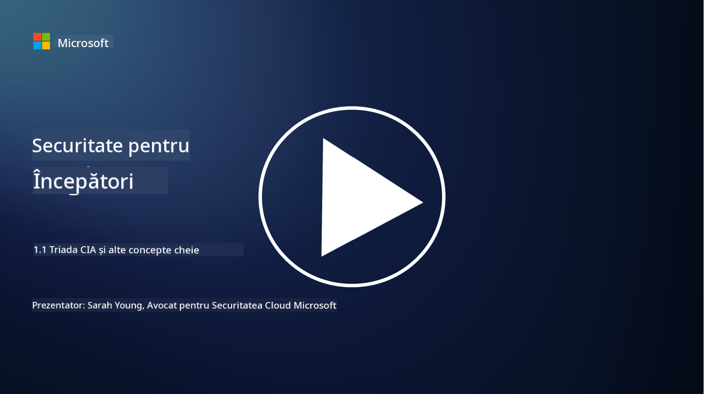
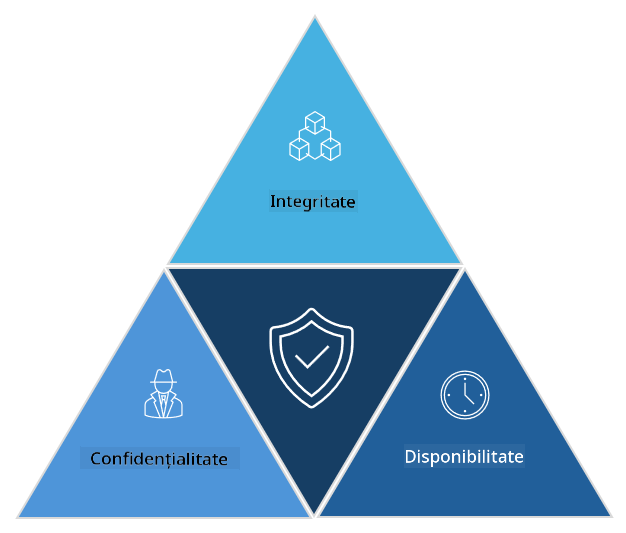

<!--
CO_OP_TRANSLATOR_METADATA:
{
  "original_hash": "16a76f9fa372fb63cffb6d76b855f023",
  "translation_date": "2025-09-04T01:12:16+00:00",
  "source_file": "1.1 The CIA triad and other key concepts.md",
  "language_code": "ro"
}
-->
# Triada CIA și alte concepte cheie

## Introducere

În această lecție vom aborda:

 - Ce este securitatea cibernetică?
   
 
 - Ce este triada CIA în securitatea cibernetică?

   

 - Ce înseamnă autenticitate, nonrepudiere și confidențialitate în contextul securității cibernetice?

## Ce este securitatea cibernetică?

Securitatea cibernetică, cunoscută și sub denumirea de securitate informațională, reprezintă practica de protejare a sistemelor informatice, rețelelor, dispozitivelor și datelor împotriva atacurilor digitale, accesului neautorizat, deteriorării sau furtului. Scopul principal al securității cibernetice este de a asigura confidențialitatea, integritatea și disponibilitatea activelor digitale și a informațiilor. Profesioniștii în securitate cibernetică proiectează și implementează controale de securitate pentru a proteja activele, datele și informațiile. Pe măsură ce tot mai multe aspecte ale vieții noastre devin digitalizate și online, securitatea cibernetică a devenit o preocupare majoră atât pentru indivizi, cât și pentru organizații.

## Ce este triada CIA în securitatea cibernetică?

Triada securității cibernetice se referă la modelul care include cele trei considerații principale pentru orice activitate de securitate cibernetică sau proiectarea unui sistem/mediu:

### Confidențialitate

Aceasta este considerația cu care majoritatea oamenilor sunt familiarizați atunci când se gândesc la „securitate cibernetică”: confidențialitatea reprezintă procesul de protejare a datelor și informațiilor împotriva încercărilor de acces neautorizat, adică doar persoanele care au nevoie să vadă informațiile pot avea acces la ele. Totuși, nu toate datele sunt create la fel, iar datele sunt de obicei clasificate și protejate în funcție de cât de multă pagubă ar putea provoca dacă ar fi accesate de persoane nepotrivite.

### Integritate

Se referă la protejarea acurateței și fiabilității datelor conținute în medii și la prevenirea modificării sau alterării acestora de către persoane neautorizate. De exemplu, un student își modifică data nașterii în registrul de conducători auto la DMV pentru a părea mai în vârstă, astfel încât să își poată reimprima permisul cu o dată de naștere mai veche pentru a cumpăra alcool.

### Disponibilitate

Aceasta este o considerație în întreaga IT operațională, dar disponibilitatea este importantă și pentru securitatea cibernetică. Există tipuri specifice de atacuri care vizează disponibilitatea și împotriva cărora profesioniștii în securitate trebuie să se protejeze (de exemplu, atacuri de tip denial of service distribuit – DDoS).

**Triada CIA în securitatea cibernetică**

## Ce înseamnă autenticitate, nonrepudiere și confidențialitate în contextul securității cibernetice?

Acestea sunt concepte suplimentare importante care se referă la asigurarea securității și fiabilității sistemelor și datelor:

**Autenticitate** - se referă la asigurarea că informația, comunicarea sau entitatea cu care interacționați este autentică și nu a fost modificată sau alterată de către părți neautorizate.

**Nonrepudiere** - este conceptul de a asigura că o parte nu poate nega implicarea sau autenticitatea unei tranzacții sau comunicări. Previne situațiile în care cineva susține că nu a trimis un mesaj sau nu a efectuat o anumită acțiune, atunci când există dovezi contrare.

**Confidențialitate** - se referă la protejarea informațiilor sensibile și identificabile personal împotriva accesului, utilizării, divulgării sau manipulării neautorizate. Implică controlul asupra persoanelor care au acces la datele personale și modul în care aceste date sunt colectate, stocate și partajate.

## Lecturi suplimentare

[Ce este securitatea informațională (InfoSec)? | Microsoft Security](https://www.microsoft.com/security/business/security-101/what-is-information-security-infosec#:~:text=Three%20pillars%20of%20information%20security%3A%20the%20CIA%20triad,as%20guiding%20principles%20for%20implementing%20an%20InfoSec%20plan.)

---

**Declinarea responsabilității**:  
Acest document a fost tradus folosind serviciul de traducere AI [Co-op Translator](https://github.com/Azure/co-op-translator). Deși depunem eforturi pentru a asigura acuratețea, vă rugăm să aveți în vedere că traducerile automate pot conține erori sau inexactități. Documentul original în limba sa nativă ar trebui considerat sursa autoritară. Pentru informații critice, se recomandă traducerea profesională realizată de un specialist uman. Nu ne asumăm răspunderea pentru eventualele neînțelegeri sau interpretări greșite care pot apărea din utilizarea acestei traduceri.