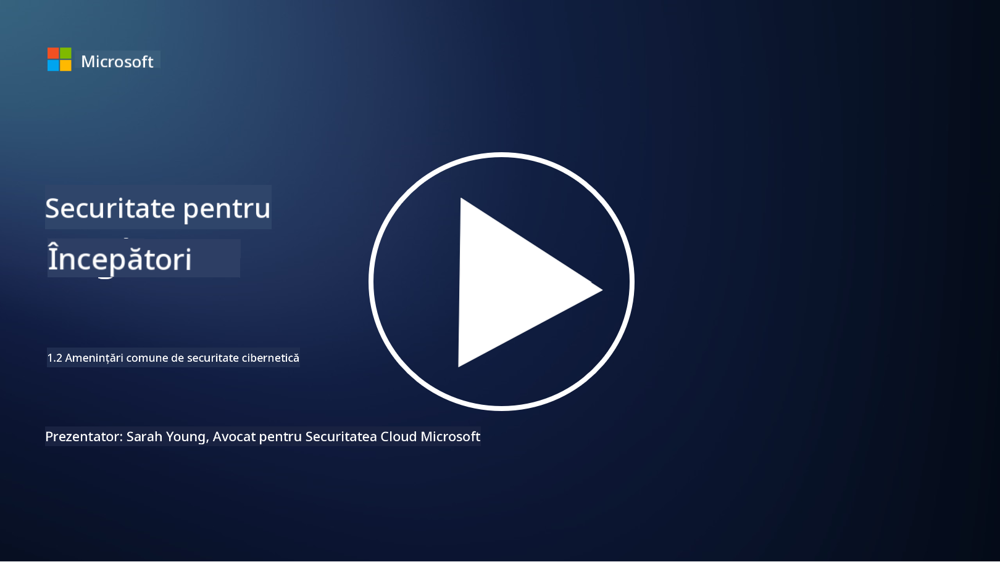

<!--
CO_OP_TRANSLATOR_METADATA:
{
  "original_hash": "6fc3030323139d7134a4ca9d03eccac9",
  "translation_date": "2025-09-03T23:29:03+00:00",
  "source_file": "1.2 Common cybersecurity threats.md",
  "language_code": "ro"
}
-->
# Amenințări comune în domeniul securității cibernetice

## Introducere

În această lecție vom aborda:

- Ce este o amenințare cibernetică?

- De ce actorii rău intenționați doresc să compromită datele și sistemele IT?

- Care sunt cele mai comune tipuri de amenințări cibernetice?

- Ce este cadrul MITRE ATT&CK?

- Unde pot să mă informez despre peisajul actual al amenințărilor cibernetice?

## Ce este o amenințare cibernetică?

O amenințare cibernetică se referă la orice pericol sau risc potențial care poate compromite confidențialitatea, integritatea sau disponibilitatea datelor sau a sistemelor IT. Aceste amenințări sunt generate de actori rău intenționați care încearcă să exploateze vulnerabilități pentru a obține acces neautorizat, a fura informații sensibile, a perturba operațiunile sau a provoca daune indivizilor, organizațiilor sau chiar națiunilor întregi. Amenințările cibernetice pot lua diverse forme și pot viza diferite aspecte ale sistemelor digitale și ale datelor.

## De ce actorii rău intenționați doresc să compromită datele și sistemele IT?

Actorii rău intenționați compromit datele și sistemele IT din diverse motive, adesea motivați de câștig personal, motive ideologice sau dorința de a provoca perturbări. Înțelegerea acestor motivații poate ajuta organizațiile și indivizii să se apere mai bine împotriva amenințărilor cibernetice. Unele dintre motivele comune pentru care actorii rău intenționați inițiază atacuri cibernetice includ:

1. **Câștig financiar**: Multe atacuri sunt motivate de dorința de profit financiar. Actorii rău intenționați pot fura informații sensibile, cum ar fi numerele de carduri de credit, detaliile conturilor bancare sau informații personale de identificare, pentru a comite fraude, furt de identitate, a șantaja o persoană sau organizație sau a vinde datele furate pe dark web.

2. **Spionaj**: Statele naționale, concurenții sau alte entități pot desfășura activități de spionaj cibernetic pentru a fura date sensibile guvernamentale, corporative sau de cercetare, în scopuri politice, economice sau militare.

3. **Perturbare și sabotaj**: Unele atacuri au ca scop perturbarea infrastructurii critice, serviciilor sau operațiunilor din motive politice sau ideologice. Aceste atacuri pot provoca haos pe scară largă, pierderi financiare și daune reputației.

4. **Motive ideologice**: Hacktiviștii și grupurile cu motivații ideologice sau politice pot compromite sisteme pentru a atrage atenția asupra anumitor probleme, a-și promova convingerile sau a protesta împotriva unor acțiuni sau organizații specifice.

5. **Acțiuni neintenționate**: Nu toate acțiunile rău intenționate sunt deliberate; unele persoane pot contribui involuntar la amenințările cibernetice prin căderea victimă a ingineriei sociale sau prin participarea la o rețea compromisă.

În cele din urmă, motivațiile pentru compromiterea datelor și sistemelor IT pot varia foarte mult, iar impactul acestor atacuri poate fi sever. Este important ca indivizii, organizațiile și guvernele să ia în serios securitatea cibernetică și să implementeze măsuri pentru a se proteja împotriva acestor amenințări.

## Care sunt cele mai comune tipuri de amenințări cibernetice?

Există mai multe tipuri comune de atacuri cibernetice pe care actorii rău intenționați le folosesc pentru a compromite sistemele, a fura date și a provoca perturbări. Iată câteva dintre cele mai frecvente tipuri la momentul redactării:

1. **Phishing**:

Phishing-ul implică trimiterea de e-mailuri sau mesaje înșelătoare care par să provină din surse legitime, pentru a păcăli destinatarii să dezvăluie informații sensibile, cum ar fi parole, numere de carduri de credit sau detalii personale. Phishing-ul poate, de asemenea, să conducă victimele către site-uri web malițioase sau să le determine să descarce malware.

2. **Malware**:

Malware-ul (software malițios) include o gamă de programe malițioase concepute pentru a infecta sistemele, a fura date sau a provoca daune. Tipurile de malware includ:

- **Ransomware**: Criptează fișierele și solicită o răscumpărare pentru decriptare.

- **Troieni**: Deghizate ca software legitim, oferă atacatorilor acces neautorizat.

- **Viruși**: Programe autoreplicante care se atașează la fișiere și se răspândesc.

- **Worms**: Programe autoreplicante care se răspândesc prin rețele.

3. **Denial of Service (DoS) și Distributed Denial of Service (DDoS)**:

Atacurile DoS supraîncarcă un sistem țintă, făcându-l indisponibil pentru utilizatori. Atacurile DDoS implică utilizarea unei rețele de dispozitive compromise pentru a inunda o țintă cu trafic, îngreunând funcționarea sistemului sau oprindu-l complet.

4. **SQL Injection**:

În acest atac, atacatorii manipulează câmpurile de intrare ale unei aplicații web pentru a injecta interogări SQL malițioase, obținând astfel acces neautorizat la baze de date și date sensibile.

5. **Cross-Site Scripting (XSS)**:

Atacatorii injectează scripturi malițioase în aplicații web, care sunt apoi executate de browserele utilizatorilor neavizați. Acest lucru poate duce la furtul de date ale utilizatorilor și/sau răspândirea malware-ului.

6. **Inginerie socială**:

Ingineria socială exploatează psihologia umană pentru a manipula indivizii să dezvăluie informații confidențiale sau să efectueze acțiuni care compromit securitatea.

7. **Exploatări Zero-Day (0day)**:

Aceste atacuri vizează vulnerabilități în software sau hardware care nu sunt încă cunoscute de furnizor sau de public. Atacatorii profită de aceste vulnerabilități înainte ca patch-urile să fie dezvoltate. Multe organizații sunt îngrijorate de zero-day-uri, deoarece nu există patch-uri pentru ele, dar acestea nu sunt la fel de frecvente ca celelalte atacuri din această listă. Când o vulnerabilitate zero-day este descoperită, cercetătorii în securitate lucrează rapid pentru a dezvolta un patch, iar astfel zero-day-urile sunt, în general, de scurtă durată.

8. **Atacuri asupra acreditărilor**:

Aceste atacuri includ atacuri brute force, în care atacatorii ghicesc repetat parolele, și atacuri de tip credential stuffing, în care acreditările furate de pe un site sunt utilizate pentru a încerca accesul pe alte site-uri.

## Ce este cadrul MITRE ATT&CK?

Cadrul [MITRE ATT&CK](https://attack.mitre.org/) (Adversarial Tactics, Techniques, and Common Knowledge) este un cadru care cataloghează și clasifică tacticile, tehnicile și procedurile (TTP-uri) pe care adversarii le folosesc în timpul atacurilor cibernetice. Cadrul a fost creat de MITRE Corporation, o organizație non-profit care operează centre de cercetare și dezvoltare pentru diverse agenții guvernamentale.

Cadrul MITRE ATT&CK oferă o modalitate standardizată de a descrie și analiza amenințările cibernetice, permițând profesioniștilor în securitate cibernetică să înțeleagă mai bine și să se apere împotriva diferitelor tehnici de atac. Este utilizat pe scară largă de echipele de securitate, vânătorii de amenințări și respondenții la incidente pentru:

1. **Înțelegerea comportamentului adversarilor**: Cadrul documentează comportamentele reale ale atacurilor, evidențiind pașii pe care atacatorii îi urmează de la intrarea inițială până la atingerea obiectivelor lor. Acesta acoperă o gamă largă de tehnici de atac utilizate de diferite grupuri de amenințări.

2. **Planificarea și implementarea strategiilor de apărare**: Echipele de securitate pot utiliza cadrul pentru a dezvolta strategii de apărare proactivă care se aliniază tacticilor și tehnicilor specifice pe care adversarii le-ar putea folosi.

3. **Răspuns la incidente și vânătoare de amenințări**: În timpul investigării incidentelor sau desfășurării activităților de vânătoare de amenințări, profesioniștii în securitate pot consulta cadrul pentru a identifica și atenua tehnicile specifice utilizate de atacatori.

Cadrul MITRE ATT&CK este organizat în matrici care grupează tehnicile de atac pe baza platformelor și mediilor specifice, cum ar fi Windows, macOS, Linux și serviciile cloud. Fiecare matrice este împărțită în tactici (obiective de nivel înalt) și tehnici (metode specifice utilizate pentru atingerea acestor obiective). Pentru fiecare tehnică, cadrul oferă informații despre modul în care funcționează, posibilele măsuri de atenuare și referințe relevante la actorii de amenințări reali care au utilizat tehnica.

Cadrul este actualizat și extins continuu pe măsură ce sunt colectate noi informații despre amenințări și pe măsură ce peisajul securității cibernetice evoluează. Este o resursă valoroasă pentru îmbunătățirea posturii de securitate cibernetică a unei organizații, permițând o înțelegere mai profundă a modului în care operează atacatorii și cum să se apere împotriva tacticilor lor.

## Unde pot să mă informez despre peisajul actual al amenințărilor cibernetice?

Există multe surse care pot fi utilizate pentru a fi la curent cu amenințările cibernetice. Iată o selecție:

- [Open Web Application Security Project (OWASP) top 10 vulnerabilities](https://owasp.org/Top10/)
- [Common Vulnerabilities and Exposures (CVEs)](https://www.bing.com/ck/a?!&&p=53df6007f017bca2JmltdHM9MTY5MjU3NjAwMCZpZ3VpZD0zYmY4N2RiYS1jYWI1LTYwMDgtMWY1YS02ZmYyY2JjNjYxZWUmaW5zaWQ9NTc2OQ&ptn=3&hsh=3&fclid=3bf87dba-cab5-6008-1f5a-6ff2cbc661ee&psq=cve&u=a1aHR0cHM6Ly9iaW5nLmNvbS9hbGluay9saW5rP3VybD1odHRwcyUzYSUyZiUyZmN2ZS5taXRyZS5vcmclMmYmc291cmNlPXNlcnAtcnImaD1BZXN4S0VBWTNnbGhNZEFpd3daMlNSZkZQNTlrODhIUnYxRUtlSkY1RTk0JTNkJnA9a2NvZmZjaWFsd2Vic2l0ZQ&ntb=1 "Common Vulnerabilities and Exposures")
- [Microsoft Security Response Center blogs](https://msrc.microsoft.com/blog/)
- [National Institute of Standards and Technology (NIST)](https://www.dhs.gov/topics/cybersecurity): NIST oferă resurse, alerte și cele mai recente actualizări despre potențialele amenințări cibernetice.
- [Cybersecurity and Infrastructure Security Agency (CISA)](https://www.cisa.gov/resources-tools/resources/free-cybersecurity-services-and-tools): CISA oferă resurse de securitate cibernetică și bune practici pentru afaceri, agenții guvernamentale și alte organizații. CISA împărtășește informații actualizate despre tipurile de activități de securitate cu impact mare care afectează comunitatea în ansamblu și analize detaliate despre amenințările cibernetice noi și în evoluție.
- [National Cybersecurity Center of Excellence (NCCoE)](https://www.dhs.gov/topics/cybersecurity): NCCoE este un centru care oferă soluții practice de securitate cibernetică aplicabile în situații reale.
- [US-CERT](https://www.cisa.gov/resources-tools/resources/free-cybersecurity-services-and-tools): Echipa de pregătire pentru urgențe informatice din Statele Unite (US-CERT) oferă o varietate de resurse de securitate cibernetică, inclusiv alerte, sfaturi și multe altele.
- Echipa de răspuns la urgențe informatice (CERT) din țara dumneavoastră.

---

**Declinare de responsabilitate**:  
Acest document a fost tradus folosind serviciul de traducere AI [Co-op Translator](https://github.com/Azure/co-op-translator). Deși ne străduim să asigurăm acuratețea, vă rugăm să fiți conștienți că traducerile automate pot conține erori sau inexactități. Documentul original în limba sa natală ar trebui considerat sursa autoritară. Pentru informații critice, se recomandă traducerea profesională realizată de un specialist uman. Nu ne asumăm responsabilitatea pentru eventualele neînțelegeri sau interpretări greșite care pot apărea din utilizarea acestei traduceri.