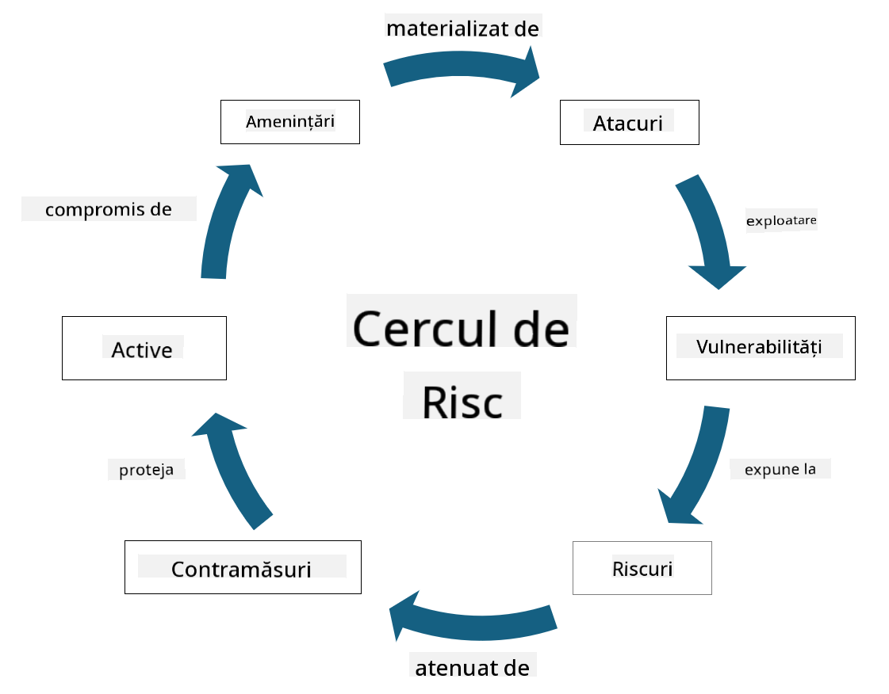

<!--
CO_OP_TRANSLATOR_METADATA:
{
  "original_hash": "fcca304f072cabf206388199e8e2e578",
  "translation_date": "2025-09-04T01:35:16+00:00",
  "source_file": "1.3 Understanding risk management.md",
  "language_code": "ro"
}
-->
# Înțelegerea managementului riscurilor

## Introducere

În această lecție vom aborda:

 - Definiții ale termenilor de securitate utilizați frecvent
   
 - Tipuri de controale de securitate

 - Evaluarea riscurilor de securitate

## Definiții ale termenilor de securitate utilizați frecvent

Acești termeni reprezintă concepte fundamentale în domeniul securității cibernetice și al managementului riscurilor. Să analizăm fiecare termen și modul în care se raportează unul la celălalt:

1. **Agent de amenințare**:

Un agent de amenințare este o persoană, grup, organizație sau sistem automatizat care are potențialul de a exploata vulnerabilitățile unui sistem sau rețea pentru a provoca daune. Agenții de amenințare pot fi hackeri, autori de malware, angajați nemulțumiți sau orice entitate care reprezintă un risc pentru sistemele de informații și tehnologie.

2. **Amenințare**:

O amenințare este un eveniment sau o acțiune potențială care poate exploata vulnerabilitățile unui sistem și poate provoca daune unui activ. Amenințările pot include acțiuni precum hacking, breșe de date, atacuri de tip denial-of-service și altele. Amenințările reprezintă "ceea ce" poate provoca daune activelor unei organizații.

3. **Vulnerabilitate**:

O vulnerabilitate este o slăbiciune sau un defect în designul, implementarea sau configurarea unui sistem care poate fi exploatat de un agent de amenințare pentru a compromite securitatea sistemului. Vulnerabilitățile pot exista în software, hardware, procese sau comportamentul uman. Identificarea și abordarea vulnerabilităților sunt esențiale pentru minimizarea riscului de atacuri reușite.

4. **Risc**:

Riscul reprezintă potențialul de pierdere, daune sau prejudicii rezultate din interacțiunea dintre o amenințare și o vulnerabilitate. Este probabilitatea ca un agent de amenințare să exploateze o vulnerabilitate pentru a provoca un impact negativ. Riscurile sunt adesea evaluate în funcție de impactul lor potențial și de probabilitatea de apariție.

5. **Activ**:

Un activ este orice lucru de valoare pe care o organizație dorește să-l protejeze. Activele pot include obiecte fizice (cum ar fi computere și servere), date (informații despre clienți, registre financiare), proprietate intelectuală (secrete comerciale, brevete) și chiar resurse umane (abilitățile și cunoștințele angajaților). Protejarea activelor este un obiectiv cheie al securității cibernetice.

6. **Expunere**:

Expunerea se referă la starea de vulnerabilitate față de amenințări potențiale. Apare atunci când există o vulnerabilitate care ar putea fi exploatată de un agent de amenințare. Expunerea evidențiază riscul asociat cu prezența vulnerabilităților într-un sistem sau rețea.

7. **Control**:

Un control este o măsură implementată pentru a reduce riscul asociat cu vulnerabilitățile și amenințările. Controalele pot fi de natură tehnică, procedurală sau administrativă. Acestea sunt concepute pentru a preveni, detecta sau atenua amenințările și vulnerabilitățile potențiale. Exemple includ firewall-uri, controale de acces, criptare, politici de securitate și instruirea angajaților.

Pentru a rezuma relația dintre acești termeni: Agenții de amenințare exploatează vulnerabilitățile pentru a realiza amenințări, care pot duce la riscuri ce au potențialul de a provoca daune activelor valoroase. Expunerea apare atunci când vulnerabilitățile sunt prezente, iar controalele sunt implementate pentru a reduce riscul prin prevenirea sau atenuarea impactului amenințărilor asupra activelor. Acest cadru formează baza managementului riscurilor cibernetice, ghidând organizațiile în identificarea, evaluarea și abordarea riscurilor potențiale pentru sistemele și activele lor de informații.

## Tipuri de controale de securitate

Controalele de securitate sunt măsuri sau protecții implementate pentru a proteja sistemele de informații și activele împotriva diferitelor amenințări și vulnerabilități. Acestea pot fi clasificate în mai multe categorii în funcție de scopul și obiectivul lor. Iată câteva tipuri comune de controale de securitate:

1. **Controale administrative**:

Aceste controale sunt legate de politici, proceduri și ghiduri care guvernează practicile de securitate ale organizației și comportamentul utilizatorilor.

- Politici și proceduri de securitate: Ghiduri documentate care definesc modul în care se menține securitatea într-o organizație.

- Conștientizare și instruire în securitate: Programe pentru educarea angajaților cu privire la cele mai bune practici de securitate și amenințările potențiale.

- Răspuns și gestionare a incidentelor: Planuri pentru răspunsul și atenuarea incidentelor de securitate.

2. **Controale tehnice**:

Controalele tehnice implică utilizarea tehnologiei pentru a aplica măsuri de securitate și a proteja sistemele și datele. Exemple de controale tehnice includ:

- Controale de acces: Măsuri care restricționează accesul utilizatorilor la resurse în funcție de rolurile și permisiunile lor.

- Criptare: Transformarea datelor într-un format securizat pentru a preveni accesul neautorizat.

- Firewall-uri: Dispozitive de securitate a rețelei care filtrează și controlează traficul de intrare și ieșire.

- Sisteme de detectare și prevenire a intruziunilor (IDPS): Instrumente care monitorizează traficul rețelei pentru activități suspecte.

- Software antivirus și anti-malware: Programe care detectează și elimină software-ul malițios.

- Mecanisme de autentificare: Metode de verificare a identității utilizatorilor, cum ar fi parolele, biometria și autentificarea multi-factor.

- Managementul patch-urilor: Actualizarea regulată a software-ului pentru a aborda vulnerabilitățile cunoscute.

3. **Controale fizice**:

Controalele fizice sunt măsuri pentru protejarea activelor și facilităților fizice.

- Gărzi de securitate și personal de control al accesului: Personal care monitorizează și controlează accesul la locațiile fizice.

- Camere de supraveghere: Sisteme de monitorizare video pentru a supraveghea și înregistra activitățile.

- Lacăte și bariere fizice: Măsuri fizice pentru a restricționa accesul la zonele sensibile.

- Controale de mediu: Măsuri pentru reglarea temperaturii, umidității și altor factori de mediu care afectează echipamentele și centrele de date.

4. **Controale operaționale**:

Aceste controale se referă la operațiunile și activitățile zilnice care asigură securitatea continuă a sistemelor.

- Managementul schimbărilor: Procese pentru urmărirea și aprobarea modificărilor aduse sistemelor și configurațiilor.

- Backup și recuperare în caz de dezastru: Planuri pentru backup-ul datelor și recuperarea acestora în caz de eșecuri ale sistemului sau dezastre.

- Înregistrare și auditare: Monitorizarea și înregistrarea activităților sistemului pentru scopuri de securitate și conformitate.

- Practici de codare securizată: Ghiduri pentru scrierea software-ului pentru a minimiza vulnerabilitățile.

5. **Controale legale și de reglementare**:

Aceste controale asigură conformitatea cu legile, reglementările și standardele industriei relevante. Standardele pe care o organizație trebuie să le respecte depind de jurisdicție, sectorul de activitate și alți factori.

- Reglementări privind protecția datelor: Conformitatea cu legi precum GDPR, HIPAA și CCPA.

- Standarde specifice industriei: Respectarea standardelor precum PCI DSS pentru securitatea datelor cardurilor de plată.

Aceste categorii de controale de securitate lucrează împreună pentru a crea o postură de securitate cuprinzătoare pentru organizații, ajutând la protejarea sistemelor, datelor și activelor împotriva unei game largi de amenințări.

## Evaluarea riscurilor de securitate

Unii profesioniști în securitate consideră că managementul riscurilor este responsabilitatea exclusivă a specialiștilor în riscuri, dar înțelegerea procesului de gestionare a riscurilor de securitate este importantă pentru orice profesionist în securitate, pentru a exprima riscurile de securitate într-un limbaj pe care restul organizației îl poate înțelege și asupra căruia poate acționa.

Organizațiile trebuie să evalueze constant riscurile de securitate și să decidă ce acțiuni (sau lipsa acestora) să ia împotriva riscurilor pentru afacere. Mai jos este o prezentare generală a modului în care acest proces este de obicei realizat. Rețineți că acest proces este, de obicei, desfășurat de mai multe echipe diferite din cadrul unei organizații; este rar ca o singură echipă să fie responsabilă de gestionarea completă a riscurilor.

1. **Identificarea activelor și amenințărilor**:

Organizația identifică activele pe care dorește să le protejeze. Acestea pot include date, sisteme, hardware, software, proprietate intelectuală și altele. Apoi, identifică amenințările potențiale care ar putea viza aceste active.

2. **Evaluarea vulnerabilităților**:

Organizațiile identifică vulnerabilitățile sau slăbiciunile din sisteme sau procese care ar putea fi exploatate de amenințări. Aceste vulnerabilități pot proveni din defecte software, configurări greșite, lipsa controalelor de securitate și erori umane.

3. **Evaluarea probabilității**:

Organizația evaluează probabilitatea apariției fiecărei amenințări. Acest lucru implică analizarea datelor istorice, informațiilor despre amenințări, tendințelor din industrie și factorilor interni. Probabilitatea poate fi clasificată ca fiind scăzută, medie sau ridicată, în funcție de probabilitatea materializării amenințării.

4. **Evaluarea impactului**:

Organizația determină impactul potențial al fiecărei amenințări dacă aceasta ar exploata o vulnerabilitate. Impactul poate include pierderi financiare, întreruperi operaționale, daune reputaționale, consecințe legale și altele. Impactul poate fi, de asemenea, clasificat ca fiind scăzut, mediu sau ridicat, în funcție de consecințele potențiale.

5. **Calcularea riscului**:

Evaluările de probabilitate și impact sunt combinate pentru a calcula nivelul general de risc pentru fiecare amenințare identificată. Acest lucru se face adesea folosind o matrice de risc care atribuie valori numerice sau descrieri calitative nivelurilor de probabilitate și impact. Nivelul de risc rezultat ajută la prioritizarea riscurilor care necesită atenție imediată.

6. **Prioritizarea și luarea deciziilor**:

Organizația prioritizează riscurile concentrându-se pe cele cu cele mai mari valori combinate de probabilitate și impact. Acest lucru le permite să aloce resurse și să implementeze controale mai eficient. Amenințările cu risc ridicat necesită atenție imediată, în timp ce amenințările cu risc mai scăzut pot fi abordate pe termen mai lung.

7. **Tratamentul riscurilor**:

Pe baza evaluării riscurilor, organizația determină cum să atenueze sau să gestioneze fiecare risc. Acest lucru poate implica implementarea controalelor de securitate, transferul riscului prin asigurare sau chiar acceptarea anumitor niveluri de risc rezidual dacă acestea sunt considerate gestionabile/prea costisitoare de remediat/etc.

8. **Monitorizare și revizuire continuă**:

Evaluarea riscurilor nu este un proces unic. Ar trebui să fie realizată periodic sau ori de câte ori există schimbări semnificative în mediul organizației. Monitorizarea continuă asigură că noile amenințări, vulnerabilități sau schimbări în peisajul afacerii sunt luate în considerare.

Prin evaluarea riscurilor de securitate într-un mod structurat, organizațiile pot lua decizii informate cu privire la alocarea resurselor, controalele de securitate și strategiile generale de management al riscurilor. Scopul este de a reduce expunerea generală la riscuri a organizației, aliniind eforturile de securitate cu obiectivele și prioritățile afacerii.

---

**Declinarea responsabilității**:  
Acest document a fost tradus folosind serviciul de traducere AI [Co-op Translator](https://github.com/Azure/co-op-translator). Deși depunem eforturi pentru a asigura acuratețea, vă rugăm să aveți în vedere că traducerile automate pot conține erori sau inexactități. Documentul original în limba sa nativă ar trebui considerat sursa autoritară. Pentru informații critice, se recomandă traducerea profesională realizată de un specialist uman. Nu ne asumăm răspunderea pentru eventualele neînțelegeri sau interpretări greșite care pot apărea din utilizarea acestei traduceri.