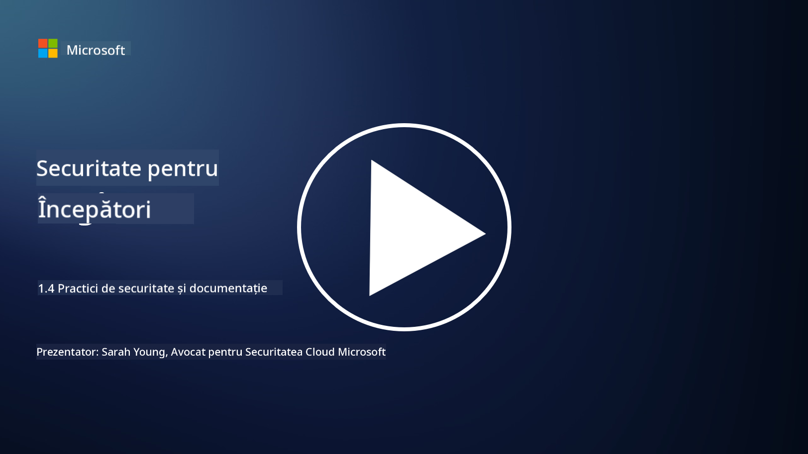

<!--
CO_OP_TRANSLATOR_METADATA:
{
  "original_hash": "d33500902124e52870935bdce4546fcc",
  "translation_date": "2025-09-04T00:22:21+00:00",
  "source_file": "1.4 Security practices and documentation.md",
  "language_code": "ro"
}
-->
# Practici și documentație de securitate

Probabil ați auzit expresiile „politică de securitate”, „standard de securitate” etc., folosite anterior, dar realitatea este că mulți profesioniști în domeniul securității cibernetice nu le utilizează corect. În această secțiune, vom explica ce înseamnă fiecare dintre aceste expresii și de ce o organizație le-ar folosi.

## Introducere

În această lecție, vom aborda:

 - Ce este o politică de securitate?
   
 - Ce este un standard de securitate?

   

 - Ce este un baseline de securitate?

   

 - Ce este un ghid de securitate?
 - Ce este o procedură de securitate?

   

 - Ce sunt legile și reglementările în contextul securității cibernetice?

Acești termeni sunt adesea utilizați în contextul securității cibernetice pentru a defini diferite niveluri de documentație și practici de securitate într-o organizație. Haideți să clarificăm fiecare termen:

## Ce este o politică de securitate?

O politică de securitate este un document de nivel înalt care conturează obiectivele generale, principiile și liniile directoare ale unei organizații în materie de securitate. Aceasta oferă un cadru pentru luarea deciziilor legate de securitate și stabilește tonul pentru postura de securitate a organizației. Politicile de securitate acoperă, de obicei, subiecte precum utilizarea acceptabilă a resurselor, protecția datelor, controlul accesului, răspunsul la incidente și altele. O politică este independentă de soluții și tehnologii. Un exemplu de politică de securitate cu care mulți sunt familiarizați ar fi politica de utilizare acceptabilă a unei organizații.

## Ce este un standard de securitate?

Un standard de securitate este un document mai detaliat și specific care oferă linii directoare și cerințe pentru implementarea controalelor și măsurilor de securitate într-o organizație. Standardele sunt mai concrete și tehnice decât politicile, oferind instrucțiuni și recomandări specifice pentru configurarea și întreținerea sistemelor, rețelelor și proceselor pentru a atinge obiectivele de securitate. Un exemplu de standard de securitate ar fi _„Toate datele interne trebuie să fie criptate în repaus și în tranzit.”_

## Ce este un baseline de securitate?

Un baseline de securitate este un set de configurații minime de securitate considerate esențiale pentru un anumit sistem, aplicație sau mediu la un moment dat. Acesta definește un punct de plecare pentru securitate care ar trebui implementat în toate instanțele relevante. Baseline-urile de securitate ajută la asigurarea consistenței și a unui anumit nivel de securitate în întreaga infrastructură IT a unei organizații. Un exemplu de baseline de securitate ar fi _„VM-urile Azure nu trebuie să aibă acces direct la Internet.”_

## Ce este un ghid de securitate?

Un ghid de securitate este un document care oferă recomandări și îndrumări atunci când un standard de securitate specific nu se aplică. Ghidurile încearcă să abordeze „zonele gri” care apar atunci când un standard nu acoperă sau acoperă doar parțial o problemă.

## Ce este o procedură de securitate?

O procedură de securitate este un ghid detaliat, pas cu pas, care descrie acțiunile și sarcinile specifice ce trebuie realizate pentru a executa un proces sau o sarcină legată de securitate. Procedurile sunt documente practice și acționabile care oferă o secvență clară de acțiuni de urmat în timpul răspunsului la incidente, întreținerii sistemelor, integrării utilizatorilor și altor activități legate de securitate. Un exemplu de procedură de securitate ar fi _„Când un incident de securitate P1 este generat de Microsoft Sentinel, centrul de operațiuni de securitate (SOC) trebuie să informeze imediat managerul de securitate de serviciu și să îi trimită detaliile incidentului.”_

În concluzie, acești termeni reprezintă diferite niveluri de documentație și îndrumare în cadrul cadrului de securitate cibernetică al unei organizații. Politicile de securitate stabilesc obiectivele generale, standardele oferă cerințe detaliate, baseline-urile stabilesc configurațiile minime de securitate, ghidurile oferă cele mai bune practici, iar procedurile oferă pași acționabili pentru procesele de securitate.

## Ce sunt legile/reglementările în contextul securității cibernetice?

Legile și reglementările se referă la cadrele legale stabilite de guverne și organisme de reglementare pentru a defini și aplica reguli, standarde și cerințe pentru securizarea sistemelor digitale, a datelor și a informațiilor. Aceste legi și reglementări variază în funcție de jurisdicție și se concentrează pe diferite aspecte ale securității cibernetice, inclusiv protecția datelor, confidențialitatea, raportarea incidentelor și securitatea infrastructurii critice. Iată câteva exemple de legi și reglementări legate de securitatea cibernetică: de exemplu, Regulamentul General privind Protecția Datelor (GDPR), Legea privind Portabilitatea și Responsabilitatea Asigurărilor de Sănătate (HIPAA), Legea privind Confidențialitatea Consumatorilor din California (CCPA), Standardul de Securitate a Datelor pentru Industria Cardurilor de Plată (PCI DSS).

## Lecturi suplimentare

[Șabloane de politici de securitate a informațiilor | SANS Institute](https://www.sans.org/information-security-policy/)

[Conformitatea cu legile și reglementările privind securitatea cibernetică și confidențialitatea | NIST](https://www.nist.gov/mep/cybersecurity-resources-manufacturers/compliance-cybersecurity-and-privacy-laws-and-regulations)

---

**Declinare de responsabilitate**:  
Acest document a fost tradus folosind serviciul de traducere AI [Co-op Translator](https://github.com/Azure/co-op-translator). Deși ne străduim să asigurăm acuratețea, vă rugăm să rețineți că traducerile automate pot conține erori sau inexactități. Documentul original în limba sa maternă ar trebui considerat sursa autoritară. Pentru informații critice, se recomandă traducerea profesională realizată de un specialist uman. Nu ne asumăm responsabilitatea pentru eventualele neînțelegeri sau interpretări greșite care pot apărea din utilizarea acestei traduceri.