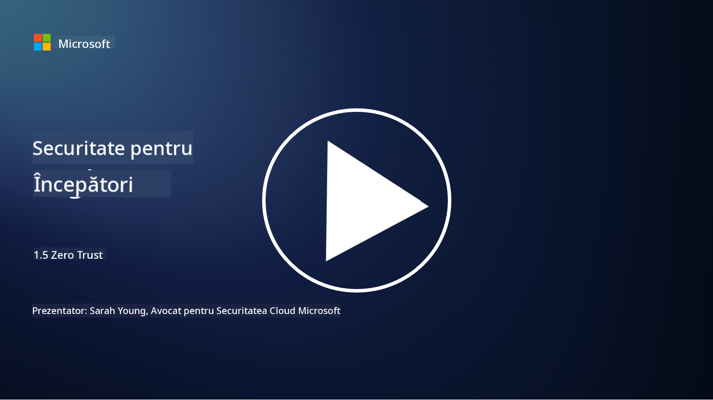
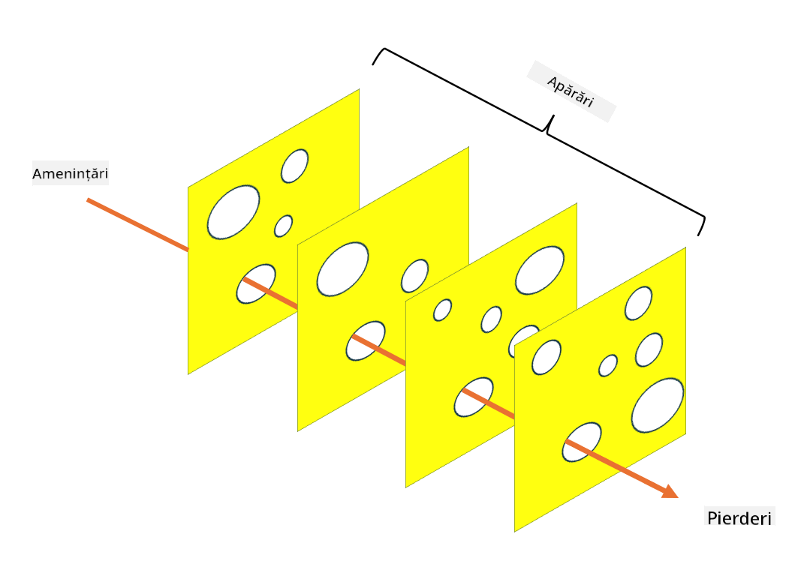

<!--
CO_OP_TRANSLATOR_METADATA:
{
  "original_hash": "75f77f972d2233c584f87c1eb96c983b",
  "translation_date": "2025-09-03T23:50:02+00:00",
  "source_file": "1.5 Zero trust.md",
  "language_code": "ro"
}
-->
# Zero Trust

„Zero trust” este o expresie folosită frecvent în cercurile de securitate în zilele noastre. Dar ce înseamnă, este doar un termen la modă? În această lecție, vom explora exact ce înseamnă zero trust.

## Introducere

 - În această lecție, vom aborda:
   
   
 - Ce este zero trust?

   
  

 - Cum diferă zero trust de arhitecturile tradiționale de securitate?

   
   

 - Ce este apărarea în profunzime?

## Zero Trust

Zero Trust este o abordare de securitate cibernetică care contestă conceptul tradițional de „încredere și verificare” prin presupunerea că nicio entitate, fie din interiorul, fie din exteriorul rețelei unei organizații, nu ar trebui să fie considerată de încredere în mod implicit. În schimb, Zero Trust promovează verificarea fiecărui utilizator, dispozitiv și aplicație care încearcă să acceseze resurse, indiferent de locația lor. Principiul de bază al Zero Trust este minimizarea „suprafeței de atac” și reducerea impactului potențial al breșelor de securitate.

Într-un model Zero Trust, sunt subliniate următoarele principii:

1. **Verificarea identității**: Autentificarea și autorizarea sunt aplicate riguros tuturor utilizatorilor și dispozitivelor, indiferent de locația lor. Rețineți că o identitate nu este neapărat umană: poate fi un dispozitiv, o aplicație etc.

2. **Privilegiu minim**: Utilizatorii și dispozitivele primesc nivelul minim de acces necesar pentru a-și îndeplini sarcinile, reducând astfel daunele potențiale în cazul compromiterii.

3. **Micro-segmentare**: Resursele rețelei sunt împărțite în segmente mai mici pentru a limita mișcarea laterală în rețea în cazul unei breșe.

4. **Monitorizare continuă**: Se efectuează monitorizarea și analiza continuă a comportamentului utilizatorilor și dispozitivelor pentru a detecta anomalii și amenințări potențiale. Tehnicile moderne de monitorizare utilizează, de asemenea, învățarea automată, AI și informații despre amenințări pentru a oferi detalii și context suplimentar.

5. **Criptarea datelor**: Datele sunt criptate atât în tranzit, cât și în repaus pentru a preveni accesul neautorizat.

6. **Control strict al accesului**: Controalele de acces sunt aplicate pe baza contextului, cum ar fi rolurile utilizatorilor, starea dispozitivelor și locația rețelei.

Microsoft împarte zero trust în cinci piloni, pe care îi vom discuta într-o lecție ulterioară.

## Diferențe față de arhitecturile tradiționale de securitate

Zero Trust diferă de arhitecturile tradiționale de securitate, cum ar fi modelele bazate pe perimetru, în mai multe moduri:

1. **Perimetru vs. Centrat pe identitate**: Modelele tradiționale se concentrează pe securizarea perimetrului rețelei și presupun că utilizatorii și dispozitivele interne pot fi de încredere odată ce sunt în interior. Zero Trust, pe de altă parte, presupune că amenințările pot proveni atât din interiorul, cât și din exteriorul rețelei și impune controale stricte bazate pe identitate.

2. **Încredere implicită vs. Încredere explicită**: Modelele tradiționale au încredere implicită în dispozitivele și utilizatorii din rețea până când se dovedește contrariul. Zero Trust verifică explicit identitățile și monitorizează continuu pentru a detecta anomalii.

3. **Rețea plată vs. Segmentată**: Arhitecturile tradiționale implică adesea rețele plate în care utilizatorii interni au acces larg. Zero Trust promovează segmentarea rețelei în zone mai mici, izolate, pentru a limita breșele potențiale.

4. **Reactiv vs. Proactiv**: Securitatea tradițională se bazează adesea pe măsuri reactive, cum ar fi firewall-urile de perimetru și detectarea intruziunilor. Zero Trust adoptă o abordare proactivă, presupunând că breșele sunt probabile și minimizând impactul acestora.

## Apărarea în profunzime

Apărarea în profunzime, cunoscută și sub numele de securitate stratificată, este o strategie de securitate cibernetică care implică implementarea mai multor straturi de controale și măsuri de securitate pentru a proteja activele unei organizații. Scopul este de a crea straturi suprapuse de apărare, astfel încât, dacă un strat este compromis, altele să poată oferi protecție. Fiecare strat se concentrează pe un aspect diferit al securității și crește postura generală de securitate a unei organizații.

Apărarea în profunzime implică o combinație de măsuri tehnice, procedurale și fizice de securitate. Acestea pot include firewall-uri, sisteme de detectare a intruziunilor, controale de acces, criptare, instruirea utilizatorilor, politici de securitate și altele. Ideea este de a crea mai multe bariere care, împreună, fac dificilă pătrunderea atacatorilor în sistemele și rețelele unei organizații. Acest model este cunoscut uneori și sub denumirea de „modelul brânzei elvețiene”, utilizat și în prevenirea accidentelor în alte industrii (de exemplu, transporturi).

## Lecturi suplimentare

[Ce este Zero Trust?](https://learn.microsoft.com/security/zero-trust/zero-trust-overview?WT.mc_id=academic-96948-sayoung)

[Evoluția Zero Trust – Document de poziție Microsoft](https://query.prod.cms.rt.microsoft.com/cms/api/am/binary/RWJJdT?WT.mc_id=academic-96948-sayoung)

[Zero Trust și BeyondCorp Google Cloud | Blogul Google Cloud](https://cloud.google.com/blog/topics/developers-practitioners/zero-trust-and-beyondcorp-google-cloud)

---

**Declinarea responsabilității**:  
Acest document a fost tradus folosind serviciul de traducere AI [Co-op Translator](https://github.com/Azure/co-op-translator). Deși depunem eforturi pentru a asigura acuratețea, vă rugăm să rețineți că traducerile automate pot conține erori sau inexactități. Documentul original în limba sa nativă ar trebui considerat sursa autoritară. Pentru informații critice, se recomandă traducerea realizată de un profesionist uman. Nu ne asumăm răspunderea pentru eventualele neînțelegeri sau interpretări greșite care pot apărea din utilizarea acestei traduceri.