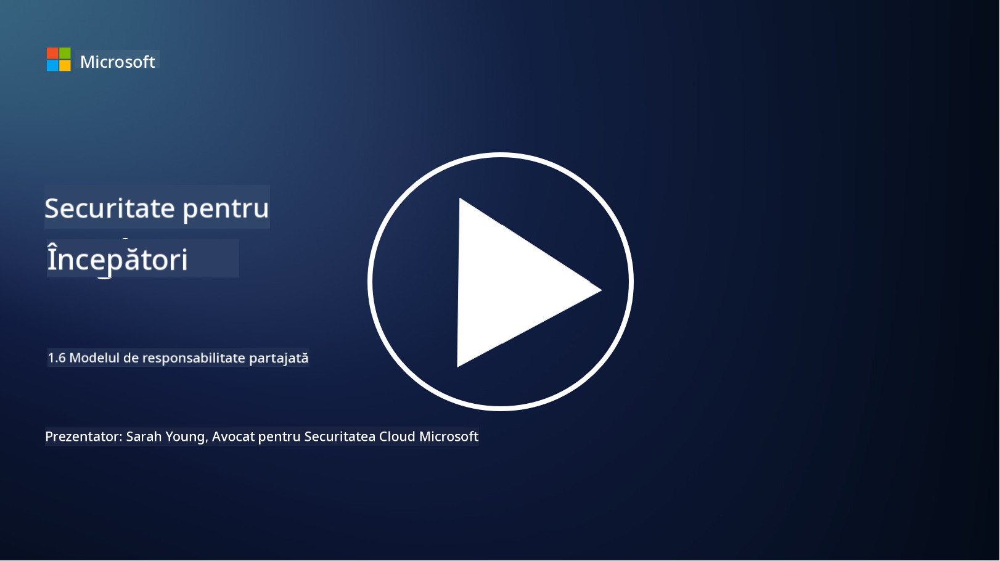

<!--
CO_OP_TRANSLATOR_METADATA:
{
  "original_hash": "a48db640d80c786b928ca178c414f084",
  "translation_date": "2025-09-04T00:28:43+00:00",
  "source_file": "1.6 Shared responsibility model.md",
  "language_code": "ro"
}
-->
# Modelul de responsabilitate partajată

Responsabilitatea partajată este un concept relativ nou în IT, apărut odată cu dezvoltarea tehnologiilor de cloud computing. Din perspectiva securității cibernetice, este esențial să înțelegem cine furnizează care controale de securitate, astfel încât să nu existe lacune în apărare.

## Introducere

În această lecție, vom aborda:

 - Ce înseamnă responsabilitatea partajată în contextul securității cibernetice?
   
 - Care este diferența în responsabilitatea partajată pentru controalele de securitate
   între IaaS, PaaS și SaaS?

 - Unde poți găsi informații despre controalele de securitate oferite de platforma ta de cloud?

 - Ce înseamnă „încredere, dar verificare”?

## Ce înseamnă responsabilitatea partajată în contextul securității cibernetice?

Responsabilitatea partajată în securitatea cibernetică se referă la distribuirea responsabilităților de securitate între un furnizor de servicii cloud (CSP) și clienții săi. În mediile de cloud computing, cum ar fi Infrastructure as a Service (IaaS), Platform as a Service (PaaS) și Software as a Service (SaaS), atât CSP-ul, cât și clientul au roluri de jucat în asigurarea securității datelor, aplicațiilor și sistemelor.

## Care este diferența în responsabilitatea partajată pentru controalele de securitate între IaaS, PaaS și SaaS?

Diviziunea responsabilităților depinde, de obicei, de tipul de serviciu cloud utilizat:

 - **IaaS (Infrastructure as a Service)**: CSP-ul furnizează infrastructura de bază (servere, rețele, stocare), în timp ce clientul este responsabil de gestionarea sistemelor de operare, aplicațiilor și configurațiilor de securitate pe acea infrastructură.
   
 - **PaaS (Platform as a Service):** CSP-ul oferă o platformă pe care clienții pot construi și implementa aplicații. CSP-ul gestionează infrastructura de bază, iar clientul se concentrează pe dezvoltarea aplicațiilor și securitatea datelor.

 - **SaaS (Software as a Service):** CSP-ul furnizează aplicații complet funcționale accesibile prin internet. În acest caz, CSP-ul este responsabil de securitatea aplicației și a infrastructurii, în timp ce clientul gestionează accesul utilizatorilor și utilizarea datelor.

Înțelegerea responsabilității partajate este crucială, deoarece clarifică ce aspecte de securitate sunt acoperite de CSP și care trebuie abordate de client. Acest lucru ajută la prevenirea neînțelegerilor și asigură implementarea completă a măsurilor de securitate.

## Unde poți găsi informații despre controalele de securitate oferite de platforma ta de cloud?

Pentru a afla ce controale de securitate oferă platforma ta de cloud, trebuie să consulți documentația și resursele furnizorului de servicii cloud. Acestea includ:

 - **Website-ul și documentația CSP-ului**: Website-ul CSP-ului va conține informații despre funcțiile și controalele de securitate oferite ca parte a serviciilor lor. De obicei, CSP-urile oferă documentație detaliată care explică practicile, controalele și recomandările lor de securitate. Acestea pot include whitepapers, ghiduri de securitate și documentație tehnică.
   
 - **Evaluări și audituri de securitate**: Majoritatea CSP-urilor își supun controalele de securitate evaluării de către experți și organizații independente. Aceste recenzii pot oferi informații despre calitatea măsurilor de securitate ale CSP-ului. Uneori, acest lucru duce la obținerea unui certificat de conformitate cu standardele de securitate (vezi punctul următor).
   
 - **Certificări de conformitate cu standardele de securitate**: Majoritatea CSP-urilor obțin certificări precum ISO:27001, SOC 2 și FedRAMP, etc. Aceste certificări demonstrează că furnizorul îndeplinește standarde specifice de securitate și conformitate.

Reține că nivelul de detaliu și disponibilitatea informațiilor pot varia între furnizorii de cloud. Asigură-te întotdeauna că consulți resursele oficiale și actualizate furnizate de furnizorul de servicii cloud pentru a lua decizii informate despre securitatea activelor tale bazate pe cloud.

## Ce înseamnă „încredere, dar verificare”?

În contextul utilizării unui CSP, software terț sau alt serviciu de securitate IT, o organizație poate avea inițial încredere în afirmațiile furnizorului despre măsurile de securitate. Totuși, pentru a se asigura cu adevărat de siguranța datelor și sistemelor lor, organizația ar trebui să verifice aceste afirmații prin evaluări de securitate, teste de penetrare și o revizuire a controalelor de securitate ale terțului înainte de a integra complet software-ul sau serviciul în operațiunile lor. Toate persoanele și organizațiile ar trebui să aibă încredere, dar să verifice controalele de securitate pentru care nu sunt responsabile.

## Responsabilitatea partajată în cadrul unei organizații

Reține că responsabilitatea partajată pentru securitate în cadrul unei organizații între diferite echipe trebuie, de asemenea, luată în considerare. Echipa de securitate rareori implementează toate controalele singură și va trebui să colaboreze cu echipele de operațiuni, dezvoltatori și alte departamente ale afacerii pentru a implementa toate controalele de securitate necesare pentru a menține organizația în siguranță.

## Lecturi suplimentare

- [Shared responsibility in the cloud - Microsoft Azure | Microsoft Learn](https://learn.microsoft.com/azure/security/fundamentals/shared-responsibility?WT.mc_id=academic-96948-sayoung)
- [What is shared responsibility model? – Definition from TechTarget.com](https://www.techtarget.com/searchcloudcomputing/definition/shared-responsibility-model)
- [The shared responsibility model explained and what it means for cloud security | CSO Online](https://www.csoonline.com/article/570779/the-shared-responsibility-model-explained-and-what-it-means-for-cloud-security.html)
- [Shared Responsibility for Cloud Security: What You Need to Know (cisecurity.org)](https://www.cisecurity.org/insights/blog/shared-responsibility-cloud-security-what-you-need-to-know)

---

**Declinare de responsabilitate**:  
Acest document a fost tradus folosind serviciul de traducere AI [Co-op Translator](https://github.com/Azure/co-op-translator). Deși ne străduim să asigurăm acuratețea, vă rugăm să fiți conștienți că traducerile automate pot conține erori sau inexactități. Documentul original în limba sa natală ar trebui considerat sursa autoritară. Pentru informații critice, se recomandă traducerea profesională realizată de un specialist uman. Nu ne asumăm responsabilitatea pentru eventualele neînțelegeri sau interpretări greșite care pot apărea din utilizarea acestei traduceri.